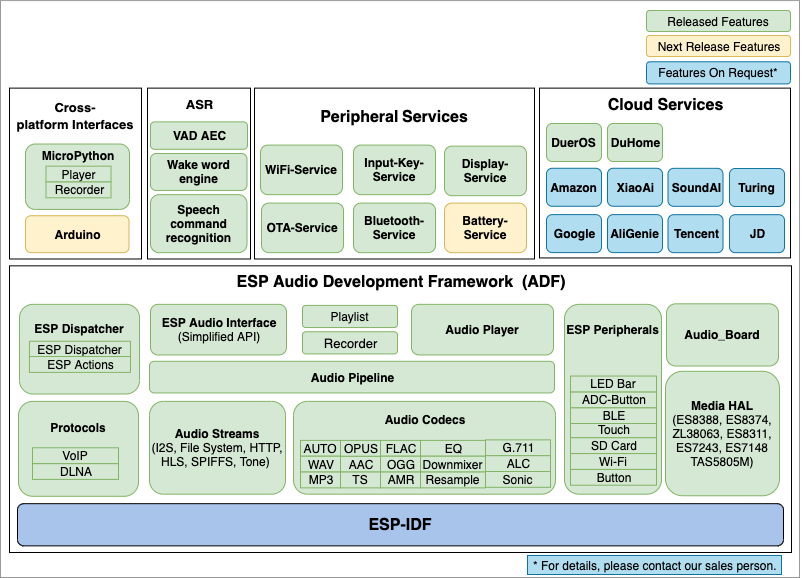
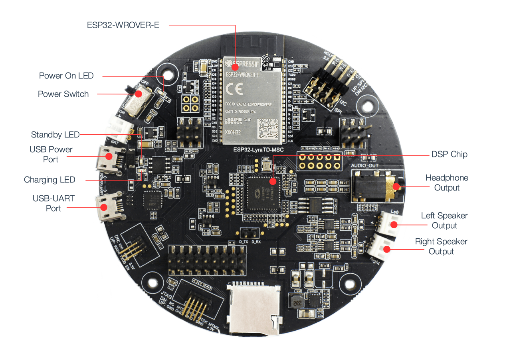

# Espressif Audio Development Framework

[](https://docs.espressif.com/projects/esp-adf/en/latest/?badge=latest)

Espressif Systems Audio Development Framework (ESP-ADF) is the official audio development framework for the [ESP32](https://espressif.com/en/products/hardware/esp32/overview) chip.

## Overview

ESP-ADF supports development of audio applications for the Espressif Systems [ESP32](https://espressif.com/en/products/hardware/esp32/overview) chip in the most comprehensive way. With ESP-ADF, you can easily add features, develop audio applications from simple to complex:

- Music player or recorder supports audio formats such as MP3, AAC, WAV, OGG, AMR, TS, SPEEX ...
- Play music from sources: HTTP, HLS(HTTP Live Streaming), SDCARD, Bluetooth A2DP/HFP
- Integrate Media services such as: DLNA, WeChat ...
- Internet Radio
- Voice recognition and integration with online services such as Alexa, DuerOS, ...

As a general, the ESP-ADF features will be supported as shown below:

<div align="center"></div>

## Developing with the ESP-ADF

### Quick Start

You need the ESP32-LyraT board and headphone connected, make sure you clone the project recursive: 

```
git clone --recursive https://github.com/espressif/esp-adf.git 
cd esp-adf/examples/get-started/play_mp3
make menuconfig
make flash monitor
```

If you clone project without `--recursive` flag, please goto the `esp-adf` directory and run command `git submodule update --init` before doing anything.

### Hardware

Espressif Systems has released a number of boards for ESP-ADF to develop ESP32 audio applications, including:

| ESP32-LyraT Development Board | ESP32-LyraTD-MSC Development Board |
|:----:|:----:|
|  [](https://docs.espressif.com/projects/esp-adf/en/latest/get-started/get-started-esp32-lyrat.html)  |  [](https://docs.espressif.com/projects/esp-adf/en/latest/get-started/get-started-esp32-lyratd-msc.html)   |
|  [Getting Started with ESP32-LyraT](https://docs.espressif.com/projects/esp-adf/en/latest/get-started/get-started-esp32-lyrat.html)  | [Getting Started with ESP32-LyraTD-MSC](https://docs.espressif.com/projects/esp-adf/en/latest/get-started/get-started-esp32-lyratd-msc.html) |

#### ESP32-LyraT

An open-source development board, supporting Espressif Systems’ ADF and featuring voice wake-up, a wake-up button and an audio player. Designed for smart speakers and smart-home applications.

[<div align="center"></div>](https://docs.espressif.com/projects/esp-adf/en/latest/get-started/get-started-esp32-lyrat.html)

* [Getting Started with ESP32-LyraT](https://docs.espressif.com/projects/esp-adf/en/latest/get-started/get-started-esp32-lyrat.html)
* [ESP32-LyraT V4.3 Hardware Reference](https://docs.espressif.com/projects/esp-adf/en/latest/design-guide/board-esp32-lyrat-v4.3.html)
* [ESP32-LyraT Schematic (PDF)](https://dl.espressif.com/dl/schematics/esp32-lyrat-v4.3-schematic.pdf)

#### ESP32-LyraTD-MSC
Designed for smart speakers and AI applications. Supports Acoustic Echo Cancellation (AEC), Automatic Speech Recognition (ASR), Wake-up Interrupt and Voice Interaction.

[<div align="center"></div>](https://docs.espressif.com/projects/esp-adf/en/latest/get-started/get-started-esp32-lyratd-msc.html)

* [Getting Started with ESP32-LyraTD-MSC](https://docs.espressif.com/projects/esp-adf/en/latest/get-started/get-started-esp32-lyratd-msc.html)
* [ESP32-LyraTD-MSC Schematic Lower Board A (PDF) ](https://dl.espressif.com/dl/schematics/ESP32-LyraTD-MSC_A_V2_2-1109A.pdf), [Upper Board B (PDF)](https://dl.espressif.com/dl/schematics/ESP32-LyraTD-MSC_B_V1_1-1109A.pdf)

#### ESP-IDF

ESP-**A**DF is based on the application layer of ESP-**I**DF ([Espressif IoT Development Framework](https://github.com/espressif/esp-idf)). The `git clone` command, described under [Quick Start](#quick-start) above, automatically downloads specific version of the ESP-IDF alongside with ESP-ADF. Please take a look at [Get Started](https://docs.espressif.com/projects/esp-adf/en/latest/get-started/index.html)

#### Examples

Check folder [examples](examples) that contains sample applications to demonstrate API features of the ESP-ADF.

# Resources

* [Documentation](https://docs.espressif.com/projects/esp-adf/en/latest/index.html) for the latest version of https://docs.espressif.com/projects/esp-adf/. This documentation is built from the [docs directory](docs) of this repository.
* The [esp32.com forum](https://esp32.com/) is a place to ask questions and find community resources. On the forum there is a [section dedicated to ESP-ADF](https://esp32.com/viewforum.php?f=20) users. 
* [Check the Issues section on github](https://github.com/espressif/esp-adf/issues) if you find a bug or have a feature request. Please check existing Issues before opening a new one.
* If you're interested in contributing to ESP-ADF, please check the [Contributions Guide](https://esp-idf.readthedocs.io/en/latest/contribute/index.html).
