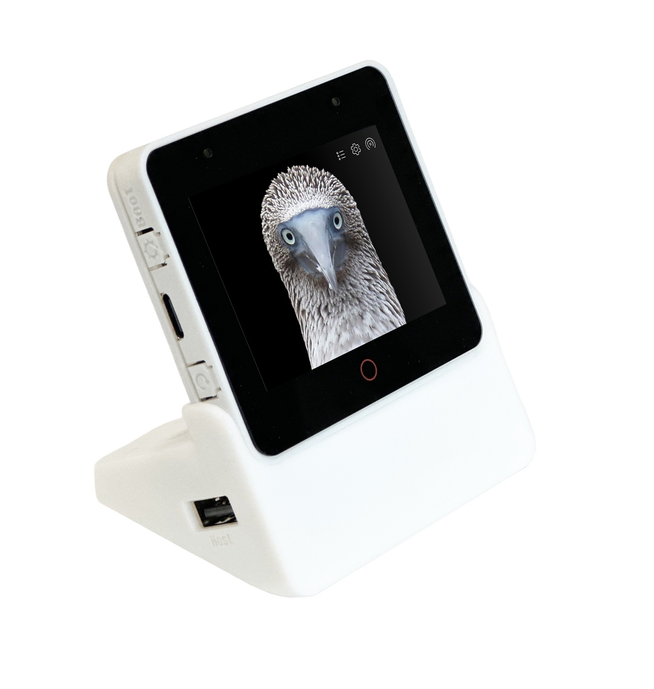

# Espressif Audio Development Framework

Espressif Systems Audio Development Framework (ESP-ADF) is the official audio development framework for the [ESP32](https://espressif.com/en/products/hardware/esp32/overview), [ESP32-S2](https://www.espressif.com/en/products/socs/esp32-s2), [ESP32-C3](https://www.espressif.com/en/products/socs/esp32-c3), [ESP32-C6](https://www.espressif.com/en/products/socs/esp32-c6), and [ESP32-S3](https://www.espressif.com/en/products/socs/esp32-s3) SoCs.

## Overview

ESP-ADF supports development of audio applications for the Espressif Systems SoCs in the most comprehensive way. With ESP-ADF, you can easily add features, develop audio and video applications from simple to complex:

- Music player or recorder supports audio formats such as MP3, AAC, FLAC, WAV, OGG, OPUS, AMR, TS, EQ, Downmixer, Sonic, ALC, G.711 and etc.
- Play music from sources: HTTP, HLS (HTTP Live Streaming), SPIFFS, SDCARD, A2DP-Source, A2DP-Sink, HFP and etc.
- Integrate media protocols, such as: DLNA, VoIP, RMTP, ESP-RTC (SIP, RTSP, and RTCP), etc.
- Video call, video recording and video live streaming
- Internet Radio
- Voice recognition and integration with online services such as Alexa, DuerOS and etc.

As a general, the ESP-ADF features will be supported as shown below:

## Developing with the ESP-ADF

### IDF Version

The following table shows the ESP-IDF versions supported by ESP-ADF at the current time. The label  means supported, and the label  means not supported.

The ESP-IDF master branch is marked as not supported because the major feature changes it has introduced may cause conflicts with ESP-ADF. Yet, the ADF examples not affected by those feature changes can still run correctly on the IDF master branch.

End of Life IDF branches are removed. See [IDF Supported Periods](https://docs.espressif.com/projects/esp-idf/en/latest/esp32/versions.html#support-periods) for details.

|                       | ESP-IDF   [Release/v4.4](https://docs.espressif.com/projects/esp-idf/zh_CN/release-v4.4/esp32/versions.html) | ESP-IDF   [Release/v5.0](https://docs.espressif.com/projects/esp-idf/zh_CN/release-v5.0/esp32/versions.html) | ESP-IDF   [Release/v5.1](https://docs.espressif.com/projects/esp-idf/zh_CN/release-v5.1/esp32/versions.html) |  ESP-IDF   [Release/v5.2](https://docs.espressif.com/projects/esp-idf/zh_CN/release-v5.2/esp32/versions.html) | ESP-IDF   [Master](https://docs.espressif.com/projects/esp-idf/zh_CN/latest/esp32/versions.html) |
|:----------- | :---------------------:| :---------------------:|:---------------------: | :---------------------:| :---------------------:|
| ESP-ADF   Master |  |  |  |  |  |
| ESP-ADF   Release/v2.6  |   **1** | |  | |  |
| ESP-ADF   Release/v2.5 |   **1**  |  |   |  |   |
| ESP-ADF   Release/v2.4 |   **1**  | |  |  |   |

**Note 1:** The built-in IDF branch of ESP-ADF v2.4 is IDF Release/v4.4 at the current time.

### Quick Start

You need one of ESP-IDF versions described in [ESP-ADF Releases](https://github.com/espressif/esp-adf/releases), one of audio boards below and headphones.

**Note:**  If this is your first exposure to ESP-IDF, proceed to **Getting Started** documentation specific for [ESP32](https://docs.espressif.com/projects/esp-idf/en/latest/esp32/get-started/index.html), [ESP32-S2](https://docs.espressif.com/projects/esp-idf/en/latest/esp32s2/get-started/index.html), or [ESP32-S3](https://docs.espressif.com/projects/esp-idf/en/latest/esp32s3/index.html) SoCs.

Click on one of audio boards shown below to set up and start using ESP-ADF.

### Hardware

Espressif Systems has released a number of boards for ESP-ADF to develop audio applications. Click the links below to learn more information on each board.

It is recommended to use the ESP-ADF master branch, as it has the latest bugfixes and the new features.

|                       | [ESP32-LyraT](https://docs.espressif.com/projects/esp-adf/en/latest/get-started/get-started-esp32-lyrat.html) | [ESP32-LyraTD-MSC](https://docs.espressif.com/projects/esp-adf/en/latest/get-started/get-started-esp32-lyratd-msc.html) | [ESP32-LyraT-Mini](https://docs.espressif.com/projects/esp-adf/en/latest/get-started/get-started-esp32-lyrat-mini.html) | [ESP32-Korvo-DU1906](https://docs.espressif.com/projects/esp-adf/en/latest/get-started/get-started-esp32-korvo-du1906.html) | [ESP32-S2-Kaluga-1 Kit](https://docs.espressif.com/projects/esp-idf/en/latest/esp32s2/hw-reference/esp32s2/user-guide-esp32-s2-kaluga-1-kit.html)|[ESP32-S3-Korvo-2](https://docs.espressif.com/projects/esp-adf/en/latest/get-started/user-guide-esp32-s3-korvo-2.html)|[ESP32-C3-Lyra](https://docs.espressif.com/projects/esp-adf/en/latest/design-guide/dev-boards/user-guide-esp32-c3-lyra.html)| [ESP32-S3-Box Serials](https://github.com/espressif/esp-box/tree/master)|
|:----------- |:---------------------: | :---------------------:| :---------------------:|:---------------------: | :---------------------:| :---------------------:| :---------------------:| :---------------------:|
|  |    |    |    |    |   |    |   |   |
| ESP-ADF Master        |  |    |  |  |  |  |  |  |
| ESP-ADF Release/v2.6  |  |    |  |  |  |  |  |   **1**  |
| ESP-ADF Release/v2.5  |  |    |  |  |  |  |  |  |
| ESP-ADF Release/v2.4  |  |    |  |  |  |  |  |  |

**Note 1:** For the development board of [esp-box series](https://github.com/espressif/esp-box), only [esp32-s3-box](https://github.com/espressif/esp-box/blob/master/docs/hardware_overview/esp32_s3_box/hardware_overview_for_box.md) and [esp32-s3-box-lite](https://github.com/espressif/esp-box/blob/master/docs/hardware_overview/esp32_s3_box_lite/hardware_overview_for_lite.md) are supported in *ESP-ADF Release/v2.6*.

[supported]: https://img.shields.io/badge/-supported-green "supported"
[not supported]: https://img.shields.io/badge/-not%20supported-orange "not supported"

#### Examples

Check folder [examples](examples) that contains sample applications to demonstrate API features of the ESP-ADF.

# Resources

* [Documentation](https://docs.espressif.com/projects/esp-adf/en/latest/index.html) for the latest version of https://docs.espressif.com/projects/esp-adf/. This documentation is built from the [docs directory](docs) of this repository.
* The [esp32.com forum](https://esp32.com/) is a place to ask questions and find community resources. On the forum there is a [section dedicated to ESP-ADF](https://esp32.com/viewforum.php?f=20) users.
* [Check the Issues section on github](https://github.com/espressif/esp-adf/issues) if you find a bug or have a feature request. Please check existing Issues before opening a new one.
* If you're interested in contributing to ESP-ADF, please check the [Contributions Guide](https://esp-idf.readthedocs.io/en/latest/contribute/index.html).
