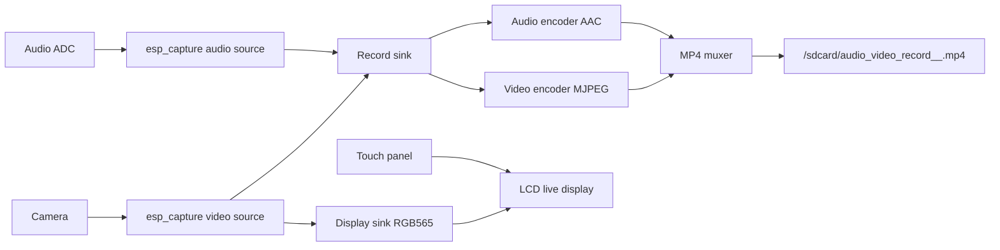

# Audio/Video Recording With Live Display

- [中文版](./README_CN.md)
- Complex Example: ⭐⭐⭐

## Example Brief

This example demonstrates an interactive audio/video recorder with continuous local screen preview. It captures camera video and audio input, shows the camera image on the LCD in real time, and starts or stops MP4 recording on the microSD card when the user taps the on-screen record button.

- Continuous LCD live preview after boot
- On-screen record or stop button and recording timer
- MP4 recording saved to the microSD card in 1-minute slices

### Typical Scenarios

- Smart doorbells and security cameras with a local preview

### Runtime Flow



The recording path uses one output channel for audio/video encoding, MP4 muxing, and card writing. The display path uses another output channel to obtain video frames, draw a lightweight recording UI, and refresh the LCD. Recording-related threads and the display task are pinned to different CPU cores to reduce the impact of live display on the recording path.

Different default recording parameters are provided for `ESP32-S3`, `ESP32-S31`, and `ESP32-P4`.

### Source Layout

Application sources live under `main/` and are split by responsibility. Tunable defaults are in `av_rec_config.h`.

Call flow: `app_main` → `av_rec_board` → `av_rec_capture` (`sink0` MP4 recording control) → `av_rec_display` (`sink1` LCD display, touch handling, and UI drawing).

```text
av_record_live_display/
├── main/
│   ├── app_main.c                 # Entry: app_main, starts the interactive live session
│   ├── av_rec_config.h            # Macros, sys type, module APIs
│   ├── av_rec_board.c             # Board init, LCD and touch setup, P4 display-done callback
│   ├── av_rec_capture.c           # esp_capture, sinks, MP4 slicing, record start/stop, core pinning
│   └── av_rec_display.c           # Live LCD frame acquire, centered blit, touch UI, FPS stats
├── sdkconfig.defaults             # Common sdkconfig
├── sdkconfig.defaults.esp32s3     # S3 camera / PSRAM, etc.
├── sdkconfig.defaults.esp32p4     # P4 camera / PSRAM, etc.
├── partitions.csv
└── pytest_av_record_live_display.py
```

| File | Role |
|------|------|
| `app_main.c` | Register encoders/muxer and run the interactive live session |
| `av_rec_board.c` | Init `display_lcd`, `lcd_touch`, `fs_sdcard`, `camera`, `audio_adc`, etc. |
| `av_rec_capture.c` | Create A/V sources, configure record/display sinks and MP4 muxer, provide record start/stop and sliced file paths |
| `av_rec_display.c` | Display task: frames from display sink to LCD, on-screen UI drawing, touch handling |
| `av_rec_config.h` | Resolution, bitrate, slice, and UI-related runtime macros (see Project Configuration) |

## Environment Setup

### Hardware Requirements

- Camera
- Audio ADC or microphone
- LCD module
- microSD card

### Supported IDF Branch

This example supports IDF release/v5.4 (>= v5.4.3) and release/v5.5 (>= v5.5.2).

## Build And Flash

### Preparation

Make sure the ESP-IDF environment is set up before building. If not, run the following commands in the ESP-IDF root directory first. For full instructions, please refer to the [ESP-IDF Programming Guide](https://docs.espressif.com/projects/esp-idf/en/latest/esp32s3/index.html).

```bash
./install.sh
. ./export.sh
```

Then:

- Enter the example directory:

```bash
cd adf_examples/recorder/av_record_live_display
```

This example uses [ESP Board Manager](https://github.com/espressif/esp-board-manager) to manage board-level resources. The [`esp-bmgr-assist`](https://pypi.org/project/esp-bmgr-assist/) helper tool is recommended as the default entry point.

- Install once in your activated ESP-IDF Python environment:

```bash
pip install esp-bmgr-assist
pip install --upgrade esp-bmgr-assist  # run this command when an update is requested
```

- List the currently visible boards:

```bash
idf.py bmgr -l
```

Example output:

```text
ℹ️  Board Components:
  espressif/esp_boards:
    [1] esp32_c3_lyra
    [2] esp32_lyrat_4_3
    [3] esp32_lyrat_mini_1_1
    [4] esp32_p4_eye
    [5] esp32_p4_function_ev_board
    [6] esp32_s31_function_coreboard_1
    [7] esp32_s31_korvo_1
    [8] esp32_s3_box_3
    [9] esp32_s3_box_lite
    [10] esp32_s3_korvo_2_3
    [11] esp32_s3_lcd_ev_board
    [12] esp_vocat_1_0
    [13] esp_vocat_1_2
```

The example output above is based on the board list and ordering from `esp_boards` 0.5.2. Different `esp_boards` versions or custom board dependencies may change the list and indexes. Use the actual output of `idf.py bmgr -l` when selecting a board.

- Select a board:

```bash
idf.py bmgr -b <board_index|board_name>
```

For example, to select `esp32_p4_function_ev_board`:

```bash
idf.py bmgr -b 5
# or
idf.py bmgr -b esp32_p4_function_ev_board
```

For best performance, this example provides board-level configuration overlays for some boards. When selecting a board, pass the overlay root with `-c`. Board Manager will auto-discover and apply the matching amend configuration by board name:

```bash
idf.py bmgr -b esp32_p4_function_ev_board -c board_overlays
```

On first invocation, `espressif/esp_board_manager` is downloaded from `main/idf_component.yml`, and board code is generated under `components/gen_bmgr_codes/`.

> [!NOTE]
> When switching the board, run `idf.py bmgr -b <board_name|index>` again. Use `idf.py fullclean` before rebuilding if needed.
> The selected board must include `camera`, `audio_adc`, `display_lcd`, and `fs_sdcard`; otherwise the example cannot run normally.
> For a custom board, see [Creating a Board Guide](https://docs.espressif.com/projects/esp-board-manager/en/latest/create-board/index.html).
> For more information about `esp_board_manager`, see the [ESP Board Manager Getting Started Guide](https://github.com/espressif/esp-board-manager/blob/main/esp_board_manager/README.md).

### Project Configuration

See `main/av_rec_config.h` in Source Layout for tunable macros. You can adjust the default behavior through these macros:

- `DEFAULT_SLICE_DURATION_MS`: MP4 file slice duration
- `FILE_RAM_CACHE_SIZE`: MP4 muxer write RAM cache size, default `8 * 1024`
- `RECORD_WIDTH`, `RECORD_HEIGHT`, `RECORD_FPS`: recording parameters
- `DISPLAY_FPS`: LCD live display frame rate
- `RECORD_BITRATE`: recording bitrate
- `REC_AUDIO_SAMPLE_RATE`, `REC_AUDIO_CHANNEL`, `REC_AUDIO_BITS`: audio recording parameters

Recording parameters differ by chip:

- `ESP32-S3`: `320x240`, `14 fps`
- `ESP32-S31`: `640x480`, `25 fps`
- `ESP32-P4`: `1024x600`, `30 fps`

The preview frame is centered on boards where the LCD is larger than the camera frame. For example, `ESP32-S31-Korvo-1` displays a centered `640x480` preview on an `800x480` panel, while `ESP32-P4` uses `1024x600` for both capture and display.

These defaults take effect after board selection. After changing the board, run `idf.py bmgr -b <board_name>` again and rebuild completely.

### Build And Flash

- Build the example:

```bash
idf.py build
```

- Flash and monitor the device (`PORT` should be replaced with your serial port):

```bash
idf.py -p PORT flash monitor
```

- Exit monitor with `Ctrl-]`

## How To Use The Example

### Features And Usage

- On boot, the example initializes the camera, audio input, LCD, SD card, and other board resources.
- The LCD shows the camera image continuously and draws a simple record UI without using LVGL.
- Tap the round button in the center-bottom area of the preview to start recording. Tap it again to stop recording.
- While recording, the top-left badge shows the elapsed recording time as `MM:SS`.
- Recordings are written to `/sdcard/audio_video_record_<session>_<slice>.mp4`. Each recording session is split every minute by default.
- The on-screen timer and button are drawn only on the LCD preview and are not burned into the recorded MP4 files.

### Log Notes

The normal flow is device initialization, capture start, interactive UI ready, and continuous live display. Key messages include `[ 1 ]` to `[ 4 ]`, `Interactive UI ready`, `Recording started`, `Recording stopped`, `Record file`, and `Display fps`. The following is a representative log excerpt:

```text
I (27) boot: ESP-IDF v5.5.3-dirty 2nd stage bootloader
I (28) boot: compile time Jul 28 2026 14:42:48
I (28) boot: Multicore bootloader
I (29) boot: chip revision: v3.2
I (31) boot: efuse block revision: v1.2
I (35) qio_mode: Enabling default flash chip QIO
I (39) boot.esp32p4: SPI Speed      : 80MHz
I (43) boot.esp32p4: SPI Mode       : QIO
I (46) boot.esp32p4: SPI Flash Size : 16MB
I (50) boot: Enabling RNG early entropy source...
I (55) boot: Partition Table:
I (57) boot: ## Label            Usage          Type ST Offset   Length
I (64) boot:  0 nvs              WiFi data        01 02 0000b000 00004000
I (70) boot:  1 factory          factory app      00 00 00010000 00300000
I (77) boot: End of partition table
I (80) esp_image: segment 0: paddr=00010020 vaddr=401d0020 size=86cd4h (552148) map
I (145) esp_image: segment 1: paddr=00096cfc vaddr=30100000 size=00144h (   324) load
I (147) esp_image: segment 2: paddr=00096e48 vaddr=30100150 size=00048h (    72) load
I (150) esp_image: segment 3: paddr=00096e98 vaddr=4ff20000 size=09180h ( 37248) load
I (162) esp_image: segment 4: paddr=000a0020 vaddr=40000020 size=1c0768h (1836904) map
I (355) esp_image: segment 5: paddr=00260790 vaddr=4ff29180 size=106e0h ( 67296) load
I (365) esp_image: segment 6: paddr=00270e78 vaddr=4ff39880 size=05834h ( 22580) load
I (369) esp_image: segment 7: paddr=002766b4 vaddr=50108080 size=00020h (    32) load
I (375) boot: Loaded app from partition at offset 0x10000
I (376) boot: Disabling RNG early entropy source...
I (391) hex_psram: vendor id    : 0x0d (AP)
I (392) hex_psram: Latency      : 0x01 (Fixed)
I (392) hex_psram: DriveStr.    : 0x00 (25 Ohm)
I (393) hex_psram: dev id       : 0x03 (generation 4)
I (397) hex_psram: density      : 0x07 (256 Mbit)
I (402) hex_psram: good-die     : 0x06 (Pass)
I (406) hex_psram: SRF          : 0x02 (Slow Refresh)
I (410) hex_psram: BurstType    : 0x00 ( Wrap)
I (415) hex_psram: BurstLen     : 0x03 (2048 Byte)
I (419) hex_psram: BitMode      : 0x01 (X16 Mode)
I (423) hex_psram: Readlatency  : 0x06 (18 cycles@Fixed)
I (429) hex_psram: DriveStrength: 0x00 (1/1)
I (433) MSPI Timing: Enter psram timing tuning
I (589) esp_psram: Found 32MB PSRAM device
I (589) esp_psram: Speed: 250MHz
I (590) hex_psram: psram CS IO is dedicated
I (590) cpu_start: Multicore app
I (1152) esp_psram: SPI SRAM memory test OK
I (1161) cpu_start: GPIO 38 and 37 are used as console UART I/O pins
I (1162) cpu_start: Pro cpu start user code
I (1162) cpu_start: cpu freq: 400000000 Hz
I (1164) app_init: Application information:
I (1168) app_init: Project name:     av_record_live_display
I (1173) app_init: App version:      v2.7-258-g6dd6a9e88-dirty
I (1179) app_init: Compile time:     Jul 28 2026 14:42:39
I (1184) app_init: ELF file SHA256:  56a606c8a...
I (1188) app_init: ESP-IDF:          v5.5.3-dirty
I (1193) efuse_init: Min chip rev:     v3.1
I (1196) efuse_init: Max chip rev:     v3.99
I (1201) efuse_init: Chip rev:         v3.2
I (1204) heap_init: Initializing. RAM available for dynamic allocation:
I (1211) heap_init: At 4FF41E10 len 000791B0 (484 KiB): RETENT_RAM
I (1217) heap_init: At 4FFBAFC0 len 00004BF0 (18 KiB): RAM
I (1222) heap_init: At 501080A0 len 00007F60 (31 KiB): RTCRAM
I (1227) heap_init: At 30100198 len 00001E68 (7 KiB): TCM
I (1233) esp_psram: Adding pool of 32768K of PSRAM memory to heap allocator
I (1240) spi_flash: detected chip: gd
I (1243) spi_flash: flash io: qio
I (1246) sleep_gpio: Configure to isolate all GPIO pins in sleep state
I (1252) sleep_gpio: Enable automatic switching of GPIO sleep configuration
I (1259) main_task: Started on CPU0
I (1263) esp_psram: Reserving pool of 32K of internal memory for DMA/internal allocations
I (1270) main_task: Calling app_main()
I (1274) PERIPH_LDO: LDO initialize success
I (1277) AV_REC_BOARD: [ 1 ] Initialize display, storage, camera and audio ADC
I (1284) DEV_DISPLAY_LCD: Initializing LCD display: display_lcd, chip: ek79007, sub_type: dsi
I (1293) DEV_DISPLAY_LCD_SUB_DSI: Initializing DSI LCD display: display_lcd, chip: ek79007
I (1301) BOARD_PERIPH: Reuse periph: ldo_mipi, ref_count=2
I (1307) PERIPH_DSI: MIPI DSI bus initialize success
I (1310) ek79007: version: 1.0.4
E (1482) lcd_panel: esp_lcd_panel_swap_xy(50): swap_xy is not supported by this panel
W (1482) DEV_DISPLAY_LCD: Failed to swap LCD panel XY: ESP_ERR_NOT_SUPPORTED
E (1485) lcd_panel: esp_lcd_panel_disp_on_off(71): disp_on_off is not supported by this panel
I (1493) DEV_DISPLAY_LCD: Successfully initialized LCD display: display_lcd (sub_type: dsi), panel: 0x4ffbb5c8, io: 0x4ffbb57c
I (1505) BOARD_MANAGER: Device display_lcd initialized
I (1510) PERIPH_I2C: I2C master bus initialized successfully
I (1515) GT911: I2C address initialization procedure skipped - using default GT9xx setup
I (1524) GT911: TouchPad_ID:0x39,0x31,0x31
I (1526) GT911: TouchPad_Config_Version:89
I (1530) DEV_LCD_TOUCH_SUB_I2C: Successfully initialized LCD touch: lcd_touch, addr: 0xba, touch:0x4825a30c, io:0x4ffbbb70
I (1541) DEV_LCD_TOUCH: Successfully initialized LCD touch: lcd_touch, chip: gt911, sub_type: i2c
I (1550) BOARD_MANAGER: Device lcd_touch initialized
W (1554) ldo: The voltage value 0 is out of the recommended range [500, 2700]
I (1561) DEV_FS_FAT_SUB_SDMMC: slot_config: cd=-1, wp=-1, clk=0, cmd=0, d0=0, d1=0, d2=0, d3=0, d4=0, d5=0, d6=0, d7=0, width=4, flags=0x1
Name: SC32G
Type: SDHC
Speed: 40.00 MHz (limit: 40.00 MHz)
Size: 30436MB
CSD: ver=2, sector_size=512, capacity=62333952 read_bl_len=9
SSR: bus_width=4
I (1764) DEV_FS_FAT: Filesystem mounted, base path: /sdcard
I (1770) BOARD_MANAGER: Device fs_sdcard initialized
I (1774) DEV_CAMERA_SUB_CSI: Initializing CSI camera...
I (1779) BOARD_PERIPH: Reuse periph: i2c_master, ref_count=2
I (1785) BOARD_PERIPH: Reuse periph: ldo_mipi, ref_count=3
I (1791) sc2336: Detected Camera sensor PID=0xcb3a
I (1868) DEV_CAMERA_SUB_CSI: CSI camera initialized successfully, dev_path: /dev/video0
I (1868) DEV_CAMERA: Successfully initialized camera device: camera, sub_type: csi, dev_path: /dev/video0
I (1874) BOARD_MANAGER: Device camera initialized
I (1879) PERIPH_I2S: I2S[0] STD, RX, ws: 10, bclk: 12, dout: 9, din: 11
I (1885) PERIPH_I2S: I2S[0] initialize success: 0x4826273c
I (1890) DEV_AUDIO_CODEC: ADC over I2S is enabled
I (1894) BOARD_PERIPH: Reuse periph: i2c_master, ref_count=3
I (1905) ES8311: Work in Slave mode
I (1908) DEV_AUDIO_CODEC: Successfully initialized codec: audio_adc
I (1909) DEV_AUDIO_CODEC: Create esp_codec_dev success, dev:0x4ffbecc4, chip:es8311
I (1916) BOARD_MANAGER: Device audio_adc initialized
I (1921) BOARD_DEVICE: Device handle audio_adc found, Handle: 0x4ffbdea8 TO: 0x4ffbdea8
I (1929) BOARD_DEVICE: Device handle display_lcd found, Handle: 0x4ffbb510 TO: 0x4ffbb510
I (1937) BOARD_DEVICE: Device display_lcd config found: 0x4020cf50 (size: 124)
I (1944) BOARD_DEVICE: Device handle lcd_touch found, Handle: 0x4ffbba20 TO: 0x4ffbba20
I (1951) AV_REC_BOARD: LCD touch ready
I (1955) AV_REC_BOARD: Display sink format=0x4c424752 size=1024x600 fps=30
I (1961) AV_REC_MAIN: [ 2 ] Register audio/video encoders and MP4 muxer
I (1968) AV_REC_MAIN: [ 3 ] Build capture system and dual sinks
I (1973) BOARD_DEVICE: Device handle audio_adc found, Handle: 0x4ffbdea8 TO: 0x4ffbdea8
I (1981) BOARD_DEVICE: Device handle camera found, Handle: 0x4ffbbfd4 TO: 0x4ffbbfd4
I (1989) VENC_EL: Create vid_enc-0x482636d8
I (1992) OVERLAY_MIXER: Create video overlay, vid_overlay-0x482637a8
I (1999) AV_REC_MAIN: [ 4 ] Start capture and interactive live display
W (2005) CAPTURE_MUXER: Muxer type 540299341 does not support streaming
I (2012) GMF_VID_PIPE: Build pipe nego for format rgb565 1024x600 30 fps
I (2018) V4L2_SRC: Success to open camera
I (2021) V4L2_SRC: Best match 1024x600
I (2025) OVERLAY_MIXER: Create video overlay, vid_overlay-0x48269c4c
I (2031) VENC_EL: Create vid_enc-0x4826a0f8
I (2035) VENC_EL: Create vid_enc-0x4826a27c
I (2039) VID_PIPE_NEGO: Start to nego for input format rgb565 1024x600 30fps
I (2045) V4L2_SRC: Best match 1024x600
I (2049) VID_PIPE_NEGO: Set path 0 in rgb565 out h264
I (2054) VID_SRC: Info 1024x600 30fps
I (2057) VIDEO_COMM: Video info for vid_ppa-0x48269f04 format:rgb565 1024x600 30fps
I (2064) VID_PIPE_NEGO: Success to negotiate 0 format:rgb565 1024x600 30fps
I (2071) VIDEO_COMM: Video info for vid_enc-0x4826a27c format:rgb565 1024x600 30fps
I (2078) VID_PIPE_NEGO: Success to negotiate 1 format:rgb565 1024x600 30fps
I (2088) VIDEO_COMM: Video info for vid_overlay-0x48269c4c format:rgb565 1024x600 30fps
I (2093) AUD_PIPE_NEGO: Negotiate return 0 src_format:541934416 sample_rate:48000

I (2100) AUD_PIPE_NEGO: Path mask 1 select sink:0 format 541278529
I (2106) AUD_SRC: Get rate:48000, ch:2, bits:16
lcd 1024x600 format 4c424752
I (2114) VIDEO_OVERLAY: add_region: overlay=0x484c5bfc rgn=0x484cae48 frame 72x72 fmt=1279412050 disp 476-512 72x72 vis=1 alpha=255
I (2124) VIDEO_CONTAINER: create container=0x484cae48 frame 72x72 fmt=1279412050 pos=476,512 with_cache=1
I (2129) VIDEO_COMM: Video info for vid_ppa-0x48269f04 format:rgb565 1024x600 30fps
I (2134) IMG_WIDGET: create img=0x484cd964 size=72x72 pos=0,0 widget.rect 0-0 72x72
I (2141) VIDEO_COMM: Video info for vid_enc-0x4826a27c format:rgb565 1024x600 30fps
I (2149) VIDEO_CONTAINER: add_widget: container=0x484cae48 widget=0x484cd964 rect 0-0 72x72 dirty 0-0 72x72 visible=1
I (2166) IMG_WIDGET: create img=0x484c5428 size=72x72 pos=0,0 widget.rect 0-0 72x72
I (2174) VIDEO_CONTAINER: add_widget: container=0x484cae48 widget=0x484c5428 rect 0-0 72x72 dirty 0-0 72x72 visible=1
I (2184) VIDEO_WIDGET: set_visible: widget=0x484cd964 visible=1 dirty 0-0 72x72
I (2191) VIDEO_WIDGET: set_visible: widget=0x484c5428 visible=0 dirty 0-0 72x72
I (2198) VIDEO_OVERLAY: add_region: overlay=0x484c5bfc rgn=0x484cd9a4 frame 104x52 fmt=1279412050 disp 8-8 104x52 vis=1 alpha=255
I (2209) VIDEO_CONTAINER: create container=0x484cd9a4 frame 104x52 fmt=1279412050 pos=8,8 with_cache=0
I (2218) IMG_WIDGET: create img=0x484cda0c size=104x52 pos=0,0 widget.rect 0-0 104x52
I (2226) VIDEO_CONTAINER: add_widget: container=0x484cd9a4 widget=0x484cda0c rect 0-0 104x52 dirty 0-0 104x52 visible=1
I (2237) VIDEO_OVERLAY: add_region: overlay=0x484c5bfc rgn=0x484cda4c frame 120x52 fmt=1279412050 disp 896-8 120x52 vis=1 alpha=255
I (2248) VIDEO_CONTAINER: create container=0x484cda4c frame 120x52 fmt=1279412050 pos=896,8 with_cache=0
I (2257) IMG_WIDGET: create img=0x484cdab4 size=120x52 pos=0,0 widget.rect 0-0 120x52
I (2265) VIDEO_CONTAINER: add_widget: container=0x484cda4c widget=0x484cdab4 rect 0-0 120x52 dirty 0-0 120x52 visible=1
I (2275) VIDEO_WIDGET: set_visible: widget=0x484cda0c visible=0 dirty 0-0 104x52
I (2283) AV_REC_DISPLAY: Interactive UI ready, touch=yes, offset=(0,0), panel=1024x600
I (2290) AV_REC_DISPLAY: Live display loop started (manual compose)
I (2296) VIDEO_RENDER: Rebuild proc ret 0
I (3116) AV_REC_DISPLAY: Display fps=24.88, frames=25, pts=966
I (4149) AV_REC_DISPLAY: Display fps=30.01, frames=56, pts=2000
I (5182) AV_REC_DISPLAY: Display fps=30.01, frames=87, pts=3033
I (6216) AV_REC_DISPLAY: Display fps=29.98, frames=118, pts=4066
I (7249) AV_REC_DISPLAY: Display fps=30.01, frames=149, pts=5100
I (7273) : ┌───────────────────┬──────────┬─────────────┬─────────┬──────────┬───────────┬────────────┬───────┐
I (7289) : │ Task              │ Core ID  │ Run Time    │ CPU     │ Priority │ Stack HWM │ State      │ Stack │
I (7300) : ├───────────────────┼──────────┼─────────────┼─────────┼──────────┼───────────┼────────────┼───────┤
I (7328) : │ IDLE0             │ 0        │ 980827      │  49.04% │ 0        │ 1240      │ Ready      │ Intr  │
I (7339) : │ isp_task          │ 0        │ 16696       │   0.83% │ 11       │ 1712      │ Blocked    │ Intr  │
I (7350) : │ vid_src           │ 0        │ 2133        │   0.11% │ 10       │ 1764      │ Blocked    │ Extr  │
I (7363) : │ sys_monitor       │ 0        │ 344         │   0.02% │ 1        │ 3612      │ Running    │ Extr  │
I (7373) : │ main              │ 0        │ 0           │   0.00% │ 1        │ 668       │ Suspended  │ Intr  │
I (7384) : │ ipc0              │ 0        │ 0           │   0.00% │ 24       │ 708       │ Suspended  │ Intr  │
I (7396) : ├───────────────────┼──────────┼─────────────┼─────────┼──────────┼───────────┼────────────┼───────┤
I (7423) : │ IDLE1             │ 1        │ 762492      │  38.13% │ 0        │ 1232      │ Ready      │ Intr  │
I (7434) : │ display           │ 1        │ 234226      │  11.71% │ 5        │ 5512      │ Blocked    │ Intr  │
I (7446) : │ venc_1            │ 1        │ 3282        │   0.16% │ 2        │ 3224      │ Blocked    │ Extr  │
I (7457) : │ ipc1              │ 1        │ 0           │   0.00% │ 24       │ 716       │ Suspended  │ Intr  │
I (7468) : ├───────────────────┼──────────┼─────────────┼─────────┼──────────┼───────────┼────────────┼───────┤
I (7496) : │ Tmr Svc           │ 7fffffff │ 0           │   0.00% │ 1        │ 1720      │ Blocked    │ Intr  │
I (7507) : └───────────────────┴──────────┴─────────────┴─────────┴──────────┴───────────┴────────────┴───────┘
I (7534) MONITOR: Func:sys_monitor_task, Line:25, MEM Total:28974928 Bytes, Inter:490463 Bytes, Dram:490463 Bytes

I (8283) AV_REC_DISPLAY: Display fps=30.01, frames=180, pts=6133
I (9316) AV_REC_DISPLAY: Display fps=29.98, frames=211, pts=7166
I (9583) CAPTURE_MUXER: Enter muxer thread muxing 1
I (9584) AV_REC_CAPTURE: Recording started, session=0
I (9584) VIDEO_COMM: Video info for vid_enc-0x4826a0f8 format:rgb565 1024x600 30fps
I (9584) VIDEO_WIDGET: set_visible: widget=0x484cd964 visible=0 dirty 0-0 72x72
I (9596) VIDEO_WIDGET: set_visible: widget=0x484c5428 visible=1 dirty 0-0 72x72
I (9604) VIDEO_WIDGET: set_visible: widget=0x484cda0c visible=1 dirty 0-0 104x52
I (9584) I2S_IF: Paired data: 0x4ffbfb1c, current mode: record, paired in_enable: 0, paired out_enable: 0
I (9616) BOARD_DEVICE: Device handle fs_sdcard found, Handle: 0x4ffbbbbc TO: 0x4ffbbbbc
I (9620) I2S_IF: STD: RX, data_bit: 16, slot_bit: 16, ws_width: 16, slot_mode: STEREO, slot_mask: 0x3
I (9627) AV_REC_CAPTURE: Record file: /sdcard/audio_video_record_000_000.mp4
I (9636) I2S_IF: STD: RX, sample_rate_hz: 48000, mclk_multiple: 256, clk_src: 0
I (9650) I2S_IF: STD: TX, data_bit: 16, slot_bit: 16, ws_width: 16, slot_mode: STEREO, slot_mask: 0x3
I (9659) I2S_IF: STD: TX, sample_rate_hz: 48000, mclk_multiple: 256, clk_src: 0
I (9680) Adev_Codec: Open codec device OK
I (9680) AUD_SRC: Start to fetch audio src data now
I (9692) ESP_GMF_AENC: Open, type:AAC, acquire in frame: 4096, out frame: 1736
I (10323) AV_REC_DISPLAY: Display fps=27.81, frames=239, pts=8100
I (11325) AV_REC_DISPLAY: Display fps=29.97, frames=269, pts=9100
I (12356) AV_REC_DISPLAY: Display fps=30.04, frames=300, pts=10133
I (13390) AV_REC_DISPLAY: Display fps=29.98, frames=331, pts=11166
I (13544) : ┌───────────────────┬──────────┬─────────────┬─────────┬──────────┬───────────┬────────────┬───────┐
I (13561) : │ Task              │ Core ID  │ Run Time    │ CPU     │ Priority │ Stack HWM │ State      │ Stack │
I (13572) : ├───────────────────┼──────────┼─────────────┼─────────┼──────────┼───────────┼────────────┼───────┤
I (13599) : │ IDLE0             │ 0        │ 830112      │  41.51% │ 0        │ 1240      │ Ready      │ Intr  │
I (13611) : │ Muxer             │ 0        │ 93562       │   4.68% │ 5        │ 2088      │ Blocked    │ Extr  │
I (13622) : │ isp_task          │ 0        │ 42555       │   2.13% │ 11       │ 1580      │ Blocked    │ Intr  │
I (13634) : │ venc_0            │ 0        │ 18294       │   0.91% │ 2        │ 1556      │ Blocked    │ Extr  │
I (13645) : │ AUD_SRC           │ 0        │ 9408        │   0.47% │ 15       │ 2328      │ Blocked    │ Extr  │
I (13657) : │ vid_src           │ 0        │ 5500        │   0.28% │ 10       │ 1764      │ Blocked    │ Extr  │
I (13668) : │ sys_monitor       │ 0        │ 569         │   0.03% │ 1        │ 1824      │ Running    │ Extr  │
I (13679) : │ main              │ 0        │ 0           │   0.00% │ 1        │ 668       │ Suspended  │ Intr  │
I (13691) : │ ipc0              │ 0        │ 0           │   0.00% │ 24       │ 708       │ Suspended  │ Intr  │
I (13702) : ├───────────────────┼──────────┼─────────────┼─────────┼──────────┼───────────┼────────────┼───────┤
I (13731) : │ IDLE1             │ 1        │ 479796      │  23.99% │ 0        │ 1216      │ Ready      │ Intr  │
I (13741) : │ display           │ 1        │ 288748      │  14.44% │ 5        │ 5380      │ Blocked    │ Intr  │
I (13752) : │ aenc_0            │ 1        │ 222678      │  11.13% │ 2        │ 2504      │ Blocked    │ Extr  │
I (13764) : │ venc_1            │ 1        │ 8778        │   0.44% │ 2        │ 3224      │ Blocked    │ Extr  │
I (13775) : │ ipc1              │ 1        │ 0           │   0.00% │ 24       │ 716       │ Suspended  │ Intr  │
I (13788) : ├───────────────────┼──────────┼─────────────┼─────────┼──────────┼───────────┼────────────┼───────┤
I (13814) : │ Tmr Svc           │ 7fffffff │ 0           │   0.00% │ 1        │ 1720      │ Blocked    │ Intr  │
I (13826) : └───────────────────┴──────────┴─────────────┴─────────┴──────────┴───────────┴────────────┴───────┘
I (13853) MONITOR: Func:sys_monitor_task, Line:25, MEM Total:25974964 Bytes, Inter:394991 Bytes, Dram:394991 Bytes

I (14423) AV_REC_DISPLAY: Display fps=30.01, frames=362, pts=12200
I (15457) AV_REC_DISPLAY: Display fps=29.98, frames=393, pts=13233
I (16490) AV_REC_DISPLAY: Display fps=30.04, frames=424, pts=14266
I (17525) AV_REC_DISPLAY: Display fps=27.05, frames=452, pts=15333
I (18557) AV_REC_DISPLAY: Display fps=30.04, frames=483, pts=16366
I (19590) AV_REC_DISPLAY: Display fps=29.98, frames=514, pts=17400
```

## Troubleshooting

### Board Manager / board selection

- If `idf.py bmgr -b` was not run or `components/gen_bmgr_codes/` is missing, the build may fail or devices may not initialize.
- After changing the board, run `idf.py bmgr -b <board_name>` again and use `idf.py fullclean` before `idf.py build` if needed.

### No LCD live display

- Make sure the board selected with `idf.py bmgr -b` includes `display_lcd` (for example `esp32_s3_korvo_2_3` or `esp32_p4_function_ev_board`).
- Make sure the board LCD and camera can both initialize successfully.

### No MP4 file generated

- Make sure the microSD card is mounted with write permission, and enable long filename support.
- If `Record file:` never appears, check whether the camera, Audio ADC, audio/video encoders, and MP4 muxer started successfully.

### MP4 file has no audio

- Make sure the selected board supports and enables the `AUDIO_ADC` device.
- Make sure `CONFIG_ESP_BOARD_DEV_AUDIO_CODEC_SUPPORT` is enabled.
- Make sure the log does not contain `Failed to create audio source` or `Failed to init audio ADC`.

### Video capture startup failed

- Make sure the camera is connected correctly and matches the selected board.
- For `ESP32-S3`, use the validated `esp32_s3_korvo_2_3` board configuration when possible.
- For `ESP32-P4`, use `esp32_p4_function_ev_board` and verify the MIPI hardware connection.

### Slow file write or recording stutter

- If SD card writes are slow, frames are dropped, muxer-related warnings increase, or high-resolution/high-bitrate recording stutters, increase `FILE_RAM_CACHE_SIZE`, for example to `16 * 1024` or `32 * 1024`.
- A larger cache usually smooths SD writes, but it uses more RAM. Rebuild after changing it and confirm enough free memory remains.

## Technical Support

- Forum: [esp32.com](https://esp32.com/viewforum.php?f=20)
- Issues and feature requests: [GitHub issue](https://github.com/espressif/esp-adf/issues)

We will reply as soon as possible.
