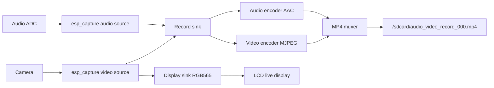

# 音视频录制与实时显示

- [English Version](./README.md)
- 例程难度：⭐⭐⭐

## 例程简介

本例程演示一个带本地屏幕预览的音视频录制应用。例程可采集摄像头画面和音频输入，在 LCD 上实时显示画面，同时将音视频内容录制为 MP4 文件并保存到 microSD 卡。

- LCD 实时显示摄像头画面
- microSD 卡保存录制生成的 MP4 文件
- 录制结束后校验文件大小并释放板级资源

### 典型场景

- 监控摄像头、视频门铃
- 带本地屏幕的音视频记录仪
- 智能相机、视频采集终端

### 运行机制



录制链路使用一个输出通道进行音视频编码、MP4 封装和写卡，显示链路使用另一个输出通道获取视频帧并刷新 LCD。例程将录制相关线程与显示任务分别绑定到不同 CPU 核，降低实时显示对录制链路的影响。

例程按芯片提供不同默认录像参数，当前支持 `ESP32-S3` 和 `ESP32-P4` 两个平台。

### 源码结构

本例程应用源码位于 `main/`，按功能拆分为多个文件；默认参数集中在 `av_rec_config.h`。

调用关系：`app_main` → `av_rec_board` → `av_rec_capture`（含 `av_rec_run_live_session`：start/stop 与 `sink0` 录制）→ `av_rec_display`（`sink1` 显示在 `av_rec_display.c`）。

```text
av_record_live_display/
├── main/
│   ├── app_main.c                 # 入口：app_main，串联 [1]～[7] 流程
│   ├── av_rec_config.h            # 宏、sys 类型、模块对外 API
│   ├── av_rec_board.c             # 板级设备初始化、LCD 格式、P4 显示完成回调
│   ├── av_rec_capture.c           # esp_capture、sink、MP4 路径/校验、线程核绑定
│   └── av_rec_display.c           # LCD 实时取帧、绘制与 FPS 统计
├── sdkconfig.defaults             # 通用 sdkconfig
├── sdkconfig.defaults.esp32s3     # S3 摄像头/PSRAM 等
├── sdkconfig.defaults.esp32p4     # P4 摄像头/PSRAM 等
├── partitions.csv
└── pytest_av_record_live_display.py
```

| 文件 | 职责 |
|------|------|
| `app_main.c` | 注册编解码器与 muxer，调用 `av_rec_run_live_session` 与录后校验 |
| `av_rec_board.c` | 初始化 `display_lcd`、`fs_sdcard`、`camera`、`audio_adc` 等 |
| `av_rec_capture.c` | 创建音视频源，配置 record/display sink 与 MP4 muxer，提供 MP4 路径与文件大小校验，`av_rec_run_live_session` 封装 start/stop |
| `av_rec_display.c` | 在独立任务中从 display sink 取帧并刷新 LCD |
| `av_rec_config.h` | 分辨率、码率、时长等可调宏（见下文「项目配置」） |

## 环境配置

### 硬件要求

- Camera
- Audio ADC 或麦克风
- LCD 模块
- microSD 卡

### 默认 IDF 分支

本例程支持 IDF release/v5.4 (>= v5.4.3) 与 release/v5.5 (>= v5.5.2) 分支。

## 编译和下载

### 编译准备

编译本例程前需先确保已配置 ESP-IDF 环境；若已配置可跳过本段，直接进入工程目录。若未配置，请在 ESP-IDF 根目录运行以下脚本完成环境设置，完整步骤请参阅 [《ESP-IDF 编程指南》](https://docs.espressif.com/projects/esp-idf/zh_CN/latest/esp32s3/index.html)。

```bash
./install.sh
. ./export.sh
```

下面是简略步骤：

- 进入本例程工程目录：

```bash
cd adf_examples/recorder/av_record_live_display
```

本示例使用 [ESP Board Manager](https://github.com/espressif/esp-board-manager) 管理板级资源。推荐安装辅助工具 [`esp-bmgr-assist`](https://pypi.org/project/esp-bmgr-assist/) 作为默认入口。

- 在已激活的 ESP-IDF Python 环境下安装（同一环境只需安装一次）：

```bash
pip install esp-bmgr-assist
pip install --upgrade esp-bmgr-assist  # 当提示需要更新时执行此命令
```

- 列出当前可见的开发板：

```bash
idf.py bmgr -l
```

输出示例：

```text
ℹ️  Board Components:
  espressif/esp_boards:
    [1] esp32_c3_lyra
    [2] esp32_lyrat_4_3
    [3] esp32_lyrat_mini_1_1
    [4] esp32_p4_eye
    [5] esp32_p4_function_ev_board
    [6] esp32_s31_function_coreboard_1
    [7] esp32_s31_korvo_1
    [8] esp32_s3_box_3
    [9] esp32_s3_box_lite
    [10] esp32_s3_korvo_2_3
    [11] esp32_s3_lcd_ev_board
    [12] esp_vocat_1_0
    [13] esp_vocat_1_2
```

以上输出示例基于 `esp_boards` 0.5.2 的开发板列表和排序。不同 `esp_boards` 版本或自定义开发板依赖可能会使列表和序号变化，使用时以 `idf.py bmgr -l` 的实际输出为准。

- 选择开发板：

```bash
idf.py bmgr -b <board_index|board_name>
```

例如选择 `esp32_s3_korvo_2_3`：

```bash
idf.py bmgr -b 10
# 或
idf.py bmgr -b esp32_s3_korvo_2_3
```

例如选择 `esp32_p4_function_ev_board`：

```bash
idf.py bmgr -b 5
# 或
idf.py bmgr -b esp32_p4_function_ev_board
```

首次执行 `idf.py bmgr` 时，组件会根据本工程 `main/idf_component.yml` 中声明的 `espressif/esp_board_manager` 依赖自动下载，并在 `components/gen_bmgr_codes/` 下生成板级代码。

> [!NOTE]
> 如果切换开发板，请重新执行 `idf.py bmgr -b <board_name|index>`，必要时 `idf.py fullclean` 后再编译。
> 所选板型须包含 `camera`、`audio_adc`、`display_lcd`、`fs_sdcard` 等设备，否则例程无法正常运行。
> 自定义开发板请参考 [创建开发板指南](https://docs.espressif.com/projects/esp-board-manager/zh_CN/latest/create-board/index.html)。
> `esp_board_manager` 更多信息请参考 [ESP_BOARD_MANAGER 入门指南](https://github.com/espressif/esp-board-manager/blob/main/esp_board_manager/README_CN.md)。

### 项目配置

可调宏定义见「源码结构」中的 `main/av_rec_config.h`。本例程可通过以下宏调整默认行为：

- `DEFAULT_RECORD_DURATION_MS`：录制与实时显示持续时间
- `DEFAULT_SLICE_DURATION_MS`：MP4 文件分片时长
- `RECORD_WIDTH`、`RECORD_HEIGHT`、`RECORD_FPS`：录像参数
- `DISPLAY_FPS`：LCD 实时显示帧率
- `RECORD_BITRATE`：录像码率
- `REC_AUDIO_SAMPLE_RATE`、`REC_AUDIO_CHANNEL`、`REC_AUDIO_BITS`：音频录制参数

本例程的显示分辨率默认跟随 LCD 分辨率，录像参数默认按芯片区分：

- `ESP32-S3`：`640x480`，`5 fps`
- `ESP32-P4`：`1024x600`，`30 fps`

上述默认值在选择开发板后生效；更换开发板后请重新执行 `idf.py bmgr -b <board_name>` 并完整编译。

### 编译与烧录

- 编译示例程序

```bash
idf.py build
```

- 烧录程序并运行 monitor 工具来查看串口输出（将 `PORT` 替换为端口名称）：

```bash
idf.py -p PORT flash monitor
```

- 退出调试界面使用 `Ctrl-]`

## 如何使用例程

### 功能和用法

- 上电后例程初始化摄像头、音频输入、LCD 和 SD 卡等板级资源。
- LCD 会实时显示摄像头画面，同时音视频内容保存到 `/sdcard/audio_video_record_000.mp4`。
- 到达默认录制时长后，例程自动停止采集、校验录制文件大小并释放资源。
- 若需要调整录制时长、分辨率、帧率或码率，可修改 `main/av_rec_config.h` 中的相关宏。

### 日志输出

正常流程依次为设备初始化、开始录制与实时显示、校验录制文件、例程结束及资源释放，关键步骤以 `[ 1 ]`～`[ 7 ]` 及 "Display fps"、"Record file size" 等标出。以下为关键 log（以 ESP32-P4 为例）：

```text
I (1441) main_task: Calling app_main()
I (1442) PERIPH_LDO: LDO initialize success
I (1445) AV_REC_BOARD: [ 1 ] Initialize display, storage, camera and audio ADC
I (1452) DEV_DISPLAY_LCD: Initializing LCD display: display_lcd, chip: ek79007, sub_type: dsi
I (1461) DEV_DISPLAY_LCD_SUB_DSI: Initializing DSI LCD display: display_lcd, chip: ek79007
I (1469) BOARD_PERIPH: Reuse periph: ldo_mipi, ref_count=2
I (1475) PERIPH_DSI: MIPI DSI bus initialize success
I (1478) ek79007: version: 1.0.4
E (1643) lcd_panel: esp_lcd_panel_swap_xy(50): swap_xy is not supported by this panel
W (1643) DEV_DISPLAY_LCD: Failed to swap LCD panel XY: ESP_ERR_NOT_SUPPORTED
E (1646) lcd_panel: esp_lcd_panel_disp_on_off(71): disp_on_off is not supported by this panel
I (1654) DEV_DISPLAY_LCD: Successfully initialized LCD display: display_lcd (sub_type: dsi), panel: 0x4ff3b5b4, io: 0x4ff3b568
I (1665) BOARD_MANAGER: Device display_lcd initialized
W (1670) ldo: The voltage value 0 is out of the recommended range [500, 2700]
I (1677) DEV_FS_FAT_SUB_SDMMC: slot_config: cd=-1, wp=-1, clk=0, cmd=0, d0=0, d1=0, d2=0, d3=0, d4=0, d5=0, d6=0, d7=0, width=4, flags=0x1
Name: SC32G
Type: SDHC
Speed: 40.00 MHz (limit: 40.00 MHz)
Size: 30436MB
CSD: ver=2, sector_size=512, capacity=62333952 read_bl_len=9
SSR: bus_width=4
I (1861) DEV_FS_FAT: Filesystem mounted, base path: /sdcard
I (1866) BOARD_MANAGER: Device fs_sdcard initialized
I (1871) DEV_CAMERA_SUB_CSI: Initializing CSI camera...
I (1876) PERIPH_I2C: I2C master bus initialized successfully
I (1881) BOARD_PERIPH: Reuse periph: ldo_mipi, ref_count=3
I (1888) sc2336: Detected Camera sensor PID=0xcb3a
I (1967) DEV_CAMERA_SUB_CSI: CSI camera initialized successfully, dev_path: /dev/video0
I (1967) DEV_CAMERA: Successfully initialized camera device: camera, sub_type: csi, dev_path: /dev/video0
I (1973) BOARD_MANAGER: Device camera initialized
I (1978) PERIPH_I2S: I2S[0] STD, RX, ws: 10, bclk: 12, dout: 9, din: 11
I (1983) PERIPH_I2S: I2S[0] initialize success: 0x481360a4
I (1989) DEV_AUDIO_CODEC: ADC over I2S is enabled
I (1993) BOARD_PERIPH: Reuse periph: i2c_master, ref_count=2
I (2004) ES8311: Work in Slave mode
I (2007) DEV_AUDIO_CODEC: Successfully initialized codec: audio_adc
I (2008) DEV_AUDIO_CODEC: Create esp_codec_dev success, dev:0x4ff3f9c4, chip:es8311
I (2015) BOARD_MANAGER: Device audio_adc initialized
I (2020) BOARD_DEVICE: Device handle audio_adc found, Handle: 0x4ff3dcf8 TO: 0x4ff3dcf8
I (2028) BOARD_DEVICE: Device handle display_lcd found, Handle: 0x4ff3b4fc TO: 0x4ff3b4fc
I (2035) AV_REC_BOARD: Display done callback registered
I (2040) BOARD_DEVICE: Device display_lcd config found: 0x401d6be0 (size: 124)
I (2047) AV_REC_BOARD: Display sink format=0x4c424752 size=1024x600 fps=30
I (2054) AV_REC_MAIN: [ 2 ] Register audio/video encoders and MP4 muxer
I (2061) AV_REC_MAIN: [ 3 ] Build capture system and dual sinks
I (2067) BOARD_DEVICE: Device handle audio_adc found, Handle: 0x4ff3dcf8 TO: 0x4ff3dcf8
I (2074) BOARD_DEVICE: Device handle camera found, Handle: 0x4ff3be94 TO: 0x4ff3be94
I (2083) VENC_EL: Create vid_enc-0x48137030
I (2086) OVERLAY_MIXER: Create video overlay, vid_overlay-0x48137100
I (2092) AV_REC_MAIN: [ 4 ] Start capture, live display and recording
W (2098) CAPTURE_MUXER: Muxer type 540299341 does not support streaming
I (2105) CAPTURE_MUXER: Enter muxer thread muxing 1
I (2110) GMF_VID_PIPE: Build pipe nego for format rgb565 1024x600 30 fps
I (2116) V4L2_SRC: Success to open camera
I (2119) V4L2_SRC: Best match 1024x600
I (2123) OVERLAY_MIXER: Create video overlay, vid_overlay-0x48138a80
I (2129) VENC_EL: Create vid_enc-0x48138da4
I (2133) OVERLAY_MIXER: Create video overlay, vid_overlay-0x48138f28
I (2139) VENC_EL: Create vid_enc-0x48138fd8
I (2143) VID_PIPE_NEGO: Start to nego for input format rgb565 1024x600 30fps
I (2150) V4L2_SRC: Best match 1024x600
I (2153) VID_PIPE_NEGO: Set path 0 in rgb565 out mjpeg
I (2158) VID_SRC: Info 1024x600 30fps
I (2161) VIDEO_COMM: Video info for vid_overlay-0x48138a80 format:rgb565 1024x600 30fps
I (2169) VID_PIPE_NEGO: Success to negotiate 0 format:rgb565 1024x600 30fps
I (2176) VIDEO_COMM: Video info for vid_overlay-0x48138f28 format:rgb565 1024x600 30fps
I (2183) VID_PIPE_NEGO: Success to negotiate 1 format:rgb565 1024x600 30fps
I (2192) VIDEO_COMM: Video info for vid_ppa-0x48138b30 format:rgb565 1024x600 30fps
I (2193) VIDEO_COMM: Video info for vid_overlay-0x48138a80 format:rgb565 1024x600 30fps
I (2205) VIDEO_COMM: Video info for vid_overlay-0x48138f28 format:rgb565 1024x600 30fps
I (2213) VIDEO_COMM: Video info for vid_enc-0x48138fd8 format:rgb565 1024x600 30fps
I (2214) AUD_PIPE_NEGO: Negotiate return 0 src_format:541934416 sample_rate:48000

I (2228) AUD_PIPE_NEGO: Path mask 1 select sink:0 format 541278529
I (2234) AUD_SRC: Get rate:48000, ch:2, bits:16
I (2234) VIDEO_COMM: Video info for vid_enc-0x48138da4 format:rgb565 1024x600 30fps
I (2238) I2S_IF: Paired data: 0x4ff3fb44, current mode: record, paired in_enable: 0, paired out_enable: 0
I (2255) BOARD_DEVICE: Device handle fs_sdcard found, Handle: 0x4ff3b9c4 TO: 0x4ff3b9c4
I (2255) I2S_IF: STD: RX, data_bit: 16, slot_bit: 16, ws_width: 16, slot_mode: STEREO, slot_mask: 0x3
I (2271) I2S_IF: STD: RX, sample_rate_hz: 48000, mclk_multiple: 256, clk_src: 0
I (2262) AV_REC_CAPTURE: Record file: /sdcard/audio_video_record_000.mp4
I (2246) AV_REC_DISPLAY: Live display loop started
I (2278) I2S_IF: STD: TX, data_bit: 16, slot_bit: 16, ws_width: 16, slot_mode: STEREO, slot_mask: 0x3
I (2298) I2S_IF: STD: TX, sample_rate_hz: 48000, mclk_multiple: 256, clk_src: 0
I (2319) Adev_Codec: Open codec device OK
I (2319) AUD_SRC: Start to fetch audio src data now
I (2331) ESP_GMF_AENC: Open, type:AAC, acquire in frame: 4096, out frame: 1736
I (3285) AV_REC_DISPLAY: Display fps=27.91, frames=29, pts=933
I (4313) AV_REC_DISPLAY: Display fps=30.16, frames=60, pts=1966
I (5314) AV_REC_DISPLAY: Display fps=29.97, frames=90, pts=2966
I (6346) AV_REC_DISPLAY: Display fps=30.04, frames=121, pts=4000
I (7386) AV_REC_DISPLAY: Display fps=29.81, frames=152, pts=5033
I (7442) : ┌───────────────────┬──────────┬─────────────┬─────────┬──────────┬───────────┬────────────┬───────┐
I (7458) : │ Task              │ Core ID  │ Run Time    │ CPU     │ Priority │ Stack HWM │ State      │ Stack │
I (7470) : ├───────────────────┼──────────┼─────────────┼─────────┼──────────┼───────────┼────────────┼───────┤
I (7497) : │ IDLE0             │ 0        │ 771316      │  38.57% │ 0        │ 1220      │ Ready      │ Intr  │
I (7508) : │ Muxer             │ 0        │ 156773      │   7.84% │ 5        │ 2108      │ Blocked    │ Extr  │
I (7520) : │ isp_task          │ 0        │ 32241       │   1.61% │ 11       │ 1712      │ Blocked    │ Intr  │
I (7531) : │ venc_0            │ 0        │ 23226       │   1.16% │ 2        │ 1696      │ Blocked    │ Extr  │
I (7542) : │ AUD_SRC           │ 0        │ 9395        │   0.47% │ 15       │ 2332      │ Blocked    │ Extr  │
I (7554) : │ vid_src           │ 0        │ 6464        │   0.32% │ 10       │ 1748      │ Blocked    │ Extr  │
I (7565) : │ sys_monitor       │ 0        │ 585         │   0.03% │ 1        │ 3612      │ Running    │ Extr  │
I (7577) : │ main              │ 0        │ 0           │   0.00% │ 1        │ 776       │ Suspended  │ Intr  │
I (7588) : │ ipc0              │ 0        │ 0           │   0.00% │ 24       │ 704       │ Suspended  │ Intr  │
I (7599) : ├───────────────────┼──────────┼─────────────┼─────────┼──────────┼───────────┼────────────┼───────┤
I (7627) : │ IDLE1             │ 1        │ 761871      │  38.09% │ 0        │ 1244      │ Ready      │ Intr  │
I (7638) : │ aenc_0            │ 1        │ 219319      │  10.97% │ 2        │ 2496      │ Blocked    │ Extr  │
I (7649) : │ display           │ 1        │ 11250       │   0.56% │ 5        │ 4008      │ Blocked    │ Intr  │
I (7661) : │ venc_1            │ 1        │ 7560        │   0.38% │ 2        │ 1956      │ Blocked    │ Extr  │
I (7672) : │ ipc1              │ 1        │ 0           │   0.00% │ 24       │ 712       │ Suspended  │ Intr  │
I (7683) : ├───────────────────┼──────────┼─────────────┼─────────┼──────────┼───────────┼────────────┼───────┤
I (7711) : │ Tmr Svc           │ 7fffffff │ 0           │   0.00% │ 1        │ 1716      │ Blocked    │ Intr  │
I (7722) : └───────────────────┴──────────┴─────────────┴─────────┴──────────┴───────────┴────────────┴───────┘
I (7749) MONITOR: Func:sys_monitor_task, Line:25, MEM Total:29807644 Bytes, Inter:507699 Bytes, Dram:507699 Bytes

I (8414) AV_REC_DISPLAY: Display fps=30.16, frames=183, pts=6066
I (9447) AV_REC_DISPLAY: Display fps=30.04, frames=214, pts=7100
I (10480) AV_REC_DISPLAY: Display fps=29.98, frames=245, pts=8133
I (11518) AV_REC_DISPLAY: Display fps=29.87, frames=276, pts=9166
I (12547) AV_REC_DISPLAY: Display fps=30.13, frames=307, pts=10200
I (13580) AV_REC_DISPLAY: Display fps=30.01, frames=338, pts=11233
I (13759) : ┌───────────────────┬──────────┬─────────────┬─────────┬──────────┬───────────┬────────────┬───────┐
I (13775) : │ Task              │ Core ID  │ Run Time    │ CPU     │ Priority │ Stack HWM │ State      │ Stack │
I (13788) : ├───────────────────┼──────────┼─────────────┼─────────┼──────────┼───────────┼────────────┼───────┤
I (13814) : │ IDLE0             │ 0        │ 756570      │  37.83% │ 0        │ 1220      │ Ready      │ Intr  │
I (13826) : │ Muxer             │ 0        │ 176972      │   8.85% │ 5        │ 2108      │ Blocked    │ Extr  │
I (13837) : │ isp_task          │ 0        │ 26072       │   1.30% │ 11       │ 1580      │ Blocked    │ Intr  │
I (13848) : │ venc_0            │ 0        │ 23949       │   1.20% │ 2        │ 1696      │ Blocked    │ Extr  │
I (13860) : │ AUD_SRC           │ 0        │ 9439        │   0.47% │ 15       │ 2332      │ Blocked    │ Extr  │
I (13871) : │ vid_src           │ 0        │ 6548        │   0.33% │ 10       │ 1748      │ Blocked    │ Extr  │
I (13883) : │ sys_monitor       │ 0        │ 450         │   0.02% │ 1        │ 1816      │ Running    │ Extr  │
I (13894) : │ ipc0              │ 0        │ 0           │   0.00% │ 24       │ 704       │ Suspended  │ Intr  │
I (13906) : │ main              │ 0        │ 0           │   0.00% │ 1        │ 776       │ Suspended  │ Intr  │
I (13918) : ├───────────────────┼──────────┼─────────────┼─────────┼──────────┼───────────┼────────────┼───────┤
I (13944) : │ IDLE1             │ 1        │ 761408      │  38.07% │ 0        │ 1244      │ Ready      │ Intr  │
I (13956) : │ aenc_0            │ 1        │ 219051      │  10.95% │ 2        │ 2496      │ Blocked    │ Extr  │
I (13968) : │ display           │ 1        │ 12134       │   0.61% │ 5        │ 4008      │ Blocked    │ Intr  │
I (13979) : │ venc_1            │ 1        │ 7407        │   0.37% │ 2        │ 1956      │ Blocked    │ Extr  │
I (13991) : │ ipc1              │ 1        │ 0           │   0.00% │ 24       │ 712       │ Suspended  │ Intr  │
I (14002) : ├───────────────────┼──────────┼─────────────┼─────────┼──────────┼───────────┼────────────┼───────┤
I (14029) : │ Tmr Svc           │ 7fffffff │ 0           │   0.00% │ 1        │ 1716      │ Blocked    │ Intr  │
I (14040) : └───────────────────┴──────────┴─────────────┴─────────┴──────────┴───────────┴────────────┴───────┘
I (14068) MONITOR: Func:sys_monitor_task, Line:25, MEM Total:29800676 Bytes, Inter:507699 Bytes, Dram:507699 Bytes

I (14613) AV_REC_DISPLAY: Display fps=30.01, frames=369, pts=12266
I (15618) AV_REC_DISPLAY: Display fps=29.85, frames=399, pts=13266
I (16647) AV_REC_DISPLAY: Display fps=30.13, frames=430, pts=14300
I (17247) AV_REC_DISPLAY: Display loop finished, frames=448, bad_frames=0
I (17258) CAPTURE_MUXER: Muxer receive stop
I (17258) CAPTURE_MUXER: Leave muxer thread
I (17265) GMF_CAPTURE_APATH: Drop for disable
I (17277) GMF_CAPTURE_VPATH: Drop for disable
I (17285) AUD_SRC: Closed, 0x483ef288
I (17305) AUD_SRC: Audio src thread exited
I (17309) GMF_CAPTURE_VPATH: Drop for disable
I (17336) AV_REC_MAIN: [ 5 ] Check recorded MP4 file
I (17336) BOARD_DEVICE: Device handle fs_sdcard found, Handle: 0x4ff3b9c4 TO: 0x4ff3b9c4
I (17341) AV_REC_CAPTURE: Record file size: /sdcard/audio_video_record_000.mp4 -> 11708756 bytes
I (17346) AV_REC_MAIN: [ 6 ] Example finished
I (17351) BOARD_DEVICE: Deinit device audio_adc ref_count: 0 device_handle:0x4ff3dcf8
I (17364) BOARD_DEVICE: Device audio_adc config found: 0x401d6cb0 (size: 384)
I (17365) BOARD_PERIPH: Deinit peripheral i2s_audio_in ref_count: 0
E (17371) i2s_common: i2s_channel_disable(1262): the channel has not been enabled yet
W (17378) PERIPH_I2S: Caution: Releasing RX (0x0).
I (17383) BOARD_PERIPH: Deinit peripheral i2c_master ref_count: 1
W (17389) BOARD_PERIPH: Peripheral i2c_master still has 1 references, not deinitializing
I (17396) BOARD_MANAGER: Device audio_adc deinitialized
I (17401) BOARD_DEVICE: Deinit device camera ref_count: 0 device_handle:0x4ff3be94
I (17409) BOARD_DEVICE: Device camera config found: 0x401d6af4 (size: 116)
I (17415) DEV_CAMERA_SUB_CSI: Deinitializing CSI camera...
I (17521) BOARD_DEVICE: Device camera config found: 0x401d6af4 (size: 116)
I (17521) BOARD_PERIPH: Deinit peripheral i2c_master ref_count: 0
I (17522) PERIPH_I2C: I2C master bus deinitialized successfully
I (17528) BOARD_PERIPH: Deinit peripheral ldo_mipi ref_count: 2
W (17533) BOARD_PERIPH: Peripheral ldo_mipi still has 2 references, not deinitializing
I (17541) DEV_CAMERA: Sub device 'csi' deinitialized successfully
I (17547) BOARD_MANAGER: Device camera deinitialized
I (17552) BOARD_DEVICE: Deinit device fs_sdcard ref_count: 0 device_handle:0x4ff3b9c4
I (17559) BOARD_DEVICE: Device fs_sdcard config found: 0x401d6c5c (size: 84)
I (17566) DEV_FS_FAT: Sub device 'sdmmc' deinitialized successfully
I (17572) BOARD_MANAGER: Device fs_sdcard deinitialized
I (17577) BOARD_DEVICE: Deinit device display_lcd ref_count: 0 device_handle:0x4ff3b4fc
I (17585) BOARD_DEVICE: Device display_lcd config found: 0x401d6be0 (size: 124)
I (17592) BOARD_PERIPH: Deinit peripheral dsi_display ref_count: 0
I (17597) PERIPH_DSI: MIPI DSI bus deinitialize
I (17602) BOARD_PERIPH: Deinit peripheral ldo_mipi ref_count: 1
W (17607) BOARD_PERIPH: Peripheral ldo_mipi still has 1 references, not deinitializing
I (17615) DEV_DISPLAY_LCD: LCD(sub_type: dsi) deinitialized successfully
I (17621) BOARD_MANAGER: Device display_lcd deinitialized
I (17627) BOARD_PERIPH: Deinit peripheral ldo_mipi ref_count: 0
I (17632) PERIPH_LDO: LDO deinitialize
I (17636) AV_REC_MAIN: [ 7 ] All resources released
I (17641) main_task: Returned from app_main()
```

## 故障排除

### Board Manager / 板型配置

- 若未执行 `idf.py bmgr -b` 或缺少 `components/gen_bmgr_codes/`，编译可能失败或设备无法初始化。
- 更换开发板后请重新执行 `idf.py bmgr -b <board_name>`，必要时 `idf.py fullclean` 后再 `idf.py build`。

### LCD 无实时显示画面

- 确认执行 `idf.py bmgr -b` 时选择的板型包含 `display_lcd`（如 `esp32_s3_korvo_2_3`、`esp32_p4_function_ev_board`）。
- 确认开发板的 LCD 屏幕与摄像头可同时正常初始化。

### 未生成 MP4 文件

- 确认 microSD 卡已正确挂载并具备写权限，且需要使能长文件名支持。
- 若日志未出现 `Record file:`，请检查摄像头、Audio ADC、音视频编码器和 MP4 muxer 是否启动成功。

### MP4 文件没有音频

- 确认所选开发板支持并启用了 `AUDIO_ADC` 设备。
- 确认 `CONFIG_ESP_BOARD_DEV_AUDIO_CODEC_SUPPORT` 已启用。
- 确认日志中未出现 `Failed to create audio source` 或 `Failed to init audio ADC`。

### 视频采集启动失败

- 确认摄像头已正确连接并与所选开发板匹配。
- 对 `ESP32-S3`，建议使用仓库中已验证的 `esp32_s3_korvo_2_3` 板级配置。
- 对 `ESP32-P4`，建议使用 `esp32_p4_function_ev_board` 并确保 MIPI 相关硬件连接正常。

## 技术支持

请按照下面的链接获取技术支持：

- 技术支持参见 [esp32.com](https://esp32.com/viewforum.php?f=20) 论坛
- 问题反馈与功能需求，请创建 [GitHub issue](https://github.com/espressif/esp-adf/issues)

我们会尽快回复。
