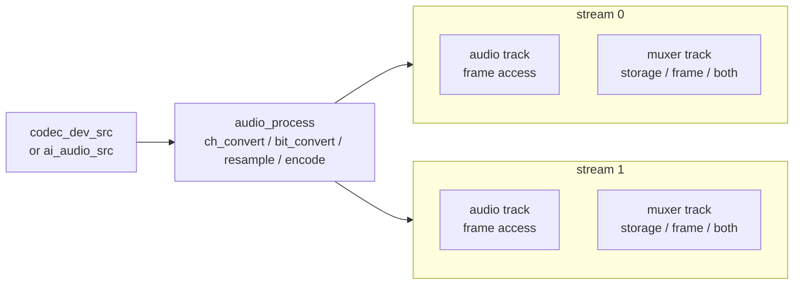
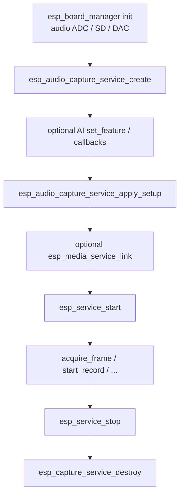

# ESP Audio Capture Service

- [](https://components.espressif.com/components/espressif/esp_audio_capture_service)
- [中文版](./README_CN.md)

`esp_audio_capture_service` is a board-aware **audio recorder** built on top of [`esp_capture_service`](../esp_capture_service/README.md). It discovers the board audio ADC through `esp_board_manager`, selects a codec-device source or an AI audio front-end source, and applies a stream / muxer setup so an application can obtain a ready-to-use audio capture pipeline with a short call sequence.

The returned handle is a standard `esp_capture_service_t *`. After creation you control it with the normal `esp_capture_service` / `esp_media_service` / `esp_service` APIs (start, stop, link, read, record).

## Features

- Discovers the board codec record (ADC) handle through `esp_board_manager`
- Automatically selects a **codec-device source** or an **AI audio source** when AI features are requested
- Configures up to two output streams with independent codecs, enable state, and muxers
- Pins the raw ADC / I2S sample rate via `fixed_src_sample_rate` for deterministic multi-stream negotiation
- Reuses all `esp_capture_service` runtime features: multi-stream output, storage muxers, manual record, frame pull, and service linking
- Optional AI front-end features: AEC, NS, VAD, WakeNet, DOA, plus callbacks and PCM dump

> Initialize board devices with `esp_board_manager` **before** calling these APIs.

## Data Flow

One source feeds shared audio processing, then fans out into one or more **streams**. A stream is a **group of tracks**; each track is the export / frame-access point (`acquire_frame`, link, or muxer). Enable or disable a stream or a single track so you only expose the data you need.



Short rules:

- **Source**: plain `codec_dev_src`, or `ai_audio_src` when an AI feature mask is set
- **Process**: channel / bit-depth / resample / encode adapt shared PCM to each stream's track format
- **Stream**: a group of tracks (codec / enable / muxer settings). Disable the whole group with `esp_capture_service_enable_stream()`
- **Track**: frame access point for elementary audio, and also for muxer output when enabled
  - Audio track: pull / link elementary frames. Disable it with `esp_capture_service_enable_track(..., ESP_MEDIA_TRACK_TYPE_AUDIO, false)` when you do not need to fetch elementary data
  - Muxer track: can be **storage only**, **frame only**, or **both**, controlled by `storage_dir` / `auto_record` and `streaming` in `esp_capture_service_muxer_cfg_t`
  - Special case: containers that support streaming (for example **TS** / **FLV**) can expose muxed packets as frame-accessible output when `streaming` is set; non-streaming containers ignore `streaming` and are typically storage-oriented

## Call Sequence



## Typical Usage

```c
#include "esp_audio_capture_service.h"
#include "esp_audio_capture_service_setup.h"
#include "esp_capture_service_ops.h"
#include "esp_service.h"

/* Board devices must be initialized first (esp_board_manager). */

esp_audio_capture_service_cfg_t cfg = {
    .dev_name = NULL,       /* NULL uses the default board audio ADC */
    .max_stream_num = 1,
};
esp_capture_service_t *capture = NULL;
ESP_ERROR_CHECK(esp_audio_capture_service_create(&cfg, &capture));

esp_audio_capture_service_setup_t setup = {
    .stream_num = 1,
    .fixed_src_sample_rate = 16000,
    .streams[0] = {
        .enabled = true,
        .audio_info = {
            .codec = ESP_CAPTURE_FMT_ID_AAC,
            .sample_rate = 16000,
            .bits_per_sample = 16,
            .channel = 1,
            .bitrate = 64000,
        },
    },
};
ESP_ERROR_CHECK(esp_audio_capture_service_apply_setup(capture, &setup));

esp_service_t *base = ESP_SERVICE_BASE(capture);
ESP_ERROR_CHECK(esp_service_start(base));

esp_media_frame_t frame = { .type = ESP_MEDIA_TRACK_TYPE_AUDIO };
if (esp_capture_service_acquire_frame(capture, 0, &frame, 1000) == ESP_OK) {
    /* ... consume PCM / encoded audio ... */
    esp_capture_service_release_frame(capture, 0, &frame);
}

esp_service_stop(base);
esp_capture_service_destroy(capture);
```

### AI Audio Front-End

Set AI features **before** `apply_setup()`. A non-zero feature mask makes setup select the AI source instead of the plain codec-device source:

```c
uint32_t features = ESP_AUDIO_CAPTURE_SERVICE_AI_FEATURE_AEC |
                    ESP_AUDIO_CAPTURE_SERVICE_AI_FEATURE_VAD;
esp_capture_service_ai_audio_src_feature_cfg_t feature_cfg = {0};
ESP_ERROR_CHECK(esp_capture_service_ai_audio_src_set_feature(capture, features, &feature_cfg));
ESP_ERROR_CHECK(esp_capture_service_ai_audio_src_set_vad_cb(capture, vad_cb, NULL));

esp_audio_capture_service_setup_t setup = {
    .stream_num = 1,
    .fixed_src_sample_rate = 16000,
    .streams[0] = {
        .enabled = true,
        .audio_info = {
            .codec = ESP_CAPTURE_FMT_ID_PCM,
            .sample_rate = 16000,
            .bits_per_sample = 16,
            .channel = 1,
        },
    },
};
ESP_ERROR_CHECK(esp_audio_capture_service_apply_setup(capture, &setup));
```

Feature mask bits (each feature also needs its matching Kconfig enabled, otherwise `set_feature` / setup returns `ESP_ERR_NOT_SUPPORTED`):

| Macro | Bit | Function | Required Kconfig |
| --- | --- | --- | --- |
| `ESP_AUDIO_CAPTURE_SERVICE_AI_FEATURE_AEC` | `0x01` | Acoustic echo cancellation: removes loudspeaker / DAC reference echo from the mic signal | `ESP_AUDIO_CAPTURE_SERVICE_AI_SRC_AEC_SUPPORT` |
| `ESP_AUDIO_CAPTURE_SERVICE_AI_FEATURE_NS` | `0x02` | Noise suppression: reduces stationary / background noise on the processed PCM | `ESP_AUDIO_CAPTURE_SERVICE_AI_SRC_NS_SUPPORT` |
| `ESP_AUDIO_CAPTURE_SERVICE_AI_FEATURE_VAD` | `0x04` | Voice activity detection: reports speech / noise state changes through `set_vad_cb()` | `ESP_AUDIO_CAPTURE_SERVICE_AI_SRC_VAD_SUPPORT` |
| `ESP_AUDIO_CAPTURE_SERVICE_AI_FEATURE_WN` | `0x08` | WakeNet: detects a wake word and reports the trigger channel through `set_wn_cb()` | `ESP_AUDIO_CAPTURE_SERVICE_AI_SRC_WN_SUPPORT` |
| `ESP_AUDIO_CAPTURE_SERVICE_AI_FEATURE_DOA` | `0x10` | Direction of arrival: estimates talker angle (degrees) through `set_doa_cb()` | `ESP_AUDIO_CAPTURE_SERVICE_AI_SRC_DOA_SUPPORT` |

Also enable `ESP_AUDIO_CAPTURE_SERVICE_AI_SRC_ENABLED` to compile the AI source, and `ESP_AUDIO_CAPTURE_SERVICE_AI_SRC_AFE_SUPPORT` when using the compact AFE path (preferred when two or more of {AEC, NS, VAD, WN} are enabled together).

Related APIs: `esp_capture_service_ai_audio_src_set_vad_cb()`, `_set_wn_cb()`, `_set_doa_cb()`, `_set_read_cb()`, `_enable_dump()`.

#### Debug Tips

To inspect the **raw ADC PCM before AI processing**, call `esp_capture_service_ai_audio_src_enable_dump()` **before** start (and before or right after `set_feature` / `apply_setup`). The AI source writes `DIR/src.pcm` while it is open:

```c
/* Directory must already exist, e.g. /sdcard/audio_record */
ESP_ERROR_CHECK(esp_capture_service_ai_audio_src_enable_dump(capture, "/sdcard/audio_record"));
```

Then compare:

- `DIR/src.pcm` — original multi-channel source PCM fed into the AI pipeline
- Captured / recorded output frames — PCM after AEC / NS / other enabled features

Other useful checks:

- Register VAD / WakeNet / DOA callbacks to confirm events fire as expected
- For AEC, play a known reference on the DAC and verify the board routes it into the ADC echo / reference channel
- If a feature bit is set but Kconfig support is off, rebuild with the matching `ESP_AUDIO_CAPTURE_SERVICE_AI_SRC_*_SUPPORT` option enabled

## Setup

Applied through `esp_audio_capture_service_setup_t`:

```c
typedef struct {
    bool                            enabled;     /* stream run-state; track is still added when disabled */
    esp_media_audio_info_t          audio_info;  /* output codec / sample rate / bits / channels */
    esp_capture_service_muxer_cfg_t muxer;       /* optional storage / streaming muxer */
} esp_audio_capture_service_stream_cfg_t;

typedef struct {
    uint16_t                               stream_num;             /* 1..ESP_AUDIO_CAPTURE_SERVICE_MAX_STREAM_NUM (2) */
    esp_audio_capture_service_stream_cfg_t streams[...];
    uint32_t                               fixed_src_sample_rate;  /* pin raw ADC rate; 0 keeps source default */
    esp_capture_audio_src_if_t            *audio_src;              /* NULL selects codec / AI source automatically */
} esp_audio_capture_service_setup_t;
```

Notes:

- **`fixed_src_sample_rate` pins the raw source (ADC) sample rate.** The raw source format is always PCM; encoding to AAC / G711 / OPUS happens on the capture path. This keeps source negotiation deterministic when multiple streams request different output codecs.
- A **disabled stream is still configured** (its track is added) but is not run after setup. Enable it later with `esp_capture_service_enable_stream()`.
- Pass a caller-owned `audio_src` to override automatic source selection.
- Setup may be re-applied any number of times before start; applying while running is rejected.

## Create Configuration

`esp_audio_capture_service_cfg_t`:

| Field | Description |
| --- | --- |
| `dev_name` | Board-manager audio ADC device name; `NULL` uses the default audio ADC |
| `pool` | Optional GMF pool for AI audio; `NULL` creates an internal pool on open. Caller-owned. |
| `max_stream_num` | Maximum output streams; `0` uses 1 |

If the board audio ADC device cannot be found, creation fails with an error from board discovery / allocation.

## Runtime Operations

Use the core capture-service APIs on the returned handle:

```c
esp_capture_service_set_storage_url(capture, stream, url);
esp_capture_service_start_record(capture, stream);
esp_capture_service_stop_record(capture, stream);
esp_capture_service_acquire_frame(capture, stream, &frame, timeout_ms);
esp_capture_service_release_frame(capture, stream, &frame);
```

For everything else:

- Start / stop: `esp_service_start()` / `esp_service_stop()` on `ESP_SERVICE_BASE(capture)`
- Linking: `esp_media_service_link()`
- Stream / track toggles, one-shot, native handles: `esp_capture_service_*`
- Destroy: `esp_capture_service_destroy(capture)`

## Optimization

When using audio capture only, trim unused video / codec / muxer / AI pieces to save flash, RAM, and CPU. Fine-tune thread resources through `esp_service_scheduler`.

1. **Disable unused video in `esp_capture`**
   - Set `CONFIG_ESP_CAPTURE_ENABLE_VIDEO=n` (and related overlay / decoder options) when the product is audio-only
2. **Register only needed audio codecs**
   - Prefer registering the exact encoders you use instead of pulling in everything
   - If you call `esp_audio_enc_register_default()` / `esp_audio_dec_register_default()`, turn off unused `CONFIG_AUDIO_ENCODER_*` / `CONFIG_AUDIO_DECODER_*` Kconfig options so default registration stays lean
   - Decoders are mainly needed for playback / verify paths; disable them when capture does not play back recordings
3. **Register only needed muxers**
   - Register only the containers you write (for example MP4 / WAV)
   - If you call `esp_muxer_register_default()`, disable unused `CONFIG_ESP_MUXER_*_SUPPORT` options
4. **Disable AI features when not needed**
   - Set `CONFIG_ESP_AUDIO_CAPTURE_SERVICE_AI_SRC_ENABLED=n`, or leave it enabled and turn off unused `ESP_AUDIO_CAPTURE_SERVICE_AI_SRC_*_SUPPORT` options
   - Do not call `esp_capture_service_ai_audio_src_set_feature()` unless AI processing is required
5. **Tune task scheduling for performance / resource usage**
   - Install `esp_service_scheduler_set_cb()` and adjust stack, priority, and core for capture threads under `ESP_CAPTURE_SERVICE_SCHEDULER_NAME` (`"esp_capture"`), such as `AUD_SRC`, `aenc_0`, `aenc_1`
   - AI audio tasks (for example `ai_audio_pipe`, `afe_feed`, `afe_fetch`) can be tuned the same way
   - Prefer this over `esp_capture_set_thread_scheduler()`

See the audio record example scheduler helper for a concrete callback pattern.

## Configuration

AI audio Kconfig options and feature-bit mapping are listed under [AI Audio Front-End](#ai-audio-front-end). Stream / track / storage settings are configured at runtime through `esp_audio_capture_service_apply_setup()`.

## Points Of Attention

- Board audio ADC must be initialized before create / setup.
- Configure AI features and callbacks **before** `apply_setup()` and **before** start. Changing them while running returns `ESP_ERR_INVALID_STATE`.
- For AEC evaluation, feed a live DAC reference that the board routes into the echo / reference channel.
- Always release every acquired frame before stop / destroy.
- Storage directories configured through the muxer are auto-created by `esp_capture_service` (maximum depth 2, for example `/sdcard/audio_record`). The separate AI PCM dump directory must already exist.
- See [`esp_capture_service`](../esp_capture_service/README.md) for muxer lazy-binding and timeout semantics.

## Example

See [`examples/audio_capture`](./examples/audio_capture/README.md) for interactive streaming, storage, dual-stream, and AI audio cases.

## MCP Tools

When `CONFIG_ESP_AUDIO_CAPTURE_SERVICE_MCP_ENABLE=y` (depends on `CONFIG_ESP_MCP_ENABLE`):

- Setup / control tools cover `apply_setup`, `start` / `stop`, `enable_stream`, `start_record` / `stop_record`, storage URL helpers, and `get_status`.
- Register the capture service with a service manager using `esp_audio_capture_service_mcp_schema_get()` and `esp_audio_capture_service_tool_invoke()`.
- Media link / unlink and dummy-sink stats stay in `esp_media_service` MCP; frames never go over MCP.

See the `audio_capture` example MCP Operation Guide for UART end-to-end verification.

## Technical Support

For technical support, use the links below:

- Technical support: [esp32.com](https://esp32.com/viewforum.php?f=20) forum
- Issue reports and feature requests: [GitHub issue](https://github.com/espressif/esp-adf/issues)

We will reply as soon as possible.
