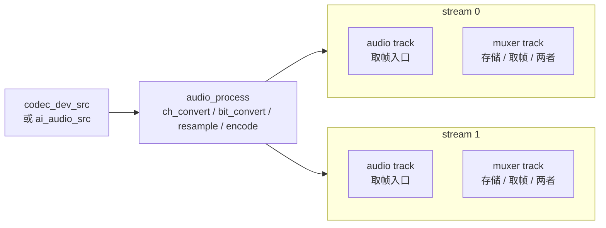
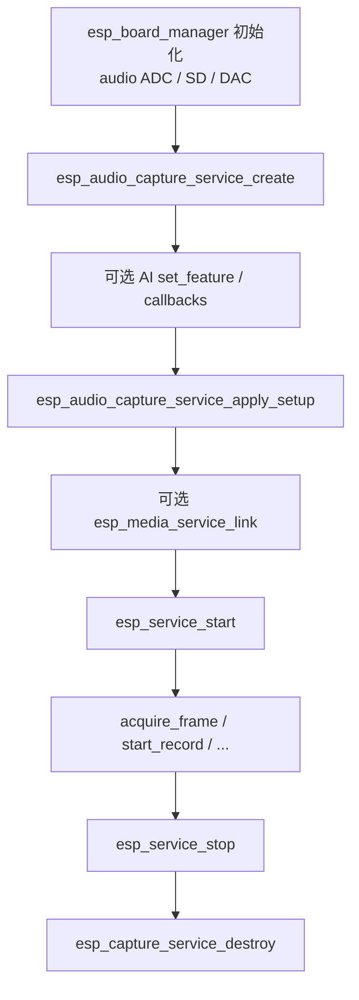

# ESP Audio Capture Service

- [](https://components.espressif.com/components/espressif/esp_audio_capture_service)
- [English](./README.md)

`esp_audio_capture_service` 是基于 [`esp_capture_service`](../esp_capture_service/README_CN.md) 的板级**音频录制**封装。它通过 `esp_board_manager` 发现板载音频 ADC，自动选择 codec 设备源或 AI 音频前端源，并应用 stream / muxer 配置，使应用程序可以用很短的调用序列获得可用的音频采集管线。

返回句柄为标准的 `esp_capture_service_t *`。创建后可通过常规的 `esp_capture_service` / `esp_media_service` / `esp_service` API 进行 start、stop、link、读帧与录制。

## 功能

- 通过 `esp_board_manager` 发现板载 codec 录音（ADC）句柄
- 在请求 AI 功能时自动选择 **codec 设备源** 或 **AI 音频源**
- 最多配置 2 路输出 stream，各自独立编解码、启停状态与 muxer
- 通过 `fixed_src_sample_rate` 固定原始 ADC / I2S 采样率，保证多 stream 协商确定
- 复用 `esp_capture_service` 全部运行时能力：多 stream 输出、存储 muxer、手动录制、拉帧与服务链接
- 可选 AI 前端能力：AEC、NS、VAD、WakeNet、DOA，以及回调与 PCM dump

> 调用这些 API **之前**，请先通过 `esp_board_manager` 初始化板级设备。

## 数据流

一个音频源经过共享的音频处理后，再分发到一个或多个 **stream**。stream 是一组 **track**；每条 track 是对外导出 / 取帧入口（`acquire_frame`、link 或 muxer）。可启停整个 stream 或单条 track，只暴露真正需要的数据。



简要规则：

- **Source**：普通 `codec_dev_src`；设置 AI feature mask 后使用 `ai_audio_src`
- **Process**：声道 / 位深 / 重采样 / 编码，将共享 PCM 适配到各 stream 的 track 格式
- **Stream**：一组 track（编解码 / 启停 / muxer 配置）。可用 `esp_capture_service_enable_stream()` 关闭整组
- **Track**：基本音频轨的取帧入口；muxer 输出在启用时也可作为取帧入口
  - Audio track：拉帧 / 链接基本音频帧。不需要取基本音频数据时，用 `esp_capture_service_enable_track(..., ESP_MEDIA_TRACK_TYPE_AUDIO, false)` 关闭
  - Muxer track：可为**仅存储**、**仅取帧**或**两者兼有**，由 `esp_capture_service_muxer_cfg_t` 中的 `storage_dir` / `auto_record` 与 `streaming` 控制
  - 特例：支持流式输出的容器（如 **TS** / **FLV**）在设置 `streaming` 后，可将封装后的包作为可取帧输出；不支持流式的容器会忽略 `streaming`，通常只用于存储

## 调用顺序



## 典型用法

```c
#include "esp_audio_capture_service.h"
#include "esp_audio_capture_service_setup.h"
#include "esp_capture_service_ops.h"
#include "esp_service.h"

/* 需先初始化板级设备（esp_board_manager） */

esp_audio_capture_service_cfg_t cfg = {
    .dev_name = NULL,       /* NULL 使用默认板载 audio ADC */
    .max_stream_num = 1,
};
esp_capture_service_t *capture = NULL;
ESP_ERROR_CHECK(esp_audio_capture_service_create(&cfg, &capture));

esp_audio_capture_service_setup_t setup = {
    .stream_num = 1,
    .fixed_src_sample_rate = 16000,
    .streams[0] = {
        .enabled = true,
        .audio_info = {
            .codec = ESP_CAPTURE_FMT_ID_AAC,
            .sample_rate = 16000,
            .bits_per_sample = 16,
            .channel = 1,
            .bitrate = 64000,
        },
    },
};
ESP_ERROR_CHECK(esp_audio_capture_service_apply_setup(capture, &setup));

esp_service_t *base = ESP_SERVICE_BASE(capture);
ESP_ERROR_CHECK(esp_service_start(base));

esp_media_frame_t frame = { .type = ESP_MEDIA_TRACK_TYPE_AUDIO };
if (esp_capture_service_acquire_frame(capture, 0, &frame, 1000) == ESP_OK) {
    /* ... 消费 PCM / 编码音频 ... */
    esp_capture_service_release_frame(capture, 0, &frame);
}

esp_service_stop(base);
esp_capture_service_destroy(capture);
```

### AI 音频前端

必须在 `apply_setup()` **之前**设置 AI 功能。非零 feature mask 会让配置选择 AI 源，而不是普通 codec 设备源：

```c
uint32_t features = ESP_AUDIO_CAPTURE_SERVICE_AI_FEATURE_AEC |
                    ESP_AUDIO_CAPTURE_SERVICE_AI_FEATURE_VAD;
esp_capture_service_ai_audio_src_feature_cfg_t feature_cfg = {0};
ESP_ERROR_CHECK(esp_capture_service_ai_audio_src_set_feature(capture, features, &feature_cfg));
ESP_ERROR_CHECK(esp_capture_service_ai_audio_src_set_vad_cb(capture, vad_cb, NULL));

esp_audio_capture_service_setup_t setup = {
    .stream_num = 1,
    .fixed_src_sample_rate = 16000,
    .streams[0] = {
        .enabled = true,
        .audio_info = {
            .codec = ESP_CAPTURE_FMT_ID_PCM,
            .sample_rate = 16000,
            .bits_per_sample = 16,
            .channel = 1,
        },
    },
};
ESP_ERROR_CHECK(esp_audio_capture_service_apply_setup(capture, &setup));
```

功能掩码（每个功能还需开启对应 Kconfig，否则 `set_feature` / 配置会返回 `ESP_ERR_NOT_SUPPORTED`）：

| 宏 | 位 | 作用 | 所需 Kconfig |
| --- | --- | --- | --- |
| `ESP_AUDIO_CAPTURE_SERVICE_AI_FEATURE_AEC` | `0x01` | 回声消除：从麦克风信号中去除扬声器 / DAC 参考回声 | `ESP_AUDIO_CAPTURE_SERVICE_AI_SRC_AEC_SUPPORT` |
| `ESP_AUDIO_CAPTURE_SERVICE_AI_FEATURE_NS` | `0x02` | 噪声抑制：降低处理后 PCM 中的稳态 / 背景噪声 | `ESP_AUDIO_CAPTURE_SERVICE_AI_SRC_NS_SUPPORT` |
| `ESP_AUDIO_CAPTURE_SERVICE_AI_FEATURE_VAD` | `0x04` | 语音活动检测：通过 `set_vad_cb()` 上报语音 / 噪声状态变化 | `ESP_AUDIO_CAPTURE_SERVICE_AI_SRC_VAD_SUPPORT` |
| `ESP_AUDIO_CAPTURE_SERVICE_AI_FEATURE_WN` | `0x08` | WakeNet：检测唤醒词，并通过 `set_wn_cb()` 上报触发通道 | `ESP_AUDIO_CAPTURE_SERVICE_AI_SRC_WN_SUPPORT` |
| `ESP_AUDIO_CAPTURE_SERVICE_AI_FEATURE_DOA` | `0x10` | 声源定位：通过 `set_doa_cb()` 估计说话人角度（度） | `ESP_AUDIO_CAPTURE_SERVICE_AI_SRC_DOA_SUPPORT` |

同时需开启 `ESP_AUDIO_CAPTURE_SERVICE_AI_SRC_ENABLED` 以编译 AI 源；使用紧凑 AFE 路径时还需 `ESP_AUDIO_CAPTURE_SERVICE_AI_SRC_AFE_SUPPORT`（当 {AEC, NS, VAD, WN} 中同时启用两项及以上时优先走 AFE）。

相关 API：`esp_capture_service_ai_audio_src_set_vad_cb()`、`_set_wn_cb()`、`_set_doa_cb()`、`_set_read_cb()`、`_enable_dump()`。

#### 调试提示

若要查看 **AI 处理前的原始 ADC PCM**，请在 start 之前（可在 `set_feature` / `apply_setup` 之前或紧随其后）调用 `esp_capture_service_ai_audio_src_enable_dump()`。AI 源打开期间会写入 `DIR/src.pcm`：

```c
/* 目录必须事先存在，例如 /sdcard/audio_record */
ESP_ERROR_CHECK(esp_capture_service_ai_audio_src_enable_dump(capture, "/sdcard/audio_record"));
```

然后对比：

- `DIR/src.pcm` — 送入 AI 管线的原始多通道源 PCM
- 采集 / 录制输出帧 — 经过 AEC / NS 等已启用功能处理后的 PCM

其他常用检查：

- 注册 VAD / WakeNet / DOA 回调，确认事件按预期触发
- 调试 AEC 时，在 DAC 上播放已知参考信号，并确认板级已将其路由到 ADC 回声 / 参考通道
- 若设置了功能位但对应 Kconfig 未开启，请打开匹配的 `ESP_AUDIO_CAPTURE_SERVICE_AI_SRC_*_SUPPORT` 后重新编译

## 配置

通过 `esp_audio_capture_service_setup_t` 应用配置：

```c
typedef struct {
    bool                            enabled;     /* 配置后的运行状态；disabled 时仍会添加 track */
    esp_media_audio_info_t          audio_info;  /* 输出编解码 / 采样率 / 位深 / 声道 */
    esp_capture_service_muxer_cfg_t muxer;       /* 可选存储 / 推流 muxer */
} esp_audio_capture_service_stream_cfg_t;

typedef struct {
    uint16_t                               stream_num;             /* 1..ESP_AUDIO_CAPTURE_SERVICE_MAX_STREAM_NUM (2) */
    esp_audio_capture_service_stream_cfg_t streams[...];
    uint32_t                               fixed_src_sample_rate;  /* 固定原始 ADC 采样率；0 表示保持默认 */
    esp_capture_audio_src_if_t            *audio_src;              /* NULL 时自动选择 codec / AI 源 */
} esp_audio_capture_service_setup_t;
```

说明：

- **`fixed_src_sample_rate` 固定原始源（ADC）采样率。** 原始源格式始终为 PCM；AAC / G711 / OPUS 等编码在采集路径上完成。多 stream 请求不同输出编码时，这能保证源协商确定。
- **disabled 的 stream 仍会被配置**（会添加 track），但应用配置后不会运行。之后可用 `esp_capture_service_enable_stream()` 启用。
- 传入调用方持有的 `audio_src` 可覆盖自动源选择。
- start 前可多次 apply；运行中 apply 会被拒绝。

## 创建配置

`esp_audio_capture_service_cfg_t`：

| 字段 | 说明 |
| --- | --- |
| `dev_name` | board-manager 音频 ADC 设备名；`NULL` 使用默认 audio ADC |
| `pool` | 可选 GMF pool，供 AI 音频复用；`NULL` 时在 open 时创建内部 pool。由调用方持有。 |
| `max_stream_num` | 最大输出 stream 数；`0` 表示 1 |

若找不到板载音频 ADC，创建会因板级发现 / 分配失败而返回错误。

## 运行时操作

对返回句柄直接使用核心 capture service API：

```c
esp_capture_service_set_storage_url(capture, stream, url);
esp_capture_service_start_record(capture, stream);
esp_capture_service_stop_record(capture, stream);
esp_capture_service_acquire_frame(capture, stream, &frame, timeout_ms);
esp_capture_service_release_frame(capture, stream, &frame);
```

其余操作：

- Start / stop：对 `ESP_SERVICE_BASE(capture)` 调用 `esp_service_start()` / `esp_service_stop()`
- 链接：`esp_media_service_link()`
- Stream / track 启停、one-shot、原生句柄：`esp_capture_service_*`
- 销毁：`esp_capture_service_destroy(capture)`

## 优化建议

仅使用音频采集时，关闭未用的视频 / 编解码 / muxer / AI 能力，以节省 Flash、RAM 和 CPU。线程资源可通过 `esp_service_scheduler` 精细调整。

1. **关闭未使用的 `esp_capture` 视频能力**
   - 纯音频产品可将 `CONFIG_ESP_CAPTURE_ENABLE_VIDEO=n`（以及相关 overlay / decoder 选项）关闭
2. **只注册需要的音频编解码器**
   - 优先只注册实际用到的编码器，避免全量拉入
   - 若调用 `esp_audio_enc_register_default()` / `esp_audio_dec_register_default()`，请关闭未用的 `CONFIG_AUDIO_ENCODER_*` / `CONFIG_AUDIO_DECODER_*`，让默认注册保持精简
   - 解码器主要用于回放 / 校验路径；若不需要播放录制文件，可关闭
3. **只注册需要的 muxer**
   - 只注册实际写入的容器（如 MP4 / WAV）
   - 若调用 `esp_muxer_register_default()`，请关闭未用的 `CONFIG_ESP_MUXER_*_SUPPORT`
4. **不需要时关闭 AI 功能**
   - 设置 `CONFIG_ESP_AUDIO_CAPTURE_SERVICE_AI_SRC_ENABLED=n`，或保留总开关后关闭未用的 `ESP_AUDIO_CAPTURE_SERVICE_AI_SRC_*_SUPPORT`
   - 不需要 AI 处理时不要调用 `esp_capture_service_ai_audio_src_set_feature()`
5. **用调度器做性能 / 资源调优**
   - 安装 `esp_service_scheduler_set_cb()`，针对 `ESP_CAPTURE_SERVICE_SCHEDULER_NAME`（`"esp_capture"`）下的采集线程（如 `AUD_SRC`、`aenc_0`、`aenc_1`）调整栈大小、优先级、绑核
   - AI 音频任务（如 `ai_audio_pipe`、`afe_feed`、`afe_fetch`）也可同样调整
   - 优先使用该方式，而不是 `esp_capture_set_thread_scheduler()`

可参考音频录制例程中的 scheduler 回调实现。

## 配置项

AI 音频相关 Kconfig 与功能位映射见 [AI 音频前端](#ai-音频前端)。stream / track / 存储均通过运行时 `esp_audio_capture_service_apply_setup()` 配置。

## 注意事项

- create / 配置前必须先初始化板载音频 ADC。
- AI 功能与回调必须在 `apply_setup()` 之前、start 之前配置。运行中修改会返回 `ESP_ERR_INVALID_STATE`。
- 评估 AEC 时，需通过板载 DAC 回放参考信号，并由板级布线送入回声 / 参考通道。
- stop / destroy 前必须释放所有已获取帧。
- muxer 配置的存储目录由 `esp_capture_service` 自动创建（最大深度 2，例如 `/sdcard/audio_record`）；独立的 AI PCM dump 目录仍需事先存在。
- muxer 延迟绑定与超时语义请参见 [`esp_capture_service`](../esp_capture_service/README_CN.md)。

## 示例

参见 [`examples/audio_capture`](./examples/audio_capture/README_CN.md)，覆盖交互式推流、存储、双 stream 与 AI 音频用例。

## MCP 工具

当 `CONFIG_ESP_AUDIO_CAPTURE_SERVICE_MCP_ENABLE=y`（依赖 `CONFIG_ESP_MCP_ENABLE`）时：

- 配置 / 控制类工具覆盖 `apply_setup`、`start` / `stop`、`enable_stream`、`start_record` / `stop_record`、存储 URL 辅助接口，以及 `get_status`。
- 通过 `esp_audio_capture_service_mcp_schema_get()` 与 `esp_audio_capture_service_tool_invoke()` 向 service manager 注册采集服务。
- 媒体 link / unlink 与 dummy-sink 统计仍属于 `esp_media_service` MCP；媒体帧不会经过 MCP。

UART 端到端验证请参见 `audio_capture` 例程中的 MCP 操作指南。

## 技术支持

请通过以下渠道获取技术支持：

- 技术支持：[esp32.com](https://esp32.com/viewforum.php?f=20) 论坛
- 问题反馈与功能请求：[GitHub issue](https://github.com/espressif/esp-adf/issues)

我们会尽快回复。
