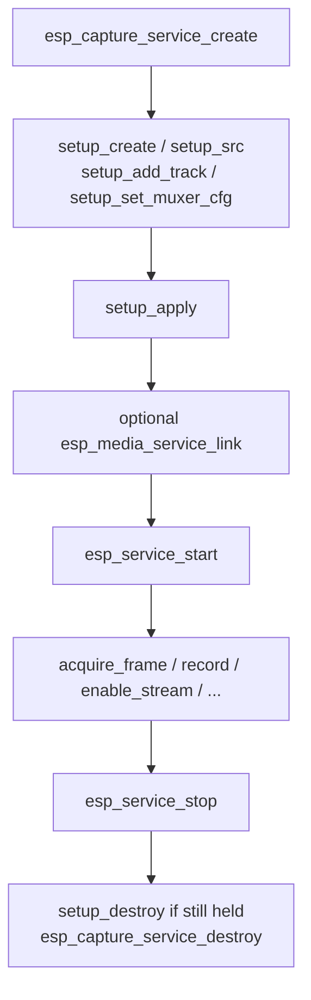

# ESP Capture Service

- [](https://components.espressif.com/components/espressif/esp_capture_service)
- [中文版](./README_CN.md)

`esp_capture_service` is the media **source** service in ESP-ADF. It wraps the low-level `esp_capture` engine and exposes it through the common `esp_media_service` / `esp_service` interface, so capture output can be pulled by the application or linked to other media services (render, RTMP/RTSP, file muxer, and so on) without hand-written frame plumbing.

It declares the `ESP_MEDIA_ROLE_SRC` role: every output stream produces frames that downstream consumers read through the standard `esp_media_provider_t` interface.

The board-aware recorders [`esp_audio_capture_service`](../esp_audio_capture_service/README.md) and [`esp_video_capture_service`](../esp_video_capture_service/README.md) are built on top of this component.

## Features

- Unified capture lifecycle through `esp_service` (`ESP_SERVICE_BASE(capture)` for start / stop)
- Declarative **setup bundle**: describe sources, streams, tracks, and muxers, then apply atomically
- Multi-stream capture with independent codecs and run-state per stream
- Up to three tracks per stream: audio, video, and muxer
- Pull-based frame access (`acquire_frame` / `release_frame` / `read_frame`) and provider-based linking
- Lazy-binding storage muxer (MP4 / TS / FLV / WAV / CAF / OGG) with manual or auto record
- Runtime stream / track enable, one-shot capture, and escape hatches to native `esp_capture` / sink handles
- Optional shared video overlay and full-speed decode on the source path (when `esp_capture` Kconfig enables them)

## Architecture

```text
            esp_service  (lifecycle: init / start / stop / deinit)
                  ^
                  | embeds
            esp_media_service  (role, streams, provider, link, request)
                  ^
                  | embeds
            esp_capture_service  (this component, ROLE_SRC)
                  |
   +--------------+----------------------------------+
   |  audio src + video src (caller-owned interfaces)|
   |  +-- stream 0: tracks + optional muxer          |
   |  +-- stream 1: tracks + optional muxer          |
   +-------------------------------------------------+
                  |
            esp_capture engine + esp_capture_sink (native)
```

- A **service** hosts up to `max_stream_num` output **streams**.
- Sources are `esp_capture_audio_src_if_t` / `esp_capture_video_src_if_t` interfaces supplied in the setup bundle.
- Each **stream** carries up to `ESP_CAPTURE_SERVICE_MAX_TRACKS_PER_STREAM` (3) tracks and an optional storage muxer.

## Call Sequence



## Typical Usage

```c
#include "esp_capture_service.h"
#include "esp_capture_service_ops.h"
#include "esp_capture_service_setup.h"
#include "esp_service.h"

/* 1. Create the service. */
esp_capture_service_cfg_t cfg = {
    .name = "capture",
    .max_stream_num = 1,
};
esp_capture_service_t *service = NULL;
ESP_ERROR_CHECK(esp_capture_service_create(&cfg, &service));

/* 2. Build and apply a setup bundle (sources are caller-owned). */
esp_capture_service_setup_t *setup = esp_capture_service_setup_create(&cfg);
esp_capture_service_src_cfg_t src_cfg = {
    .audio_src = audio_if,
    .video_src = video_if,
};
esp_capture_service_setup_src(setup, &src_cfg);

esp_media_track_info_t audio_track = {
    .id = 1,
    .type = ESP_MEDIA_TRACK_TYPE_AUDIO,
    .info.audio = {
        .codec = ESP_CAPTURE_FMT_ID_AAC,
        .sample_rate = 16000,
        .bits_per_sample = 16,
        .channel = 1,
        .bitrate = 64000,
    },
};
esp_media_track_info_t video_track = {
    .id = 2,
    .type = ESP_MEDIA_TRACK_TYPE_VIDEO,
    .info.video = {
        .codec = ESP_CAPTURE_FMT_ID_H264,
        .width = 1280,
        .height = 720,
        .fps = 15,
    },
};
esp_capture_service_setup_add_track(setup, ESP_MEDIA_DEFAULT_STREAM, &audio_track);
esp_capture_service_setup_add_track(setup, ESP_MEDIA_DEFAULT_STREAM, &video_track);
ESP_ERROR_CHECK(esp_capture_service_setup_apply(service, setup));
esp_capture_service_setup_destroy(setup);

/* 3. Start through the common service base. */
esp_service_t *base = ESP_SERVICE_BASE(service);
ESP_ERROR_CHECK(esp_service_start(base));

/* 4. Pull frames. */
esp_media_frame_t frame = { .type = ESP_MEDIA_TRACK_TYPE_VIDEO };
if (esp_capture_service_acquire_frame(service, ESP_MEDIA_DEFAULT_STREAM, &frame, 1000) == ESP_OK) {
    /* ... use frame.data / frame.size / frame.pts ... */
    esp_capture_service_release_frame(service, ESP_MEDIA_DEFAULT_STREAM, &frame);
}

/* 5. Stop and destroy. */
esp_service_stop(base);
esp_capture_service_destroy(service);
```

### Linking To Another Service

```c
esp_service_t *capture_base = ESP_SERVICE_BASE(service);
esp_media_service_link(capture_base, ESP_MEDIA_DEFAULT_STREAM, sink_base, sink_stream);
esp_service_start(sink_base);
esp_service_start(capture_base);
```

### Recording To Storage

```c
esp_capture_service_set_storage_url(service, ESP_MEDIA_DEFAULT_STREAM, "/sdcard/clip.mp4");
esp_capture_service_start_record(service, ESP_MEDIA_DEFAULT_STREAM);
/* ... record ... */
esp_capture_service_stop_record(service, ESP_MEDIA_DEFAULT_STREAM);
```

## Setup Bundle

Configuration is assembled into an `esp_capture_service_setup_t` bundle, then applied once:

| API | Description |
| --- | --- |
| `esp_capture_service_setup_create()` / `_destroy()` | Allocate / free a setup bundle |
| `esp_capture_service_setup_src()` | Bind audio / video source interfaces (and optional overlay / full-speed decode flags) |
| `esp_capture_service_setup_add_track()` | Add a track to a stream (unique type per stream, max 3) |
| `esp_capture_service_setup_set_muxer_cfg()` | Configure storage / streaming for a stream |
| `esp_capture_service_setup_apply()` | Apply the bundle (before start only; re-apply tears down and recreates) |

### Storage And Muxer

Each stream can own one storage / streaming muxer via `esp_capture_service_muxer_cfg_t`:

| Field | Meaning |
| --- | --- |
| `muxer_type` | Container type. `ESP_CAPTURE_SERVICE_MUXER_NONE` lets a manual URL infer the type |
| `auto_record` | Enable the muxer automatically once capture starts |
| `streaming` | Keep muxed output available to providers (ignored for non-streaming containers) |
| `storage_dir` | Storage directory; missing components are created (maximum depth 2); `NULL` disables automatic file storage |
| `slice_duration` | File segment duration in milliseconds; `0` uses the service default of 10 minutes |
| `ram_cache_size` | Aligned internal-RAM write cache; `0` disables it, and 16 KiB or above is recommended for high-speed storage |

A muxer is provisioned only when at least one of `auto_record`, `streaming`, or `storage_dir` is set.

When `storage_dir` is set, the service creates missing directory components during setup. Recursive creation is intentionally limited to two components (for example `/sdcard/record`); deeper paths return an error with the failed path logged. Manual storage URLs also create their parent directory on `esp_capture_service_set_storage_url()`. Paths starting with `/fake` skip filesystem creation for test applications and custom in-memory muxers.

**Lazy binding.** The sink muxer is added right before `start`, so muxer type and storage URL can change any number of times while the service is stopped. Container type resolves in this order:

1. Inferred from the URL extension when recognizable
2. Otherwise the muxer type configured during setup
3. Otherwise the default container

After the muxer is bound, the URL can still be updated for the next recording (`stop_record` → `set_storage_url` → `start_record`), but the **container type can no longer change**.

### Frame Acquisition

| API | Use when |
| --- | --- |
| `esp_capture_service_acquire_frame()` / `_release_frame()` | Pull frames owned by the capture engine |
| `esp_capture_service_read_frame()` | Copy one frame into a caller-provided buffer |
| `esp_capture_service_get_provider()` / `esp_media_service_link()` | Hand frames to a linked sink |

`acquire_frame()` timeout semantics:

| `timeout_ms` | Behavior |
| --- | --- |
| `0` | Non-blocking |
| `UINT32_MAX` | Block until a frame is available or the provider aborts |
| other | Wait up to `timeout_ms` |

> **Global cache (best-effort).** When a linked sink requests `need_global_cache`, a reader that asks for `ESP_MEDIA_TRACK_TYPE_UNKNOWN` is served by polling all tracks in arrival order. The underlying capture engine has no native global cache.

## API Overview

### Service Lifecycle (`esp_capture_service.h`)

| API | Description |
| --- | --- |
| `esp_capture_service_create()` | Create a service from `esp_capture_service_cfg_t` |
| `esp_capture_service_destroy()` | Destroy the service |
| `esp_capture_service_set_deinit_cb()` | Register a wrapper deinit callback |

Use `ESP_SERVICE_BASE(service)` to obtain the `esp_service_t *` for start / stop / link.

### Runtime Ops (`esp_capture_service_ops.h`)

| API | Description |
| --- | --- |
| `esp_capture_service_set_audio_src_fixed_caps()` | Pin raw audio source caps (before start) |
| `esp_capture_service_get_provider()` | Get an `esp_media_provider_t` for a stream |
| `esp_capture_service_acquire_frame()` / `_release_frame()` / `_read_frame()` | Frame access |
| `esp_capture_service_enable_stream()` / `_enable_track()` | Toggle a stream or a single track at runtime |
| `esp_capture_service_one_shot()` | Trigger a one-shot capture |
| `esp_capture_service_set_storage_url()` / `_get_last_storage_url()` | Manual recording URL |
| `esp_capture_service_start_record()` / `_stop_record()` | Toggle the storage muxer at runtime |
| `esp_capture_service_get_capture_handle()` / `_get_sink_handle()` | Native `esp_capture` / sink escape hatches |

### Native Capture And Sink Handles

When the service-level APIs are not enough and you need **manual control** over the capture engine, use:

- `esp_capture_service_get_capture_handle()` — returns the raw `esp_capture_handle_t`
- `esp_capture_service_get_sink_handle()` — returns the raw `esp_capture_sink_handle_t` for one stream

Typical uses:

- Attach or tune a **customized video overlay** on the capture / sink path
- Build or adjust a **customized capture pipeline** with advanced `esp_capture` / sink settings that are not exposed by the service setup bundle
- Call other low-level `esp_capture` APIs while still using the service for lifecycle, linking, and frame delivery

Call these APIs **after** a successful `esp_capture_service_setup_apply()`, so the native handles already exist. The service still owns the handles; do not destroy them yourself, and keep any extra configuration compatible with the service start / stop / teardown flow.

```c
esp_capture_handle_t capture_handle = NULL;
esp_capture_sink_handle_t sink_handle = NULL;

ESP_ERROR_CHECK(esp_capture_service_get_capture_handle(service, &capture_handle));
ESP_ERROR_CHECK(esp_capture_service_get_sink_handle(service, ESP_MEDIA_DEFAULT_STREAM, &sink_handle));

/* Configure customized overlay / pipeline through native esp_capture APIs. */
```

Capture pipeline threads (for example `venc_0`, `aenc_0`, `AUD_SRC`, `VID_SRC`) are scheduled under `ESP_CAPTURE_SERVICE_SCHEDULER_NAME` (`"esp_capture"`). Tune them through `esp_service_scheduler_set_cb()` instead of `esp_capture_set_thread_scheduler()`.

## Points Of Attention

- Register sources and apply setup **before** `esp_service_start()`. Re-applying setup while running returns `ESP_ERR_INVALID_STATE`.
- Source interfaces in `esp_capture_service_src_cfg_t` are **caller-owned** and must outlive the open capture.
- Duplicate track types on the same stream are rejected.
- Always `release_frame()` every frame returned by `acquire_frame()`. Do not use `frame.data` after release.
- Stop only after all acquired frames have been released.
- `start_record` / `stop_record` / `set_storage_url` and `enable_stream` / `enable_track` are valid while running.
- Enabling a previously disabled track may require sink re-setup and can return `ESP_ERR_NOT_SUPPORTED`.
- When using native handles from `get_capture_handle()` / `get_sink_handle()`, the application must honor the engine's ordering and ownership rules.
- Overlay (`share_overlay`) and full-speed decode (`full_speed_decode`) require the matching `esp_capture` Kconfig options.

## Configuration

`esp_capture_service` itself has no Kconfig options. Stream / track / storage settings are described entirely by the runtime setup bundle. Default-configuration helpers live in the recorder wrappers.

## Technical Support

For technical support, use the links below:

- Technical support: [esp32.com](https://esp32.com/viewforum.php?f=20) forum
- Issue reports and feature requests: [GitHub issue](https://github.com/espressif/esp-adf/issues)

We will reply as soon as possible.
