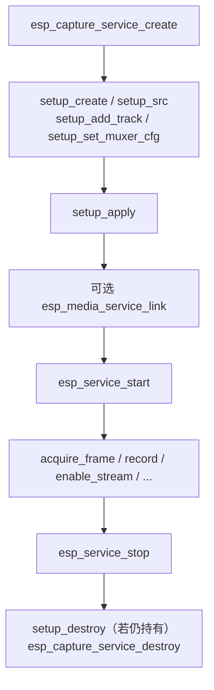

# ESP Capture Service

- [](https://components.espressif.com/components/espressif/esp_capture_service)
- [English](./README.md)

`esp_capture_service` 是 ESP-ADF 中的媒体**源**服务。它封装底层 `esp_capture` 引擎，并通过统一的 `esp_media_service` / `esp_service` 接口对外提供能力，使应用程序可以直接拉取采集输出，或将其链接到渲染、RTMP/RTSP、文件封装等其他媒体服务，而无需手写帧转发逻辑。

该服务声明 `ESP_MEDIA_ROLE_SRC` 角色：每个输出 stream 都会产生媒体帧，下游通过标准的 `esp_media_provider_t` 接口读取。

板级录音/录像封装组件 [`esp_audio_capture_service`](../esp_audio_capture_service/README_CN.md) 与 [`esp_video_capture_service`](../esp_video_capture_service/README_CN.md) 均基于本组件实现。

## 功能

- 通过 `esp_service` 统一管理生命周期（使用 `ESP_SERVICE_BASE(capture)` 进行 start / stop）
- 声明式 **setup bundle**：一次性描述源、stream、track 与 muxer，并原子应用
- 支持多 stream 采集，每个 stream 可独立配置编解码与运行状态
- 每个 stream 最多 3 条 track：音频、视频与 muxer
- 支持拉取式取帧（`acquire_frame` / `release_frame` / `read_frame`）以及基于 provider 的服务链接
- 支持延迟绑定的存储 muxer（MP4 / TS / FLV / WAV / CAF / OGG），可手动或自动录制
- 运行时可启停 stream / track、触发 one-shot，并提供原生 `esp_capture` / sink 句柄出口
- 可选源路径共享视频叠加层与全速解码（需 `esp_capture` 对应 Kconfig 开启）

## 架构

```text
            esp_service  (生命周期：init / start / stop / deinit)
                  ^
                  | embeds
            esp_media_service  (角色、stream、provider、link、request)
                  ^
                  | embeds
            esp_capture_service  (本组件，ROLE_SRC)
                  |
   +--------------+----------------------------------+
   |  audio src + video src（调用方持有）            |
   |  +-- stream 0: tracks + 可选 muxer              |
   |  +-- stream 1: tracks + 可选 muxer              |
   +-------------------------------------------------+
                  |
            esp_capture 引擎 + esp_capture_sink（原生）
```

- 一个 **service** 最多承载 `max_stream_num` 个输出 **stream**。
- 源接口为 setup bundle 中传入的 `esp_capture_audio_src_if_t` / `esp_capture_video_src_if_t`。
- 每个 **stream** 最多包含 `ESP_CAPTURE_SERVICE_MAX_TRACKS_PER_STREAM`（3）条 track，并可配置可选存储 muxer。

## 调用顺序



## 典型用法

```c
#include "esp_capture_service.h"
#include "esp_capture_service_ops.h"
#include "esp_capture_service_setup.h"
#include "esp_service.h"

/* 1. 创建服务 */
esp_capture_service_cfg_t cfg = {
    .name = "capture",
    .max_stream_num = 1,
};
esp_capture_service_t *service = NULL;
ESP_ERROR_CHECK(esp_capture_service_create(&cfg, &service));

/* 2. 构建并应用 setup bundle（源接口由调用方持有） */
esp_capture_service_setup_t *setup = esp_capture_service_setup_create(&cfg);
esp_capture_service_src_cfg_t src_cfg = {
    .audio_src = audio_if,
    .video_src = video_if,
};
esp_capture_service_setup_src(setup, &src_cfg);

esp_media_track_info_t audio_track = {
    .id = 1,
    .type = ESP_MEDIA_TRACK_TYPE_AUDIO,
    .info.audio = {
        .codec = ESP_CAPTURE_FMT_ID_AAC,
        .sample_rate = 16000,
        .bits_per_sample = 16,
        .channel = 1,
        .bitrate = 64000,
    },
};
esp_media_track_info_t video_track = {
    .id = 2,
    .type = ESP_MEDIA_TRACK_TYPE_VIDEO,
    .info.video = {
        .codec = ESP_CAPTURE_FMT_ID_H264,
        .width = 1280,
        .height = 720,
        .fps = 15,
    },
};
esp_capture_service_setup_add_track(setup, ESP_MEDIA_DEFAULT_STREAM, &audio_track);
esp_capture_service_setup_add_track(setup, ESP_MEDIA_DEFAULT_STREAM, &video_track);
ESP_ERROR_CHECK(esp_capture_service_setup_apply(service, setup));
esp_capture_service_setup_destroy(setup);

/* 3. 通过公共 service base 启动 */
esp_service_t *base = ESP_SERVICE_BASE(service);
ESP_ERROR_CHECK(esp_service_start(base));

/* 4. 拉取帧 */
esp_media_frame_t frame = { .type = ESP_MEDIA_TRACK_TYPE_VIDEO };
if (esp_capture_service_acquire_frame(service, ESP_MEDIA_DEFAULT_STREAM, &frame, 1000) == ESP_OK) {
    /* ... 使用 frame.data / frame.size / frame.pts ... */
    esp_capture_service_release_frame(service, ESP_MEDIA_DEFAULT_STREAM, &frame);
}

/* 5. 停止并销毁 */
esp_service_stop(base);
esp_capture_service_destroy(service);
```

### 链接到其他服务

```c
esp_service_t *capture_base = ESP_SERVICE_BASE(service);
esp_media_service_link(capture_base, ESP_MEDIA_DEFAULT_STREAM, sink_base, sink_stream);
esp_service_start(sink_base);
esp_service_start(capture_base);
```

### 录制到存储

```c
esp_capture_service_set_storage_url(service, ESP_MEDIA_DEFAULT_STREAM, "/sdcard/clip.mp4");
esp_capture_service_start_record(service, ESP_MEDIA_DEFAULT_STREAM);
/* ... 录制 ... */
esp_capture_service_stop_record(service, ESP_MEDIA_DEFAULT_STREAM);
```

## Setup Bundle

配置先组装到 `esp_capture_service_setup_t`，再一次性应用：

| API | 说明 |
| --- | --- |
| `esp_capture_service_setup_create()` / `_destroy()` | 分配 / 释放 setup bundle |
| `esp_capture_service_setup_src()` | 绑定音视频源接口（以及可选 overlay / 全速解码标志） |
| `esp_capture_service_setup_add_track()` | 向 stream 添加 track（同 stream 内类型唯一，最多 3 条） |
| `esp_capture_service_setup_set_muxer_cfg()` | 配置 stream 的存储 / 推流 muxer |
| `esp_capture_service_setup_apply()` | 应用配置（仅允许在 start 前；再次应用会拆除并重建） |

### 存储与 Muxer

每个 stream 可通过 `esp_capture_service_muxer_cfg_t` 配置一个存储 / 推流 muxer：

| 字段 | 含义 |
| --- | --- |
| `muxer_type` | 容器类型；`ESP_CAPTURE_SERVICE_MUXER_NONE` 可由手动 URL 推断 |
| `auto_record` | 采集启动后自动启用 muxer |
| `streaming` | 保留封装输出供 provider 读取（非流式容器忽略） |
| `storage_dir` | 存储目录；缺失目录会自动创建（最大深度 2）；`NULL` 表示不做自动文件存储 |

仅当 `auto_record`、`streaming`、`storage_dir` 至少有一项有效时，才会创建 muxer。

设置 `storage_dir` 后，服务会在 setup 阶段创建缺失的目录层级。递归创建最多支持两级（例如 `/sdcard/record`）；更深路径会返回错误并记录失败路径。手动调用 `esp_capture_service_set_storage_url()` 时，也会创建 URL 的父目录。测试应用或自定义内存 muxer 可使用 `/fake` 开头的路径，服务会跳过实际文件系统目录创建。

**延迟绑定。** sink muxer 在真正 `start` 前才加入，因此服务停止期间可反复修改 muxer 类型与存储 URL。容器类型按以下顺序解析：

1. 可识别的 URL 后缀
2. setup 中配置的 muxer 类型
3. 默认容器

muxer 绑定后，仍可更新下一次录制 URL（`stop_record` → `set_storage_url` → `start_record`），但**容器类型不可再变更**。

### 取帧方式

| API | 适用场景 |
| --- | --- |
| `esp_capture_service_acquire_frame()` / `_release_frame()` | 拉取由采集引擎持有的帧 |
| `esp_capture_service_read_frame()` | 拷贝一帧到调用方缓冲区 |
| `esp_capture_service_get_provider()` / `esp_media_service_link()` | 将帧交给已链接的 sink |

`acquire_frame()` 超时语义：

| `timeout_ms` | 行为 |
| --- | --- |
| `0` | 非阻塞 |
| `UINT32_MAX` | 阻塞直到有帧或 provider 中止 |
| 其他 | 最多等待 `timeout_ms` |

> **全局缓存（尽力而为）。** 当链接的 sink 请求 `need_global_cache` 时，请求 `ESP_MEDIA_TRACK_TYPE_UNKNOWN` 的读取会按到达顺序轮询所有 track。底层采集引擎没有原生全局缓存。

## API 概览

### 服务生命周期（`esp_capture_service.h`）

| API | 说明 |
| --- | --- |
| `esp_capture_service_create()` | 根据 `esp_capture_service_cfg_t` 创建服务 |
| `esp_capture_service_destroy()` | 销毁服务 |
| `esp_capture_service_set_deinit_cb()` | 注册封装层 deinit 回调 |

使用 `ESP_SERVICE_BASE(service)` 获取 `esp_service_t *`，用于 start / stop / link。

### 运行时操作（`esp_capture_service_ops.h`）

| API | 说明 |
| --- | --- |
| `esp_capture_service_set_audio_src_fixed_caps()` | 固定原始音频源能力（start 前） |
| `esp_capture_service_get_provider()` | 获取 stream 的 `esp_media_provider_t` |
| `esp_capture_service_acquire_frame()` / `_release_frame()` / `_read_frame()` | 取帧 |
| `esp_capture_service_enable_stream()` / `_enable_track()` | 运行时启停 stream 或单条 track |
| `esp_capture_service_one_shot()` | 触发 one-shot 采集 |
| `esp_capture_service_set_storage_url()` / `_get_last_storage_url()` | 手动录制 URL |
| `esp_capture_service_start_record()` / `_stop_record()` | 运行时启停存储 muxer |
| `esp_capture_service_get_capture_handle()` / `_get_sink_handle()` | 获取原生 `esp_capture` / sink 句柄 |

### 原生 Capture / Sink 句柄

当服务层 API 无法满足需求、需要**手动控制**底层采集引擎时，可使用：

- `esp_capture_service_get_capture_handle()` — 获取原生 `esp_capture_handle_t`
- `esp_capture_service_get_sink_handle()` — 获取某一 stream 对应的原生 `esp_capture_sink_handle_t`

典型用途：

- 在 capture / sink 路径上挂接或调整**自定义视频叠加层**
- 构建或调整**自定义采集管线**，使用 setup bundle 未直接暴露的高级 `esp_capture` / sink 配置
- 在仍由服务负责生命周期、链接与取帧的前提下，调用其他底层 `esp_capture` API

请在 `esp_capture_service_setup_apply()` 成功之后调用这些 API，此时原生句柄已经创建。句柄仍由服务持有，请勿自行销毁；额外配置需与服务的 start / stop / teardown 流程兼容。

```c
esp_capture_handle_t capture_handle = NULL;
esp_capture_sink_handle_t sink_handle = NULL;

ESP_ERROR_CHECK(esp_capture_service_get_capture_handle(service, &capture_handle));
ESP_ERROR_CHECK(esp_capture_service_get_sink_handle(service, ESP_MEDIA_DEFAULT_STREAM, &sink_handle));

/* 通过原生 esp_capture API 配置自定义叠加层 / 管线 */
```

采集管线线程（如 `venc_0`、`aenc_0`、`AUD_SRC`、`VID_SRC`）通过 `ESP_CAPTURE_SERVICE_SCHEDULER_NAME`（`"esp_capture"`）调度。请使用 `esp_service_scheduler_set_cb()` 调整，而不是 `esp_capture_set_thread_scheduler()`。

## 注意事项

- 必须在 `esp_service_start()` **之前**绑定源并完成 setup。运行中再次 apply setup 会返回 `ESP_ERR_INVALID_STATE`。
- `esp_capture_service_src_cfg_t` 中的源接口由**调用方持有**，生命周期需覆盖整个打开的采集过程。
- 同一 stream 上不允许重复的 track 类型。
- 每次 `acquire_frame()` 成功后都必须调用 `release_frame()`；释放后不可再使用 `frame.data`。
- 停止前确保所有已获取帧都已释放。
- `start_record` / `stop_record` / `set_storage_url` 与 `enable_stream` / `enable_track` 可在运行时调用。
- 重新启用已被禁用的 track 可能需要 sink 重建，并可能返回 `ESP_ERR_NOT_SUPPORTED`。
- 使用 `get_capture_handle()` / `get_sink_handle()` 时，需自行遵守引擎的顺序与所有权约束。
- `share_overlay` 与 `full_speed_decode` 需要对应的 `esp_capture` Kconfig 支持。

## 配置

`esp_capture_service` 本身没有 Kconfig 选项。stream / track / 存储均由运行时 setup bundle 描述。默认配置助手位于上层录音/录像封装组件中。

## 技术支持

请通过以下渠道获取技术支持：

- 技术支持：[esp32.com](https://esp32.com/viewforum.php?f=20) 论坛
- 问题反馈与功能请求：[GitHub issue](https://github.com/espressif/esp-adf/issues)

我们会尽快回复。
