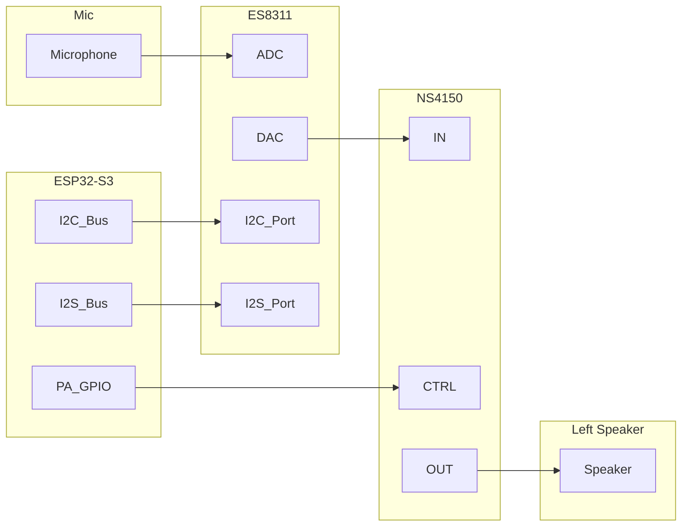
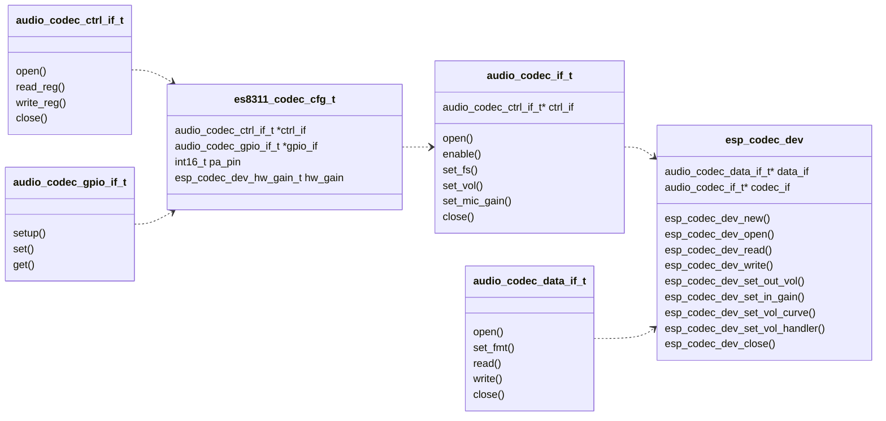

# ESP Codec Device
- [](https://components.espressif.com/components/espressif/esp_codec_dev)
- [中文版本](./README_CN.md)

## General Information

`esp_codec_dev` is a driver component for audio codec devices. Following features are supported currently:
* Support driver for common audio codec devices
* Support multiple instance of codec devices (including device of same type)
* Add unified abstract interface to operate on codec device
* Support customized codec realization based on provided interface
* Easy-to-use high-level API for playback and recording
* Support for volume adjustment in software when it is not supported in hardware
* Support customized volume curve and customized volume control
* Easy to port to other platform after replacing codes under [platform](./platform)

The currently supported codec devices are listed as below:

|       |Playback|Record|
| :-----| :---- | :---- |
|ES8311  |Y|Y|
|ES8388  |Y|Y|
|ES8374  |Y|Y|
|ZL38063  |Y|Y|
|TAS6805M  |Y|N|
|AW88298 |Y|N|
|ES7210 |N|Y|
|ES7243 |N|Y|
|ES7243E |N|Y|
|ES8156 |N|Y|


## Architecture overview

Hardware connection and software architecture are introduced respectively by taking the codec device (ES8311) as an example.  
The hardware connection diagram between the codec device (ES8311) and the main IC (ESP32-S3) is as below:


ESP32-S3 sends control data to ES8311 through I2C bus and exchanges audio data through I2S bus. During playing, ES8311 receives digital audio data from I2S bus and performs DAC operation, then the analog signal is amplified by PA chip (NS4150) and finally is output through the speaker. During recording, ES8311 gets the analog signal from the microphone, amplifies it, and performs ADC operation, then digital audio data can be obtained from ESP32-S3.

Communication between ESP32-S3 and ES8311 mainly occurs on two paths:
* Control path: Set up the codec chip (using I2C bus)
* Data path: Exchange audio data (using I2S bus)
   
In software architecture, the above hardware behavior is abstracted as:


`esp_codec_dev` abstracts the above communication path into two interfaces:  
* `audio_codec_ctrl_if_t` for the control path:  
	The control interface mainly offers `read_reg` and `write_reg` APIs to do codec setup  
	Commonly used control channels include I2C, SPI, etc
* `audio_codec_data_if_t` for data path:  
	The data interface mainly offers `read` and `write` APIs to exchange audio data  
	Commonly used data channels include I2S, SPI, etc

`esp_codec_dev` provides users with convenient high-level API to implement playback and recording functions. It is composed of `audio_codec_data_if_t` and `audio_codec_if_t`. `audio_codec_if_t` abstracts codec control operations and constructed by specified codec configuration (configured by `audio_codec_ctrl_if_t` and `audio_codec_gpio_if_t` through `es8311_codec_cfg_t`). `audio_codec_gpio_if_t` abstracts the IO control to adapt to the main control IO or the expansion chip IO, and called inside the codec to match the unique set timing.

## DAC Volume setting

Volume setting is realized by common API: `esp_codec_dev_set_out_vol`.  
`esp_codec_dev` supports the following volume setup methods:
1. Use codec register to adjust the volume
2. Use built-in software volume `audio_codec_new_sw_vol` when codec hardware does not support volume adjustment
3. Use customized software volume interface through `esp_codec_dev_set_vol_handler`

The default volume range is 0 - 100. Volume [1:100] is mapped to [-49.5 dB:0 dB] with the scale being 0.5 dB. Volume 0 is mapped to -96 dB. To change this mapping, you can define your own volume curve through API `esp_codec_dev_set_vol_curve`. The volume curve is an array of `esp_codec_dev_vol_map_t` which uses linear interpolation to calculate the decibel value at a certain volume point internally (please sort volume maps in advance).   
To balance the speaker's loudness across different platforms when playing the same content, you need to know some mechanism of the audio gain. In short, audio gain consists of two parts: software gain (adjustable) and hardware gain (fixed). Software gain can be adjusted by changing the input PCM data level or setting the codec volume register. The hardware gain is affected by the peripheral circuit, mainly by the amplification efficiency of the analog signal. The typical impact parameter of hardware gain is extracted into `esp_codec_dev_hw_gain_t`, which can be configured to codec devices to ensure loudness consistency. For more details, please refer to the comments in [esp_codec_dev_vol.h](include/esp_codec_dev_vol.h).

## Usage

The steps below take the ES8311 codec as an example to illustrate how to play and record audio.
1. Install the driver for codec control and data bus referring to [test_board.c](test_apps/codec_dev_test/main/test_board.c)  
   	```c
	ut_i2c_init(0);
	ut_i2s_init(0);
   	```
2. Create the control and data interfaces for the codec using the interface provided by default   
   	```c
	audio_codec_i2s_cfg_t i2s_cfg = {
	#if ESP_IDF_VERSION >= ESP_IDF_VERSION_VAL(5, 0, 0)
	    .rx_handle = i2s_keep[0]->rx_handle,
	    .tx_handle = i2s_keep[0]->tx_handle,
	#endif
	};
	const audio_codec_data_if_t *data_if = audio_codec_new_i2s_data(&i2s_cfg);

	audio_codec_i2c_cfg_t i2c_cfg = {.addr = ES8311_CODEC_DEFAULT_ADDR};
	const audio_codec_ctrl_if_t *out_ctrl_if = audio_codec_new_i2c_ctrl(&i2c_cfg);

	const audio_codec_gpio_if_t *gpio_if = audio_codec_new_gpio();
   	```

3. Create the codec interface based on control interface and codec-specified configuration  
   	```c
	es8311_codec_cfg_t es8311_cfg = {
	    .codec_mode = ESP_CODEC_DEV_WORK_MODE_BOTH,
	    .ctrl_if = out_ctrl_if,
	    .gpio_if = gpio_if,
	    .pa_pin = YOUR_PA_GPIO,
	    .use_mclk = true,
	};
	const audio_codec_if_t *out_codec_if = es8311_codec_new(&es8311_cfg);
   	```

4. Get `esp_codec_dev_handle_t` through `esp_codec_dev_new`  
   Now you can use the handle for further playback and recording as follows:
	```c
	esp_codec_dev_cfg_t dev_cfg = {
		.codec_if = out_codec_if;              // codec interface from es8311_codec_new
		.data_if = data_if;                    // data interface from audio_codec_new_i2s_data
		.dev_type = ESP_CODEC_DEV_TYPE_IN_OUT; // codec support both playback and record
	};
	esp_codec_dev_handle_t codec_dev = esp_codec_dev_new(&dev_cfg);
	// Below code shows how to play
	esp_codec_dev_set_out_vol(codec_dev, 60.0);
	esp_codec_dev_sample_info_t fs = {
		.sample_rate = 48000,
		.channel = 2,
		.bits_per_sample = 16,
	};
	esp_codec_dev_open(codec_dev, &fs);
	uint8_t data[256];
	esp_codec_dev_write(codec_dev, data, sizeof(data));

	// Below code shows how to record
	esp_codec_dev_set_in_gain(codec_dev, 30.0);
	esp_codec_dev_read(codec_dev, data, sizeof(data));
	esp_codec_dev_close(codec_dev);
	```


## How to customize for new codec device

1. Implement `audio_codec_ctrl_if_t` and `audio_codec_data_if_t`  
   If you are using I2C bus for control and I2S bus for data, you can use the implementation provided by default:  
   `audio_codec_new_i2c_ctrl` and `audio_codec_new_i2s_data`

2. Implement `audio_codec_if_t` based on the interface built in step 1
	```c
	typedef struct {
		const audio_codec_ctrl_if_t *ctrl_if;     /*!< Codec Control interface */
		const audio_codec_gpio_if_t *gpio_if;     /*!< If you want to operate GPIO */
		//...................................     Other settings
	} my_codec_cfg_t;
	const audio_codec_if_t *my_codec_new(my_codec_cfg_t *codec_cfg);
	```

For details, refer to the sample code [my_codec.c](test_apps/codec_dev_test/main/my_codec.c).
