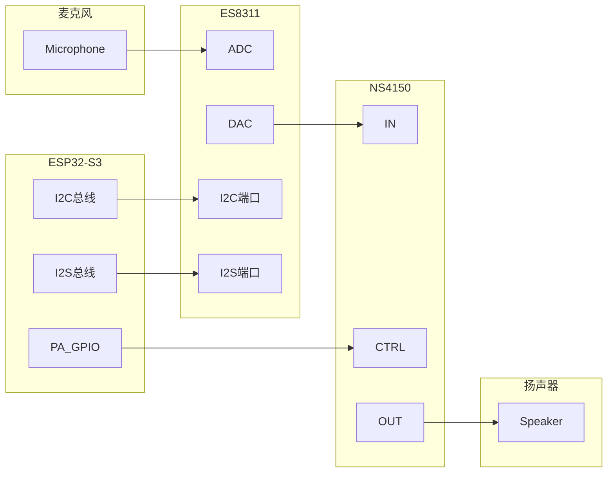
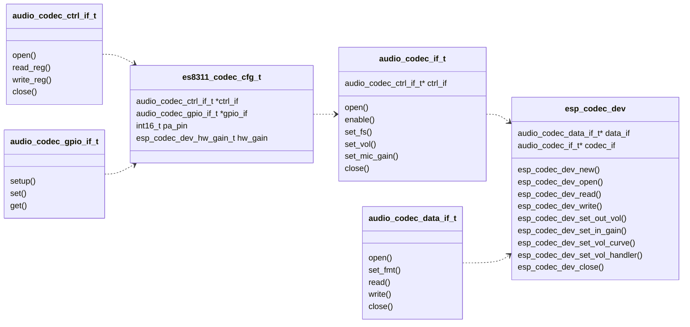

# ESP Codec Device
- [](https://components.espressif.com/components/espressif/esp_codec_dev)
- [English version](./README.md)

## 概要

`esp_codec_dev` 是为音频编解码器设备提供驱动的组件，目前支持以下功能:
* 提供常用音频编解码器设备的驱动
* 支持音频编解码器设备的多实例 （包括同类型设备）
* 提供统一的抽象化接口来操作编解码器设备
* 支持客户定制化编解码器设备 (仅需实例化提供的接口)
* 为播放和录音提供易用的上层 API
* 支持软件音量调节 (硬件不支持音量调节时)
* 支持定制化音量曲线以及音量控制实现
* 兼容多平台仅需替换 [platform](./platform)

已经支持的编解码器设备如下:
|       |播放|录音|
| :-----| :---- | :---- |
|ES8311  |Y|Y|
|ES8388  |Y|Y|
|ES8374  |Y|Y|
|ZL38063  |Y|Y|
|TAS6805M  |Y|N|
|AW88298 |Y|N|
|ES8389 |Y|Y|
|ES7210 |N|Y|
|ES7243 |N|Y|
|ES7243E |N|Y|
|ES8156 |N|Y|
|CJC8910 |Y|Y|


## 架构预览

以编解码器设备 (ES8311) 为例，下面分别介绍硬件框图和软件架构。
编解码器设备 (ES8311) 和主芯片(ESP32-S3) 之间的硬件连接简图如下:


ESP32-S3 通过 I2C 总线向 ES8311 发送控制命令，通过 I2S 总线传递音频数据。在播放过程中, ES8311 从 I2S 总线接收数字音频数据进行数模转换后发送给功放芯片(NS4150), 最后发送给扬声器输出声音。在录音过程中，ES8311将从麦克风采集到的模拟信号放大，进行模数转换后发送给 ESP32-S3。
ESP32-S3 同 ES8311 在以下两个通道进行通讯:
 1. 控制通道：用来配置编解码器设备 (通过 I2C 总线)
 2. 数据通道: 用来交换音频数据 (通过 I2S 总线)

软件架构上，对硬件行为进行了下述抽象：


通讯通道抽象为两种接口:
* `audio_codec_ctrl_if_t` 控制接口：
	主要提供 `read_reg` 和 `write_reg` API 来配置编解码器设备
	常用控制通道包括 I2C， SPI 等
* `audio_codec_data_if_t` 数据接口：
	主要提供 `read` 和 `write` API 用来交换音频数据
	常用数据通道包括 I2S， SPI 等

`esp_codec_dev` 为用户提供便捷的上层 API 来实现播放和录音功能。它是由 `audio_codec_data_if_t` 和 `audio_codec_if_t` 组成。`audio_codec_if_t` 对编解码器控制操作进行抽象，通过编解码器特有的配置参数构建（由 `audio_codec_ctrl_if_t` 和`audio_codec_gpio_if_t` 通过 `es8311_codec_cfg_t` 进行配置）。`audio_codec_gpio_if_t ` 对 IO 控制进行抽象，以适配主控 IO 或者扩展芯片 IO， 在编解码器内部进行调用用以匹配特有的设定时序。

## 解码器音量设定

音量统一通过 API `esp_codec_dev_set_out_vol` 进行设定。
`esp_codec_dev` 支持以下音量设定实现:
1. 通过调节音量寄存器实现
2. 在硬件不支持音量调节下，可以使用内置的软件音量实现 `audio_codec_new_sw_vol`
3. 客制化音量接口实现，并通过 `esp_codec_dev_set_vol_handler` 设定

默认的音量调节区间是 0 - 100，音量 100 对应为 0 dB，每个刻度对应 0.5 dB，音量 0 被特殊映射为 -96 dB。用户可以通过 `esp_codec_dev_set_vol_curve` 设定音量曲线来改变这一行为。音量曲线是音量映射 `esp_codec_dev_vol_map_t` 的数组，通过线性插值的方法来计算每一个音量对应的 dB 值 (请预先将音量映射排好序)。

为了平衡在不同平台上播放相同内容的响度差异，需要了解音频增益的相关机制。简单说来音频增益包括软件增益 （可调节）和硬件增益 (不可调节) 两部分。软件增益可以通过改变音频数据的幅值或者改变音量寄存器实现。硬件增益受外围电路的影响，主要取决于模拟信号的放大系数。实现中选取了典型的影响参数 `esp_codec_dev_hw_gain_t`，作为配置参数进行配置，以抵消平台间响度差异，详情可参考代码注释 [esp_codec_dev_vol.h](include/esp_codec_dev_vol.h)。

## 使用方法

以 ES8311 为例，下面将演示播放和录音的具体步骤
1. 为编解码器设备的控制和数据总线安装驱动，可参考[test_board.c](test_apps/codec_dev_test/main/test_board.c)
   	```c
	ut_i2c_init(0);
	ut_i2s_init(0);
   	```

2. 为编解码器设备实现控制接口，数据接口和 GPIO 接口 (使用默认提供的接口实现)
   	```c
	audio_codec_i2s_cfg_t i2s_cfg = {
	#if ESP_IDF_VERSION >= ESP_IDF_VERSION_VAL(5, 0, 0)
	    .rx_handle = i2s_keep[0]->rx_handle,
	    .tx_handle = i2s_keep[0]->tx_handle,
	#endif
	};
	const audio_codec_data_if_t *data_if = audio_codec_new_i2s_data(&i2s_cfg);

	audio_codec_i2c_cfg_t i2c_cfg = {.addr = ES8311_CODEC_DEFAULT_ADDR};
	const audio_codec_ctrl_if_t *out_ctrl_if = audio_codec_new_i2c_ctrl(&i2c_cfg);

	const audio_codec_gpio_if_t *gpio_if = audio_codec_new_gpio();
   	```

3. 基于控制接口和 ES8311 特有的配置实现 `audio_codec_if_t` 接口
   	```c
	es8311_codec_cfg_t es8311_cfg = {
	    .codec_mode = ESP_CODEC_DEV_WORK_MODE_BOTH,
	    .ctrl_if = out_ctrl_if,
	    .gpio_if = gpio_if,
	    .pa_pin = YOUR_PA_GPIO,
	    .use_mclk = true,
	};
	const audio_codec_if_t *out_codec_if = es8311_codec_new(&es8311_cfg);
   	```

4. 通过 API `esp_codec_dev_new` 获取 `esp_codec_dev_handle_t` 句柄
   参考下面代码用获取到的句柄来进行播放和录制操作:
	```c
	esp_codec_dev_cfg_t dev_cfg = {
		.codec_if = out_codec_if;              // es8311_codec_new 获取到的接口实现
		.data_if = data_if;                    // audio_codec_new_i2s_data 获取到的数据接口实现
		.dev_type = ESP_CODEC_DEV_TYPE_IN_OUT; // 设备同时支持录制和播放
	};
	esp_codec_dev_handle_t codec_dev = esp_codec_dev_new(&dev_cfg);
	// 以下代码展示如何播放音频
	esp_codec_dev_set_out_vol(codec_dev, 60.0);
	esp_codec_dev_sample_info_t fs = {
		.sample_rate = 48000,
		.channel = 2,
		.bits_per_sample = 16,
	};
	esp_codec_dev_open(codec_dev, &fs);
	uint8_t data[256];
	esp_codec_dev_write(codec_dev, data, sizeof(data));

	// 以下代码展示如何录制音频
	esp_codec_dev_set_in_gain(codec_dev, 30.0);
	esp_codec_dev_read(codec_dev, data, sizeof(data));
	esp_codec_dev_close(codec_dev);
	```

## 客制化编解码器设备

1. 实现接口 `audio_codec_ctrl_if_t` 和 `audio_codec_data_if_t`
   如果使用 I2C 总线作控制，I2S 总线做数据传输，可以使用默认的接口实现：
   `audio_codec_new_i2c_ctrl` 和 `audio_codec_new_i2s_data`

2. 在第一步的基础上实现接口 `audio_codec_if_t`
	```c
	typedef struct {
		const audio_codec_ctrl_if_t *ctrl_if;     /*!< 创建的控制接口 */
		const audio_codec_gpio_if_t *gpio_if;     /*!< 需要操作 GPIO */
		//...................................     其他设定
	} my_codec_cfg_t;
	const audio_codec_if_t *my_codec_new(my_codec_cfg_t *codec_cfg);
	```

更细节的实现可以参考测试代码 [my_codec.c](test_apps/codec_dev_test/main/my_codec.c)。
