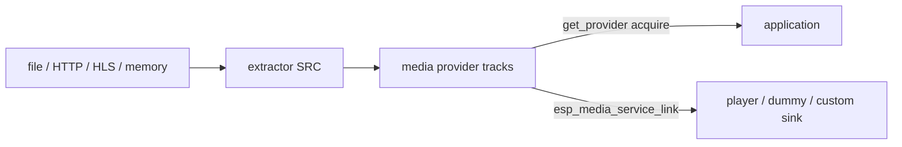
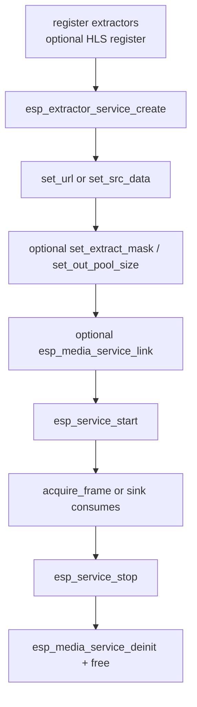

# ESP Extractor Service

- [](https://components.espressif.com/components/espressif/esp_extractor_service)
- [中文版](./README_CN.md)

`esp_extractor_service` is a high-level **media source** that extracts elementary audio and video frames from containers on local storage, over HTTP(S) / HLS, or from an in-memory buffer. You set a URL (or buffer), start the service, and consume frames — either by pulling them yourself or by linking the extractor to any media **sink** service.

The returned handle is a standard `esp_extractor_service_t *` built on `esp_media_service` / `esp_service`. After create you use the usual start, stop, link, and provider APIs. Demux details, GMF IO, and HLS playlist handling stay inside the service so application code stays short.

Typical products: local file playback, network radio / VOD, HLS live ingest, or any pipeline that needs A/V frames from a container without writing a custom demuxer.

## Why Use It

- **One source API for local and network media.** File paths, `file://`, `http(s)://`, and HLS (`.m3u8` / `.hls`) share the same create → set URL → start flow.
- **Frames, not containers.** The service demuxes MP4 / TS / WAV / elementary streams (and HLS when enabled) into audio and video tracks your app can decode, record, or display.
- **Link to any sink.** `esp_media_service_link()` connects the extractor to [`esp_player_service`](../esp_player_service/README.md), [`esp_audio_player_service`](../esp_audio_player_service/README.md), [`esp_video_player_service`](../esp_video_player_service/README.md), [`esp_media_dummy_service`](../esp_media_service/README.md), or any other `esp_media_service` sink. Frames move in-process; you do not copy them in application code.
- **Pull when you need control.** `esp_media_service_get_provider()` plus acquire / release is the same pattern as other ADF media sources.
- **Trim what you compile.** File IO, HTTP IO, and HLS are Kconfig options. Register only the extractors your product needs.

Caller must register extractors (for example `esp_extractor_register_default()`), and `esp_hls_extractor_register()` when `CONFIG_ESP_EXTRACTOR_SERVICE_HLS_SUPPORT` is enabled.

## Features

- File path / `file://` via GMF file IO
- `http(s)://` via GMF HTTP IO
- HLS (`.m3u8` / `.hls`) via `esp_hls_stream` when compiled in
- In-memory buffer input (`set_src_data`, borrowed, not copied)
- Extract mask: audio, video, or both
- Optional caller-owned GMF pool; otherwise an internal pool is created when Kconfig IO flags are on
- Standard media-service linking so playback, dummy test sinks, or a custom sink can be wired with a few calls

## Data Flow



## Call Sequence



## Typical Usage

Pull frames in the application:

```c
#include "esp_extractor_defaults.h"
#include "esp_extractor_service.h"
#include "esp_extractor_service_ops.h"
#include "esp_media_service.h"
#include "esp_service.h"

esp_extractor_register_default();

esp_extractor_service_cfg_t cfg = ESP_EXTRACTOR_SERVICE_CFG_DEFAULT();
esp_extractor_service_t *extractor = NULL;
ESP_ERROR_CHECK(esp_extractor_service_create(&cfg, &extractor));
ESP_ERROR_CHECK(esp_extractor_service_set_url(extractor, "/sdcard/video/test1.mp4"));
ESP_ERROR_CHECK(esp_extractor_service_set_extract_mask(extractor, ESP_EXTRACT_MASK_AV));
ESP_ERROR_CHECK(esp_service_start(ESP_SERVICE_BASE(extractor)));

esp_media_provider_t provider = {0};
ESP_ERROR_CHECK(esp_media_service_get_provider(ESP_SERVICE_BASE(extractor),
                                               ESP_MEDIA_DEFAULT_STREAM, &provider));
/* acquire / release frames from provider, then stop and deinit */
```

Or link to a sink and let the sink consume (player, dummy sink, or any media sink):

```c
ESP_ERROR_CHECK(esp_media_service_link(ESP_SERVICE_BASE(extractor), ESP_MEDIA_DEFAULT_STREAM,
                                       ESP_SERVICE_BASE(sink), ESP_MEDIA_DEFAULT_STREAM));
ESP_ERROR_CHECK(esp_service_start(ESP_SERVICE_BASE(sink)));
ESP_ERROR_CHECK(esp_service_start(ESP_SERVICE_BASE(extractor)));
```

HLS live or VOD uses the same APIs; pass an `.m3u8` URL after `esp_hls_extractor_register()`.

## Create Configuration

| Field | Description |
| --- | --- |
| `name` | Service name; `NULL` uses `esp_extractor_service` |
| `pool` | Optional GMF pool with file/http IO; `NULL` creates an internal pool when Kconfig allows |

## Runtime Operations

All ops require INITIALIZED (stopped) state:

```c
esp_extractor_service_set_extract_mask(extractor, ESP_EXTRACT_MASK_AV);
esp_extractor_service_set_out_pool_size(extractor, 64 * 1024);
esp_extractor_service_set_url(extractor, url);
esp_extractor_service_set_src_data(extractor, buf, size);
```

Start / stop with `esp_service_start()` / `esp_service_stop()` on `ESP_SERVICE_BASE(extractor)`. Tear down with `esp_media_service_deinit()` then `free()`.

## Scheduler

Thread name: `ESP_EXTRACTOR_SCHED_SRC_TASK` (`extractor_src`). Default stack 8192, priority 10, core 0. Override with `esp_service_scheduler_set_cb()` when you need a larger stack for HLS or high-bitrate files.

## Configuration

- `ESP_EXTRACTOR_SERVICE_FILE_IO_SUPPORT`
- `ESP_EXTRACTOR_SERVICE_HTTP_IO_SUPPORT`
- `ESP_EXTRACTOR_SERVICE_HLS_SUPPORT` (default n)
- `ESP_EXTRACTOR_SERVICE_MCP_ENABLE` (depends on `ESP_MCP_ENABLE`)

## Points Of Attention

- Register extractors before start.
- `set_src_data` does not copy; keep the buffer alive until stop.
- HLS needs `esp_hls_extractor_register()` when HLS Kconfig is on.
- File cases need a mounted filesystem (typically SD via `esp_board_manager`); HTTP / HLS cases need a network connection.
- Always release acquired frames before stop / destroy.
- Tear down with `esp_media_service_deinit()` then `free()`.

## Example

See [`examples/extractor_service`](./examples/extractor_service/README.md) for local MP4 and HLS, manual provider vs link-to-sink, board-manager setup, and MCP UART checks.

## MCP Tools

When `CONFIG_ESP_EXTRACTOR_SERVICE_MCP_ENABLE=y`:

- Tools: `set_extract_mask`, `set_out_pool_size`, `set_url`, `start`, `stop`
- Link / dummy-sink stats stay in `esp_media_service` MCP; frames never go over MCP

## Technical Support

For technical support, use the links below:

- Technical support: [esp32.com](https://esp32.com/viewforum.php?f=20) forum
- Issue reports and feature requests: [GitHub issue](https://github.com/espressif/esp-adf/issues)

We will reply as soon as possible.
