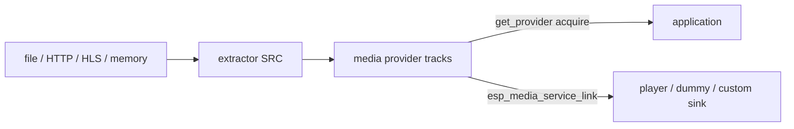
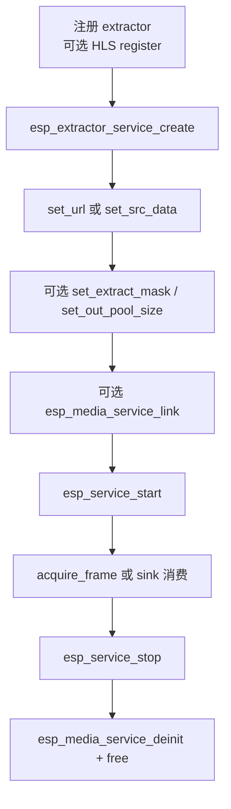

# ESP Extractor Service

- [](https://components.espressif.com/components/espressif/esp_extractor_service)
- [English](./README.md)

`esp_extractor_service` 是高层 **媒体源（SRC）**：从本地存储、HTTP(S) / HLS 或内存缓冲区的容器中解出基本音频 / 视频帧。设置 URL（或缓冲区）并启动服务后即可消费帧——既可由应用自行拉帧，也可通过 `esp_media_service_link()` 接到任意媒体 **sink** 服务。

返回句柄为标准的 `esp_extractor_service_t *`，建立在 `esp_media_service` / `esp_service` 之上。创建后使用常规的 start、stop、link、provider API。解复用、GMF IO 与 HLS 播放列表处理都在服务内部完成，应用代码保持简短。

典型场景：本地文件播放、网络电台 / 点播、HLS 直播接入，以及任何需要从容器取 A/V 帧、而不想自写 demuxer 的管线。

## 如何使用

- **本地与网络共用一套源 API。** 文件路径、`file://`、`http(s)://` 与 HLS（`.m3u8` / `.hls`）都是 create → 设置 URL → start。
- **面向帧，而不是容器。** 服务将 MP4 / TS / WAV / 基本流（以及启用时的 HLS）解复用为音频、视频轨，供解码、录制或显示。
- **可链接任意 sink。** `esp_media_service_link()` 可将抽取器接到 [`esp_player_service`](../esp_player_service/README.md)、[`esp_audio_player_service`](../esp_audio_player_service/README.md)、[`esp_video_player_service`](../esp_video_player_service/README.md)、[`esp_media_dummy_service`](../esp_media_service/README.md) 或其他 `esp_media_service` sink。帧在进程内传递，应用无需拷贝。
- **需要精细控制时自行拉帧。** `esp_media_service_get_provider()` 配合 acquire / release，与其他 ADF 媒体源一致。
- **按需裁剪编译。** 文件 IO、HTTP IO、HLS 均为 Kconfig 选项；只注册产品需要的 extractor。

调用方须在 start 前注册 extractor（例如 `esp_extractor_register_default()`）；启用 `CONFIG_ESP_EXTRACTOR_SERVICE_HLS_SUPPORT` 时还需 `esp_hls_extractor_register()`。

## 功能

- 文件路径 / `file://`（GMF file IO）
- `http(s)://`（GMF HTTP IO）
- HLS（`.m3u8` / `.hls`，编译进 `esp_hls_stream` 时）
- 内存缓冲区输入（`set_src_data`，借用指针，不拷贝）
- 抽取掩码：仅音频、仅视频或音视频
- 可选调用方自有 GMF pool；未提供且 Kconfig IO 开启时创建内部 pool
- 标准媒体服务链接：播放、dummy 测试 sink 或自定义 sink 只需少量调用即可接入

## 数据流



## 调用顺序



## 典型用法

在应用中拉帧：

```c
#include "esp_extractor_defaults.h"
#include "esp_extractor_service.h"
#include "esp_extractor_service_ops.h"
#include "esp_media_service.h"
#include "esp_service.h"

esp_extractor_register_default();

esp_extractor_service_cfg_t cfg = ESP_EXTRACTOR_SERVICE_CFG_DEFAULT();
esp_extractor_service_t *extractor = NULL;
ESP_ERROR_CHECK(esp_extractor_service_create(&cfg, &extractor));
ESP_ERROR_CHECK(esp_extractor_service_set_url(extractor, "/sdcard/video/test1.mp4"));
ESP_ERROR_CHECK(esp_extractor_service_set_extract_mask(extractor, ESP_EXTRACT_MASK_AV));
ESP_ERROR_CHECK(esp_service_start(ESP_SERVICE_BASE(extractor)));

esp_media_provider_t provider = {0};
ESP_ERROR_CHECK(esp_media_service_get_provider(ESP_SERVICE_BASE(extractor),
                                               ESP_MEDIA_DEFAULT_STREAM, &provider));
/* 从 provider 上 acquire / release 帧，然后 stop 并 deinit */
```

或链接到 sink，由 sink 消费（播放器、dummy sink 或任意媒体 sink）：

```c
ESP_ERROR_CHECK(esp_media_service_link(ESP_SERVICE_BASE(extractor), ESP_MEDIA_DEFAULT_STREAM,
                                       ESP_SERVICE_BASE(sink), ESP_MEDIA_DEFAULT_STREAM));
ESP_ERROR_CHECK(esp_service_start(ESP_SERVICE_BASE(sink)));
ESP_ERROR_CHECK(esp_service_start(ESP_SERVICE_BASE(extractor)));
```

HLS 直播或点播使用同一套 API：在 `esp_hls_extractor_register()` 之后传入 `.m3u8` URL 即可。

## 创建配置

| 字段 | 说明 |
| --- | --- |
| `name` | 服务名；`NULL` 使用 `esp_extractor_service` |
| `pool` | 可选、已注册 file/http IO 的 GMF pool；`NULL` 且 Kconfig 允许时创建内部 pool |

## 运行时操作

以下接口均要求处于 INITIALIZED（已 stop）状态：

```c
esp_extractor_service_set_extract_mask(extractor, ESP_EXTRACT_MASK_AV);
esp_extractor_service_set_out_pool_size(extractor, 64 * 1024);
esp_extractor_service_set_url(extractor, url);
esp_extractor_service_set_src_data(extractor, buf, size);
```

通过 `ESP_SERVICE_BASE(extractor)` 调用 `esp_service_start()` / `esp_service_stop()`。销毁时先 `esp_media_service_deinit()` 再 `free()`。

## 调度

线程名：`ESP_EXTRACTOR_SCHED_SRC_TASK`（`extractor_src`）。默认栈 8192、优先级 10、核 0。HLS 或高码率文件需要更大栈时，用 `esp_service_scheduler_set_cb()` 覆盖。

## 配置项

- `ESP_EXTRACTOR_SERVICE_FILE_IO_SUPPORT`
- `ESP_EXTRACTOR_SERVICE_HTTP_IO_SUPPORT`
- `ESP_EXTRACTOR_SERVICE_HLS_SUPPORT`（默认 n）
- `ESP_EXTRACTOR_SERVICE_MCP_ENABLE`（依赖 `ESP_MCP_ENABLE`）

## 注意事项

- start 前必须注册 extractor。
- `set_src_data` 不拷贝缓冲区，stop 前须保持有效。
- 开启 HLS Kconfig 时需调用 `esp_hls_extractor_register()`。
- 文件用例需要已挂载的文件系统（通常通过 `esp_board_manager` 挂载 SD）；HTTP / HLS 用例需要网络。
- stop / destroy 前必须释放所有已获取帧。
- 销毁时先 `esp_media_service_deinit()` 再 `free()`。

## 示例

参见 [`examples/extractor_service`](./examples/extractor_service/README_CN.md)，覆盖本地 MP4 与 HLS、手动 provider 与链接 sink、board-manager 环境配置以及 MCP UART 验证。

## MCP 工具

当 `CONFIG_ESP_EXTRACTOR_SERVICE_MCP_ENABLE=y` 时：

- 工具：`set_extract_mask`、`set_out_pool_size`、`set_url`、`start`、`stop`
- link / dummy-sink 统计仍属于 `esp_media_service` MCP；媒体帧不会经过 MCP

## 技术支持

请通过以下渠道获取技术支持：

- 技术支持：[esp32.com](https://esp32.com/viewforum.php?f=20) 论坛
- 问题反馈与功能请求：[GitHub issue](https://github.com/espressif/esp-adf/issues)

我们会尽快回复。
