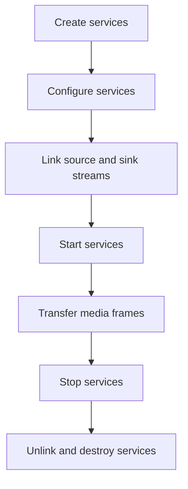

# ESP Media Service

- [](https://components.espressif.com/components/espressif/esp_media_service)
- [中文版](./README_CN.md)

`esp_media_service` provides a common media interface for audio and video services in ESP-ADF.

Applications create services, configure their media streams, and link source streams to sink streams. After services are linked and started, media frames flow through the shared provider and track APIs instead of being forwarded manually by application code.

## Features

- Unified audio and video service model
- Source, sink, and source-sink service roles
- Stream-based media endpoints (`esp_media_stream_id_t`)
- Link-time request negotiation between sinks and sources
- Provider read APIs and track-manager write APIs
- Default in-memory track manager for queued media frames
- Consistent service lifecycle through `esp_service`

## Agent Guidelines

For implementation and review guidance, see [agent.md](agent.md). It covers service model details, link flow, track manager behavior, stop/abort rules, and a review checklist.

## Service Roles

A media service can be one of these roles:

- `ESP_MEDIA_ROLE_SRC`: produces media frames.
- `ESP_MEDIA_ROLE_SINK`: consumes media frames.
- `ESP_MEDIA_ROLE_SRC_SINK`: consumes and produces media frames.

Services can implement `get_role()` to let `esp_media_service_link()` validate that the selected source and sink are compatible.

## Streams

Services communicate through stream IDs:

```c
typedef uint16_t esp_media_stream_id_t;
#define ESP_MEDIA_DEFAULT_STREAM  ((esp_media_stream_id_t)0)
```

One stream is a series of tracks. Use `ESP_MEDIA_DEFAULT_STREAM` for the first stream:

```c
esp_media_stream_id_t stream = ESP_MEDIA_DEFAULT_STREAM;
esp_media_service_link(src_service, stream, sink_service, stream);
```

## Typical Usage

Link a source service to a sink service, then start both services:

```c
esp_media_stream_id_t stream = ESP_MEDIA_DEFAULT_STREAM;

esp_media_service_link(src_service, stream, sink_service, stream);

esp_service_start(sink_service);
esp_service_start(src_service);
```

After the services are linked and started, media data flows from the source to the sink through the provider supplied by the source.

Typical lifecycle:



## Provider And Track APIs

Media data uses two interfaces:

- `esp_media_provider_t` (read): queries tracks, receives events, acquires or reads frames, releases frames, aborts blocking reads. Defined in `esp_media_provider.h`.
- `esp_media_track_mngr_t` (write): manages track queues. Write APIs are in `esp_media_track.h`.

A sink receives an `esp_media_provider_t` from an upstream source during link. A source writes frames through `esp_media_track_write_frame()`.

Frames acquired with `esp_media_provider_acquire_frame()` must always be released with `esp_media_provider_release_frame()`. Do not use `frame.data` after the frame is released.

## Track Manager

`esp_media_track_mngr_t` is the default in-memory frame store. It exposes one provider handle and manages queues for one or more tracks.

It supports two payload ownership modes:

- `ESP_MEDIA_TRACK_CACHE_INTERNAL`: the manager copies and owns frame payload data.
- `ESP_MEDIA_TRACK_CACHE_USER`: the manager queues frame metadata only; user-owned payloads are returned through `frame_release`.

It also supports global cache, where all tracks share one arrival-order queue. This is useful for interleaved audio/video transports such as RTMP. Enable global cache before adding tracks.

## Implementing A Source Service

A source usually owns an `esp_media_track_mngr_t`:

```c
esp_media_track_mngr_cfg_t cfg = {
    .max_track_num = 2,
};

esp_media_track_mngr_create(&cfg, &svc->mngr);
esp_media_track_mngr_add_track(svc->mngr, &audio_track);
esp_media_track_mngr_add_track(svc->mngr, &video_track);
esp_media_track_mngr_get_provider(svc->mngr, &svc->provider);
```

The source implements `get_provider()` and writes produced frames with `esp_media_track_write_frame()`.

## Implementing A Sink Service

A sink implements `set_provider()` and stores the upstream provider:

```c
static esp_err_t my_sink_set_provider(esp_service_t *service,
                                      esp_media_stream_id_t stream,
                                      const esp_media_provider_t *provider)
{
    my_sink_t *sink = (my_sink_t *)service;

    if (provider == NULL) {
        sink->provider.ops = NULL;
        sink->provider.ctx = NULL;
        return ESP_OK;
    }

    sink->provider = *provider;
    return esp_media_provider_set_event_cb(&sink->provider, my_event_cb, sink);
}
```

The sink task reads frames and releases every acquired frame:

```c
while (!sink->stop) {
    esp_media_frame_t frame = {0};
    if (esp_media_provider_acquire_frame(&sink->provider, &frame, timeout_ms) == ESP_OK) {
        process_frame(&frame);
        esp_media_provider_release_frame(&sink->provider, &frame);
    }
}
```

## Stop And Abort

The media interfaces are designed so stop order is not fragile:

- Source stop should call `esp_media_track_write_abort()` to notify downstream providers with `ESP_MEDIA_PROVIDER_EVENT_TRACKS_ABORT`.
- Sink stop should set a local stop flag, call `esp_media_provider_abort()`, wait for tasks to exit, release acquired frames, and unlink.
- Unlink services before resetting or destroying a track manager that was shared through a link.
- Do not reset or destroy a track manager while another task may still hold an acquired frame or block on its queue.

## Technical Support

For technical support, use the links below:

- Technical support: [esp32.com](https://esp32.com/viewforum.php?f=20) forum
- Issue reports and feature requests: [GitHub issue](https://github.com/espressif/esp-adf/issues)

We will reply as soon as possible.
