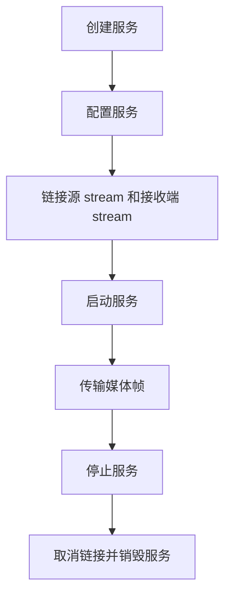

# ESP Media Service

- [](https://components.espressif.com/components/espressif/esp_media_service)
- [English](./README.md)

`esp_media_service` 为 ESP-ADF 中的音频和视频服务提供通用媒体接口。

应用程序创建服务、配置媒体 stream，并将源 stream 链接到接收端 stream。服务完成链接并启动后，媒体帧会通过 provider 和 track 接口流动，应用程序无需手动转发媒体帧。

## 功能

- 统一的音视频服务模型
- 支持源、接收端以及源接收一体服务角色
- 基于 stream ID 的媒体端点（`esp_media_stream_id_t`）
- 支持源和接收端之间的链接时请求协商
- Provider 读取接口和 track manager 写入接口
- 提供默认的内存 track manager
- 通过 `esp_service` 统一管理服务生命周期

## Agent 指南

实现或评审相关服务时，请参考 [agent.md](agent.md)。该文档包含服务模型、链接流程、track manager 行为、停止/中止规则，以及评审检查清单。

## 服务角色

媒体服务可以是以下角色之一：

- `ESP_MEDIA_ROLE_SRC`：产生媒体帧。
- `ESP_MEDIA_ROLE_SINK`：消费媒体帧。
- `ESP_MEDIA_ROLE_SRC_SINK`：既消费媒体帧，也产生媒体帧。

服务可以实现 `get_role()`，让 `esp_media_service_link()` 校验所选源和接收端是否兼容。

## Stream

服务通过 stream ID 通信：

```c
typedef uint16_t esp_media_stream_id_t;
#define ESP_MEDIA_DEFAULT_STREAM  ((esp_media_stream_id_t)0)
```

一个 stream 包含一组 track。使用 `ESP_MEDIA_DEFAULT_STREAM` 表示第一个 stream：

```c
esp_media_stream_id_t stream = ESP_MEDIA_DEFAULT_STREAM;
esp_media_service_link(src_service, stream, sink_service, stream);
```

## 典型用法

将源服务链接到接收端服务，然后启动两个服务：

```c
esp_media_stream_id_t stream = ESP_MEDIA_DEFAULT_STREAM;

esp_media_service_link(src_service, stream, sink_service, stream);

esp_service_start(sink_service);
esp_service_start(src_service);
```

服务链接并启动后，媒体数据会通过源服务提供的 provider 从源服务流向接收端服务。

典型生命周期如下：



## Provider 和 Track 接口

媒体数据使用两个接口：

- `esp_media_provider_t`（读取）：查询 track、接收事件、获取或读取帧、释放帧、中止阻塞读取。定义在 `esp_media_provider.h`。
- `esp_media_track_mngr_t`（写入）：管理 track 队列。写入 API 定义在 `esp_media_track.h`。

接收端在链接时从上游源服务获取 `esp_media_provider_t`。源服务通过 `esp_media_track_write_frame()` 写入帧。

通过 `esp_media_provider_acquire_frame()` 获取的帧必须始终使用 `esp_media_provider_release_frame()` 释放。帧释放后，不要再访问 `frame.data`。

## Track Manager

`esp_media_track_mngr_t` 是默认的内存帧存储。它导出一个 provider 句柄，并为一个或多个 track 管理队列。

它支持两种 payload 所有权模式：

- `ESP_MEDIA_TRACK_CACHE_INTERNAL`：manager 复制并持有帧 payload 数据。
- `ESP_MEDIA_TRACK_CACHE_USER`：manager 只缓存帧元数据；用户持有的 payload 会通过 `frame_release` 归还。

它还支持 global cache，此时所有 track 共用一个按到达顺序排列的队列。这适用于 RTMP 等音视频交错传输场景。请在添加 track 前启用 global cache。

## 实现源服务

源服务通常持有一个 `esp_media_track_mngr_t`：

```c
esp_media_track_mngr_cfg_t cfg = {
    .max_track_num = 2,
};

esp_media_track_mngr_create(&cfg, &svc->mngr);
esp_media_track_mngr_add_track(svc->mngr, &audio_track);
esp_media_track_mngr_add_track(svc->mngr, &video_track);
esp_media_track_mngr_get_provider(svc->mngr, &svc->provider);
```

源服务实现 `get_provider()`，并通过 `esp_media_track_write_frame()` 写入产生的帧。

## 实现接收端服务

接收端实现 `set_provider()` 并保存上游 provider：

```c
static esp_err_t my_sink_set_provider(esp_service_t *service,
                                      esp_media_stream_id_t stream,
                                      const esp_media_provider_t *provider)
{
    my_sink_t *sink = (my_sink_t *)service;

    if (provider == NULL) {
        sink->provider.ops = NULL;
        sink->provider.ctx = NULL;
        return ESP_OK;
    }

    sink->provider = *provider;
    return esp_media_provider_set_event_cb(&sink->provider, my_event_cb, sink);
}
```

接收端任务读取帧，并释放每一个已获取的帧：

```c
while (!sink->stop) {
    esp_media_frame_t frame = {0};
    if (esp_media_provider_acquire_frame(&sink->provider, &frame, timeout_ms) == ESP_OK) {
        process_frame(&frame);
        esp_media_provider_release_frame(&sink->provider, &frame);
    }
}
```

## 停止和中止

媒体接口的设计降低了停止顺序的脆弱性：

- 源服务停止时应调用 `esp_media_track_write_abort()`，通过 `ESP_MEDIA_PROVIDER_EVENT_TRACKS_ABORT` 通知下游 provider。
- 接收端停止时应设置本地停止标志，调用 `esp_media_provider_abort()`，等待任务退出，释放已获取的帧，并取消链接。
- 如果 track manager 通过链接共享，取消链接后再 reset 或 destroy。
- 当其他任务仍可能持有已获取帧或阻塞在队列上时，不要 reset 或 destroy track manager。

## 技术支持

如需技术支持，请使用以下链接：

- 技术支持：[esp32.com](https://esp32.com/viewforum.php?f=20) 论坛
- 问题报告和功能请求：[GitHub issue](https://github.com/espressif/esp-adf/issues)

我们会尽快回复。
