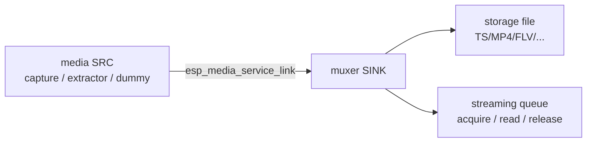
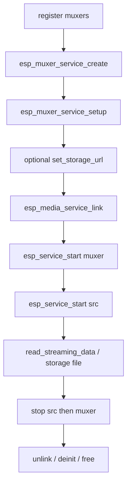

# ESP Muxer Service

- [](https://components.espressif.com/components/espressif/esp_muxer_service)
- [中文版](./README_CN.md)

`esp_muxer_service` is a high-level **media sink** that wraps container muxing for application writers. You link any source that already produces elementary audio / video frames, start the muxer, and get a file on storage, a live stream of muxed bytes, or both — without writing a muxer loop, managing slices, or copying frames in app code.

The returned handle is a standard media service built on `esp_media_service` / `esp_service`. After create you call `esp_muxer_service_setup()` / `esp_muxer_service_set_storage_url()`, then `esp_media_service_link()` and the usual start / stop APIs. Packetization, file IO, and streaming queues stay inside the service so product code stays a short, repeatable sequence.

Typical products: record capture or extracted A/V to SD, produce a live TS/FLV byte stream for a custom sender, or keep a file while also pushing muxed packets.

## Advantanges

- **Build the app from services, not muxer internals.** Create the muxer, `setup()` the container and mode, `esp_media_service_link()` a source, start muxer then source. The same few calls work for recording, live mux, or both.
- **Plug in any source.** Link [`esp_audio_capture_service`](../esp_audio_capture_service/README.md), [`esp_video_capture_service`](../esp_video_capture_service/README.md), [`esp_extractor_service`](../esp_extractor_service/README.md), a dummy source, or any other `esp_media_service` SRC. Frames move in-process; the application does not copy or re-timestamp them.
- **Storage is a path, not a file writer.** Set `storage_dir` or `set_storage_url()`. The service infers the container from a known extension, auto-creates directories (maximum depth 2), and can slice by duration.
- **Live mux without a second pipeline.** `STREAMING_ONLY` or `BOTH` exposes muxed container bytes through `acquire` / `read` / `release` (not `esp_media_frame_t`) for TS / FLV and other streaming-capable types.
- **One mode switch covers product variants.** `STORAGE_ONLY` / `STREAMING_ONLY` / `BOTH` share the same setup struct — no separate “record” vs “stream” code paths.
- **Keep the firmware small.** `esp_muxer_register_default()` only pulls in containers still enabled under **ESP_Muxer Configuration** in menuconfig. Turn off unused types to cut flash (see [Optimization](#optimization)).

## Features

- Container muxer sink for any media source (capture, extractor, dummy, protocol src)
- Storage-only, streaming-only, or both output modes
- Infers container type from a storage URL extension when recognized
- Auto-creates storage directories (maximum depth 2)
- Optional RAM cache for file writes
- Optional streaming queue cache
- Thread resources overridable through `esp_service_scheduler` (`muxer_sink`)

## Data Flow



Short rules:

- The muxer never acts as a media source. Muxed bytes are container packets, not `esp_media_frame_t`
- Link a source that already produces elementary AAC / H264 (or other mapped codecs) before start
- Start the muxer **before** the source so the first frames are not dropped
- Streaming APIs are valid only in `STREAMING_ONLY` or `BOTH` after start

## Call Sequence



## Typical Usage

```c
#include "esp_muxer_default.h"
#include "esp_muxer_service.h"
#include "esp_muxer_service_ops.h"
#include "esp_media_service.h"
#include "esp_service.h"

ESP_ERROR_CHECK(esp_muxer_register_default());

esp_muxer_service_cfg_t cfg = ESP_MUXER_SERVICE_CFG_DEFAULT();
esp_muxer_service_t *muxer = NULL;
ESP_ERROR_CHECK(esp_muxer_service_create(&cfg, &muxer));

esp_muxer_service_setup_t setup = ESP_MUXER_SERVICE_SETUP_DEFAULT();
setup.muxer_type = ESP_MUXER_TYPE_TS;
setup.mode = ESP_MUXER_SERVICE_MODE_STREAMING_ONLY;
setup.ram_cache_size = 16 * 1024;
ESP_ERROR_CHECK(esp_muxer_service_setup(muxer, &setup));

ESP_ERROR_CHECK(esp_media_service_link(ESP_SERVICE_BASE(src), ESP_MEDIA_DEFAULT_STREAM,
                                       ESP_SERVICE_BASE(muxer), ESP_MEDIA_DEFAULT_STREAM));
ESP_ERROR_CHECK(esp_service_start(ESP_SERVICE_BASE(muxer)));
ESP_ERROR_CHECK(esp_service_start(ESP_SERVICE_BASE(src)));

uint8_t buffer[4096];
size_t size = sizeof(buffer);
ESP_ERROR_CHECK(esp_muxer_service_read_streaming_data(muxer, buffer, &size, 2000));

esp_service_stop(ESP_SERVICE_BASE(src));
esp_service_stop(ESP_SERVICE_BASE(muxer));
esp_media_service_unlink(ESP_SERVICE_BASE(src), ESP_MEDIA_DEFAULT_STREAM,
                         ESP_SERVICE_BASE(muxer), ESP_MEDIA_DEFAULT_STREAM);
esp_media_service_deinit(ESP_SERVICE_BASE(muxer));
free(muxer);
```

For storage, set `mode` to `STORAGE_ONLY` or `BOTH` and `storage_dir` (for example `/sdcard/muxed`), or call `esp_muxer_service_set_storage_url()` with a path such as `/sdcard/muxed/clip.ts`.

## Create Configuration

`esp_muxer_service_cfg_t`:

| Field | Description |
| --- | --- |
| `name` | Service name used by scheduler / MCP; `NULL` uses `esp_muxer_service` |

## Setup

Applied through `esp_muxer_service_setup_t` while stopped:

| Field | Description |
| --- | --- |
| `muxer_type` | Container type (`ESP_MUXER_TYPE_TS` by default) |
| `storage_dir` | Directory for sliced files; `NULL` disables storage unless a URL is set |
| `slice_duration` | Slice length in ms; `0` uses the muxer default |
| `ram_cache_size` | File-write RAM cache; `0` uses default |
| `streaming_cache_size` | Streaming queue cache; `0` uses default |
| `mode` | `STORAGE_ONLY` / `STREAMING_ONLY` / `BOTH` |

`esp_muxer_service_set_storage_url()` overrides the next file path and can change `muxer_type` from the extension (for example `.mp4`, `.ts`, `.flv`).

## Runtime Operations

```c
esp_muxer_service_acquire_streaming_data(muxer, &data, &size, timeout_ms);
esp_muxer_service_release_streaming_data(muxer);
esp_muxer_service_read_streaming_data(muxer, buffer, &inout_size, timeout_ms);
```

Start / stop with `esp_service_start()` / `esp_service_stop()` on `ESP_SERVICE_BASE(muxer)`. Tear down with `esp_media_service_deinit()` then `free()`.

## Scheduler

Install `esp_service_scheduler_set_cb()` and match:

- Service name: prefix of create `name` (default `esp_muxer_service`; MCP in the example uses `esp_muxer_service_mcp`)
- Thread name: `ESP_MUXER_SCHED_TASK` (`muxer_sink`)

Default worker: stack 6144, priority 10, no core affinity. Match `service_name` with `strncmp(..., ESP_MUXER_SERVICE_NAME, ...)` so both the default instance and a `_mcp` suffix share the same `muxer_sink` settings.

## Optimization

Trim unused containers so `esp_muxer_register_default()` does not pull extra muxers into flash. In `idf.py menuconfig`:

```text
Component config → ESP_Muxer Configuration
```

Each option defaults to **y**. Disable every type the product does not write:

| Kconfig | Container |
| --- | --- |
| `CONFIG_ESP_MUXER_MP4_SUPPORT` | MP4 |
| `CONFIG_ESP_MUXER_TS_SUPPORT` | MPEG-TS |
| `CONFIG_ESP_MUXER_OGG_SUPPORT` | OGG |
| `CONFIG_ESP_MUXER_WAV_SUPPORT` | WAV |
| `CONFIG_ESP_MUXER_FLV_SUPPORT` | FLV |
| `CONFIG_ESP_MUXER_CAF_SUPPORT` | CAF |
| `CONFIG_ESP_MUXER_AVI_SUPPORT` | AVI |

This example / a typical recorder that only writes TS should keep `CONFIG_ESP_MUXER_TS_SUPPORT=y` and set the rest to **n**. `esp_muxer_service_setup()` with a disabled `muxer_type` returns `ESP_ERR_NOT_SUPPORTED`.

Also:

- Prefer registering only the muxers you use if you do not call `esp_muxer_register_default()`
- Disable `CONFIG_ESP_MUXER_SERVICE_MCP_ENABLE` when MCP is not needed
- Tune `muxer_sink` stack / priority / core through `esp_service_scheduler_set_cb()` instead of growing the default stack for every product

## Configuration

- `ESP_MUXER_SERVICE_MCP_ENABLE` (depends on `ESP_MCP_ENABLE`)
- Container types through `esp_muxer` **ESP_Muxer Configuration** (`CONFIG_ESP_MUXER_*_SUPPORT`)

## Points Of Attention

- Setup and `set_storage_url` are rejected while running (`ESP_ERR_INVALID_STATE`)
- Streaming read APIs fail if the mode is storage-only
- Not every container supports streaming; use a streaming-capable type such as TS / FLV for `STREAMING_ONLY` / `BOTH`
- Do not feed muxed container bytes into RTMP/RTSP sinks; those services consume elementary frames. Record and live-push from the **same source** instead
- Always release acquired streaming buffers before stop / deinit
- File storage needs a mounted filesystem (typically SD via `esp_board_manager`)

## Example

See [`examples/muxer_service`](./examples/muxer_service/README.md) for dummy AAC and dummy H264+AAC linkage, board-manager SD setup, and MCP UART checks.

## MCP Tools

When `CONFIG_ESP_MUXER_SERVICE_MCP_ENABLE=y` (depends on `CONFIG_ESP_MCP_ENABLE`):

- Setup / control tools cover `setup`, `set_storage_url`, `start`, and `stop`
- Register with a service manager using `esp_muxer_service_mcp_schema_get()` and `esp_muxer_service_tool_invoke()`
- Media link / unlink stays in `esp_media_service` MCP; muxed bytes never go over MCP

See the `muxer_service` example MCP Operation Guide for UART end-to-end verification.

## Technical Support

For technical support, use the links below:

- Technical support: [esp32.com](https://esp32.com/viewforum.php?f=20) forum
- Issue reports and feature requests: [GitHub issue](https://github.com/espressif/esp-adf/issues)

We will reply as soon as possible.
