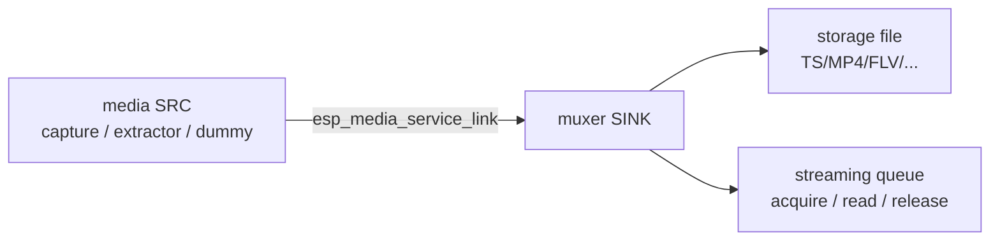
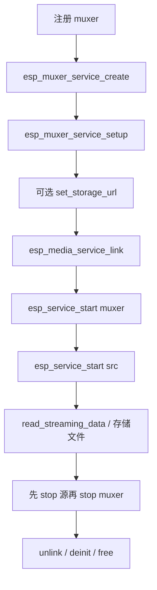

# ESP Muxer Service

- [](https://components.espressif.com/components/espressif/esp_muxer_service)
- [English](./README.md)

`esp_muxer_service` 是面向应用开发者的高层 **媒体 sink**：把已编码的基本音频 / 视频帧封装进容器。链接任意媒体源并启动 muxer 后，即可在存储上得到文件、从队列读到封装字节流，或两者同时进行——无需自写封装循环、管理切片，也无需在应用里拷贝帧。

返回句柄为建立在 `esp_media_service` / `esp_service` 上的标准媒体服务。创建后调用 `esp_muxer_service_setup()` / `esp_muxer_service_set_storage_url()`，再 `esp_media_service_link()` 以及常规 start / stop。打包、文件 IO 与流式队列都留在服务内部，产品代码保持短而可复用。

典型场景：把采集或解封装后的 A/V 录到 SD、为自定义发送端产出直播 TS/FLV 字节流，或在写文件的同时推送封装包。

## 优势

- **用服务拼应用，而不是写 muxer 内部逻辑。** 创建 muxer、`setup()` 容器与模式、`esp_media_service_link()` 源、先启动 muxer 再启动源。录制、直播封装或两者兼有，都是同一套短调用。
- **任意源即插即用。** 可链接 [`esp_audio_capture_service`](../esp_audio_capture_service/README.md)、[`esp_video_capture_service`](../esp_video_capture_service/README.md)、[`esp_extractor_service`](../esp_extractor_service/README.md)、dummy 源或其他 `esp_media_service` SRC。帧在进程内传递，应用无需拷贝或重新打时间戳。
- **落盘只需路径，不必自己写文件。** 设置 `storage_dir` 或 `set_storage_url()`。服务可从已知扩展名推断容器、自动创建目录（最大深度 2），并可按时长切片。
- **直播封装不必再搭一条管线。** `STREAMING_ONLY` 或 `BOTH` 通过 `acquire` / `read` / `release` 给出封装后的容器字节（不是 `esp_media_frame_t`），适用于 TS / FLV 等支持流式的类型。
- **一种模式切换覆盖产品形态。** `STORAGE_ONLY` / `STREAMING_ONLY` / `BOTH` 共用同一 setup 结构，不必为“录像”和“推流”写两套代码。
- **固件可以很小。** `esp_muxer_register_default()` 只会拉入 menuconfig **ESP_Muxer Configuration** 中仍启用的容器。关掉不用的类型即可减小 Flash（见 [优化体积](#优化体积)）。

## 功能

- 面向任意媒体源的容器封装 sink（采集、extractor、dummy、协议源）
- 仅存储、仅流式或两者兼有
- 可从存储 URL 扩展名推断容器类型
- 自动创建存储目录（最大深度 2）
- 可选文件写 RAM 缓存
- 可选流式队列缓存
- 可通过 `esp_service_scheduler` 覆盖线程资源（`muxer_sink`）

## 数据流



简要规则：

- muxer 不会作为媒体源。输出的是容器包，不是 `esp_media_frame_t`
- start 前链接已能产出基本 AAC / H264（或其他已映射编解码）的源
- **先启动 muxer 再启动源**，避免丢掉开头若干帧
- 流式 API 仅在 start 之后的 `STREAMING_ONLY` 或 `BOTH` 模式下有效

## 调用顺序



## 典型用法

```c
#include "esp_muxer_default.h"
#include "esp_muxer_service.h"
#include "esp_muxer_service_ops.h"
#include "esp_media_service.h"
#include "esp_service.h"

ESP_ERROR_CHECK(esp_muxer_register_default());

esp_muxer_service_cfg_t cfg = ESP_MUXER_SERVICE_CFG_DEFAULT();
esp_muxer_service_t *muxer = NULL;
ESP_ERROR_CHECK(esp_muxer_service_create(&cfg, &muxer));

esp_muxer_service_setup_t setup = ESP_MUXER_SERVICE_SETUP_DEFAULT();
setup.muxer_type = ESP_MUXER_TYPE_TS;
setup.mode = ESP_MUXER_SERVICE_MODE_STREAMING_ONLY;
setup.ram_cache_size = 16 * 1024;
ESP_ERROR_CHECK(esp_muxer_service_setup(muxer, &setup));

ESP_ERROR_CHECK(esp_media_service_link(ESP_SERVICE_BASE(src), ESP_MEDIA_DEFAULT_STREAM,
                                       ESP_SERVICE_BASE(muxer), ESP_MEDIA_DEFAULT_STREAM));
ESP_ERROR_CHECK(esp_service_start(ESP_SERVICE_BASE(muxer)));
ESP_ERROR_CHECK(esp_service_start(ESP_SERVICE_BASE(src)));

uint8_t buffer[4096];
size_t size = sizeof(buffer);
ESP_ERROR_CHECK(esp_muxer_service_read_streaming_data(muxer, buffer, &size, 2000));

esp_service_stop(ESP_SERVICE_BASE(src));
esp_service_stop(ESP_SERVICE_BASE(muxer));
esp_media_service_unlink(ESP_SERVICE_BASE(src), ESP_MEDIA_DEFAULT_STREAM,
                         ESP_SERVICE_BASE(muxer), ESP_MEDIA_DEFAULT_STREAM);
esp_media_service_deinit(ESP_SERVICE_BASE(muxer));
free(muxer);
```

若要落盘，将 `mode` 设为 `STORAGE_ONLY` 或 `BOTH` 并设置 `storage_dir`（例如 `/sdcard/muxed`），或调用 `esp_muxer_service_set_storage_url()` 传入如 `/sdcard/muxed/clip.ts` 的路径。

## 创建配置

`esp_muxer_service_cfg_t`：

| 字段 | 说明 |
| --- | --- |
| `name` | 调度 / MCP 使用的服务名；`NULL` 使用 `esp_muxer_service` |

## Setup

在 stop 状态下通过 `esp_muxer_service_setup_t` 应用：

| 字段 | 说明 |
| --- | --- |
| `muxer_type` | 容器类型（默认 `ESP_MUXER_TYPE_TS`） |
| `storage_dir` | 切片文件目录；`NULL` 且未设 URL 时关闭存储 |
| `slice_duration` | 切片时长（ms）；`0` 使用 muxer 默认值 |
| `ram_cache_size` | 文件写 RAM 缓存；`0` 使用默认值 |
| `streaming_cache_size` | 流式队列缓存；`0` 使用默认值 |
| `mode` | `STORAGE_ONLY` / `STREAMING_ONLY` / `BOTH` |

`esp_muxer_service_set_storage_url()` 会覆盖下一份文件路径，并在可识别时根据扩展名改写 `muxer_type`（例如 `.mp4`、`.ts`、`.flv`）。

## 运行时操作

```c
esp_muxer_service_acquire_streaming_data(muxer, &data, &size, timeout_ms);
esp_muxer_service_release_streaming_data(muxer);
esp_muxer_service_read_streaming_data(muxer, buffer, &inout_size, timeout_ms);
```

通过 `ESP_SERVICE_BASE(muxer)` 调用 `esp_service_start()` / `esp_service_stop()`。销毁时先 `esp_media_service_deinit()` 再 `free()`。

## 调度

安装 `esp_service_scheduler_set_cb()` 并匹配：

- 服务名：创建时 `name` 的前缀（默认 `esp_muxer_service`；例程 MCP 使用 `esp_muxer_service_mcp`）
- 线程名：`ESP_MUXER_SCHED_TASK`（`muxer_sink`）

默认工作线程：栈 6144、优先级 10、无核绑定。用 `strncmp(..., ESP_MUXER_SERVICE_NAME, ...)` 匹配 `service_name`，默认实例和带 `_mcp` 后缀的实例共用同一套 `muxer_sink` 配置。

## 优化体积

裁掉不用的容器，避免 `esp_muxer_register_default()` 把多余 muxer 链进固件。在 `idf.py menuconfig` 中打开：

```text
Component config → ESP_Muxer Configuration
```

各项默认均为 **y**。产品不写的类型请全部关掉：

| Kconfig | 容器 |
| --- | --- |
| `CONFIG_ESP_MUXER_MP4_SUPPORT` | MP4 |
| `CONFIG_ESP_MUXER_TS_SUPPORT` | MPEG-TS |
| `CONFIG_ESP_MUXER_OGG_SUPPORT` | OGG |
| `CONFIG_ESP_MUXER_WAV_SUPPORT` | WAV |
| `CONFIG_ESP_MUXER_FLV_SUPPORT` | FLV |
| `CONFIG_ESP_MUXER_CAF_SUPPORT` | CAF |
| `CONFIG_ESP_MUXER_AVI_SUPPORT` | AVI |

本例程 / 只写 TS 的典型录像产品应保持 `CONFIG_ESP_MUXER_TS_SUPPORT=y`，其余设为 **n**。对已禁用的 `muxer_type` 调用 `esp_muxer_service_setup()` 会返回 `ESP_ERR_NOT_SUPPORTED`。

另外：

- 若不调用 `esp_muxer_register_default()`，请只注册真正用到的 muxer
- 不需要 MCP 时关闭 `CONFIG_ESP_MUXER_SERVICE_MCP_ENABLE`
- 用 `esp_service_scheduler_set_cb()` 调整 `muxer_sink` 的栈 / 优先级 / 核，而不是给所有产品加大默认栈

## 配置项

- `ESP_MUXER_SERVICE_MCP_ENABLE`（依赖 `ESP_MCP_ENABLE`）
- 容器类型由 `esp_muxer` 的 **ESP_Muxer Configuration** 控制（`CONFIG_ESP_MUXER_*_SUPPORT`）

## 注意事项

- 运行中调用 setup / `set_storage_url` 会返回 `ESP_ERR_INVALID_STATE`
- 仅存储模式下，流式读接口会失败
- 并非所有容器都支持流式；`STREAMING_ONLY` / `BOTH` 请使用 TS / FLV 等支持流式的类型
- 不要把封装后的容器字节喂给 RTMP/RTSP sink，那些服务消费的是基本帧。录制与直播推流应对**同一源**分别链接
- stop / deinit 前必须释放已获取的流式缓冲区
- 文件存储需要已挂载的文件系统（通常通过 `esp_board_manager` 挂载 SD）

## 示例

参见 [`examples/muxer_service`](./examples/muxer_service/README_CN.md)，覆盖 dummy AAC 与 dummy H264+AAC 链接、board-manager SD 配置以及 MCP UART 验证。

## MCP 工具

当 `CONFIG_ESP_MUXER_SERVICE_MCP_ENABLE=y`（依赖 `CONFIG_ESP_MCP_ENABLE`）时：

- 配置 / 控制类工具覆盖 `setup`、`set_storage_url`、`start`、`stop`
- 通过 `esp_muxer_service_mcp_schema_get()` 与 `esp_muxer_service_tool_invoke()` 向 service manager 注册
- 媒体 link / unlink 仍属于 `esp_media_service` MCP；封装字节不会经过 MCP

UART 端到端验证请参见 `muxer_service` 例程中的 MCP 操作指南。

## 技术支持

请通过以下渠道获取技术支持：

- 技术支持：[esp32.com](https://esp32.com/viewforum.php?f=20) 论坛
- 问题反馈与功能请求：[GitHub issue](https://github.com/espressif/esp-adf/issues)

我们会尽快回复。
