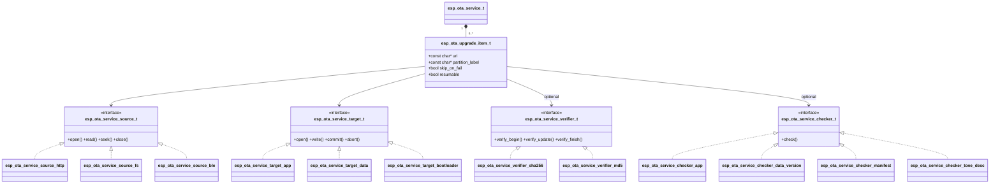
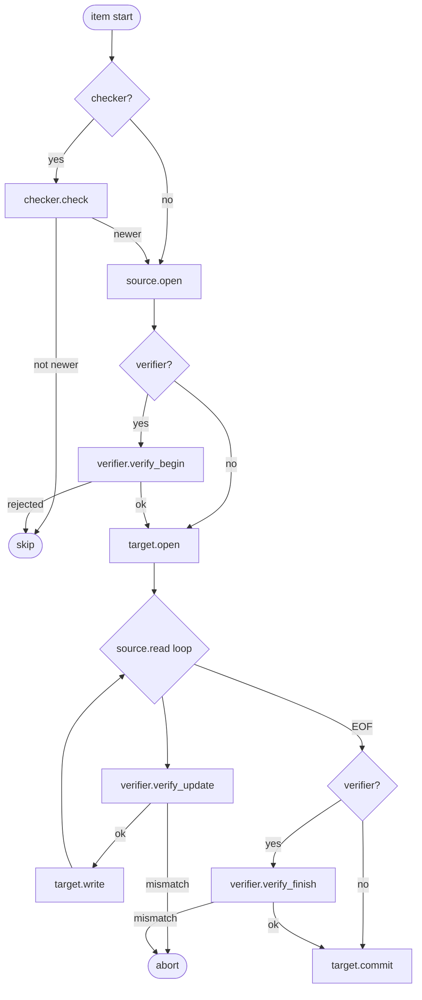

# OTA Service

[中文版](./README_CN.md)

**OTA Service** is a modular, extensible `esp_service_t` subclass that implements an Over-The-Air firmware upgrade pipeline. It separates the upgrade into four independent abstraction layers — source, target, checker, and verifier — enabling any combination of HTTP/HTTPS, filesystem, and BLE transports with app-partition, data-partition, or bootloader targets, without modifying the core service.

## Key Features

- **Multi-source download** — HTTP/HTTPS (`esp_ota_service_source_http_create()`), local filesystem (`esp_ota_service_source_fs_create()`), and BLE GATT peripheral speaking the official ESP BLE OTA APP protocol (`esp_ota_service_source_ble_create()`, optional); pluggable `esp_ota_service_source_t` interface for custom transports (UART, SPI, …)
- **Multi-target flash** — app partition (`esp_ota_service_target_app_create()`), raw data partition (`esp_ota_service_target_data_create()`), and bootloader (`esp_ota_service_target_bootloader_create()`, optional); custom targets via `esp_ota_service_target_t`
- **Pre-download version check** — `esp_ota_service_checker_app_create()` (app image), `esp_ota_service_checker_data_version_create()` (semver header), `esp_ota_service_checker_manifest_create()` (JSON manifest); items already up to date are skipped automatically
- **Streaming integrity verification** — `esp_ota_service_verifier_sha256_create()` (SHA-256) and `esp_ota_service_verifier_md5_create()` (MD5); pluggable `esp_ota_service_verifier_t` for signature or CRC schemes
- **NVS-based resume** — saves download offset every N KB; resumes from the last checkpoint on failure or reboot via HTTP Range / `fseek`
- **Rollback support** — `esp_ota_service_confirm_update()` / `esp_ota_service_rollback()` with pending-verify state detection (requires `CONFIG_OTA_ENABLE_ROLLBACK`)
- **Pause / resume mid-download** — `esp_service_pause()` / `esp_service_resume()` on the running session
- **Rich event bus** — 6 event types covering session begin, version check, item begin/progress/end, and session end; no reboot policy imposed on the application

## Architecture



Each `esp_ota_upgrade_item_t` is processed through the following pipeline. `esp_service_start()` returns immediately; the worker task runs in the background and reports progress via events.



## Quick Start

See [`examples/ota_http/`](examples/ota_http/) for a complete working example. The pattern is always: create pipeline components → subscribe to events → `esp_ota_service_set_upgrade_list()` → `esp_service_start()`.

> **Ownership rule:** after `esp_ota_service_set_upgrade_list()` the service owns every `source`, `target`, `checker`, and `verifier` in the list. Never call their `destroy()` directly — `esp_ota_service_destroy()` will free them.

After rebooting into the new image, call `esp_ota_service_confirm_update()` once connectivity is confirmed to cancel the rollback timer (requires `CONFIG_OTA_ENABLE_ROLLBACK=y`).

## Choosing the Right Abstractions

| Scenario | source | checker | verifier | target |
|----------|--------|---------|----------|--------|
| HTTP OTA, version + SHA-256 check | `esp_ota_service_source_http_create()` | `esp_ota_service_checker_manifest_create()` | `esp_ota_service_verifier_sha256_create()` | `esp_ota_service_target_app_create()` |
| HTTP OTA, version check only | `esp_ota_service_source_http_create()` | `esp_ota_service_checker_app_create()` | — | `esp_ota_service_target_app_create()` |
| SD card / USB flash drive | `esp_ota_service_source_fs_create()` | `esp_ota_service_checker_app_create()` | — | `esp_ota_service_target_app_create()` |
| BLE (no WiFi) | `esp_ota_service_source_ble_create()` | — | — | `esp_ota_service_target_app_create()` |
| Multi-partition batch | one source per partition | one checker per partition | optional | `esp_ota_service_target_app_create()` / `esp_ota_service_target_data_create()` |
| Data partition upgrade | `esp_ota_service_source_http_create()` / `esp_ota_service_source_fs_create()` | `esp_ota_service_checker_data_version_create()` | — | `esp_ota_service_target_data_create()` |

`esp_ota_service_checker_manifest_create()` fetches a JSON manifest (`{"version","sha256","size",...}`) and sets `esp_ota_service_check_result_t::has_hash = true` / `hash[32]` when a SHA-256 digest is present, so the caller can arm `esp_ota_service_verifier_sha256_create()` before starting the session (see `examples/ota_http` for the full pattern).

## Events

Subscribe with `esp_service_event_subscribe((esp_service_t *)svc, &sub)`. Each call delivers an `adf_event_t` whose `payload` is an `esp_ota_service_event_t *`. Always read `evt->id` first and access only the corresponding union branch.

| Event | Meaning | Key fields |
|-------|---------|------------|
| `ESP_OTA_SERVICE_EVT_SESSION_BEGIN` | Worker task started | — |
| `ESP_OTA_SERVICE_EVT_ITEM_VER_CHECK` | Version check completed | `ver_check.upgrade_available`, `error` |
| `ESP_OTA_SERVICE_EVT_ITEM_BEGIN` | Download + write loop starting | `item_index`, `item_label` |
| `ESP_OTA_SERVICE_EVT_ITEM_PROGRESS` | ~1 s progress tick | `progress.bytes_written`, `progress.total_bytes` |
| `ESP_OTA_SERVICE_EVT_ITEM_END` | One partition finished | `item_end.status`, `item_end.reason`, `error` |
| `ESP_OTA_SERVICE_EVT_SESSION_END` | All items done or aborted | `session_end.{success,failed,skipped}_count`, `aborted` |

`ESP_OTA_SERVICE_EVT_ITEM_VER_CHECK` notes: `error != ESP_OK` → checker failed, `ITEM_END(FAILED)` follows; `!upgrade_available` → item silently skipped (no `ITEM_BEGIN`/`ITEM_END`); `upgrade_available` → download proceeds.

## Optional Features

| Feature | Enable | Notes |
|---------|--------|-------|
| NVS-based resume | `CONFIG_OTA_ENABLE_RESUME=y` (default) | Saves offset every `OTA_RESUME_SAVE_INTERVAL_KB` KB; set `resumable = false` for targets without `set_write_offset()` (data, bootloader) or sources without `seek()` (BLE) — otherwise `esp_ota_service_set_upgrade_list()` returns `ESP_ERR_NOT_SUPPORTED` |
| Rollback | `CONFIG_OTA_ENABLE_ROLLBACK=y` | Call `esp_ota_service_confirm_update()` once the new image is verified (e.g., WiFi up); omitting this call causes rollback on every reboot — see `examples/ota_http/main/app_main.c` for the pattern |
| Bootloader OTA | `CONFIG_OTA_ENABLE_BOOTLOADER_OTA=y` | Uses a staging partition; no atomicity guarantee — power loss during copy may brick the device; temporarily not covered by `test_apps` (TODO: add automated tests in a future update) |
| BLE source | `CONFIG_OTA_ENABLE_BLE_SOURCE=y` | Requires ESP BLE OTA APP protocol; `seek` not implemented, so `resumable` must be `false` |

All other tuning parameters (worker stack, chunk size, timeouts) are runtime fields in `esp_ota_service_cfg_t` — initialize with `ESP_OTA_SERVICE_CFG_DEFAULT()` and override only what you need. See `include/esp_ota_service.h` for defaults.

## Custom Source / Target / Checker / Verifier

Each abstraction is a struct of function pointers. Implement the interface and pass the result to `esp_ota_service_set_upgrade_list()`. The service takes ownership and calls `destroy()` when it is done.

```c
static esp_err_t my_open(esp_ota_service_source_t *self, const char *uri) { ... }
static int       my_read(esp_ota_service_source_t *self, uint8_t *buf, int len) { ... }
static int64_t   my_get_size(esp_ota_service_source_t *self) { return -1; }
static esp_err_t my_close(esp_ota_service_source_t *self) { ... }
static void      my_destroy(esp_ota_service_source_t *self) { free(self); }

esp_err_t my_source_create(esp_ota_service_source_t **out_src)
{
    esp_ota_service_source_t *src = calloc(1, sizeof(esp_ota_service_source_t));
    if (!src) { return ESP_ERR_NO_MEM; }
    src->open     = my_open;
    src->read     = my_read;
    src->get_size = my_get_size;
    src->seek     = NULL;       /* no seek — resumable must be false */
    src->close    = my_close;
    src->destroy  = my_destroy;
    *out_src = src;
    return ESP_OK;
}
```

The same pattern applies to `esp_ota_service_target_t`, `esp_ota_service_checker_t`, and `esp_ota_service_verifier_t`. See `include/source/esp_ota_service_source.h`, `include/target/esp_ota_service_target.h`, `include/checker/esp_ota_service_checker.h`, and `include/verifier/esp_ota_service_verifier.h` for each vtable definition.

## Typical Scenarios

- **HTTP OTA with version check** — fetch firmware from a web server, skip if already up to date, resume on failure
- **SD card / offline deployment** — write a firmware binary to SD card offline; flash on next boot without network
- **USB flash drive (U-disk) OTA** — mount a FAT-formatted USB drive via USB Host + MSC; `esp_ota_service_source_fs_create()` reads `firmware.bin` through the VFS mount, no new source code needed
- **BLE OTA (no WiFi)** — mobile app or PC script transfers binary over BLE GATT; device acts as GATT peripheral
- **Multi-partition batch upgrade** — upgrade app + data partition + tone partition in a single session with a single event stream
- **Dual-image A/B rollback** — upgrade, run self-test, confirm or roll back using the pending-verify API

## Example Projects

Three ready-to-run examples cover the most common transports. Each example is self-contained: flash it, follow the steps below, and you have a working end-to-end OTA flow in minutes.

| Example | Transport | Key features demonstrated |
|---------|-----------|--------------------------|
| [`examples/ota_http/`](examples/ota_http/) | HTTP over WiFi | Manifest-based version check, SHA-256 verification, resume |
| [`examples/ota_fs/`](examples/ota_fs/) | SD card or USB flash drive | Offline deployment, multi-partition (app + data + tone), SD card writer |
| [`examples/ota_ble/`](examples/ota_ble/) | BLE GATT | No-WiFi upgrade, ESP BLE OTA APP protocol |

Each example is paired with helper scripts under [`tools/`](tools/README.md) that handle building a versioned firmware image, writing it to an SD card, serving it over HTTP, or pushing it over BLE — so you only need `idf.py flash monitor` on the device side. See [`tools/README.md`](tools/README.md) for the full workflow.
