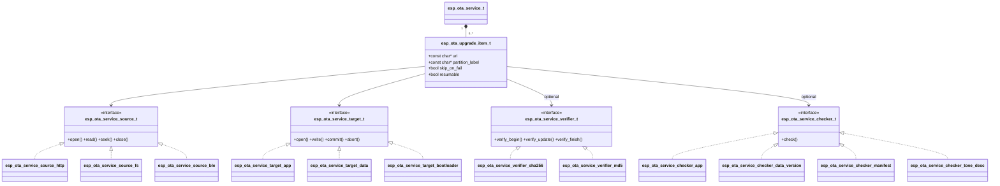
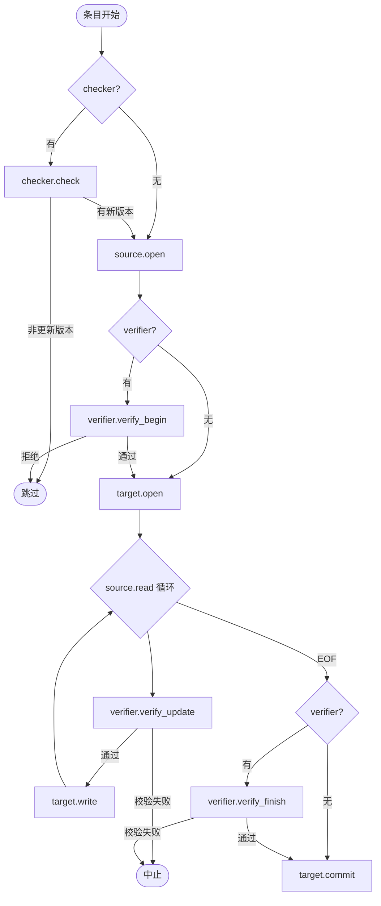

# OTA Service

[English](./README.md)

**OTA Service** 是一个模块化、可扩展的 `esp_service_t` 子类，实现了完整的空中固件升级（OTA）流水线。它将升级过程拆分为四个独立的抽象层——数据源、写入目标、版本检查器和完整性校验器——从而支持 HTTP/HTTPS、文件系统、BLE 等传输方式与应用分区、数据分区或 Bootloader 目标的任意组合，无需修改核心服务代码。

## 主要特性

- **多数据源下载** — HTTP/HTTPS（`esp_ota_service_source_http_create()`）、本地文件系统（`esp_ota_service_source_fs_create()`）、遵循官方 ESP BLE OTA APP 协议的 BLE GATT 外设（`esp_ota_service_source_ble_create()`，可选）；通过 `esp_ota_service_source_t` 接口支持自定义传输（UART、SPI 等）
- **多目标写入** — 应用分区（`esp_ota_service_target_app_create()`）、原始数据分区（`esp_ota_service_target_data_create()`）、Bootloader（`esp_ota_service_target_bootloader_create()`，可选）；通过 `esp_ota_service_target_t` 支持自定义目标
- **下载前版本检查** — `esp_ota_service_checker_app_create()`（应用镜像）、`esp_ota_service_checker_data_version_create()`（语义版本头）、`esp_ota_service_checker_manifest_create()`（JSON 清单）；已是最新版本的条目自动跳过
- **流式完整性校验** — `esp_ota_service_verifier_sha256_create()`（SHA-256）和 `esp_ota_service_verifier_md5_create()`（MD5）；通过 `esp_ota_service_verifier_t` 支持签名或 CRC 方案
- **基于 NVS 的断点续传** — 每 N KB 保存一次下载偏移；故障或重启后通过 HTTP Range / `fseek` 从断点恢复
- **回滚支持** — 提供 `esp_ota_service_confirm_update()` / `esp_ota_service_rollback()` 及待验证状态检测（需要 `CONFIG_OTA_ENABLE_ROLLBACK`）
- **下载中暂停/恢复** — 可在运行中对会话调用 `esp_service_pause()` / `esp_service_resume()`
- **丰富的事件总线** — 6 种事件类型覆盖会话开始、版本检查、条目开始/进度/结束和会话结束；不强制规定重启策略

## 架构



每个 `esp_ota_upgrade_item_t` 按以下流水线处理。`esp_service_start()` 立即返回，工作任务在后台运行并通过事件上报进度。



## 快速开始

完整示例请参阅 [`examples/ota_http/`](examples/ota_http/)。固定模式为：创建流水线组件 → 订阅事件 → `esp_ota_service_set_upgrade_list()` → `esp_service_start()`。

> **所有权规则：** 调用 `esp_ota_service_set_upgrade_list()` 后，服务接管列表中每个 `source`、`target`、`checker` 和 `verifier` 的所有权。不要直接调用它们的 `destroy()`——`esp_ota_service_destroy()` 会负责释放。

重启进入新固件后，在确认连接正常时调用 `esp_ota_service_confirm_update()` 以取消回滚计时器（需要 `CONFIG_OTA_ENABLE_ROLLBACK=y`）。

## 选择合适的组合

| 场景 | source | checker | verifier | target |
|------|--------|---------|----------|--------|
| HTTP OTA，版本 + SHA-256 校验 | `esp_ota_service_source_http_create()` | `esp_ota_service_checker_manifest_create()` | `esp_ota_service_verifier_sha256_create()` | `esp_ota_service_target_app_create()` |
| HTTP OTA，仅版本检查 | `esp_ota_service_source_http_create()` | `esp_ota_service_checker_app_create()` | — | `esp_ota_service_target_app_create()` |
| SD 卡 / U 盘 | `esp_ota_service_source_fs_create()` | `esp_ota_service_checker_app_create()` | — | `esp_ota_service_target_app_create()` |
| BLE（无 WiFi） | `esp_ota_service_source_ble_create()` | — | — | `esp_ota_service_target_app_create()` |
| 多分区批量升级 | 每个分区一个 source | 每个分区一个 checker | 可选 | `esp_ota_service_target_app_create()` / `esp_ota_service_target_data_create()` |
| 数据分区升级 | `esp_ota_service_source_http_create()` / `esp_ota_service_source_fs_create()` | `esp_ota_service_checker_data_version_create()` | — | `esp_ota_service_target_data_create()` |

`esp_ota_service_checker_manifest_create()` 拉取 JSON 清单（`{"version","sha256","size",...}`），当清单中包含 SHA-256 摘要时设置 `esp_ota_service_check_result_t::has_hash = true` / `hash[32]`，调用方可据此在启动会话前配置 `esp_ota_service_verifier_sha256_create()`（完整示例见 `examples/ota_http`）。

## 事件

通过 `esp_service_event_subscribe((esp_service_t *)svc, &sub)` 订阅。每次回调收到的 `adf_event_t` 中，`payload` 指向 `esp_ota_service_event_t *`。先读取 `evt->id`，再访问对应的联合体分支。

| 事件 | 含义 | 关键字段 |
|------|------|----------|
| `ESP_OTA_SERVICE_EVT_SESSION_BEGIN` | 工作任务已启动 | — |
| `ESP_OTA_SERVICE_EVT_ITEM_VER_CHECK` | 版本检查完成 | `ver_check.upgrade_available`，`error` |
| `ESP_OTA_SERVICE_EVT_ITEM_BEGIN` | 下载写入循环即将开始 | `item_index`，`item_label` |
| `ESP_OTA_SERVICE_EVT_ITEM_PROGRESS` | 约每秒一次进度更新 | `progress.bytes_written`，`progress.total_bytes` |
| `ESP_OTA_SERVICE_EVT_ITEM_END` | 单个分区升级完成 | `item_end.status`，`item_end.reason`，`error` |
| `ESP_OTA_SERVICE_EVT_SESSION_END` | 全部条目完成或中止 | `session_end.{success,failed,skipped}_count`，`aborted` |

`ESP_OTA_SERVICE_EVT_ITEM_VER_CHECK` 说明：`error != ESP_OK` → 检查器报错，随后会触发 `ITEM_END(FAILED)`；`!upgrade_available` → 条目静默跳过（不触发 `ITEM_BEGIN`/`ITEM_END`）；`upgrade_available` → 继续下载。

## 可选功能

| 功能 | 启用方式 | 说明 |
|------|----------|------|
| 基于 NVS 的断点续传 | `CONFIG_OTA_ENABLE_RESUME=y`（默认开启） | 每 `OTA_RESUME_SAVE_INTERVAL_KB` KB 保存一次偏移；对没有 `set_write_offset()` 的目标（数据、Bootloader）或没有 `seek()` 的数据源（BLE）须将 `resumable` 设为 `false`，否则 `esp_ota_service_set_upgrade_list()` 返回 `ESP_ERR_NOT_SUPPORTED` |
| 回滚 | `CONFIG_OTA_ENABLE_ROLLBACK=y` | 新固件验证通过后（如 WiFi 已连接）调用 `esp_ota_service_confirm_update()`；若未调用，每次重启都会触发回滚——参见 `examples/ota_http/main/app_main.c` |
| Bootloader OTA | `CONFIG_OTA_ENABLE_BOOTLOADER_OTA=y` | 通过暂存分区写入；无原子性保证——拷贝途中断电可能导致设备变砖；`test_apps` 暂时未覆盖该路径（TODO：后续补充自动化测试） |
| BLE 数据源 | `CONFIG_OTA_ENABLE_BLE_SOURCE=y` | 需要官方 ESP BLE OTA APP 协议；未实现 `seek`，因此 `resumable` 必须为 `false` |

其余调节参数（工作任务栈、块大小、超时）均为 `esp_ota_service_cfg_t` 的运行时字段——使用 `ESP_OTA_SERVICE_CFG_DEFAULT()` 初始化后按需覆盖。默认值见 `include/esp_ota_service.h`。

## 自定义数据源 / 目标 / 检查器 / 校验器

每种抽象均为函数指针结构体，实现接口后传给 `esp_ota_service_set_upgrade_list()`。服务接管所有权，完成后调用 `destroy()`。

```c
static esp_err_t my_open(esp_ota_service_source_t *self, const char *uri) { ... }
static int       my_read(esp_ota_service_source_t *self, uint8_t *buf, int len) { ... }
static int64_t   my_get_size(esp_ota_service_source_t *self) { return -1; }
static esp_err_t my_close(esp_ota_service_source_t *self) { ... }
static void      my_destroy(esp_ota_service_source_t *self) { free(self); }

esp_err_t my_source_create(esp_ota_service_source_t **out_src)
{
    esp_ota_service_source_t *src = calloc(1, sizeof(esp_ota_service_source_t));
    if (!src) { return ESP_ERR_NO_MEM; }
    src->open     = my_open;
    src->read     = my_read;
    src->get_size = my_get_size;
    src->seek     = NULL;       /* no seek — resumable must be false */
    src->close    = my_close;
    src->destroy  = my_destroy;
    *out_src = src;
    return ESP_OK;
}
```

`esp_ota_service_target_t`、`esp_ota_service_checker_t` 和 `esp_ota_service_verifier_t` 遵循同样的模式，各接口定义见 `include/source/esp_ota_service_source.h`、`include/target/esp_ota_service_target.h`、`include/checker/esp_ota_service_checker.h`、`include/verifier/esp_ota_service_verifier.h`。

## 典型应用场景

- **带版本检查的 HTTP OTA** — 从 Web 服务器拉取固件，已是最新版时自动跳过，失败后断点续传
- **SD 卡 / 离线部署** — 离线将固件写入 SD 卡，下次启动时无需网络直接烧录
- **U 盘（USB 闪存盘）OTA** — 通过 USB Host + MSC 挂载 FAT 格式的 U 盘，`esp_ota_service_source_fs_create()` 经由 VFS 直接读取 `firmware.bin`，无需新增数据源代码
- **BLE OTA（无 WiFi）** — 手机 App 或 PC 脚本通过 BLE GATT 传输固件，设备作为 GATT 外设
- **多分区批量升级** — 在一次会话内升级应用分区 + 数据分区 + 音调分区，共用单一事件流
- **双镜像 A/B 回滚** — 升级后自测，通过待验证 API 确认或回滚

## 示例工程

三个开箱即用的示例覆盖最常见的传输方式。每个示例均配套辅助脚本，帮助构建固件镜像、写入 SD 卡、启动 HTTP 服务或通过 BLE 推送——设备侧只需 `idf.py flash monitor`。详细流程见 [`tools/README.md`](tools/README.md)。

| 示例 | 传输方式 | 演示功能 |
|------|----------|----------|
| [`examples/ota_http/`](examples/ota_http/) | HTTP over WiFi | 基于清单的版本检查、SHA-256 校验、断点续传 |
| [`examples/ota_fs/`](examples/ota_fs/) | SD 卡或 U 盘 | 离线部署、多分区（应用 + 数据 + 音调）、SD 卡写入工具 |
| [`examples/ota_ble/`](examples/ota_ble/) | BLE GATT | 无 WiFi 升级、官方 ESP BLE OTA APP 协议 |
