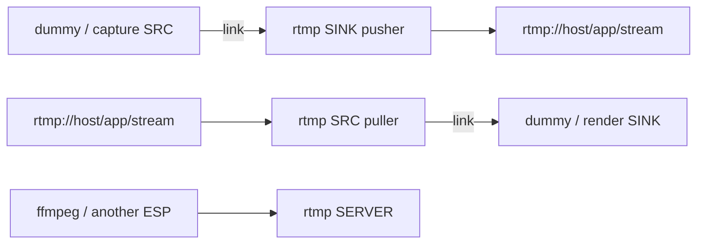
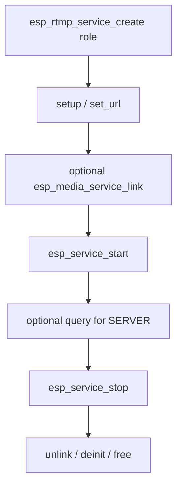

# ESP RTMP Service

- [](https://components.espressif.com/components/espressif/esp_rtmp_service)
- [中文版](./README_CN.md)

RTMP service is a high-level RTMP implementation: link it with capture, dummy, or playback services and skip the protocol setup and A/V plumbing.

It covers the full RTMP stack:

- **RTMP / RTMPS**
- **Server** — local ingest and relay
- **Pusher (SINK)** — send A/V to a live server
- **Puller (SRC)** — receive A/V from a live URL

Typical uses:

- Push live audio/video to YouTube and other ingest servers
- Host a local RTMP server for real-time video or audio apps

## Features

- URL-based setup (`rtmp://` / `rtmps://`)
- Link other media services instead of managing frames yourself
- One instance is one role: SERVER, SRC (puller), or SINK (pusher)
- Interleaved A/V uses a shared cache on link
- Thread resources overridable through `esp_service_scheduler`

## Data Flow



Short rules:

- SINK and SRC speak elementary frames, not FLV file bytes
- SERVER has no `esp_media_service_link` data path
- Start sinks before sources
- Do not pipe `esp_muxer_service` streaming bytes into RTMP; muxer and RTMP should share the same elementary source

## Call Sequence



## Typical Usage

### Pusher (SINK)

```c
esp_rtmp_service_cfg_t cfg = ESP_RTMP_SERVICE_CFG_DEFAULT(ESP_RTMP_SERVICE_ROLE_SINK);
esp_rtmp_service_t *rtmp = NULL;
ESP_ERROR_CHECK(esp_rtmp_service_create(&cfg, &rtmp));
esp_rtmp_service_setup_t setup = ESP_RTMP_SERVICE_SINK_SETUP_DEFAULT();
ESP_ERROR_CHECK(esp_rtmp_service_setup(rtmp, &setup));
ESP_ERROR_CHECK(esp_rtmp_service_set_url(rtmp, "rtmp://192.168.1.10/live/stream0"));
ESP_ERROR_CHECK(esp_media_service_link(ESP_SERVICE_BASE(src), ESP_MEDIA_DEFAULT_STREAM,
                                       ESP_SERVICE_BASE(rtmp), ESP_MEDIA_DEFAULT_STREAM));
ESP_ERROR_CHECK(esp_service_start(ESP_SERVICE_BASE(rtmp)));
ESP_ERROR_CHECK(esp_service_start(ESP_SERVICE_BASE(src)));
```

### Puller (SRC)

```c
esp_rtmp_service_cfg_t cfg = ESP_RTMP_SERVICE_CFG_DEFAULT(ESP_RTMP_SERVICE_ROLE_SRC);
esp_rtmp_service_t *rtmp = NULL;
ESP_ERROR_CHECK(esp_rtmp_service_create(&cfg, &rtmp));
esp_rtmp_service_setup_t setup = ESP_RTMP_SERVICE_SRC_SETUP_DEFAULT();
ESP_ERROR_CHECK(esp_rtmp_service_setup(rtmp, &setup));
ESP_ERROR_CHECK(esp_rtmp_service_set_url(rtmp, "rtmp://192.168.1.10/live/stream0"));
ESP_ERROR_CHECK(esp_media_service_link(ESP_SERVICE_BASE(rtmp), ESP_MEDIA_DEFAULT_STREAM,
                                       ESP_SERVICE_BASE(sink), ESP_MEDIA_DEFAULT_STREAM));
```

### Server

```c
esp_rtmp_service_cfg_t cfg = ESP_RTMP_SERVICE_CFG_DEFAULT(ESP_RTMP_SERVICE_ROLE_SERVER);
esp_rtmp_service_t *server = NULL;
ESP_ERROR_CHECK(esp_rtmp_service_create(&cfg, &server));
esp_rtmp_service_setup_t setup = ESP_RTMP_SERVICE_SERVER_SETUP_DEFAULT();
ESP_ERROR_CHECK(esp_rtmp_service_setup(server, &setup));
ESP_ERROR_CHECK(esp_rtmp_service_set_url(server, "rtmp://0.0.0.0:1935/live"));
ESP_ERROR_CHECK(esp_service_start(ESP_SERVICE_BASE(server)));
esp_rtmp_service_query(server);
```

URL shapes:

| Role | URL |
| --- | --- |
| SERVER | `rtmp[s]://host:port/app` |
| SRC / SINK | `rtmp[s]://host:port/app/stream` |

## Scheduler

| Role | Thread name macro | Default name |
| --- | --- | --- |
| SINK | `ESP_RTMP_SERVICE_PUSH_TASK_NAME` | `rtmp_push` |
| SRC | `ESP_RTMP_SERVICE_SRC_TASK_NAME` | `rtmp_src` |
| SERVER | `ESP_RTMP_SERVICE_SERVER_TASK_NAME` | `rtmp_server` |

Match the create `name` plus the thread name in `esp_service_scheduler_set_cb()`.

## Configuration

Role compile switches: `ESP_RTMP_SERVICE_SRC_SUPPORT`, `ESP_RTMP_SERVICE_SINK_SUPPORT`, `ESP_RTMP_SERVICE_SERVER_SUPPORT`.

## Events

Subscribe with `esp_service_event_subscribe()` on `ESP_SERVICE_BASE(rtmp)`. RTMP publishes:

- `ESP_RTMP_SERVICE_EVENT_PEER_CLOSED` for SRC/SINK remote disconnects
- `ESP_RTMP_SERVICE_EVENT_SERVER_CLIENT_CONNECTED` for a new server client
- `ESP_RTMP_SERVICE_EVENT_SERVER_PULLER_STARTED` / `STOPPED` with the stream name

The payload is `esp_rtmp_service_event_payload_t`. Base lifecycle transitions continue to use `ESP_SERVICE_EVENT_STATE_CHANGED`.

## Points Of Attention

- Setup and `set_url` require the service to be stopped
- `esp_rtmp_service_query()` is SERVER-only
- A sink requests global interleaved cache through link `get_request`
- Tear down with `esp_media_service_deinit()` then `free()`

## Example

See [`examples/rtmp_service`](./examples/rtmp_service/README.md) for pusher, puller, and server walkthroughs.

## MCP Tools

When `CONFIG_ESP_RTMP_SERVICE_MCP_ENABLE=y` (depends on `CONFIG_ESP_MCP_ENABLE`):

- Setup / control tools cover `setup`, `set_url`, `start`, `stop`, and `query`
- Register with `esp_rtmp_service_mcp_schema_get()` and `esp_rtmp_service_tool_invoke()`
- Media link / unlink stays in `esp_media_service` MCP; frames never go over MCP

See the `rtmp_service` example MCP Operation Guide for UART verification.

## Technical Support

For technical support, use the links below:

- Technical support: [esp32.com](https://esp32.com/viewforum.php?f=20) forum
- Issue reports and feature requests: [GitHub issue](https://github.com/espressif/esp-adf/issues)
