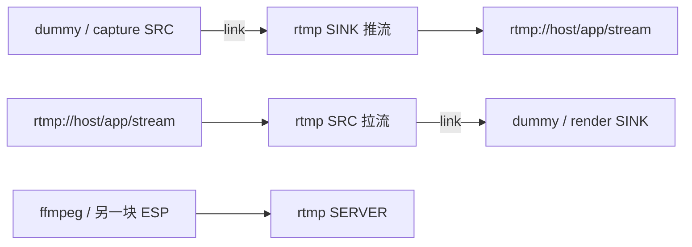
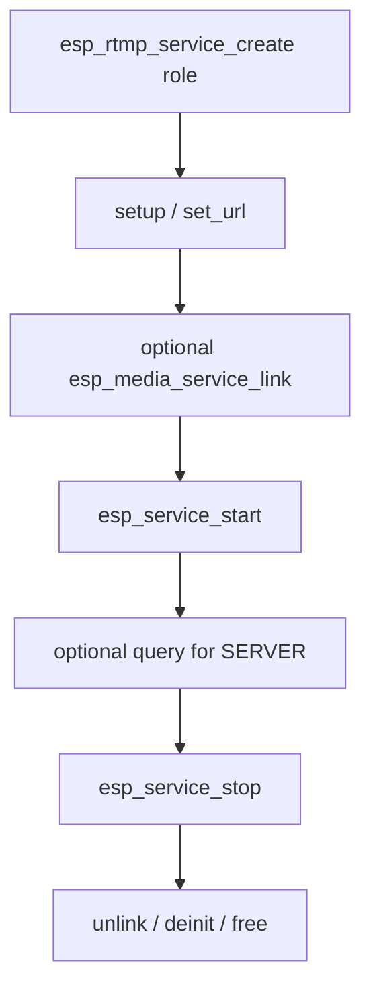

# ESP RTMP Service

- [](https://components.espressif.com/components/espressif/esp_rtmp_service)
- [English](./README.md)

RTMP 服务是高层 RTMP 实现：与采集、dummy 或播放服务链接即可，无需自行处理协议握手与音视频管线。

覆盖完整 RTMP 栈：

- **RTMP / RTMPS**
- **Server** — 本地收流与转发
- **Pusher（SINK）** — 将音视频推送到直播服务器
- **Puller（SRC）** — 从直播 URL 拉取音视频

典型用途：

- 将实时音视频推送到 YouTube 等收流服务器
- 在本地部署 RTMP 服务器，用于实时视频或音频应用

## 功能

- 基于 URL 配置（`rtmp://` / `rtmps://`）
- 与其他媒体服务链接，无需自行管理帧
- 一个实例对应一种角色：SERVER、SRC（拉流）或 SINK（推流）
- 交错音视频在 link 时使用共享缓存
- 可通过 `esp_service_scheduler` 覆盖线程资源

## 数据流



简要规则：

- SINK 与 SRC 传输基本音视频帧，不是 FLV 文件字节
- SERVER 没有 `esp_media_service_link` 数据通路
- 先启动 sink，再启动 source
- 不要把 `esp_muxer_service` 的流式封装字节送入 RTMP；muxer 与 RTMP 应共享同一路基本音视频源

## 调用顺序



## 典型用法

### 推流（SINK）

```c
esp_rtmp_service_cfg_t cfg = ESP_RTMP_SERVICE_CFG_DEFAULT(ESP_RTMP_SERVICE_ROLE_SINK);
esp_rtmp_service_t *rtmp = NULL;
ESP_ERROR_CHECK(esp_rtmp_service_create(&cfg, &rtmp));
esp_rtmp_service_setup_t setup = ESP_RTMP_SERVICE_SINK_SETUP_DEFAULT();
ESP_ERROR_CHECK(esp_rtmp_service_setup(rtmp, &setup));
ESP_ERROR_CHECK(esp_rtmp_service_set_url(rtmp, "rtmp://192.168.1.10/live/stream0"));
ESP_ERROR_CHECK(esp_media_service_link(ESP_SERVICE_BASE(src), ESP_MEDIA_DEFAULT_STREAM,
                                       ESP_SERVICE_BASE(rtmp), ESP_MEDIA_DEFAULT_STREAM));
ESP_ERROR_CHECK(esp_service_start(ESP_SERVICE_BASE(rtmp)));
ESP_ERROR_CHECK(esp_service_start(ESP_SERVICE_BASE(src)));
```

### 拉流（SRC）

```c
esp_rtmp_service_cfg_t cfg = ESP_RTMP_SERVICE_CFG_DEFAULT(ESP_RTMP_SERVICE_ROLE_SRC);
esp_rtmp_service_t *rtmp = NULL;
ESP_ERROR_CHECK(esp_rtmp_service_create(&cfg, &rtmp));
esp_rtmp_service_setup_t setup = ESP_RTMP_SERVICE_SRC_SETUP_DEFAULT();
ESP_ERROR_CHECK(esp_rtmp_service_setup(rtmp, &setup));
ESP_ERROR_CHECK(esp_rtmp_service_set_url(rtmp, "rtmp://192.168.1.10/live/stream0"));
ESP_ERROR_CHECK(esp_media_service_link(ESP_SERVICE_BASE(rtmp), ESP_MEDIA_DEFAULT_STREAM,
                                       ESP_SERVICE_BASE(sink), ESP_MEDIA_DEFAULT_STREAM));
```

### 服务器

```c
esp_rtmp_service_cfg_t cfg = ESP_RTMP_SERVICE_CFG_DEFAULT(ESP_RTMP_SERVICE_ROLE_SERVER);
esp_rtmp_service_t *server = NULL;
ESP_ERROR_CHECK(esp_rtmp_service_create(&cfg, &server));
esp_rtmp_service_setup_t setup = ESP_RTMP_SERVICE_SERVER_SETUP_DEFAULT();
ESP_ERROR_CHECK(esp_rtmp_service_setup(server, &setup));
ESP_ERROR_CHECK(esp_rtmp_service_set_url(server, "rtmp://0.0.0.0:1935/live"));
ESP_ERROR_CHECK(esp_service_start(ESP_SERVICE_BASE(server)));
esp_rtmp_service_query(server);
```

URL 形态：

| 角色 | URL |
| --- | --- |
| SERVER | `rtmp[s]://host:port/app` |
| SRC / SINK | `rtmp[s]://host:port/app/stream` |

## 调度器

| 角色 | 线程名宏 | 默认名称 |
| --- | --- | --- |
| SINK | `ESP_RTMP_SERVICE_PUSH_TASK_NAME` | `rtmp_push` |
| SRC | `ESP_RTMP_SERVICE_SRC_TASK_NAME` | `rtmp_src` |
| SERVER | `ESP_RTMP_SERVICE_SERVER_TASK_NAME` | `rtmp_server` |

在 `esp_service_scheduler_set_cb()` 中匹配 create 时的 `name` 以及上表线程名。

## 配置项

角色编译开关：`ESP_RTMP_SERVICE_SRC_SUPPORT`、`ESP_RTMP_SERVICE_SINK_SUPPORT`、`ESP_RTMP_SERVICE_SERVER_SUPPORT`。

## 事件

通过 `ESP_SERVICE_BASE(rtmp)` 调用 `esp_service_event_subscribe()` 订阅。RTMP 服务会发布：

- SRC/SINK 远端断开：`ESP_RTMP_SERVICE_EVENT_PEER_CLOSED`
- SERVER 新客户端：`ESP_RTMP_SERVICE_EVENT_SERVER_CLIENT_CONNECTED`
- SERVER 拉流端开始 / 停止：`ESP_RTMP_SERVICE_EVENT_SERVER_PULLER_STARTED` / `STOPPED`，携带流名

事件载荷为 `esp_rtmp_service_event_payload_t`。基础生命周期转换仍使用 `ESP_SERVICE_EVENT_STATE_CHANGED`。

## 注意事项

- Setup 与 `set_url` 要求服务处于停止状态
- `esp_rtmp_service_query()` 仅适用于 SERVER
- Sink 通过 link 的 `get_request` 请求全局交错缓存
- 销毁时先调用 `esp_media_service_deinit()`，再 `free()`

## 示例

推流、拉流与服务器演示见 [`examples/rtmp_service`](./examples/rtmp_service/README_CN.md)。

## MCP 工具

当 `CONFIG_ESP_RTMP_SERVICE_MCP_ENABLE=y`（依赖 `CONFIG_ESP_MCP_ENABLE`）时：

- 配置 / 控制类工具覆盖 `setup`、`set_url`、`start`、`stop` 与 `query`
- 通过 `esp_rtmp_service_mcp_schema_get()` 与 `esp_rtmp_service_tool_invoke()` 注册
- 媒体 link / unlink 仍属于 `esp_media_service` MCP；媒体帧不会经过 MCP

UART 验证请参见 `rtmp_service` 例程中的 MCP 操作指南。

## 技术支持

请通过以下渠道获取技术支持：

- 技术支持：[esp32.com](https://esp32.com/viewforum.php?f=20) 论坛
- 问题反馈与功能请求：[GitHub issue](https://github.com/espressif/esp-adf/issues)
