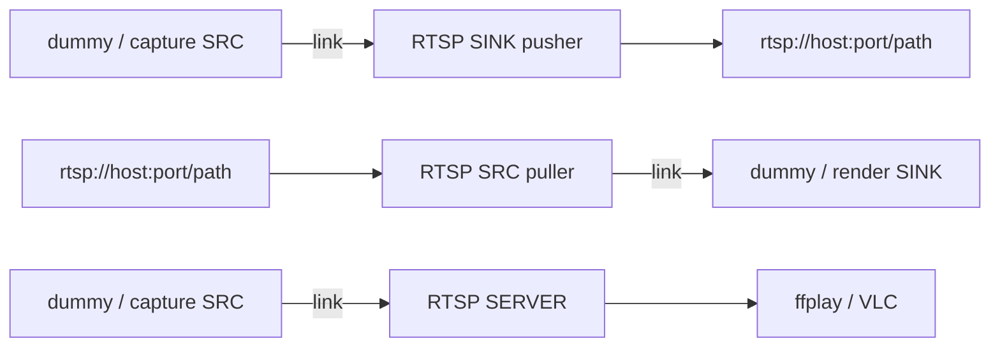
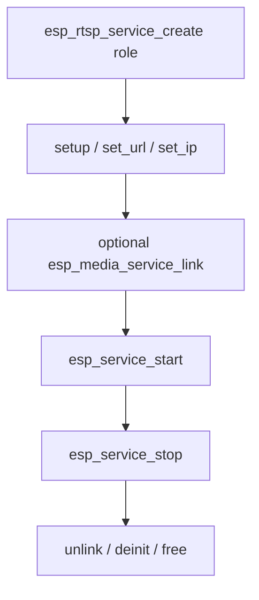

# ESP RTSP Service

- [](https://components.espressif.com/components/espressif/esp_rtsp_service)
- [中文版](./README_CN.md)

RTSP service is a high-level wrapper over `esp_rtsp`: link it with capture, dummy, or playback services and avoid handling RTSP sessions and A/V frame plumbing directly.

It supports three roles:

- **Server** — accepts linked elementary frames and serves one remote RTSP client
- **Pusher (SINK)** — publishes linked audio/video to an RTSP server
- **Puller (SRC)** — plays an RTSP URL and provides received audio/video

## Features

- URL-based setup (`rtsp://`)
- UDP and TCP transport
- H264 or MJPEG video and AAC or G.711 audio, subject to peer support
- One service instance per role: SERVER, SRC (puller), or SINK (pusher)
- Media-service links instead of application-managed frame callbacks
- Thread resources overridable through `esp_service_scheduler`

## Data Flow



Short rules:

- SINK and SERVER consume elementary audio/video frames, not container bytes
- SRC produces elementary frames for a linked sink
- Start consuming sinks before producing sources
- SERVER currently serves one remote puller
- A client-push destination must support RTSP `ANNOUNCE`, `SETUP`, and `RECORD`

## Call Sequence



## Typical Usage

### Pusher (SINK)

```c
esp_rtsp_service_cfg_t cfg = ESP_RTSP_SERVICE_CFG_DEFAULT(ESP_RTSP_SERVICE_ROLE_SINK);
esp_rtsp_service_t *rtsp = NULL;
ESP_ERROR_CHECK(esp_rtsp_service_create(&cfg, &rtsp));
esp_rtsp_service_setup_t setup = ESP_RTSP_SERVICE_SETUP_DEFAULT();
ESP_ERROR_CHECK(esp_rtsp_service_setup(rtsp, &setup));
ESP_ERROR_CHECK(esp_rtsp_service_set_url(rtsp, "rtsp://192.168.1.10:8554/live"));
ESP_ERROR_CHECK(esp_media_service_link(ESP_SERVICE_BASE(src), ESP_MEDIA_DEFAULT_STREAM,
                                       ESP_SERVICE_BASE(rtsp), ESP_MEDIA_DEFAULT_STREAM));
ESP_ERROR_CHECK(esp_service_start(ESP_SERVICE_BASE(rtsp)));
ESP_ERROR_CHECK(esp_service_start(ESP_SERVICE_BASE(src)));
```

### Puller (SRC)

```c
esp_rtsp_service_cfg_t cfg = ESP_RTSP_SERVICE_CFG_DEFAULT(ESP_RTSP_SERVICE_ROLE_SRC);
esp_rtsp_service_t *rtsp = NULL;
ESP_ERROR_CHECK(esp_rtsp_service_create(&cfg, &rtsp));
esp_rtsp_service_setup_t setup = ESP_RTSP_SERVICE_SETUP_DEFAULT();
ESP_ERROR_CHECK(esp_rtsp_service_setup(rtsp, &setup));
ESP_ERROR_CHECK(esp_rtsp_service_set_url(rtsp, "rtsp://192.168.1.10:8554/live"));
ESP_ERROR_CHECK(esp_media_service_link(ESP_SERVICE_BASE(rtsp), ESP_MEDIA_DEFAULT_STREAM,
                                       ESP_SERVICE_BASE(sink), ESP_MEDIA_DEFAULT_STREAM));
ESP_ERROR_CHECK(esp_service_start(ESP_SERVICE_BASE(sink)));
ESP_ERROR_CHECK(esp_service_start(ESP_SERVICE_BASE(rtsp)));
```

### Server

```c
esp_rtsp_service_cfg_t cfg = ESP_RTSP_SERVICE_CFG_DEFAULT(ESP_RTSP_SERVICE_ROLE_SERVER);
esp_rtsp_service_t *rtsp = NULL;
ESP_ERROR_CHECK(esp_rtsp_service_create(&cfg, &rtsp));
ESP_ERROR_CHECK(esp_rtsp_service_set_url(rtsp, "rtsp://0.0.0.0:554/live"));
ESP_ERROR_CHECK(esp_rtsp_service_set_ip(rtsp, "192.168.1.10"));  /* optional; else 0.0.0.0 */
ESP_ERROR_CHECK(esp_media_service_link(ESP_SERVICE_BASE(src), ESP_MEDIA_DEFAULT_STREAM,
                                       ESP_SERVICE_BASE(rtsp), ESP_MEDIA_DEFAULT_STREAM));
ESP_ERROR_CHECK(esp_service_start(ESP_SERVICE_BASE(rtsp)));
ESP_ERROR_CHECK(esp_service_start(ESP_SERVICE_BASE(src)));
```

Remote players use `rtsp://<device-ip>:554/live`.

## Setup and URL

`esp_rtsp_service_setup()` configures the server port, client transport, SRC track preferences, receive cache sizes, and RTP frame buffers (`aud_frame_size` / `vid_frame_size`). Leave those sizes at 0 to keep the defaults (4 KB audio, 64 KB video). SINK and SERVER derive enabled tracks and codecs from the linked provider when starting.

Call `esp_rtsp_service_set_url()` before starting. Use `esp_rtsp_service_set_ip()` for the address put in SDP / bind; it is not taken from the URL. If unset, the stack uses `0.0.0.0`. The conventional local-server URL is `rtsp://0.0.0.0:554/live`; port 554 is used when the setup port is zero.

## Scheduler

| Role | Thread name macro | Default name |
| --- | --- | --- |
| SINK | `ESP_RTSP_SERVICE_PUSH_TASK_NAME` | `rtsp_push` |
| SRC | `ESP_RTSP_SERVICE_SRC_TASK_NAME` | `rtsp_src` |
| SERVER | `ESP_RTSP_SERVICE_SERVER_TASK_NAME` | `rtsp_server` |

Match the create `name` and worker thread name in `esp_service_scheduler_set_cb()`.

## Configuration

Role switches are `ESP_RTSP_SERVICE_SRC_SUPPORT`, `ESP_RTSP_SERVICE_SINK_SUPPORT`, and `ESP_RTSP_SERVICE_SERVER_SUPPORT`.

## Events

Subscribe with `esp_service_event_subscribe()` on `ESP_SERVICE_BASE(rtsp)`. Native RTSP session states are published as `ESP_RTSP_SERVICE_EVENT_OPTIONS` through `ESP_RTSP_SERVICE_EVENT_TEARDOWN`; each carries `esp_rtsp_service_event_payload_t` with the service role and mapped state. A successful client push publishes `RECORD` even though the underlying protocol callback reports `PLAY`.

Base lifecycle transitions continue to use `ESP_SERVICE_EVENT_STATE_CHANGED`.

## Points of Attention

- `setup`, `set_url`, and `set_ip` require the service to be stopped
- Link the provider before starting SINK or SERVER so track information is available
- Stop producers before their consuming service during teardown
- Tear down with `esp_media_service_deinit()` and then free the service handle

## Example

See [`examples/rtsp_service`](./examples/rtsp_service/README.md) for pusher, puller, server, console, Wi-Fi reconnect, and MCP UART walkthroughs.

## MCP Tools

When `CONFIG_ESP_RTSP_SERVICE_MCP_ENABLE=y` (depends on `CONFIG_ESP_MCP_ENABLE`):

- Setup/control tools cover `setup`, `set_url`, `set_ip`, `start`, and `stop`
- Register with `esp_rtsp_service_mcp_schema_get()` and `esp_rtsp_service_tool_invoke()`
- Media link/unlink remains in `esp_media_service` MCP; frames never go over MCP

See the example MCP Operation Guide for UART verification.

## Technical Support

- Technical support: [esp32.com](https://esp32.com/viewforum.php?f=20) forum
- Issue reports and feature requests: [GitHub issue](https://github.com/espressif/esp-adf/issues)
