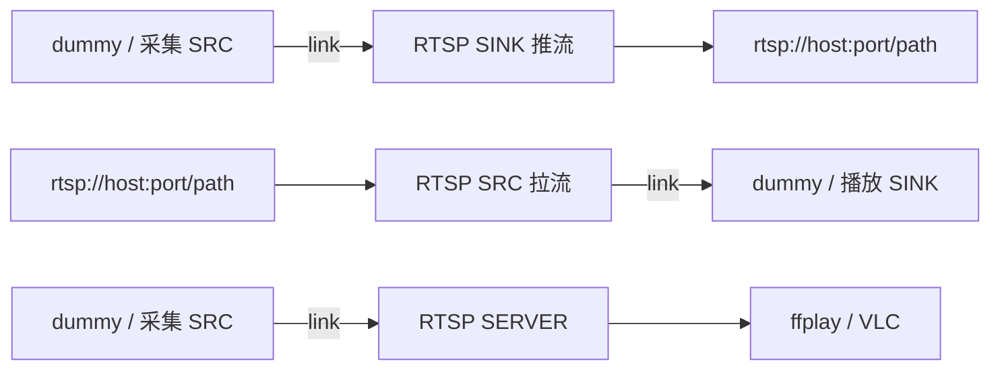
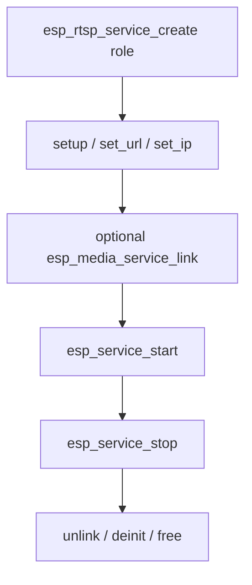

# ESP RTSP Service

- [](https://components.espressif.com/components/espressif/esp_rtsp_service)
- [English](./README.md)

RTSP 服务是 `esp_rtsp` 的高层封装：与采集、dummy 或播放服务链接即可，无需由应用直接处理 RTSP 会话和音视频帧管线。

支持三种角色：

- **Server** — 接收链接的基本音视频帧，并向一个远端 RTSP 客户端提供服务
- **推流端（SINK）** — 将链接的音视频发布到 RTSP 服务器
- **拉流端（SRC）** — 播放 RTSP URL 并输出接收到的音视频

## 功能

- 基于 URL 配置（`rtsp://`）
- 支持 UDP 与 TCP 交错传输
- 支持 H264 / MJPEG 视频与 AAC / G.711 音频，实际能力取决于对端
- 一个服务实例对应一种角色：SERVER、SRC（拉流）或 SINK（推流）
- 使用媒体服务链接，无需应用直接管理帧回调
- 可通过 `esp_service_scheduler` 覆盖线程资源

## 数据流



简要规则：

- SINK 与 SERVER 消费基本音视频帧，不接收容器字节流
- SRC 输出基本帧供链接的 sink 使用
- 先启动消费端 sink，再启动生产端 source
- SERVER 当前仅服务一个远端拉流端
- RTSP 推流目标必须支持 `ANNOUNCE`、`SETUP` 与 `RECORD`

## 调用顺序



## 典型用法

### 推流端（SINK）

```c
esp_rtsp_service_cfg_t cfg = ESP_RTSP_SERVICE_CFG_DEFAULT(ESP_RTSP_SERVICE_ROLE_SINK);
esp_rtsp_service_t *rtsp = NULL;
ESP_ERROR_CHECK(esp_rtsp_service_create(&cfg, &rtsp));
esp_rtsp_service_setup_t setup = ESP_RTSP_SERVICE_SETUP_DEFAULT();
ESP_ERROR_CHECK(esp_rtsp_service_setup(rtsp, &setup));
ESP_ERROR_CHECK(esp_rtsp_service_set_url(rtsp, "rtsp://192.168.1.10:8554/live"));
ESP_ERROR_CHECK(esp_media_service_link(ESP_SERVICE_BASE(src), ESP_MEDIA_DEFAULT_STREAM,
                                       ESP_SERVICE_BASE(rtsp), ESP_MEDIA_DEFAULT_STREAM));
ESP_ERROR_CHECK(esp_service_start(ESP_SERVICE_BASE(rtsp)));
ESP_ERROR_CHECK(esp_service_start(ESP_SERVICE_BASE(src)));
```

### 拉流端（SRC）

```c
esp_rtsp_service_cfg_t cfg = ESP_RTSP_SERVICE_CFG_DEFAULT(ESP_RTSP_SERVICE_ROLE_SRC);
esp_rtsp_service_t *rtsp = NULL;
ESP_ERROR_CHECK(esp_rtsp_service_create(&cfg, &rtsp));
esp_rtsp_service_setup_t setup = ESP_RTSP_SERVICE_SETUP_DEFAULT();
ESP_ERROR_CHECK(esp_rtsp_service_setup(rtsp, &setup));
ESP_ERROR_CHECK(esp_rtsp_service_set_url(rtsp, "rtsp://192.168.1.10:8554/live"));
ESP_ERROR_CHECK(esp_media_service_link(ESP_SERVICE_BASE(rtsp), ESP_MEDIA_DEFAULT_STREAM,
                                       ESP_SERVICE_BASE(sink), ESP_MEDIA_DEFAULT_STREAM));
ESP_ERROR_CHECK(esp_service_start(ESP_SERVICE_BASE(sink)));
ESP_ERROR_CHECK(esp_service_start(ESP_SERVICE_BASE(rtsp)));
```

### 服务器

```c
esp_rtsp_service_cfg_t cfg = ESP_RTSP_SERVICE_CFG_DEFAULT(ESP_RTSP_SERVICE_ROLE_SERVER);
esp_rtsp_service_t *rtsp = NULL;
ESP_ERROR_CHECK(esp_rtsp_service_create(&cfg, &rtsp));
ESP_ERROR_CHECK(esp_rtsp_service_set_url(rtsp, "rtsp://0.0.0.0:554/live"));
ESP_ERROR_CHECK(esp_rtsp_service_set_ip(rtsp, "192.168.1.10"));  /* 可选；未设置则为 0.0.0.0 */
ESP_ERROR_CHECK(esp_media_service_link(ESP_SERVICE_BASE(src), ESP_MEDIA_DEFAULT_STREAM,
                                       ESP_SERVICE_BASE(rtsp), ESP_MEDIA_DEFAULT_STREAM));
ESP_ERROR_CHECK(esp_service_start(ESP_SERVICE_BASE(rtsp)));
ESP_ERROR_CHECK(esp_service_start(ESP_SERVICE_BASE(src)));
```

远端播放器使用 `rtsp://<device-ip>:554/live`。

## 配置与 URL

`esp_rtsp_service_setup()` 用于配置服务器端口、客户端传输方式、SRC 轨道偏好、接收缓存大小以及 RTP 帧缓冲（`aud_frame_size` / `vid_frame_size`）。这些大小为 0 时使用默认值（音频 4 KB，视频 64 KB）。SINK 与 SERVER 在启动时从链接的 provider 获取启用轨道及编解码信息。

启动前必须调用 `esp_rtsp_service_set_url()`。本地 IP 用 `esp_rtsp_service_set_ip()` 设置，不会从 URL 解析；未设置时协议栈使用 `0.0.0.0`。本地服务器通常使用 `rtsp://0.0.0.0:554/live`；setup 端口为零时使用 554。

## 调度器

| 角色 | 线程名宏 | 默认名称 |
| --- | --- | --- |
| SINK | `ESP_RTSP_SERVICE_PUSH_TASK_NAME` | `rtsp_push` |
| SRC | `ESP_RTSP_SERVICE_SRC_TASK_NAME` | `rtsp_src` |
| SERVER | `ESP_RTSP_SERVICE_SERVER_TASK_NAME` | `rtsp_server` |

在 `esp_service_scheduler_set_cb()` 中匹配 create 时的 `name` 和工作线程名。

## 配置项

角色编译开关为 `ESP_RTSP_SERVICE_SRC_SUPPORT`、`ESP_RTSP_SERVICE_SINK_SUPPORT` 与 `ESP_RTSP_SERVICE_SERVER_SUPPORT`。

## 事件

通过 `ESP_SERVICE_BASE(rtsp)` 调用 `esp_service_event_subscribe()` 订阅。原生 RTSP 会话状态会映射为 `ESP_RTSP_SERVICE_EVENT_OPTIONS` 至 `ESP_RTSP_SERVICE_EVENT_TEARDOWN`，载荷 `esp_rtsp_service_event_payload_t` 包含服务角色与映射后的状态。客户端推流成功时发布 `RECORD`，即使底层协议回调报告为 `PLAY`。

基础生命周期转换仍使用 `ESP_SERVICE_EVENT_STATE_CHANGED`。

## 注意事项

- `setup`、`set_url` 与 `set_ip` 要求服务处于停止状态
- 启动 SINK 或 SERVER 前先链接 provider，确保轨道信息可用
- 销毁时先停止生产端，再停止对应的消费服务
- 最后调用 `esp_media_service_deinit()`，再释放服务句柄

## 示例

推流、拉流、服务器、控制台、Wi-Fi 重连及 MCP UART 演示见 [`examples/rtsp_service`](./examples/rtsp_service/README_CN.md)。

## MCP 工具

当 `CONFIG_ESP_RTSP_SERVICE_MCP_ENABLE=y`（依赖 `CONFIG_ESP_MCP_ENABLE`）时：

- 配置 / 控制工具覆盖 `setup`、`set_url`、`set_ip`、`start` 与 `stop`
- 通过 `esp_rtsp_service_mcp_schema_get()` 与 `esp_rtsp_service_tool_invoke()` 注册
- 媒体 link / unlink 仍属于 `esp_media_service` MCP；媒体帧不会经过 MCP

UART 验证请参见例程中的 MCP 操作指南。

## 技术支持

- 技术支持：[esp32.com](https://esp32.com/viewforum.php?f=20) 论坛
- 问题反馈与功能请求：[GitHub issue](https://github.com/espressif/esp-adf/issues)
