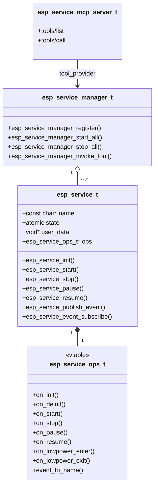
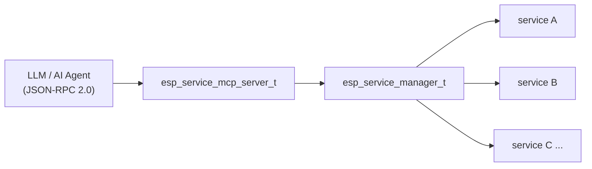
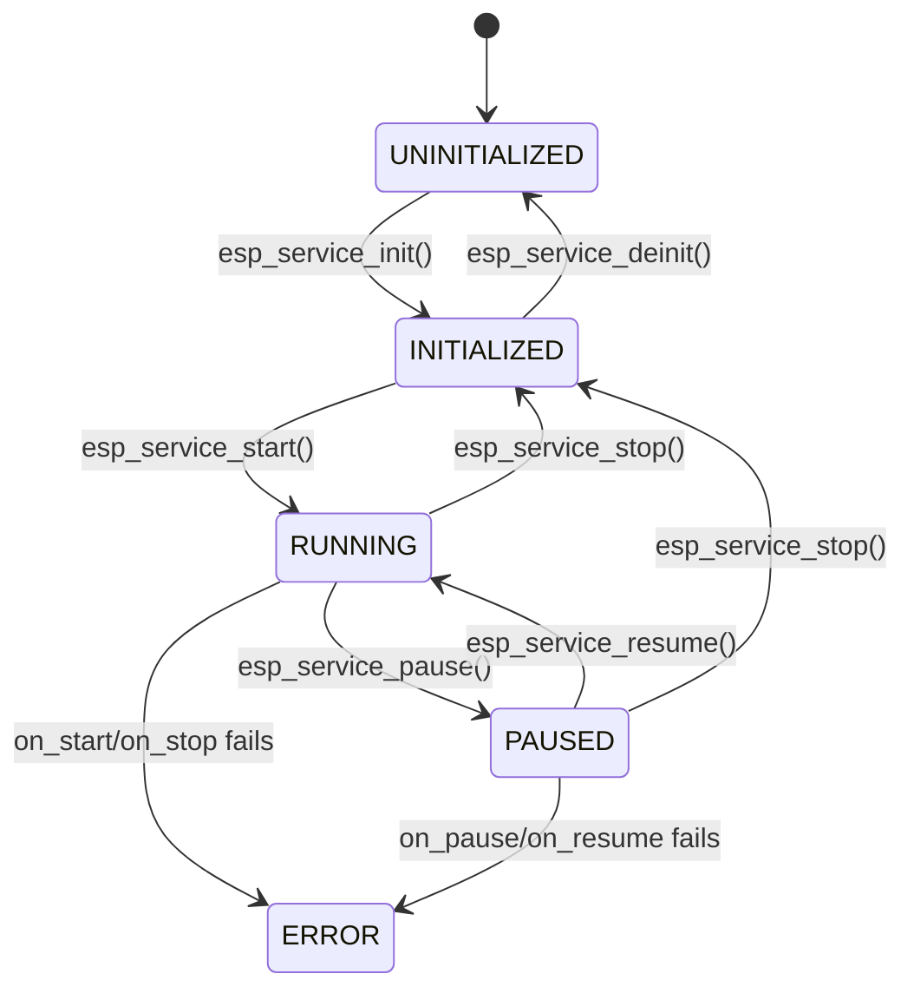

# ESP Service

[中文版](./README_CN.md)

**ESP Service** is a three-layer service infrastructure for ESP-IDF. It provides `esp_service_t` as the base class for services built on this layer, `esp_service_manager` as a dynamic registry that auto-discovers JSON-schema tools, and an optional MCP (Model Context Protocol) server that exposes those tools over HTTP, SSE, WebSocket, UART, STDIO, or SDIO — enabling direct invocation by LLMs and AI agents.

## Key Features

- **Lifecycle state machine** — `UNINITIALIZED → INITIALIZED → RUNNING ⇄ PAUSED`; all transitions are synchronous in the caller's task context
- **Vtable-based subclassing** — derived services fill in `esp_service_ops_t` function pointers and embed `esp_service_t` as their first member
- **Event Hub integration** — each service owns an `adf_event_hub_t`; use `esp_service_publish_event()` / `esp_service_event_subscribe()` for publish-subscribe domain events
- **Low-power hooks** — `on_lowpower_enter` / `on_lowpower_exit` ops are direct callbacks with no state change; suitable for suspending radios, LEDs, and clocks
- **Dynamic service registry** — `esp_service_manager` registers / unregisters services at runtime, supports batch `start_all` / `stop_all`, and looks up services by name or category
- **Automatic tool discovery** — the manager parses a JSON array at registration time and makes all described tools available via `esp_service_manager_invoke_tool()`
- **MCP server (optional)** — implements MCP 2024-11-05 (`tools/list`, `tools/call`, `notifications/tools/list_changed`) over a pluggable transport; enable with `CONFIG_ESP_MCP_ENABLE=y`
- **Multiple transports** — HTTP, SSE, WebSocket, UART, STDIO, and SDIO; each is an independent Kconfig option
- **Thread-safe** — service manager and MCP server internals are mutex-protected; `esp_service_t::state` is atomic for lock-free reads from any task

## Architecture



The three layers are independent — use only `esp_service_t` for a minimal service, add the manager for orchestration, and optionally attach the MCP server for AI-agent access.



## Service State Machine



Low-power hooks (`esp_service_lowpower_enter()` / `esp_service_lowpower_exit()`) do **not** change state — they call `on_lowpower_enter` / `on_lowpower_exit` directly.

## Quick Start — Subclassing

Embed `esp_service_t` as the first member, fill in `esp_service_ops_t`, call `esp_service_init()`:

```c
typedef struct {
    esp_service_t base;  /* must be first */
    /* ... derived fields ... */
} my_service_t;

static esp_err_t my_on_start(esp_service_t *base)
{
    my_service_t *svc = (my_service_t *)base;
    /* spawn background task, enable hardware, etc. */
    return ESP_OK;
}

static const esp_service_ops_t s_my_ops = {
    .on_start = my_on_start,
    .on_stop  = my_on_stop,
};

esp_err_t my_service_create(my_service_t **out_svc)
{
    my_service_t *svc = calloc(1, sizeof(*svc));
    if (!svc) { return ESP_ERR_NO_MEM; }
    esp_service_config_t cfg = { .name = "my_service" };
    ESP_ERROR_CHECK(esp_service_init(&svc->base, &cfg, &s_my_ops));
    *out_svc = svc;
    return ESP_OK;
}
```

See [`esp_ota_service`](../esp_ota_service/), [`esp_button_service`](../esp_button_service/), and [`esp_cli_service`](../esp_cli_service/) for complete subclass examples.

## Events

### Lifecycle Event

The base layer publishes `ESP_SERVICE_EVENT_STATE_CHANGED` automatically on every successful state transition. Its ID is `UINT16_MAX - 1`; derived services must not use `UINT16_MAX` (wildcard) or `UINT16_MAX - 1`.

| Event | Payload | When |
|-------|---------|------|
| `ESP_SERVICE_EVENT_STATE_CHANGED` | `esp_service_state_changed_payload_t` (`old_state`, `new_state`) | Any lifecycle transition |

### Domain Events (Subclass Pattern)

Domain events (OTA progress, button press, etc.) are published through the same event hub using `esp_service_publish_event()`. The pattern used across all services built on this layer:

1. Define an event ID enum in the public header (start from `1`; values `UINT16_MAX` and `UINT16_MAX-1` are reserved)
2. Define an event payload struct
3. Call `esp_service_publish_event()` from the service task whenever an event occurs
4. Callers subscribe with `esp_service_event_subscribe()`

```c
/* 1. Event IDs (in my_service.h) */
typedef enum {
    MY_EVENT_DONE  = 1,
    MY_EVENT_ERROR = 2,
} my_event_id_t;

/* 2. Payload */
typedef struct {
    my_event_id_t id;
    esp_err_t     error;
} my_event_t;

/* 3. Publish (inside service task) */
my_event_t *pl = malloc(sizeof(*pl));
pl->id    = MY_EVENT_DONE;
pl->error = ESP_OK;
esp_service_publish_event(&svc->base, MY_EVENT_DONE, pl, sizeof(*pl),
                          (adf_event_payload_release_cb_t)free, NULL);

/* 4. Subscribe (caller side) */
adf_event_subscribe_info_t sub = ADF_EVENT_SUBSCRIBE_INFO_DEFAULT();
sub.handler = on_my_event;
esp_service_event_subscribe((esp_service_t *)svc, &sub);
```

> **Payload ownership:** after `esp_service_publish_event()` returns, the caller must not access `pl` — `release_cb` (here `free`) is called exactly once on every path, including error paths.

## Service Manager

### Configuration

Initialize with `ESP_SERVICE_MANAGER_CONFIG_DEFAULT()` and override only what you need.

| Field | Type | Description | Default |
|-------|------|-------------|---------|
| `max_services` | `uint16_t` | Maximum registered services | `16` |
| `max_tools_per_service` | `uint16_t` | Maximum tools parsed from one JSON descriptor | `32` |
| `auto_start_services` | `bool` | Start each service immediately on registration | `false` |

### Registration

| Field | Type | Description |
|-------|------|-------------|
| `service` | `esp_service_t *` | Service instance. Required. |
| `category` | `const char *` | Category string for `find_by_category` queries (e.g. `"audio"`). |
| `flags` | `uint32_t` | `ESP_SERVICE_REG_FLAG_SKIP_BATCH_START/STOP` to exclude from batch ops. |
| `tool_desc` | `const char *` | JSON array of MCP tool definitions. `NULL` = lifecycle-only. |
| `tool_invoke` | `esp_service_tool_invoke_fn_t` | C dispatch for tool calls. Required when `tool_desc` is set. |

### Tool Description Format

```json
[
  {
    "name": "player_service_play",
    "description": "Start audio playback",
    "inputSchema": { "type": "object", "properties": {} }
  },
  {
    "name": "player_service_set_volume",
    "description": "Set playback volume (0–100)",
    "inputSchema": {
      "type": "object",
      "properties": {
        "volume": { "type": "integer", "minimum": 0, "maximum": 100 }
      },
      "required": ["volume"]
    }
  }
]
```

## Optional Features

### MCP Server (`CONFIG_ESP_MCP_ENABLE=y`)

Implements MCP 2024-11-05 over a pluggable transport. Connect it to the manager via `esp_service_manager_as_tool_provider()`.

| Field | Type | Description |
|-------|------|-------------|
| `transport` | `esp_service_mcp_trans_t *` | Pre-created transport instance. Required. |
| `tool_provider` | `esp_service_mcp_tool_provider_t` | Populated by `esp_service_manager_as_tool_provider()`. |
| `server_name` | `const char *` | Server identity string in MCP `initialize` response. |
| `server_version` | `const char *` | Server version string. |

### Available Transports

| Transport | Kconfig | Header |
|-----------|---------|--------|
| HTTP (`POST /mcp`) | `CONFIG_ESP_MCP_TRANSPORT_HTTP` | `esp_service_mcp_trans_http.h` |
| SSE (streaming) | `CONFIG_ESP_MCP_TRANSPORT_SSE` | `esp_service_mcp_trans_sse.h` |
| WebSocket | `CONFIG_ESP_MCP_TRANSPORT_WS` | `esp_service_mcp_trans_ws.h` |
| UART | `CONFIG_ESP_MCP_TRANSPORT_UART` | `esp_service_mcp_trans_uart.h` |
| STDIO | `CONFIG_ESP_MCP_TRANSPORT_STDIO` | `esp_service_mcp_trans_stdio.h` |
| SDIO | `CONFIG_ESP_MCP_TRANSPORT_SDIO` | `esp_service_mcp_trans_sdio.h` |

## Typical Scenarios

- **Service base only** — implement `esp_service_ops_t` and embed `esp_service_t` to get lifecycle management and event publishing without any manager or MCP overhead
- **Runtime service orchestration** — register multiple services with `esp_service_manager` and drive them through `start_all` / `stop_all`; the CLI service uses the manager for its `svc` commands
- **LLM tool gateway** — attach an MCP server to the manager so that any service with a JSON tool description becomes directly callable by an LLM or AI agent over HTTP/WebSocket/UART
- **Offline / embedded AI agent** — use UART or SDIO transport to connect a host-side model to device services without a network stack

## Example Projects

- [`components/esp_service/examples/mock_services/`](examples/mock_services/) — service manager + all MCP transport variants with host-side Python test scripts
- [`adf_examples/services_hub/`](../../adf_examples/services_hub/) — production-style multi-service setup (Wi-Fi + OTA + CLI + button) with `esp_board_manager` and optional MCP integration
