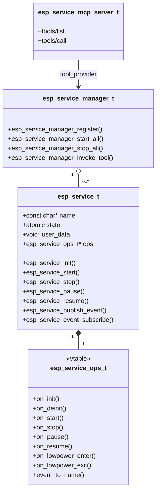
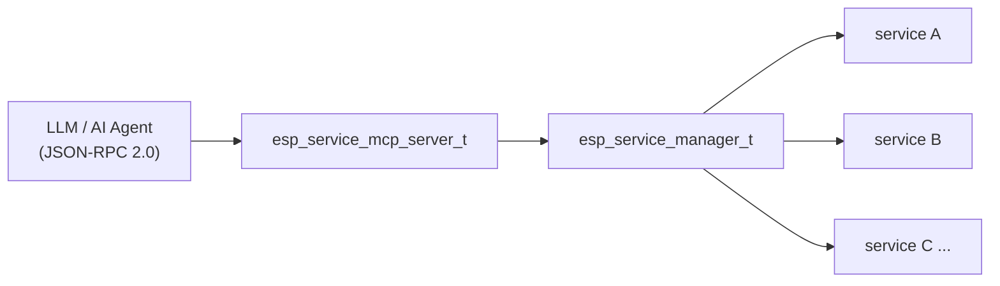
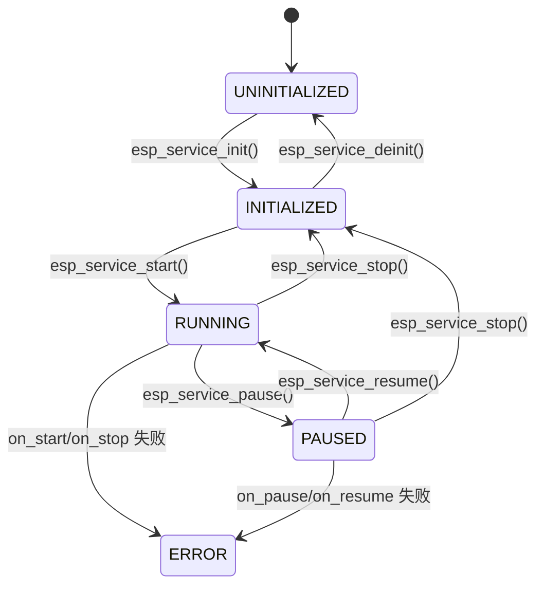

# ESP Service

[English](./README.md)

**ESP Service** 是面向 ESP-IDF 的三层服务基础设施。它提供 `esp_service_t` 作为基于该层实现的所有服务的基类，`esp_service_manager` 作为能自动发现 JSON-schema 工具的动态注册中心，以及可选的 MCP（Model Context Protocol）服务器——通过 HTTP、SSE、WebSocket、UART、STDIO 或 SDIO 将这些工具暴露出去，供 LLM 和 AI Agent 直接调用。

## 主要特性

- **生命周期状态机** — `UNINITIALIZED → INITIALIZED → RUNNING ⇄ PAUSED`；所有转换均在调用方任务上下文中同步执行
- **基于 vtable 的子类化** — 派生服务填充 `esp_service_ops_t` 函数指针，并将 `esp_service_t` 作为第一个成员嵌入
- **事件总线集成** — 每个服务拥有一个 `adf_event_hub_t`；通过 `esp_service_publish_event()` / `esp_service_event_subscribe()` 实现发布-订阅模式的领域事件
- **低功耗钩子** — `on_lowpower_enter` / `on_lowpower_exit` 是直接回调，不改变状态；适用于挂起无线电、LED 和时钟
- **动态服务注册中心** — `esp_service_manager` 支持运行时注册/注销服务，批量 `start_all` / `stop_all`，以及按名称或类别查找服务
- **自动工具发现** — 管理器在注册时解析 JSON 数组，所有描述的工具均可通过 `esp_service_manager_invoke_tool()` 调用
- **MCP 服务器（可选）** — 实现 MCP 2024-11-05（`tools/list`、`tools/call`、`notifications/tools/list_changed`），通过可插拔传输层对外暴露；需启用 `CONFIG_ESP_MCP_ENABLE=y`
- **多种传输方式** — HTTP、SSE、WebSocket、UART、STDIO、SDIO；每种均为独立的 Kconfig 选项
- **线程安全** — 服务管理器和 MCP 服务器内部由互斥锁保护；`esp_service_t::state` 为原子变量，可在任意任务中无锁读取

## 架构



三层相互独立——仅使用 `esp_service_t` 可实现最小服务，加入管理器用于编排，可选地挂载 MCP 服务器以供 AI Agent 访问。



## 服务状态机



低功耗钩子（`esp_service_lowpower_enter()` / `esp_service_lowpower_exit()`）**不改变**状态——它们直接调用 `on_lowpower_enter` / `on_lowpower_exit`。

## 快速开始——子类化

将 `esp_service_t` 作为第一个成员嵌入，填充 `esp_service_ops_t`，调用 `esp_service_init()`：

```c
typedef struct {
    esp_service_t base;  /* 必须是第一个成员 */
    /* ... 派生字段 ... */
} my_service_t;

static esp_err_t my_on_start(esp_service_t *base)
{
    my_service_t *svc = (my_service_t *)base;
    /* 创建后台任务、使能硬件等 */
    return ESP_OK;
}

static const esp_service_ops_t s_my_ops = {
    .on_start = my_on_start,
    .on_stop  = my_on_stop,
};

esp_err_t my_service_create(my_service_t **out_svc)
{
    my_service_t *svc = calloc(1, sizeof(*svc));
    if (!svc) { return ESP_ERR_NO_MEM; }
    esp_service_config_t cfg = { .name = "my_service" };
    ESP_ERROR_CHECK(esp_service_init(&svc->base, &cfg, &s_my_ops));
    *out_svc = svc;
    return ESP_OK;
}
```

完整子类示例参见 [`esp_ota_service`](../esp_ota_service/)、[`esp_button_service`](../esp_button_service/) 和 [`esp_cli_service`](../esp_cli_service/)。

## 事件

### 生命周期事件

基类在每次成功状态转换时自动发布 `ESP_SERVICE_EVENT_STATE_CHANGED`，其 ID 为 `UINT16_MAX - 1`；派生服务不得使用 `UINT16_MAX`（通配符）或 `UINT16_MAX - 1`。

| 事件 | 载荷 | 触发时机 |
|------|------|----------|
| `ESP_SERVICE_EVENT_STATE_CHANGED` | `esp_service_state_changed_payload_t`（`old_state`、`new_state`） | 任意生命周期转换 |

### 领域事件（子类模式）

领域事件（OTA 进度、按键按下等）通过同一事件总线，使用 `esp_service_publish_event()` 发布。所有基于本层实现的服务遵循的统一模式：

1. 在公共头文件中定义事件 ID 枚举（从 `1` 开始；`UINT16_MAX` 和 `UINT16_MAX-1` 为保留值）
2. 定义事件载荷结构体
3. 在服务任务中事件发生时调用 `esp_service_publish_event()`
4. 调用方通过 `esp_service_event_subscribe()` 订阅

```c
/* 1. 事件 ID（在 my_service.h 中） */
typedef enum {
    MY_EVENT_DONE  = 1,
    MY_EVENT_ERROR = 2,
} my_event_id_t;

/* 2. 载荷 */
typedef struct {
    my_event_id_t id;
    esp_err_t     error;
} my_event_t;

/* 3. 发布（在服务任务内部） */
my_event_t *pl = malloc(sizeof(*pl));
pl->id    = MY_EVENT_DONE;
pl->error = ESP_OK;
esp_service_publish_event(&svc->base, MY_EVENT_DONE, pl, sizeof(*pl),
                          (adf_event_payload_release_cb_t)free, NULL);

/* 4. 订阅（调用方侧） */
adf_event_subscribe_info_t sub = ADF_EVENT_SUBSCRIBE_INFO_DEFAULT();
sub.handler = on_my_event;
esp_service_event_subscribe((esp_service_t *)svc, &sub);
```

> **载荷所有权：** `esp_service_publish_event()` 返回后，调用方不得再访问 `pl`——`release_cb`（此处为 `free`）在所有路径（包括错误路径）上均只调用一次。

## 服务管理器

### 配置

使用 `ESP_SERVICE_MANAGER_CONFIG_DEFAULT()` 初始化，按需覆盖字段。

| 字段 | 类型 | 说明 | 默认值 |
|------|------|------|--------|
| `max_services` | `uint16_t` | 最大注册服务数 | `16` |
| `max_tools_per_service` | `uint16_t` | 单个服务 JSON 描述中可解析的最大工具数 | `32` |
| `auto_start_services` | `bool` | 注册时立即启动服务 | `false` |

### 注册信息

| 字段 | 类型 | 说明 |
|------|------|------|
| `service` | `esp_service_t *` | 服务实例，必填 |
| `category` | `const char *` | 类别字符串，用于 `find_by_category` 查询（如 `"audio"`） |
| `flags` | `uint32_t` | `ESP_SERVICE_REG_FLAG_SKIP_BATCH_START/STOP`：将服务排除在批量操作之外 |
| `tool_desc` | `const char *` | MCP 工具定义 JSON 数组；`NULL` = 仅生命周期管理 |
| `tool_invoke` | `esp_service_tool_invoke_fn_t` | 工具调用 C 分发函数；设置 `tool_desc` 时必填 |

### 工具描述格式

```json
[
  {
    "name": "player_service_play",
    "description": "Start audio playback",
    "inputSchema": { "type": "object", "properties": {} }
  },
  {
    "name": "player_service_set_volume",
    "description": "Set playback volume (0–100)",
    "inputSchema": {
      "type": "object",
      "properties": {
        "volume": { "type": "integer", "minimum": 0, "maximum": 100 }
      },
      "required": ["volume"]
    }
  }
]
```

## 可选功能

### MCP 服务器（`CONFIG_ESP_MCP_ENABLE=y`）

实现 MCP 2024-11-05，通过可插拔传输层对外暴露。通过 `esp_service_manager_as_tool_provider()` 将其与管理器连接。

| 字段 | 类型 | 说明 |
|------|------|------|
| `transport` | `esp_service_mcp_trans_t *` | 预先创建的传输实例，必填 |
| `tool_provider` | `esp_service_mcp_tool_provider_t` | 由 `esp_service_manager_as_tool_provider()` 填充 |
| `server_name` | `const char *` | MCP `initialize` 响应中的服务器标识字符串 |
| `server_version` | `const char *` | 服务器版本字符串 |

### 可用传输方式

| 传输方式 | Kconfig | 头文件 |
|----------|---------|--------|
| HTTP（`POST /mcp`） | `CONFIG_ESP_MCP_TRANSPORT_HTTP` | `esp_service_mcp_trans_http.h` |
| SSE（流式） | `CONFIG_ESP_MCP_TRANSPORT_SSE` | `esp_service_mcp_trans_sse.h` |
| WebSocket | `CONFIG_ESP_MCP_TRANSPORT_WS` | `esp_service_mcp_trans_ws.h` |
| UART | `CONFIG_ESP_MCP_TRANSPORT_UART` | `esp_service_mcp_trans_uart.h` |
| STDIO | `CONFIG_ESP_MCP_TRANSPORT_STDIO` | `esp_service_mcp_trans_stdio.h` |
| SDIO | `CONFIG_ESP_MCP_TRANSPORT_SDIO` | `esp_service_mcp_trans_sdio.h` |

## 典型应用场景

- **仅使用服务基类** — 实现 `esp_service_ops_t` 并嵌入 `esp_service_t`，即可获得生命周期管理和事件发布能力，无需引入管理器或 MCP 的额外开销
- **运行时服务编排** — 通过 `esp_service_manager` 注册多个服务，用 `start_all` / `stop_all` 统一驱动；CLI 服务使用管理器实现其 `svc` 命令
- **LLM 工具网关** — 将 MCP 服务器挂载到管理器上，任何注册了 JSON 工具描述的服务都可以通过 HTTP/WebSocket/UART 被 LLM 或 AI Agent 直接调用
- **离线/嵌入式 AI Agent** — 通过 UART 或 SDIO 传输将主机侧模型连接到设备服务，无需网络栈

## 示例工程

- [`components/esp_service/examples/mock_services/`](examples/mock_services/) — 服务管理器 + 所有 MCP 传输变体，附主机侧 Python 测试脚本
- [`adf_examples/services_hub/`](../../adf_examples/services_hub/) — 生产风格的多服务组合（Wi-Fi + OTA + CLI + Button），集成 `esp_board_manager`，支持可选的 MCP 接入
