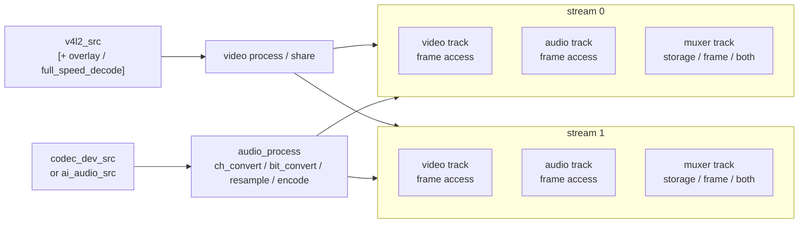
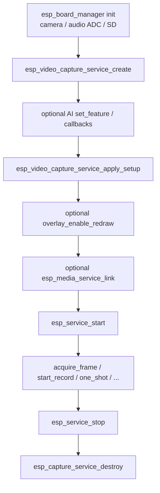

# ESP Video Capture Service

- [](https://components.espressif.com/components/espressif/esp_video_capture_service)
- [中文版](./README_CN.md)

`esp_video_capture_service` is a board-aware **video (A/V) recorder** built on top of [`esp_capture_service`](../esp_capture_service/README.md). It discovers the board camera and audio codec through `esp_board_manager`, prepares a V4L2 video source and an attached audio capture context, applies a stream / overlay / muxer setup, and reuses the full `esp_capture_service` runtime surface.

The returned handle is a standard `esp_capture_service_t *`. After creation you use the normal `esp_capture_service` / `esp_media_service` / `esp_service` APIs to start, stop, link, read, and record. AI audio APIs from [`esp_audio_capture_service`](../esp_audio_capture_service/README.md) can be used directly on the same handle.

> The default V4L2 camera source is intended for **ESP32-P4** (and other targets that expose a board camera through V4L2). On unsupported camera setups, apply_setup returns `ESP_ERR_NOT_FOUND` / `ESP_ERR_NOT_SUPPORTED`.

## Features

- Discovers the board camera through `esp_board_manager` and opens it as a V4L2 source
- Attaches an audio capture context so the same handle can record A/V or enable AI audio features
- Configures up to two output streams with independent video / audio codecs, enable state, and muxers
- Optional source-side **text overlay** (camera type and / or date-time), including shared overlay for multi-stream capture
- Optional full-speed decode before re-encode on the source path (for compressed camera formats such as UVC MJPEG / H.264)
- Reuses all `esp_capture_service` runtime features: multi-stream output, storage muxers, manual record, frame pull, one-shot, and service linking

> Initialize board devices with `esp_board_manager` **before** calling these APIs.

## Data Flow

Video and optional audio sources are processed once, then fan out into one or more **streams**. A stream is a **group of tracks**; each track is the export / frame-access point. Disable a stream or a single track when you do not need that data.



Short rules:

- **Video source**: board V4L2 camera; optional shared overlay and full-speed decode sit on the source path before fan-out
- **Audio source**: same model as audio capture (`codec_dev_src` or `ai_audio_src`)
- **Stream**: a group of video / audio / muxer tracks. Toggle the whole group with `esp_capture_service_enable_stream()`
- **Track**: frame access point for elementary A/V, and also for muxer output when enabled
  - Video / audio tracks: pull / link elementary frames. Disable them with `esp_capture_service_enable_track()` when you do not need to fetch that data
  - Muxer track: can be **storage only**, **frame only**, or **both**, controlled by `storage_dir` / `auto_record` and `streaming` in `esp_capture_service_muxer_cfg_t`
  - Special case: containers that support streaming (for example **TS** / **FLV**) can expose muxed packets as frame-accessible output when `streaming` is set; non-streaming containers ignore `streaming` and are typically storage-oriented

## Call Sequence



## Typical Usage

```c
#include "esp_video_capture_service.h"
#include "esp_video_capture_service_setup.h"
#include "esp_capture_service_ops.h"
#include "esp_service.h"

/* Board devices must be initialized first (esp_board_manager). */

esp_video_capture_service_cfg_t cfg = {
    .audio_dev_name = NULL,   /* NULL uses default board audio ADC when audio is configured */
    .video_dev_name = NULL,   /* NULL uses default board camera */
    .max_stream_num = 1,
};
esp_capture_service_t *capture = NULL;
ESP_ERROR_CHECK(esp_video_capture_service_create(&cfg, &capture));

esp_video_capture_service_setup_t setup = {
    .stream_num = 1,
    .fixed_src_sample_rate = 16000,
    .streams[0] = {
        .enabled = true,
        .video_info = {
            .codec = ESP_CAPTURE_FMT_ID_H264,
            .width = 1280,
            .height = 720,
            .fps = 15,
        },
        .audio_info = {
            .codec = ESP_CAPTURE_FMT_ID_AAC,
            .sample_rate = 16000,
            .bits_per_sample = 16,
            .channel = 1,
            .bitrate = 64000,
        },
    },
};
ESP_ERROR_CHECK(esp_video_capture_service_apply_setup(capture, &setup));

esp_service_t *base = ESP_SERVICE_BASE(capture);
ESP_ERROR_CHECK(esp_service_start(base));

esp_capture_service_set_storage_url(capture, ESP_MEDIA_DEFAULT_STREAM, "/sdcard/clip.mp4");
esp_capture_service_start_record(capture, ESP_MEDIA_DEFAULT_STREAM);
/* ... record ... */
esp_capture_service_stop_record(capture, ESP_MEDIA_DEFAULT_STREAM);

esp_service_stop(base);
esp_capture_service_destroy(capture);
```

### Pulling Encoded Frames

```c
esp_media_frame_t frame = { .type = ESP_MEDIA_TRACK_TYPE_VIDEO };
if (esp_capture_service_acquire_frame(capture, 0, &frame, 1000) == ESP_OK) {
    /* ... handle encoded video (H264 / MJPEG / RGB565) ... */
    esp_capture_service_release_frame(capture, 0, &frame);
}
```

### Streaming Via Linking

```c
esp_service_t *capture_base = ESP_SERVICE_BASE(capture);
esp_media_service_link(capture_base, ESP_MEDIA_DEFAULT_STREAM, sink_base, sink_stream);
esp_service_start(sink_base);
esp_service_start(capture_base);
```

### AI Audio On The Same Handle

```c
uint32_t features = ESP_AUDIO_CAPTURE_SERVICE_AI_FEATURE_AEC |
                    ESP_AUDIO_CAPTURE_SERVICE_AI_FEATURE_VAD;
esp_capture_service_ai_audio_src_feature_cfg_t feature_cfg = {0};
ESP_ERROR_CHECK(esp_capture_service_ai_audio_src_set_feature(capture, features, &feature_cfg));
/* then call esp_video_capture_service_apply_setup() with audio_info filled */
```

## Setup

Applied through `esp_video_capture_service_setup_t`:

```c
typedef struct {
    bool                            enabled;     /* stream run-state after setup */
    esp_media_audio_info_t          audio_info;  /* add audio track when codec is non-zero */
    esp_media_video_info_t          video_info;  /* add video track when codec is non-zero */
    esp_capture_service_muxer_cfg_t muxer_info;  /* storage / streaming muxer */
} esp_video_capture_service_stream_cfg_t;

typedef struct {
    uint16_t                                stream_num;             /* 1..ESP_VIDEO_CAPTURE_SERVICE_MAX_STREAM_NUM (2) */
    esp_video_capture_service_stream_cfg_t  streams[...];
    uint8_t                                 fb_num;                 /* V4L2 buffer count; 0 uses Kconfig */
    esp_video_capture_service_overlay_cfg_t overlay;
    uint32_t                                fixed_src_sample_rate;  /* pin raw audio rate; 0 keeps default */
    esp_capture_audio_src_if_t             *audio_src;              /* NULL selects attached codec / AI source */
    esp_capture_video_src_if_t             *video_src;              /* NULL selects default V4L2 source */
    bool                                    share_overlay;         /* one overlay mixer for all sinks */
    bool                                    full_speed_decode;     /* decode ahead of re-encode on source path */
} esp_video_capture_service_setup_t;
```

Notes:

- Setup may be re-applied any number of times **before** start; an existing capture state is torn down and recreated. Applying while running is rejected.
- A **disabled stream is still configured** (tracks are added) but is explicitly disabled after setup. Enable it later with `esp_capture_service_enable_stream()`.
- Video tracks are added when `video_info.codec` is non-zero; audio tracks when `audio_info.codec` is non-zero. At least one media track is required.
- Typical video codecs: H264 / MJPEG / RGB565. Typical audio codecs: AAC / G711A / PCM. Storage containers: MP4 / TS / FLV.

### Overlay

```c
typedef struct {
    bool        enabled;           /* enable text overlay on the video source path */
    bool        show_camera_type;  /* draw camera-type text */
    bool        show_datetime;     /* draw build / current date-time text */
    const char *camera_type;       /* NULL uses default "Espressif" */
} esp_video_capture_service_overlay_cfg_t;
```

- Requires `CONFIG_ESP_CAPTURE_ENABLE_VIDEO_OVERLAY=y`, and at least one painter font (for example `CONFIG_ESP_PAINTER_BASIC_FONT_24`) when drawing text.
- For dual / multi-stream capture that should share one overlay, set `share_overlay = true` together with `overlay.enabled`.
- Call `esp_video_capture_service_overlay_enable_redraw(capture, true)` after setup to refresh timestamp text about every 900 ms while running.

### Full-Speed Decode

Set `full_speed_decode = true` when the camera outputs a compressed format that sinks must re-encode (for example UVC MJPEG / H.264 → H.264 / MJPEG). Requires `CONFIG_ESP_CAPTURE_ENABLE_VIDEO_DECODER=y`. Tune `CONFIG_ESP_CAPTURE_VIDEO_DEC_OUT_POOL_SIZE` (prefer 3) for decoder output pool depth.

## Create Configuration

`esp_video_capture_service_cfg_t`:

| Field | Description |
| --- | --- |
| `audio_dev_name` | Board-manager audio ADC device name; `NULL` uses the default |
| `video_dev_name` | Board-manager camera device name; `NULL` uses the default |
| `pool` | Optional GMF pool forwarded to AI audio; `NULL` creates an internal pool on open. Caller-owned. |
| `max_stream_num` | Maximum output streams; `0` uses 1 |

> Create / destroy / setup APIs are **not thread-safe** and must be serialized by the application.

## Runtime Operations

```c
esp_capture_service_set_storage_url(capture, stream, url);
esp_capture_service_start_record(capture, stream);
esp_capture_service_stop_record(capture, stream);
esp_capture_service_one_shot(capture, stream);
esp_capture_service_acquire_frame(capture, stream, &frame, timeout_ms);
esp_capture_service_release_frame(capture, stream, &frame);
esp_video_capture_service_overlay_enable_redraw(capture, true);
```

Destroy with `esp_capture_service_destroy(capture)`. Overlay objects owned by this wrapper are cleaned up through the service deinit path.

## Optimization

Reuse the audio capture optimization methods for the audio path, then trim video encode / decode and tune related tasks with the service scheduler.

1. **Apply audio optimizations for the audio path**
   - Follow [`esp_audio_capture_service` Optimization](../esp_audio_capture_service/README.md#optimization): disable unused AI features, register only needed audio encoders / decoders / muxers, and turn off unused defaults when calling `register_default`
2. **Register only needed video encoders**
   - Enable only the codecs you actually encode to (for example H264 and / or MJPEG)
   - Prefer exact encoder registration over enabling every video encoder Kconfig option
3. **Enable video decode only when required**
   - Keep `CONFIG_ESP_CAPTURE_ENABLE_VIDEO_DECODER=n` unless you need full-speed decode / re-encode (for example UVC compressed input)
   - Likewise enable overlay Kconfig only when text overlay is used
4. **Disable unused audio / muxer pieces**
   - If the product is video-only, skip audio device init and do not configure audio tracks
   - Register only the muxers you write (MP4 / TS / FLV, etc.), or trim unused `CONFIG_ESP_MUXER_*_SUPPORT` when using `esp_muxer_register_default()`
5. **Tune all related tasks through `esp_service_scheduler`**
   - Install `esp_service_scheduler_set_cb()` and set stack / priority / core for capture threads under `ESP_CAPTURE_SERVICE_SCHEDULER_NAME` (`"esp_capture"`), such as `VID_SRC`, `venc_0`, `venc_1`, `AUD_SRC`, `aenc_0`
   - Also cover overlay redraw (`ESP_VIDEO_CAPTURE_TASK_OVL_REDRAW`) and AI audio tasks when those features are enabled
   - Prefer this over `esp_capture_set_thread_scheduler()`

See the video capture example scheduler helper for a concrete multi-task callback pattern.

## Points Of Attention

- Initialize camera (and audio ADC when recording audio) before create / setup.
- Configure AI audio features **before** `apply_setup()` when using the AI audio source.
- Always release every acquired frame before stop / destroy.
- Overlay and full-speed decode fail with `ESP_ERR_NOT_SUPPORTED` when the matching `esp_capture` Kconfig is disabled.
- Storage directories configured through the muxer are auto-created by `esp_capture_service` (maximum depth 2, for example `/sdcard/video_capture`).
- See [`esp_capture_service`](../esp_capture_service/README.md) for muxer lazy-binding, timeout semantics, and linking rules.

## Example

See [`examples/video_capture`](./examples/video_capture/README.md) for interactive video-only, A/V streaming, storage, dual-stream, overlay, AI audio, and full-speed UVC cases.

## MCP Tools

When `CONFIG_ESP_VIDEO_CAPTURE_SERVICE_MCP_ENABLE=y` (depends on `CONFIG_ESP_MCP_ENABLE`):

- Setup / control tools cover `apply_setup`, `start` / `stop`, `enable_stream`, `start_record` / `stop_record`, storage URL helpers, `overlay_enable_redraw`, and `get_status`.
- Register the capture service with a service manager using `esp_video_capture_service_mcp_schema_get()` and `esp_video_capture_service_tool_invoke()`.
- Media link / unlink and dummy-sink stats stay in `esp_media_service` MCP; frames never go over MCP.

See the `video_capture` example MCP Operation Guide for UART end-to-end verification.

## Technical Support

For technical support, use the links below:

- Technical support: [esp32.com](https://esp32.com/viewforum.php?f=20) forum
- Issue reports and feature requests: [GitHub issue](https://github.com/espressif/esp-adf/issues)

We will reply as soon as possible.
