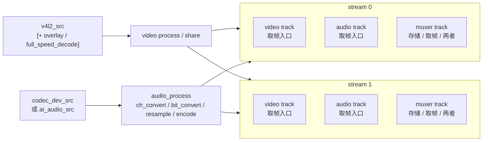
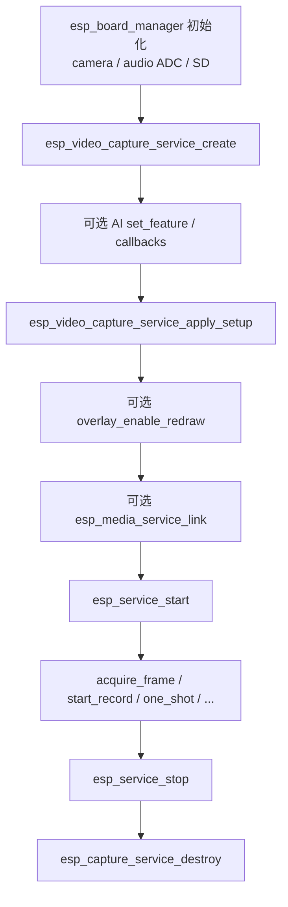

# ESP Video Capture Service

- [](https://components.espressif.com/components/espressif/esp_video_capture_service)
- [English](./README.md)

`esp_video_capture_service` 是基于 [`esp_capture_service`](../esp_capture_service/README_CN.md) 的板级**视频（A/V）录制**封装。它通过 `esp_board_manager` 发现板载摄像头与音频 codec，准备 V4L2 视频源并挂接音频采集上下文，应用 stream / overlay / muxer 配置，并完整复用 `esp_capture_service` 的运行时能力。

返回句柄为标准的 `esp_capture_service_t *`。创建后可通过常规的 `esp_capture_service` / `esp_media_service` / `esp_service` API 进行 start、stop、link、读帧与录制。同一句柄也可直接使用 [`esp_audio_capture_service`](../esp_audio_capture_service/README_CN.md) 中的 AI 音频 API。

> 默认 V4L2 摄像头源面向 **ESP32-P4**（以及其他通过 V4L2 暴露板载摄像头的目标）。在不支持的摄像头配置上，`apply_setup` 可能返回 `ESP_ERR_NOT_FOUND` / `ESP_ERR_NOT_SUPPORTED`。

## 功能

- 通过 `esp_board_manager` 发现板载摄像头，并以 V4L2 源打开
- 挂接音频采集上下文，同一句柄可录制 A/V 或启用 AI 音频功能
- 最多配置 2 路输出 stream，各自独立配置视频 / 音频编解码、启停状态与 muxer
- 可选源路径**文字叠加层**（摄像头类型和 / 或日期时间），并支持多 stream 共享叠加
- 可选在源路径上先全速解码再重编码（适用于 UVC MJPEG / H.264 等压缩摄像头格式）
- 复用 `esp_capture_service` 全部运行时能力：多 stream 输出、存储 muxer、手动录制、拉帧、one-shot 与服务链接

> 调用这些 API **之前**，请先通过 `esp_board_manager` 初始化板级设备。

## 数据流

视频与可选音频源先各自处理一次，再分发到一个或多个 **stream**。stream 是一组 **track**；每条 track 是对外导出 / 取帧入口。不需要某路数据时，可关闭整个 stream 或单条 track。



简要规则：

- **视频源**：板载 V4L2 摄像头；可选共享叠加层与全速解码位于分发前的源路径上
- **音频源**：与音频采集相同（`codec_dev_src` 或 `ai_audio_src`）
- **Stream**：一组 video / audio / muxer track。可用 `esp_capture_service_enable_stream()` 切换整组
- **Track**：基本音视频轨的取帧入口；muxer 输出在启用时也可作为取帧入口
  - Video / audio track：拉帧 / 链接基本媒体帧。不需要取该路数据时，用 `esp_capture_service_enable_track()` 关闭
  - Muxer track：可为**仅存储**、**仅取帧**或**两者兼有**，由 `esp_capture_service_muxer_cfg_t` 中的 `storage_dir` / `auto_record` 与 `streaming` 控制
  - 特例：支持流式输出的容器（如 **TS** / **FLV**）在设置 `streaming` 后，可将封装后的包作为可取帧输出；不支持流式的容器会忽略 `streaming`，通常只用于存储

## 调用顺序



## 典型用法

```c
#include "esp_video_capture_service.h"
#include "esp_video_capture_service_setup.h"
#include "esp_capture_service_ops.h"
#include "esp_service.h"

/* 需先初始化板级设备（esp_board_manager） */

esp_video_capture_service_cfg_t cfg = {
    .audio_dev_name = NULL,   /* NULL 表示使用默认板载 audio ADC（配置音频时） */
    .video_dev_name = NULL,   /* NULL 表示使用默认板载摄像头 */
    .max_stream_num = 1,
};
esp_capture_service_t *capture = NULL;
ESP_ERROR_CHECK(esp_video_capture_service_create(&cfg, &capture));

esp_video_capture_service_setup_t setup = {
    .stream_num = 1,
    .fixed_src_sample_rate = 16000,
    .streams[0] = {
        .enabled = true,
        .video_info = {
            .codec = ESP_CAPTURE_FMT_ID_H264,
            .width = 1280,
            .height = 720,
            .fps = 15,
        },
        .audio_info = {
            .codec = ESP_CAPTURE_FMT_ID_AAC,
            .sample_rate = 16000,
            .bits_per_sample = 16,
            .channel = 1,
            .bitrate = 64000,
        },
    },
};
ESP_ERROR_CHECK(esp_video_capture_service_apply_setup(capture, &setup));

esp_service_t *base = ESP_SERVICE_BASE(capture);
ESP_ERROR_CHECK(esp_service_start(base));

esp_capture_service_set_storage_url(capture, ESP_MEDIA_DEFAULT_STREAM, "/sdcard/clip.mp4");
esp_capture_service_start_record(capture, ESP_MEDIA_DEFAULT_STREAM);
/* ... 录制 ... */
esp_capture_service_stop_record(capture, ESP_MEDIA_DEFAULT_STREAM);

esp_service_stop(base);
esp_capture_service_destroy(capture);
```

### 拉取编码帧

```c
esp_media_frame_t frame = { .type = ESP_MEDIA_TRACK_TYPE_VIDEO };
if (esp_capture_service_acquire_frame(capture, 0, &frame, 1000) == ESP_OK) {
    /* ... 处理编码视频（H264 / MJPEG / RGB565）... */
    esp_capture_service_release_frame(capture, 0, &frame);
}
```

### 通过链接进行推流

```c
esp_service_t *capture_base = ESP_SERVICE_BASE(capture);
esp_media_service_link(capture_base, ESP_MEDIA_DEFAULT_STREAM, sink_base, sink_stream);
esp_service_start(sink_base);
esp_service_start(capture_base);
```

### 在同一句柄上使用 AI 音频

```c
uint32_t features = ESP_AUDIO_CAPTURE_SERVICE_AI_FEATURE_AEC |
                    ESP_AUDIO_CAPTURE_SERVICE_AI_FEATURE_VAD;
esp_capture_service_ai_audio_src_feature_cfg_t feature_cfg = {0};
ESP_ERROR_CHECK(esp_capture_service_ai_audio_src_set_feature(capture, features, &feature_cfg));
/* 然后调用 esp_video_capture_service_apply_setup()，并填写 audio_info */
```

## 配置

通过 `esp_video_capture_service_setup_t` 应用配置：

```c
typedef struct {
    bool                            enabled;     /* 配置后的运行状态 */
    esp_media_audio_info_t          audio_info;  /* codec 非 0 时添加音频 track */
    esp_media_video_info_t          video_info;  /* codec 非 0 时添加视频 track */
    esp_capture_service_muxer_cfg_t muxer_info;  /* 存储 / 推流 muxer */
} esp_video_capture_service_stream_cfg_t;

typedef struct {
    uint16_t                                stream_num;             /* 1..ESP_VIDEO_CAPTURE_SERVICE_MAX_STREAM_NUM (2) */
    esp_video_capture_service_stream_cfg_t  streams[...];
    uint8_t                                 fb_num;                 /* V4L2 缓冲数量；0 使用 Kconfig */
    esp_video_capture_service_overlay_cfg_t overlay;
    uint32_t                                fixed_src_sample_rate;  /* 固定原始音频采样率；0 表示保持默认 */
    esp_capture_audio_src_if_t             *audio_src;              /* NULL 选择挂接的 codec / AI 源 */
    esp_capture_video_src_if_t             *video_src;              /* NULL 选择默认 V4L2 源 */
    bool                                    share_overlay;         /* 所有 sink 共享一个叠加混合器 */
    bool                                    full_speed_decode;     /* 在源路径上先解码再重编码 */
} esp_video_capture_service_setup_t;
```

说明：

- start 前可多次 apply；已有采集状态会被拆除并重建。运行中 apply 会被拒绝。
- **disabled 的 stream 仍会被配置**（会添加 track），但应用配置后会被显式禁用。之后可用 `esp_capture_service_enable_stream()` 启用。
- `video_info.codec` 非 0 时添加视频 track；`audio_info.codec` 非 0 时添加音频 track。至少需要一条媒体 track。
- 常见视频编码：H264 / MJPEG / RGB565。常见音频编码：AAC / G711A / PCM。存储容器：MP4 / TS / FLV。

### 叠加层

```c
typedef struct {
    bool        enabled;           /* 在视频源路径启用文字叠加 */
    bool        show_camera_type;  /* 绘制摄像头类型文字 */
    bool        show_datetime;     /* 绘制构建 / 当前日期时间 */
    const char *camera_type;       /* NULL 使用默认 "Espressif" */
} esp_video_capture_service_overlay_cfg_t;
```

- 需要 `CONFIG_ESP_CAPTURE_ENABLE_VIDEO_OVERLAY=y`；绘制文字时还需要至少一个 painter 字体（例如 `CONFIG_ESP_PAINTER_BASIC_FONT_24`）。
- 多 stream 共享同一叠加层时，请同时设置 `share_overlay = true` 与 `overlay.enabled`。
- 应用配置后调用 `esp_video_capture_service_overlay_enable_redraw(capture, true)`，可在运行期间大约每 900 ms 刷新时间戳文字。

### 全速解码

当摄像头输出压缩格式且 sink 需要重编码时（例如 UVC MJPEG / H.264 → H.264 / MJPEG），设置 `full_speed_decode = true`。需要 `CONFIG_ESP_CAPTURE_ENABLE_VIDEO_DECODER=y`。建议将 `CONFIG_ESP_CAPTURE_VIDEO_DEC_OUT_POOL_SIZE` 调到 3。

## 创建配置

`esp_video_capture_service_cfg_t`：

| 字段 | 说明 |
| --- | --- |
| `audio_dev_name` | board-manager 音频 ADC 设备名；`NULL` 使用默认值 |
| `video_dev_name` | board-manager 摄像头设备名；`NULL` 使用默认值 |
| `pool` | 可选 GMF pool，会转发给 AI 音频；`NULL` 时在 open 时创建内部 pool。由调用方持有。 |
| `max_stream_num` | 最大输出 stream 数；`0` 表示 1 |

> create / destroy / 配置 API **非线程安全**，需由应用程序串行化调用。

## 运行时操作

```c
esp_capture_service_set_storage_url(capture, stream, url);
esp_capture_service_start_record(capture, stream);
esp_capture_service_stop_record(capture, stream);
esp_capture_service_one_shot(capture, stream);
esp_capture_service_acquire_frame(capture, stream, &frame, timeout_ms);
esp_capture_service_release_frame(capture, stream, &frame);
esp_video_capture_service_overlay_enable_redraw(capture, true);
```

使用 `esp_capture_service_destroy(capture)` 销毁。本封装持有的叠加层对象会在服务 deinit 路径中清理。

## 优化建议

音频路径复用音频采集的优化方法；视频路径再裁剪编码 / 解码能力，并用 service scheduler 精确调整相关任务。

1. **音频路径沿用音频优化方法**
   - 参见 [`esp_audio_capture_service` 优化建议](../esp_audio_capture_service/README_CN.md#优化建议)：关闭未用 AI、只注册需要的音频编解码器 / muxer，并在调用 `register_default` 时裁剪未用默认项
2. **只注册需要的视频编码器**
   - 仅开启实际编码使用的格式（如 H264 和 / 或 MJPEG）
   - 优先精确注册编码器，避免打开全部视频编码器 Kconfig
3. **仅在真正需要时开启视频解码**
   - 除非需要全速解码 / 重编码（例如 UVC 压缩输入），保持 `CONFIG_ESP_CAPTURE_ENABLE_VIDEO_DECODER=n`
   - 不使用文字叠加时，也不要开启 overlay 相关 Kconfig
4. **关闭未用的音频 / muxer 能力**
   - 纯视频产品可跳过音频设备初始化，并不配置 audio track
   - 只注册实际写入的 muxer（如 MP4 / TS / FLV）；若使用 `esp_muxer_register_default()`，关闭未用的 `CONFIG_ESP_MUXER_*_SUPPORT`
5. **用 `esp_service_scheduler` 精确调整相关任务**
   - 安装 `esp_service_scheduler_set_cb()`，针对 `ESP_CAPTURE_SERVICE_SCHEDULER_NAME`（`"esp_capture"`）下的采集线程（如 `VID_SRC`、`venc_0`、`venc_1`、`AUD_SRC`、`aenc_0`）设置栈大小、优先级、绑核
   - 启用叠加层或 AI 音频时，一并覆盖 overlay redraw（`ESP_VIDEO_CAPTURE_TASK_OVL_REDRAW`）与 AI 音频任务
   - 优先使用该方式，而不是 `esp_capture_set_thread_scheduler()`

可参考视频采集例程中的多任务 scheduler 回调实现。

## 注意事项

- create / 配置前必须先初始化摄像头（录制音频时还需初始化 audio ADC）。
- 使用 AI 音频源时，必须在 `apply_setup()` 之前配置 AI 功能。
- stop / destroy 前必须释放所有已获取帧。
- 对应 `esp_capture` Kconfig 未开启时，overlay 与全速解码会返回 `ESP_ERR_NOT_SUPPORTED`。
- muxer 配置的存储目录由 `esp_capture_service` 自动创建（最大深度 2，例如 `/sdcard/video_capture`）。
- muxer 延迟绑定、超时语义与链接规则请参见 [`esp_capture_service`](../esp_capture_service/README_CN.md)。

## 示例

参见 [`examples/video_capture`](./examples/video_capture/README_CN.md)，覆盖视频-only、A/V 推流、存储、双 stream、叠加层、AI 音频与全速 UVC 等交互用例。

## MCP 工具

当 `CONFIG_ESP_VIDEO_CAPTURE_SERVICE_MCP_ENABLE=y`（依赖 `CONFIG_ESP_MCP_ENABLE`）时：

- 配置 / 控制类工具覆盖 `apply_setup`、`start` / `stop`、`enable_stream`、`start_record` / `stop_record`、存储 URL 辅助接口、`overlay_enable_redraw`，以及 `get_status`。
- 通过 `esp_video_capture_service_mcp_schema_get()` 与 `esp_video_capture_service_tool_invoke()` 向 service manager 注册采集服务。
- 媒体 link / unlink 与 dummy-sink 统计仍属于 `esp_media_service` MCP；媒体帧不会经过 MCP。

UART 端到端验证请参见 `video_capture` 例程中的 MCP 操作指南。

## 技术支持

请通过以下渠道获取技术支持：

- 技术支持：[esp32.com](https://esp32.com/viewforum.php?f=20) 论坛
- 问题反馈与功能请求：[GitHub issue](https://github.com/espressif/esp-adf/issues)

我们会尽快回复。
