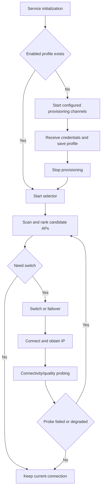

# Wi-Fi Service

- [中文版本](./README_CN.md)

## Overview

`esp_wifi_service` is a production-ready Wi-Fi service component for Espressif devices. It brings credential storage, provisioning interaction, automatic connection, network selection, and quality probing into one service interface. With this module, an application does not need to maintain separate logic for credential storage, SoftAP/Web provisioning, BluFi provisioning, reconnection, and multi-AP selection. It helps teams build stable, maintainable, field-serviceable connected products faster and shortens the development cycle from prototype validation to production rollout.

- **Profile Management**: Maintain multiple Wi-Fi credentials, including add, update, enable, disable, delete, and cleanup operations, and share them between provisioning and connection selection through one profile manager
- **Replaceable Storage Media**: Use NVS, file system, raw dual-partition flash, or a user-defined storage adapter, with optional encryption callbacks to protect saved credentials
- **Multi-Channel Provisioning**: Support HTTP SoftAP/Web UI, DNS captive portal, BluFi, and application-defined provisioning flows, all writing into the shared profile store
- **Automatic Startup Policy**: Start connection selection when enabled profiles exist, or start configured provisioning channels when no enabled profile is available
- **Intelligent Selection and Switching**: Select a better SSID/BSSID using user priority, RSSI, historical connectivity, temporary blocklists, and re-evaluate after disconnects or link degradation
- **Network Quality Probing**: Detect connectivity, latency, and throughput degradation to handle cases where Wi-Fi is connected but the business service is unavailable
- **Service Events and APIs**: Report connection, provisioning, credential, and error states through a unified service lifecycle and event mechanism so the application can subscribe and control behavior centrally

## MCP Tool Support

When `CONFIG_ESP_MCP_ENABLE` and `CONFIG_WIFI_SERVICE_MCP_ENABLE` are enabled, the component builds an MCP tool handler that can be registered with `esp_service_manager`. The tools expose remote status and management operations through the existing `esp_service` MCP server and its transports.

Exposed tools:

- `esp_wifi_service_get_status`: Returns service state, station connection details, IP information, provisioning state, and profile count
- `esp_wifi_service_list_profiles`: Lists saved profiles without passwords
- `esp_wifi_service_add_profile`: Adds or updates a saved profile by SSID
- `esp_wifi_service_set_profile_enabled`: Enables or disables one profile by SSID
- `esp_wifi_service_delete_profile`: Deletes one profile by index or SSID
- `esp_wifi_service_clear_profiles`: Clears all saved profiles
- `esp_wifi_service_prov_start`: Starts configured provisioning agents
- `esp_wifi_service_prov_stop`: Stops running provisioning agents
- `esp_wifi_service_request_reeval`: Requests one selector scan and re-evaluation cycle

The MCP tools do not expose saved passwords in responses. Applications that expose MCP transports outside a trusted debug channel should add their own authentication and transport security policy.

## WiFi Profile Storage

Profile storage supports multiple storage media, commonly including:

- NVS
- File system
- Raw dual-partition flash
- User-defined storage adapter layer

### Optional Encrypted Storage

The storage layer supports encryption callbacks:

- Encrypt before write and decrypt after read
- Configure extra headroom to handle encrypted blob size growth

If `crypto` is not configured, profile data is stored in plaintext.

## WiFi Provisioning

Provisioning supports multiple channels running in parallel:

- Web provisioning (HTTP + Web UI)
- Bluetooth provisioning (BluFi)

When the service starts, it starts connection selection if at least one enabled profile exists. Otherwise it starts all configured provisioning flows.

### BluFi

The BLUFI channel is used for mobile Bluetooth provisioning. A typical flow:

- The phone sends network information
- The device attempts to connect and reports status
- Credentials are saved into the shared profile manager
- The service restarts selector logic after provisioning stops

BLUFI credential submission is reported through service events:

- `ESP_WIFI_SERVICE_EVENT_PROV_CREDENTIAL_RECEIVED`: returns the received Wi-Fi information
- `ESP_WIFI_SERVICE_EVENT_PROV_ERROR` when applying or saving credentials fails
- `esp_wifi_service_prov_send()` can send custom data to a connected BLUFI peer; HTTP provisioning
  currently returns `ESP_ERR_NOT_SUPPORTED` for outbound peer data.

`CONFIG_WIFI_SERVICE_PROV_BLUFI_ENABLE` depends on the ESP-BLUFI stack (`BT_BLE_BLUFI_ENABLE` or `BT_NIMBLE_BLUFI_ENABLE`). If BLUFI is unavailable in the build, HTTP provisioning can still be used independently.

### HTTP API

HTTP provisioning starts a SoftAP, DNS captive portal helper, HTTP server, periodic scan cache, and default or custom Web UI. If no SoftAP SSID is configured, the default name is `ESP_SVC_XXXXXX`, where `XXXXXX` comes from the device SoftAP MAC address. It exposes status, profile management, scan result, and stop APIs.

#### Default APIs

Default API prefix: `/prov`. The following APIs are registered:

- `GET /prov/status`
  - Returns HTTP provisioning and STA state
  - Example response: `{"agent":"http","running":true,"connected":true,"ssid":"Office","bssid":"aa:bb:cc:dd:ee:ff","rssi":-45,"ip":"192.168.4.2","netmask":"255.255.255.0","gw":"192.168.4.1"}`
  - Fields:
    - `agent`: provisioning channel name, default `http`
    - `running`: whether the HTTP provisioning channel is running
    - `connected`: Whether STA is associated with an AP
    - `ssid`, `bssid`, `rssi`: Current AP information when connected
    - `ip`, `netmask`, `gw`: Current STA IPv4 information
- `GET /prov/profiles`
  - Returns saved profile list
  - Example response: `{"count":2,"profiles":[{"index":0,"ssid":"Office","priority":10,"enabled":true}]}`
  - Fields:
    - `count`: Number of saved profiles
    - `profiles[]`: Profile array
    - `index`: Profile index, usable for later delete operations
    - `ssid`: Network name
    - `priority`: User priority (`0~20`, larger means preferred)
    - `enabled`: Whether this profile participates in automatic selection
- `POST /prov/profiles`
  - Connects to the submitted AP, then adds or updates credentials if connection succeeds
  - Requires `Content-Type: application/json`
  - Request fields:
    - `ssid` (required): Target network name; an empty value returns an error
    - `password` (optional): Network password; open networks can use an empty string
    - `priority` (optional): Priority; out-of-range values are clamped to `0~20`
  - Example JSON request: `{"ssid":"Office","password":"12345678","priority":10}`
  - Success response includes current status: `{"result":"ok","message":"Connected and profile saved.","status":{...}}`
- `DELETE /prov/profiles?ssid=...` or `DELETE /prov/profiles?index=...`
  - Deletes one profile by SSID or index
  - Parameters:
    - `ssid`: Delete by network name (mutually exclusive with `index`)
    - `index`: Delete by profile index (mutually exclusive with `ssid`)
  - Success response: `{"result":"ok"}`
- `POST /prov/profiles/clear`
  - Clears all saved profiles
  - Success response: `{"result":"ok"}`
- `POST /prov/profiles/enabled`
  - Enables or disables a specific profile
  - Example JSON: `{"ssid":"Office","enabled":true}`
  - Fields:
    - `ssid`: Target network name
    - `enabled`: Boolean value; `true` enables the profile, `false` disables it
  - Success response: `{"result":"ok"}`
- `POST /prov/credentials`
  - Not registered by the current implementation. Use `POST /prov/profiles`
- `GET /prov/scan_result`
  - Returns cached scan results from the provisioning channel's periodic non-blocking scan
  - Results are sorted by RSSI and deduplicated by SSID, keeping the stronger entry
  - Example response: `{"aps":[{"ssid":"Office","rssi":-45,"channel":1,"encrypted":true}]}`
  - Fields:
    - `aps[]`: Scan result array
    - `ssid`: Network name
    - `rssi`: Signal strength in dBm (values closer to 0 are usually better)
    - `channel`: AP channel number
    - `encrypted`: Whether the AP auth mode is not open
- `POST /prov/stop`
  - Ends the current HTTP provisioning flow asynchronously
  - Success response: `{"result":"ok"}`

JSON is the common response format. Credential submission currently accepts JSON only.

Notes:

- To avoid blocking the `httpd` task, the HTTP provisioning channel maintains scan results with non-blocking Wi-Fi scans and `WIFI_EVENT_SCAN_DONE`
- Captive portal friendly behavior is enabled by default: common OS connectivity-check URLs redirect to the entry page, and SoftAP DNS replies point clients to the device

#### Custom APIs

You can register business routes in addition to default APIs:

- Attach custom handlers when the service starts
- Reuse the same HTTP server context
- Suitable for device info, diagnostics, region config, and similar APIs

Simple example (append one custom route to the default provisioning server):

```c
#include "esp_http_server.h"

static esp_err_t app_version_get(httpd_req_t *req)
{
    (void)req;
    return httpd_resp_sendstr(req, "{\"version\":\"1.0.0\"}");
}

static esp_err_t app_register_http_routes(void *httpd_handle, void *user_ctx)
{
    (void)user_ctx;
    httpd_handle_t server = (httpd_handle_t)httpd_handle;

    httpd_uri_t version_uri = {
        .uri = "/app/version",
        .method = HTTP_GET,
        .handler = app_version_get,
        .user_ctx = NULL,
    };
    return httpd_register_uri_handler(server, &version_uri);
}

esp_wifi_service_prov_http_config_t http_cfg = {
    .name = "http",
    .register_cb = app_register_http_routes,
    .register_ctx = app_ctx,  // optional user context
};
```

### Web UI

Web UI works with the HTTP channel and provides browser-side interaction.

#### Default Web UI

The default page provides an end-to-end flow from scanning to credential submission:

- Scan and pick visible networks
- Fill and submit credentials
- View and manage saved profiles
- Check status and actively stop provisioning

The built-in page is embedded when `CONFIG_WIFI_SERVICE_PROV_HTTP_DEFAULT_WEBUI_ENABLE` is enabled and `esp_wifi_service_prov_web_ui_config_t.data` is not supplied.

#### Custom Web UI

You can replace the page with your own resources:

- Specify page content and mount path
- Specify content type
- Keep compatibility with default API contracts, especially `POST /prov/profiles` and `GET /prov/scan_result`

Simple example (Hello World page calling `GET /app/version` above):

```c
static const char hello_world_web_ui[] =
    "<!doctype html><html><body>"
    "<h1>Hello World</h1>"
    "<p id='ver'>loading...</p>"
    "<script>"
    "fetch('/app/version').then(r=>r.json()).then(d=>{"
    "document.getElementById('ver').textContent='version: '+(d.version||'unknown');"
    "}).catch(()=>{document.getElementById('ver').textContent='version: request failed';});"
    "</script>"
    "</body></html>";

esp_wifi_service_prov_http_config_t http_cfg = {
    .name = "http",
    .web_ui = {
        .data = (const uint8_t *)hello_world_web_ui,
        .data_len = sizeof(hello_world_web_ui) - 1,
        .path = "/",
        .content_type = "text/html",
    },
};
```

### Custom Provisioning Flow

If you do not use built-in interactive channels, you can still implement your own app-level provisioning flow:

- Collect credentials and write them into profile storage
- Start or stop provisioning channels on demand
- Let selector logic take over connection and switching afterward

Common service APIs:

- `esp_wifi_service_start_provisioning()` / `esp_wifi_service_stop_provisioning()`
- `esp_wifi_service_is_provisioning_running()`
- You can write profiles directly through `esp_wifi_service_profile_mgr_add()`, `esp_wifi_service_profile_mgr_delete()`, and related profile manager APIs.

## WiFi Selection and Switching

WiFi selection and switching solves automatic connection in multi-network environments. A device may store credentials for home, office, hotspot, and other networks, and it may also see multiple APs under the same SSID. This module reevaluates available networks at the right time and tries to keep the device connected to a more stable AP that better matches user preference.

Typical trigger scenarios include:

- Signal degradation
- Current network fails to access external services
- Network latency remains high
- Actual throughput is lower than expected
- The device disconnects and needs to find an available network again

### Candidate Ranking

During reevaluation, the system scans nearby APs and keeps only candidates that match saved and enabled profiles. Candidate networks are ranked by business preference instead of simply choosing the strongest signal.

Ranking mainly considers:

- User-configured priority, such as "prefer office network" or "prefer main router"
- Current AP signal quality, avoiding weak or unstable networks
- The most recent profile that could access the network successfully, reducing retries on clearly unavailable networks
- Temporary blacklist, avoiding a BSSID that just failed probing or degraded in quality

After candidate ranking:

- If the device is not connected to Wi-Fi, it connects to the best candidate
- If the current connection is already the best candidate, it keeps the current connection
- If a better AP is found, it disconnects first and then connects to the new candidate
- If the candidate does not have a clear advantage, it keeps the current connection to avoid frequent switching

### Network Quality Probing

Network quality probing handles cases where Wi-Fi is connected but the business path is unusable. For example, the device may already have an IP address, but cloud API access fails, network latency is too high, or download throughput remains insufficient. In this case, Wi-Fi connection state alone is not enough to determine whether the network is usable, so the service evaluates link quality from the business access point of view.

Probing logic can cover:

- Accessing a specified URL to verify external connectivity
- Measuring request duration to detect sustained high latency
- Reading a fixed amount of data to estimate whether actual throughput meets the minimum requirement
- Triggering reselection after continuous failure or sustained degradation

#### Connectivity Check

Connectivity check confirms whether the current network can actually access the target service. If access keeps failing, the system treats the current AP as connected but unsuitable for business traffic. The current BSSID can then be added to a temporary blacklist and a new candidate selection can be triggered.

#### Throughput/Latency Check

Throughput and latency checks detect networks that are reachable but perform poorly. For example, AP signal may look acceptable, but cloud access is slow or throughput stays below the business requirement. The system does not switch immediately because of one transient jitter; it handles the issue after consecutive degradation reaches the threshold, reducing false positives.

After quality degradation is confirmed, the current BSSID can be temporarily avoided, and the selector scans again to choose a better candidate network.

#### Degradation Actions

The goal of degradation handling is to balance stability and availability:

- For minor or transient issues, report the event without switching immediately
- For continuous failure or sustained degradation, trigger rescan and candidate selection
- For a BSSID that just failed, set a temporary avoidance period to prevent repeated reconnection to the same unusable AP

### Flow Chart



## Usage

Minimal initialization example (NVS profile store + HTTP provisioning + selector policy):

```c
#include "esp_config_storage.h"
#include "esp_config_manager.h"
#include "esp_service.h"
#include "esp_wifi_service_prov_http.h"
#include "esp_wifi_service.h"

static esp_wifi_service_t *s_wifi_service;

static void on_wifi_service_event(const adf_event_t *event, void *ctx)
{
    (void)ctx;
    if (event->event_id == ESP_WIFI_SERVICE_EVENT_STA_GOT_IP) {
        // Network is ready.
    }
}

void wifi_service_startup(void)
{
    static esp_config_storage_nvs_t nvs_cfg = {
        .nvs_namespace = "wifi_store",
        .key_primary = "profile_p",
        .key_backup = "profile_b",
    };
    esp_config_storage_t profile_store = NULL;
    ESP_ERROR_CHECK(esp_config_storage_init_nvs(&nvs_cfg, &profile_store));
    esp_wifi_service_profile_mgr_cfg_t profile_cfg = {
        .max_profiles = 8,
        .storage = profile_store,
        .crypto = NULL,
        .crypto_extra_size = 0,
    };
    esp_wifi_service_profile_mgr_t profile_manager = NULL;
    ESP_ERROR_CHECK(esp_wifi_service_profile_mgr_init(&profile_cfg, &profile_manager));

    esp_wifi_service_prov_t *http_agent = NULL;
    esp_wifi_service_prov_http_config_t http_cfg = {
        .name = "http",
        .port = 80,
        .profile_manager = profile_manager,
        .default_priority = 10,
    };
    ESP_ERROR_CHECK(esp_wifi_service_prov_http_create(&http_cfg, &http_agent));

    // The following configuration demonstrates a custom selector policy.
    // In actual use, selector_policy can be set to NULL to use the built-in default policy.
    esp_wifi_service_selector_cfg_t selector_cfg = {
        .triggers_mask = ESP_WIFI_SERVICE_SELECTOR_TRIGGER_RSSI_LOW |
                         ESP_WIFI_SERVICE_SELECTOR_TRIGGER_PROBE_FAILED,
        .select_order = {
            ESP_WIFI_SERVICE_SELECTOR_CRITERION_PRIORITY,
            ESP_WIFI_SERVICE_SELECTOR_CRITERION_QUALITY,
            ESP_WIFI_SERVICE_SELECTOR_CRITERION_PROBE_TRUSTED,
        },
        .rssi = {
            .threshold_dbm = -75,
            .check_period_ms = 5000,
        },
        .probe = {
            .url = "http://connectivitycheck.gstatic.com/generate_204",
            .check_period_min = 5,
            .timeout_ms = 5000,
            .expected_status = 204,
            .blocked_seconds = 15,
        },
    };

    esp_wifi_service_config_t cfg = {
        .name = "wifi_service",
        .profile_manager = profile_manager,
        .prov_list = &http_agent,
        .prov_num = 1,
        .selector_policy = &selector_cfg,         /* Set to NULL to use the built-in policy: re-evaluate
                                                   * networks on low RSSI, then select candidates by probe
                                                   * trust, signal quality, and profile priority.
                                                   */
    };

    ESP_ERROR_CHECK(esp_wifi_service_create(&cfg, &s_wifi_service));

    esp_service_t *base = (esp_service_t *)s_wifi_service;
    adf_event_subscribe_info_t sub_info = ADF_EVENT_SUBSCRIBE_INFO_DEFAULT();
    sub_info.event_id = ADF_EVENT_ANY_ID;
    sub_info.handler = on_wifi_service_event;
    ESP_ERROR_CHECK(esp_service_event_subscribe(base, &sub_info));
    ESP_ERROR_CHECK(esp_service_start(base));
}
```
