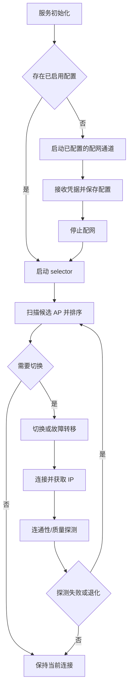

# Wi-Fi Service

- [English Version](./README.md)

## 概述

`esp_wifi_service` 是面向 Espressif 设备的产品级 Wi-Fi 服务组件，用于把设备联网流程中的配置保存、配网交互、自动连接、网络选择和质量探测统一到同一套服务接口中。应用使用该模块后，不需要分别维护凭据存储、SoftAP/Web 配网、BluFi 配网、断线重连和多 AP 选择逻辑，可以更快构建稳定、可维护、便于现场运维的联网产品，缩短从原型验证到量产落地的开发周期。

- **Profile 管理**：维护多组 Wi-Fi 凭据，支持新增、更新、启用、禁用、删除和清理，并通过统一 profile manager 供配网与连接选择共享
- **可替换存储介质**：支持 NVS、文件系统、双分区 raw flash 或用户自定义存储适配层，并可通过加密回调保护已保存凭据
- **多通道配网**：支持 HTTP SoftAP/Web UI、DNS captive portal、BluFi，以及应用自定义配网流程，所有通道都可以写入共享 profile
- **自动启动策略**：服务启动时会根据是否存在已启用配置，自动进入连接选择流程或启动已配置的配网流程
- **智能选择与切换**：根据用户优先级、RSSI、历史连通性、临时黑名单等因素选择更合适的 SSID/BSSID，并在断线或链路退化后重新评估
- **网络质量探测**：支持连通性、延迟和吞吐退化判断，处理“已连接 Wi-Fi 但业务不可用”的场景
- **服务化事件与 API**：通过统一的服务生命周期和事件机制上报连接、配网、凭据和错误状态，便于应用层统一订阅和控制

## MCP Tool 支持

同时启用 `CONFIG_ESP_MCP_ENABLE` 和 `CONFIG_WIFI_SERVICE_MCP_ENABLE` 后，组件会编译 MCP tool handler，可注册到 `esp_service_manager`，并通过现有 `esp_service` MCP server 及其 transport 对外提供远程状态查询和管理操作。

当前提供的工具：

- `esp_wifi_service_get_status`：返回 service 状态、STA 连接信息、IP 信息、配网状态和 profile 数量
- `esp_wifi_service_list_profiles`：列出已保存 profile，不返回密码
- `esp_wifi_service_add_profile`：按 SSID 新增或更新一个已保存 profile
- `esp_wifi_service_set_profile_enabled`：按 SSID 启用或禁用一个 profile
- `esp_wifi_service_delete_profile`：按索引或 SSID 删除一个 profile
- `esp_wifi_service_clear_profiles`：清空所有已保存 profile
- `esp_wifi_service_prov_start`：启动已配置的配网实例
- `esp_wifi_service_prov_stop`：停止正在运行的配网实例
- `esp_wifi_service_request_reeval`：请求 selector 执行一次扫描和重新评估

MCP 工具响应不会暴露已保存密码。如果应用将 MCP transport 暴露到可信调试通道之外，应自行增加鉴权和传输安全策略。

## WiFi Profile 存储

Profile 存储支持多种存储介质，常见包括：

- NVS
- 文件系统
- 双分区原始 flash
- 用户自定义存储适配层

### 可选加密存储

存储层支持加密回调：

- 可在写入前加密、读取后解密
- 可配置额外冗余空间，用于处理加密后体积增长

若不配置 `crypto` 接口，则配置信息将按明文存储。

## WiFi 配网

配网支持多种通道并行启用：

- 网页方式（HTTP + Web UI）
- 蓝牙方式（BluFi）

服务启动时，如果存在至少一个已启用的配置，则启动连接流程；否则启动所有已配置的配网流程。

### BluFi

BLUFI 通道用于手机侧蓝牙配网，典型流程是：

- 手机发送网络信息
- 设备尝试连接并上报状态
- 凭据保存到共享的 profile 管理器
- 配网停止后，服务重新启动 selector 逻辑

BLUFI 凭据提交会通过 service 事件上报：

- `ESP_WIFI_SERVICE_EVENT_PROV_CREDENTIAL_RECEIVED`： 返回接收到的 WiFi 信息
- `ESP_WIFI_SERVICE_EVENT_PROV_ERROR`：应用或保存凭据失败时触发
- `esp_wifi_service_prov_send()` 可向已连接的 BLUFI peer 发送自定义数据；HTTP 配网当前对
  下行 peer 数据返回 `ESP_ERR_NOT_SUPPORTED`

`CONFIG_WIFI_SERVICE_PROV_BLUFI_ENABLE` 依赖 ESP-BLUFI 协议栈（`BT_BLE_BLUFI_ENABLE` 或 `BT_NIMBLE_BLUFI_ENABLE`）。如果当前构建中 BLUFI 不可用，HTTP 配网仍可独立使用。

### HTTP API

HTTP 配网会启动 SoftAP、DNS captive portal 辅助功能、HTTP server、周期性扫描缓存，以及默认或自定义 Web UI。未配置 SoftAP SSID 时，默认名称为 `ESP_SVC_XXXXXX`，其中 `XXXXXX` 来自设备 SoftAP MAC 地址。它提供状态查询、配置管理、扫描结果和停止配网 API。

#### 默认 API

默认 API 前缀为 `/prov`，注册以下 API：

- `GET /prov/status`
  - 返回 HTTP 配网和 STA 状态
  - 响应示例：`{"agent":"http","running":true,"connected":true,"ssid":"Office","bssid":"aa:bb:cc:dd:ee:ff","rssi":-45,"ip":"192.168.4.2","netmask":"255.255.255.0","gw":"192.168.4.1"}`
  - 字段：
    - `agent`：配网通道名称，默认为 `http`
    - `running`：HTTP 配网通道是否正在运行
    - `connected`：STA 是否已关联到 AP
    - `ssid`、`bssid`、`rssi`：已连接时的当前 AP 信息
    - `ip`、`netmask`、`gw`：当前 STA IPv4 信息
- `GET /prov/profiles`
  - 返回已保存的配置列表
  - 响应示例：`{"count":2,"profiles":[{"index":0,"ssid":"Office","priority":10,"enabled":true}]}`
  - 字段：
    - `count`：已保存配置数量
    - `profiles[]`：配置数组
    - `index`：配置索引，可用于后续删除操作
    - `ssid`：网络名称
    - `priority`：用户优先级（`0~20`，数值越大越优先）
    - `enabled`：该配置是否参与自动选择
- `POST /prov/profiles`
  - 先连接提交的 AP，连接成功后添加或更新凭据
  - 要求 `Content-Type: application/json`
  - 请求字段：
    - `ssid`（必填）：目标网络名称；空值会返回错误
    - `password`（可选）：网络密码；开放网络可为空字符串
    - `priority`（可选）：优先级；超出范围的值会被限制到 `0~20`
  - JSON 请求示例：`{"ssid":"Office","password":"12345678","priority":10}`
  - 成功响应包含当前状态：`{"result":"ok","message":"Connected and profile saved.","status":{...}}`
- `DELETE /prov/profiles?ssid=...` 或 `DELETE /prov/profiles?index=...`
  - 按 SSID 或索引删除一个配置
  - 参数：
    - `ssid`：按网络名称删除（与 `index` 互斥）
    - `index`：按配置索引删除（与 `ssid` 互斥）
  - 成功响应：`{"result":"ok"}`
- `POST /prov/profiles/clear`
  - 清空所有已保存配置
  - 成功响应：`{"result":"ok"}`
- `POST /prov/profiles/enabled`
  - 启用或禁用指定配置
  - JSON 示例：`{"ssid":"Office","enabled":true}`
  - 字段：
    - `ssid`：目标网络名称
    - `enabled`：布尔值；`true` 表示启用，`false` 表示禁用
  - 成功响应：`{"result":"ok"}`
- `POST /prov/credentials`
  - 当前实现未注册该 API。请使用 `POST /prov/profiles`
- `GET /prov/scan_result`
  - 返回配网通道周期性非阻塞扫描得到的缓存扫描结果
  - 结果按 RSSI 排序，并按 SSID 去重，保留信号更强的条目
  - 响应示例：`{"aps":[{"ssid":"Office","rssi":-45,"channel":1,"encrypted":true}]}`
  - 字段：
    - `aps[]`：扫描结果数组
    - `ssid`：网络名称
    - `rssi`：信号强度，单位 dBm（越接近 0 通常越好）
    - `channel`：AP 信道号
    - `encrypted`：AP 认证模式是否非开放
- `POST /prov/stop`
  - 异步结束当前 HTTP 配网流程
  - 成功响应：`{"result":"ok"}`

JSON 是通用响应格式。凭据提交当前仅接受 JSON。

说明：

- 为避免阻塞 `httpd` 任务，HTTP 配网通道使用非阻塞 Wi-Fi 扫描和 `WIFI_EVENT_SCAN_DONE` 维护扫描结果
- 默认启用 captive portal 友好行为：常见系统连通性检测 URL 会重定向到入口页面，SoftAP DNS 响应会指向设备自身

#### 自定义 API

除默认 API 外，也可以注册业务路由：

- 在服务启动时挂载自定义 handler
- 复用同一个 HTTP server 上下文
- 适用于设备信息、诊断、区域配置等 API

简单示例（在默认配网 server 上追加一个自定义路由）：

```c
#include "esp_http_server.h"

static esp_err_t app_version_get(httpd_req_t *req)
{
    (void)req;
    return httpd_resp_sendstr(req, "{\"version\":\"1.0.0\"}");
}

static esp_err_t app_register_http_routes(void *httpd_handle, void *user_ctx)
{
    (void)user_ctx;
    httpd_handle_t server = (httpd_handle_t)httpd_handle;

    httpd_uri_t version_uri = {
        .uri = "/app/version",
        .method = HTTP_GET,
        .handler = app_version_get,
        .user_ctx = NULL,
    };
    return httpd_register_uri_handler(server, &version_uri);
}

esp_wifi_service_prov_http_config_t http_cfg = {
    .name = "http",
    .register_cb = app_register_http_routes,
    .register_ctx = app_ctx,  // 可选用户上下文
};
```

### Web UI

Web UI 与 HTTP 通道配合使用，提供浏览器端交互。

#### 默认 Web UI

默认页面提供从扫描到凭据提交的完整流程：

- 扫描并选择可见网络
- 填写并提交凭据
- 查看和管理已保存配置
- 查看状态并主动停止配网

当 `CONFIG_WIFI_SERVICE_PROV_HTTP_DEFAULT_WEBUI_ENABLE` 启用且未提供 `esp_wifi_service_prov_web_ui_config_t.data` 时，会使用内置页面。

#### 自定义 Web UI

可以替换为自定义页面资源：

- 指定页面内容和挂载路径
- 指定 content type
- 保持与默认 API 契约兼容，尤其是 `POST /prov/profiles` 和 `GET /prov/scan_result`

简单示例（Hello World 页面调用上面的 `GET /app/version`）：

```c
static const char hello_world_web_ui[] =
    "<!doctype html><html><body>"
    "<h1>Hello World</h1>"
    "<p id='ver'>loading...</p>"
    "<script>"
    "fetch('/app/version').then(r=>r.json()).then(d=>{"
    "document.getElementById('ver').textContent='version: '+(d.version||'unknown');"
    "}).catch(()=>{document.getElementById('ver').textContent='version: request failed';});"
    "</script>"
    "</body></html>";

esp_wifi_service_prov_http_config_t http_cfg = {
    .name = "http",
    .web_ui = {
        .data = (const uint8_t *)hello_world_web_ui,
        .data_len = sizeof(hello_world_web_ui) - 1,
        .path = "/",
        .content_type = "text/html",
    },
};
```

### 自定义配网流程

如果不使用内置交互通道，也可以在应用层实现自己的配网流程：

- 收集凭据并写入 profile storage
- 按需启动或停止配网通道
- 后续由 selector 逻辑接管连接和切换

常用服务 API：

- `esp_wifi_service_start_provisioning()` / `esp_wifi_service_stop_provisioning()`
- `esp_wifi_service_is_provisioning_running()`
- 可以通过 `esp_wifi_service_profile_mgr_add()`、`esp_wifi_service_profile_mgr_delete()` 及相关 profile manager API 直接写入配置

## WiFi 选择与切换

WiFi 选择与切换用于解决设备在多网络环境中的自动连接问题。设备可能保存了家庭、办公室、热点等多组 WiFi 配置，也可能在同一 SSID 下看到多个 AP。该模块会在合适的时机重新评估可用网络，尽量让设备连接到更稳定、更符合用户偏好的 AP。

典型触发场景包括：

- 信号变差
- 当前网络访问外部服务失败
- 网络延迟持续偏高
- 实际吞吐低于预期
- 设备断开后需要重新寻找可用网络

### 候选排序

重评估时，系统会扫描周围 AP，并只保留能匹配已保存且已启用配置的候选项。候选网络会按业务优先级排序，而不是简单选择信号最强的 AP。

排序时主要考虑：

- 用户配置的优先级，适合表达“优先连公司网络”或“优先连主路由”等偏好
- 当前 AP 信号质量，避免连接到过弱或不稳定的网络
- 最近一次可正常访问网络的配置，减少反复尝试明显不可用网络
- 临时黑名单，避开刚刚发生探测失败或质量退化的 BSSID

排序完成后，系统按当前连接状态执行不同动作：

- 如果设备尚未连接 WiFi，则直接连接最佳候选
- 如果当前连接已经是最佳候选，则保持当前连接
- 如果发现更合适的 AP，则先断开当前连接，再连接新候选
- 如果候选网络没有明显优势，则保持当前连接，避免频繁切换

### 网络质量探测

网络质量探测用于处理“WiFi 已连接但业务不可用”的情况。例如设备已经拿到 IP，但云端接口访问失败、网络延迟过高，或下载吞吐长期不足。此时仅依赖 WiFi 连接状态不足以判断网络是否可用，需要进一步从业务访问角度评估链路质量。

探测逻辑可以覆盖：

- 访问指定 URL，确认网络具备外部连通性
- 统计请求耗时，判断链路延迟是否持续偏高
- 读取固定大小的数据，估算实际吞吐是否满足最低要求
- 在连续失败或持续退化后触发重新选择

#### 连通性检查

连通性检查用于确认当前网络是否真的可以访问目标服务。若连续访问失败，系统会认为当前 AP 虽然已经连接，但不适合作为业务网络继续使用。此时可以将当前 BSSID 临时加入黑名单，并触发新一轮候选选择。

#### 吞吐/延迟检查

吞吐和延迟检查用于发现“能访问但体验差”的网络。比如 AP 信号看起来还可以，但实际访问云服务很慢，或吞吐长时间低于业务要求。系统不会因为一次偶发抖动立即切换，而是在连续退化达到阈值后再触发处理，减少误判。

当质量退化被确认后，当前 BSSID 可以被临时避开，selector 会重新扫描并选择更合适的候选网络。

#### 退化处理

退化处理的核心目标是在稳定性和可用性之间取得平衡：

- 对轻微或偶发问题，只上报事件，不立即切换
- 对连续失败或持续退化，触发重新扫描和候选选择
- 对刚失败的 BSSID 设置临时避让时间，避免在短时间内反复连接同一个不可用 AP

### 流程图



## 用法

最小初始化示例（NVS profile store + HTTP 配网 + selector 策略）：

```c
#include "esp_config_storage.h"
#include "esp_config_manager.h"
#include "esp_service.h"
#include "esp_wifi_service_prov_http.h"
#include "esp_wifi_service.h"

static esp_wifi_service_t *s_wifi_service;

static void on_wifi_service_event(const adf_event_t *event, void *ctx)
{
    (void)ctx;
    if (event->event_id == ESP_WIFI_SERVICE_EVENT_STA_GOT_IP) {
        // Network is ready.
    }
}

void wifi_service_startup(void)
{
    static esp_config_storage_nvs_t nvs_cfg = {
        .nvs_namespace = "wifi_store",
        .key_primary = "profile_p",
        .key_backup = "profile_b",
    };
    esp_config_storage_t profile_store = NULL;
    ESP_ERROR_CHECK(esp_config_storage_init_nvs(&nvs_cfg, &profile_store));
    esp_wifi_service_profile_mgr_cfg_t profile_cfg = {
        .max_profiles = 8,
        .storage = profile_store,
        .crypto = NULL,
        .crypto_extra_size = 0,
    };
    esp_wifi_service_profile_mgr_t profile_manager = NULL;
    ESP_ERROR_CHECK(esp_wifi_service_profile_mgr_init(&profile_cfg, &profile_manager));

    esp_wifi_service_prov_t *http_agent = NULL;
    esp_wifi_service_prov_http_config_t http_cfg = {
        .name = "http",
        .port = 80,
        .profile_manager = profile_manager,
        .default_priority = 10,
    };
    ESP_ERROR_CHECK(esp_wifi_service_prov_http_create(&http_cfg, &http_agent));

    // 以下配置演示自定义 selector 策略；实际使用时可将 selector_policy 设为 NULL 使用内置默认策略。
    esp_wifi_service_selector_cfg_t selector_cfg = {
        .triggers_mask = ESP_WIFI_SERVICE_SELECTOR_TRIGGER_RSSI_LOW |
                         ESP_WIFI_SERVICE_SELECTOR_TRIGGER_PROBE_FAILED,
        .select_order = {
            ESP_WIFI_SERVICE_SELECTOR_CRITERION_PRIORITY,
            ESP_WIFI_SERVICE_SELECTOR_CRITERION_QUALITY,
            ESP_WIFI_SERVICE_SELECTOR_CRITERION_PROBE_TRUSTED,
        },
        .rssi = {
            .threshold_dbm = -75,
            .check_period_ms = 5000,
        },
        .probe = {
            .url = "http://connectivitycheck.gstatic.com/generate_204",
            .check_period_min = 5,
            .timeout_ms = 5000,
            .expected_status = 204,
            .blocked_seconds = 15,
        },
    };

    esp_wifi_service_config_t cfg = {
        .name = "wifi_service",
        .profile_manager = profile_manager,
        .prov_list = &http_agent,
        .prov_num = 1,
        .selector_policy = &selector_cfg,         /* 设为 NULL 时使用内置策略：低 RSSI 时重新评估网络，
                                                   * 并按探测可信度、信号质量和 profile 优先级选择候选网络。
                                                   */

    };

    ESP_ERROR_CHECK(esp_wifi_service_create(&cfg, &s_wifi_service));

    esp_service_t *base = (esp_service_t *)s_wifi_service;
    adf_event_subscribe_info_t sub_info = ADF_EVENT_SUBSCRIBE_INFO_DEFAULT();
    sub_info.event_id = ADF_EVENT_ANY_ID;
    sub_info.handler = on_wifi_service_event;
    ESP_ERROR_CHECK(esp_service_event_subscribe(base, &sub_info));
    ESP_ERROR_CHECK(esp_service_start(base));
}
```
