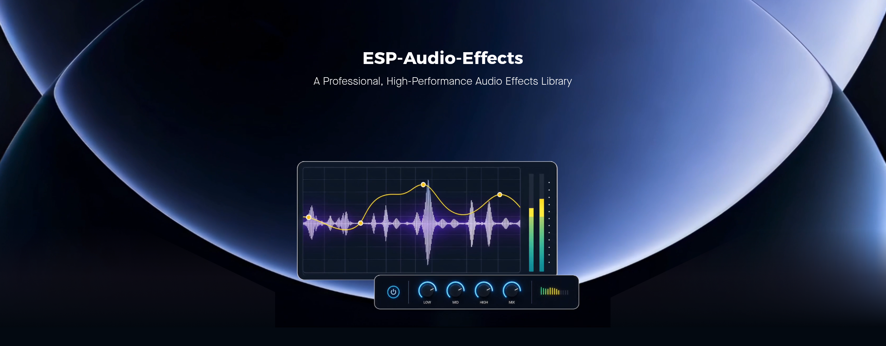

ESP-Audio-Effects
=================

:link_to_translation:`zh_CN:[中文]`

|

ESP-Audio-Effects (ESP_AUDIO_EFFECTS) is Espressif's audio processing module collection for ESP series SoCs. It modifies, enhances, or shapes audio signals. All modules share a consistent API and can run alone or be chained into a processing pipeline.

The current modules include: automatic level control (ALC), sample rate conversion, bit depth conversion, channel conversion, equalizer (EQ), data weaver, mixer, fade, Sonic tempo/pitch processing, dynamic range control (DRC), multi-band dynamic range compression (MBC), howling suppression (HOWL), reverb, and delay.

The modules fall into four groups:

- **Format conversion**: sample rate, bit depth, and channel conversion, used to align PCM between devices and codecs.
- **Data routing**: the data weaver interleaves and deinterleaves multi-channel data; the mixer blends streams by weight, for example background music and voice prompts.
- **Dynamic control**: ALC, DRC, and the multi-band compressor stabilize level, limit clipping, and shape dynamics per band.
- **Sound effects**: equalizer, fade, time-stretch/pitch-shift, howling suppression, reverb, and delay, used for tuning and spatial effects.

On ESP32-S3 at 240 MHz, most modules use less than 1% CPU, with memory in the kilobyte range. The multi-band compressor, the most demanding module, stays within 5% CPU. Parameters can be changed at runtime: the equalizer exposes filter, frequency, and gain; DRC and the multi-band compressor expose gain curves plus attack, release, and hold times. The component covers the ESP32 series and can be used in ESP-IDF and ESP-GMF projects.

Related links:

- `Component Registry <https://components.espressif.com/components/espressif/esp_audio_effects>`__
- `GitHub Repository <https://github.com/espressif/esp-adf-libs/tree/master/esp_audio_effects>`__
- `Tech Blog <https://developer.espressif.com/blog/2025/07/overview-of-esp-audio-effects>`__
