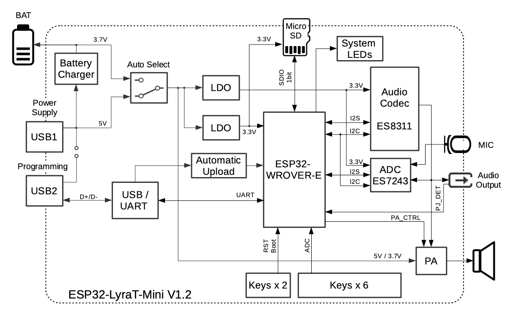
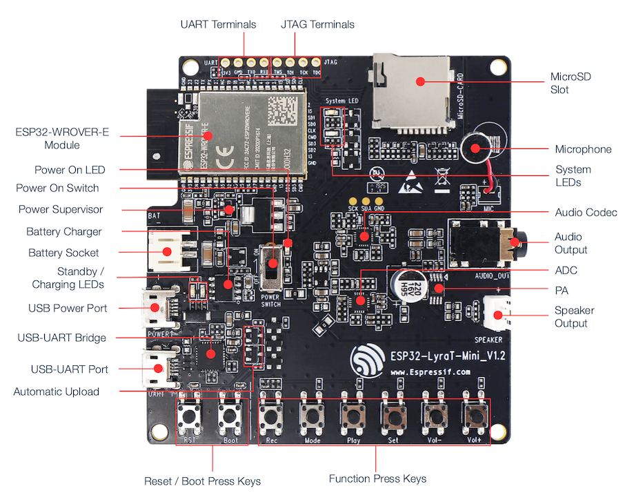

ESP32-LyraT-Mini V1.2 Hardware Reference
========================================

This guide provides functional descriptions, configuration options for ESP32-LyraT-Mini V1.2 audio development board. As an introduction to functionality and using the LyraT, please see :doc:`get-started-esp32-lyrat-mini`.

.. contents:: In this Section
    :local:
    :depth: 3

Overview
--------

The ESP32-LyraT is a hardware platform designed for the dual-core ESP32 audio applications, e.g., Wi-Fi or BT audio speakers, speech-based remote controllers, connected smart-home appliances with one or more audio functionality, etc. 

The block diagram below presents main components of the ESP32-LyraT-Mini.

    ESP32-LyraT-Mini V1.2 Electrical Block Diagram

Functional Description
----------------------

The following list and figure describe key components, interfaces and controls of the ESP32-LyraT-Mini board. The list provides description starting from the picture’s top right corner and going clockwise.

MicroSD Card
    The development board supports a MicroSD card in SPI/1-bit modes, and can store or play audio files in the MicroSD card. See `MicroSD Card`_ for pinout details. 
Microphone
    On-board microphone connected to AINRP/AINRP of the **Audio ADC Chip**.
System LEDs
    Two general purpose LEDs (green and red) controlled by **ESP32-WROVER-B Module** to indicate certain operation states of the audio application using dedicated API.
Audio Codec Chip
    The audio codec chip, `ES8311`_, is a low power mono audio codec. It consists of 1-channel ADC, 1-channel DAC, low noise pre-amplifier, headphone driver, digital sound effects, analog mixing and gain functions. It is interfaced with **ESP32-WROVER-B Module** over I2S and I2C buses to provide audio processing in hardware independently from the audio application.
Audio Output
    Output socket to connect headphones with a 3.5 mm stereo jack. One of the socket's terminals is wired to ESP32 to provide jack insertion detection.
Audio ADC Chip
    The audio codec chip, `ES7243`_, is a low power multi-bit delta-sigma audio ADC and DAC. In this board this chip is used as the microphone interface.
PA Chip
    A power amplifier used to amplify the audio signal from the **Audio Codec Chip** for driving the speaker.
Speaker Output
    Output socket to connect a speaker. The 4-ohm and 3-watt speaker is recommended. The pins have a 2.00 mm / 0.08" pitch.
Audio Function Press Keys
    Six press keys labeled **Rec**, **Mode**, **Play**, **Set**, **Vol-** and **Vol+**. They are routed to **ESP32-WROVER-B Module** and intended for development and testing of a UI for audio applications using dedicated API.

    ESP32 LyraT-Mini V1.2 Board Layout

Boot/Reset Press Keys
    Boot: holding down the **Boot** button and momentarily pressing the **Reset** button initiates the firmware upload mode. Then user can upload firmware through the serial port. Reset: pressing this button alone resets the system.
Automatic Upload
    A simple two transistor circuit to put ESP32 into firmware upload mode depending on the status of UART DTR and RTS signals. The signals are controlled by an external application to upload the firmware over the USB-UART interface.
USB-UART Port
    Functions as the communication interface between a PC and the ESP32 module.
USB-UART Bridge Chip
    A single chip USB-UART bridge CP2102N provides up to 3 Mbps transfers rates.
Standby / Charging LEDs
    The **Standby** green LED indicates that power has been applied to the **USB Power Port**. The **Charging** red LED indicates that a battery connected to the **Battery Socket** is being charged.
Battery Socket
    Two pins socket to connect a single cell Li-ion battery.

    .. note::

        Please verify if polarity on the battery plug matches polarity of the socket as marked on the board's soldermask besides the socket. 
Battery Charger Chip
    Constant current and constant voltage linear charger for single cell lithium-ion batteries AP5056. Used for charging of a battery connected to the **Battery Socket** over the **USB Power Port**.
Power On Switch
    Power on/off knob: toggling it to the top powers the board on; toggling it to the down powers the board off.

    .. note::

        The **Power On Switch** does not affect / disconnect the Li-ion battery charging. More information, you can refer to `ESP32-LyraT-Mini V1.2 schematic`_ (PDF).

Power Supervisor
    Provides EN signal to enable ESP32 once power supply voltage stabilizes.
Power On LED
    Red LED indicating that **Power On Switch** is turned on.
ESP32-WROVER-B Module
    The ESP32-WROVER-B module contains ESP32 chip to provide Wi-Fi / BT connectivity and data processing power as well as integrates 64 Mbit SPI flash and 64 Mbit PSRAM for flexible data storage.
UART Test Point
    Serial port: provides access to the serial TX/RX signals between **ESP32-WROVER-B Module** and **USB-UART Bridge Chip**. See `UART Test Point`_ for pinout details.
JTAG Test Point
    Provides access to the **JTAG** interface of **ESP32-WROVER-B Module**. It may be used for debugging, application upload, as well as implementing several other functions, e.g., `Application Level Tracing <http://esp-idf.readthedocs.io/en/latest/api-reference/system/app_trace.html>`_. See `JTAG Test Point`_ for pinout details. 

Allocation of ESP32 Pins to Test Points
---------------------------------------

This section describes allocation of test points available on the ESP32-LyraT-Mini board. 

The test points are bare through hole solder pads and have standard 2.54 mm / 0.1 inch pitch. User may need to populate them with pin headers or sockets for easy connection of external hardware. 

JTAG Test Point
^^^^^^^^^^^^^^^

====  ===============  =================
.     ESP32 Pin        JTAG Signal
====  ===============  =================
 1    MTDO / GPIO15    TDO
 2    MTCK / GPIO13    TCK
 3    MTDI / GPIO12    TDI
 4    MTMS / GPIO14    TMS
====  ===============  =================

.. note:

    **JTAG** cannot be used if application is using **MicroSD Card**.

UART Test Point
^^^^^^^^^^^^^^^

====  ===============  =================
.     ESP32 Pin        Pin Description
====  ===============  =================
 1    RXD0             RX
 2    TXD0             TX
 3    GND              GND
 4    n/a              3.3 V
====  ===============  =================

MicroSD Card
------------

Implemented on this board MicoSD card interface operates in SPI/1-bit mode. The board is able to support SPI/4-b 
it mode after populating couple of additional components on locations reserved on the PCB. See `ESP32-LyraT-Mini V1.2 schematic`_ (PDF) for additional information. Not populated components are marked *(NC)* on the schematic.

====  ==============  ===============
.     ESP32 Pin       MicroSD Signal
====  ==============  ===============
1     MTDI / GPIO12   --
2     MTCK / GPIO13   --
3     MTDO / GPIO15   CMD
4     MTMS / GPIO14   CLK
5     GPIO2           DATA0
6     GPIO4           --
7     GPIO34          CD
====  ==============  ===============

GPIO Allocation Summary
-----------------------

The table below provides allocation of GPIOs exposed on terminals of **ESP32-WROVER-B Module** to control specific components or functions of the board.

.. csv-table::
    :header: Pin :sup:`1`,Pin Name,`ES8311`_,`ES7243`_,Keys,MicroSD,Other

    3,EN,,,EN_KEY,,
    4,S_VP,,I2S_DATA,,,
    5,S_VN,,,"REC, MODE, PLAY, SET, VOL-, VOL+",,
    6,IO34,,,,CD,
    7,IO35,I2S0_ASDOUT,,,,
    8,IO32,,I2S1_SCLK,,,
    9,IO33,,I2S1_LRCK,,,
    10,IO25,I2S0_LRCK,,,,
    11,IO26,I2S0_DSDIN,,,,
    12,IO27,,,,,Blue_LED
    13,IO14,,,,CLK,
    14,IO12,,,,NC (DATA2),
    16,IO13,,,,NC (DATA3),
    17,SD2,,,,,
    18,SD3,,,,,
    19,CMD,,,,,
    20,CLK,,,,,
    21,SD0,,,,,
    22,SD1,,,,,
    23,IO15,,,,CMD,
    24,IO2,,,IO2_KEY,DATA0,
    25,IO0,I2S0_MCLK,I2S1_MCLK,IO0_KEY,,
    26,IO4,,,,NC (DATA1),
    27,NC (IO16),,,,,
    28,NC (IO17),,,,,
    29,IO5,I2S0_SCLK,,,,
    30,IO18,I2C_SDA,I2C_SDA,,,
    31,IO19,,,,,PJ_DET :sup:`2`
    33,IO21,,,,, PA_CTRL :sup:`3`
    34,RXD0,,,,,RXD0 :sup:`4`
    35,TXD0,,,,,TXD0 :sup:`4`
    36,IO22,,,,,Green_LED
    37,IO23,I2C_SCK,I2C_SCL,,,

1. **Pin** - ESP32-WROVER-B module pin number, GND and power supply pins are not listed
2. **PJ_DET** - phone jack insertion detect signal
3. **PA_CTRL** - NS4150 power amplifier chip control signal
4. **RXD0**, **TXD0** - serial communication signals connected to TXD and RXD pins of CP2102N USB-UART bridge
5. **NC** - not connected

Notes on Power Distribution
---------------------------

The ESP32-LyraT-Mini board provides some basic features to isolate noise from digital components by providing separate power distribution for audio and digital subsystems.

Power Supply over USB and from Battery
^^^^^^^^^^^^^^^^^^^^^^^^^^^^^^^^^^^^^^

The main power supply is 5V and provided by a USB. The secondary power supply is 3.7V and provided by an optional battery. The USB power itself is fed with a dedicated cable, separate from a USB cable used for an application upload. To further reduce noise from the USB, the battery may be used instead of the USB.

.. figure:: ../../../_static/esp32-lyrat-mini-v1.2-usb-ps.png
    :scale: 60%
    :alt: ESP32-LyraT-Mini V1.2 - Dedicated USB Power Supply Socket
    :figclass: align-center

    ESP32-LyraT-Mini V1.2 - Dedicated USB Power Supply Socket

.. figure:: ../../../_static/esp32-lyrat-mini-v1.2-battery-ps.png
    :scale: 60%
    :alt: ESP32-LyraT-Mini V1.2 - Power Supply from a Battery
    :figclass: align-center

    ESP32-LyraT-Mini V1.2 - Power Supply from a Battery

Independent Audio and Digital Power Supply
^^^^^^^^^^^^^^^^^^^^^^^^^^^^^^^^^^^^^^^^^^

The board features independent power supplies to the audio components and ESP32 module. This should reduce noise in the audio signal from digital components and improve overall performance of the components.

.. figure:: ../../../_static/esp32-lyrat-mini-v1.2-digital-ps.png
    :scale: 60%
    :alt: ESP32-LyraT-Mini V1.2 - Digital Power Supply
    :figclass: align-center

    ESP32-LyraT-Mini V1.2 - Digital Power Supply

.. figure:: ../../../_static/esp32-lyrat-mini-v1.2-audio-ps.png
    :scale: 60%
    :alt: ESP32-LyraT-Mini V1.2 - Audio Power Supply
    :figclass: align-center

    ESP32-LyraT-Mini V1.2 - Audio Power Supply

Selecting of the Audio Output
-----------------------------

The board provides a mono audio output signal on pins OUTN and OUTP of the ES8311 codec chip. The signal is routed to two outputs:

* power amplifier (PA) to drive an external speaker,
* phone jack socket to drive external headphones.

The board design assumes that selection between one of these outputs is implemented in software, as opposed to using traditional mechanical contacts in a phone jack socket, that would disconnect the speaker once a headphone jack is inserted.

Two digital IO signals are provided to implement selection between the speaker and the headphones: 

* **PJ_DET** - digital input signal to o detect when a headphone jack is inserted,
* **PA_CTRL** - digital output signal to enable or disable the amplifier IC.

The application running on ESP32 may then enable of disable the PA with **PA_CTRL** basing on status of **PJ_DET**. Please see `GPIO Allocation Summary`_ for specific GPIO numbers allocated to these signals.

Related Documents
-----------------

* `ESP32-LyraT-Mini V1.2 schematic`_ (PDF)
* :doc:`get-started-esp32-lyrat-mini`
* `ESP32 Datasheet <https://www.espressif.com/sites/default/files/documentation/esp32_datasheet_en.pdf>`_ (PDF)
* `ESP32-WROVER-B Datasheet <https://espressif.com/sites/default/files/documentation/esp32-wrover-b_datasheet_en.pdf>`_ (PDF)

.. _ESP32-LyraT-Mini V1.2 schematic: https://dl.espressif.com/dl/schematics/SCH_ESP32-LYRAT-MINI_V1.2_20190605.pdf
.. _ES8311: http://www.everest-semi.com/pdf/ES8311%20PB.pdf
.. _ES7243: http://www.everest-semi.com/pdf/ES7243%20PB.pdf
