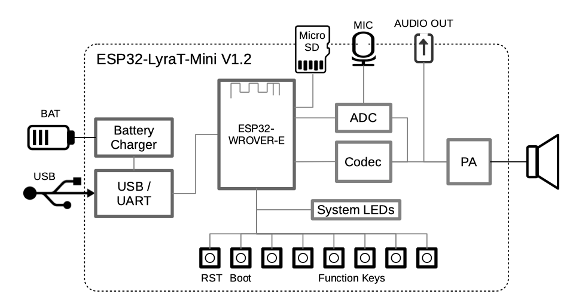
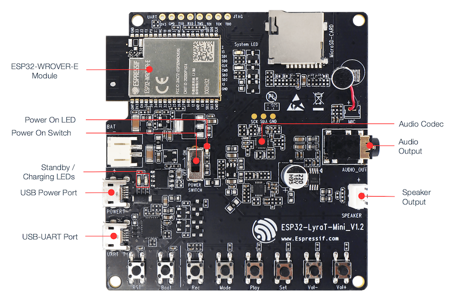

ESP32-LyraT-Mini V1.2 Getting Started Guide
===========================================

:link_to_translation:`zh_CN:[中文]`

This guide provides users with functional descriptions, configuration options for ESP32-LyraT-Mini V1.2 audio development board, as well as how to get started with the ESP32-LyraT board.

The ESP32-LyraT is a hardware platform designed for the dual-core ESP32 audio applications, e.g., Wi-Fi or BT audio speakers, speech-based remote controllers, connected smart-home appliances with one or more audio functionality, etc. 

The ESP32-LyraT-Mini is a mono audio board. If you are looking for a stereo audio board, check :doc:`get-started-esp32-lyrat`.

What You Need
-------------

* :ref:`ESP32-LyraT-Mini V1.2 board <get-started-esp32-lyrat-mini-v1.2-board>`
* Speaker or headphones with a 3.5 mm jack. If you use a speaker, it is recommended to choose one no more than 3 watts, and JST PH 2.0 2-Pin plugs are needed. In case you do not have this type of plug it is also fine to use Dupont female jumper wires during development.
* Two Micro-USB 2.0 cables, Type A to Micro B
* PC loaded with Windows, Linux or Mac OS

Optional components

* Micro SD-card
* Li-ion Battery

If you like to start using this board right now, go directly to section `Start Application Development`_.

Overview
^^^^^^^^

The ESP32-LyraT-Mini V1.2 is an audio development board produced by `Espressif <https://espressif.com>`_ built around ESP32. It is intended for audio applications, by providing hardware for audio processing and additional RAM on top of what is already on-board of the ESP32 chip. The specific hardware includes:

* **ESP32-WROVER-E module**
* **Audio codec chip**
* **ADC chip**
* **Microphone** on board
* **Audio output**
* **1 x 3-watt speaker** output
* **MicroSD card** slot (1 line)
* **Eight keys**
* **Two system LEDs**
* **JTAG** and **UART** test points
* Integrated **USB-UART Bridge Chip**
* Li-ion **Battery-Charge Management**

The block diagram below presents main components of the ESP32-LyraT-Mini and interconnections between components.

    ESP32-LyraT-Mini Block Diagram

Components
^^^^^^^^^^

The following list and figure describe key components, interfaces and controls of the ESP32-LyraT-Mini used in this guide. For detailed technical documentation of this board, please refer to :doc:`board-esp32-lyrat-mini-v1.2` and `ESP32-LyraT-Mini V1.2 schematic`_ (PDF). The list below provides description starting from the picture’s top right corner and going clockwise.

Audio Codec Chip
	The audio codec chip, `ES8311 <http://www.everest-semi.com/pdf/ES8311%20PB.pdf>`_, is a low power mono audio codec. It consists of 1-channel ADC, 1-channel DAC, low noise pre-amplifier, headphone driver, digital sound effects, analog mixing and gain functions. It is interfaced with **ESP32-WROVER-E Module** over I2S and I2C buses to provide audio processing in hardware independently from the audio application.
Audio Output
	Output socket to connect headphones with a 3.5 mm stereo jack. (Please note that the board outputs a mono signal)
Speaker Output
	Output socket to connect a speaker. The 4-ohm and 3-watt speaker is recommended. The pins have a 2.00 mm / 0.08" pitch.

.. _get-started-esp32-lyrat-mini-v1.2-board:

    ESP32 LyraT-Mini V1.2 Board Layout Overview

USB-UART Port
	Functions as the communication interface between a PC and the ESP32.
USB Power Port
	Provides the power supply for the board.
Standby / Charging LEDs
	The **Standby** green LED indicates that power has been applied to the **USB Power Port**. The **Charging** red LED indicates that a battery connected to the **Battery Socket** is being charged.
Power On Switch
	Power on/off knob: toggling it to the top powers the board on; toggling it to the down powers the board off.
Power On LED
	Red LED indicating that **Power On Switch** is turned on.
ESP32-WROVER-E Module
    The ESP32-WROVER-E module contains ESP32 chip to provide Wi-Fi / Bluetooth connectivity and data processing power as well as integrates 4 MB external SPI flash and an additional 8 MB PSRAM for flexible data storage.

Start Application Development
-----------------------------

Before powering up the ESP32-LyraT-Mini, please make sure that the board has been received in good condition with no obvious signs of damage.

Initial Setup
^^^^^^^^^^^^^

Prepare the board for loading of the first sample application:

1. Connect speaker to the **Speaker Output**. Connecting headphones to the **Audio Output** is an option.
2. Plug in the Micro-USB cables to the PC and to **both USB ports** of the ESP32-LyraT-Mini.
3. The **Standby LED** (green) should turn on. Assuming that a battery is not connected, the **Charging LED** (red) will blink every couple of seconds.
4. Toggle top the **Power On Switch**.
5. The red **Power On LED** should turn on.

If this is what you see on the LEDs, the board should be ready for application upload. Now prepare the PC by loading and configuring development tools what is discussed in the next section.

Develop Applications
^^^^^^^^^^^^^^^^^^^^

Once the board is initially set up and checked, you can start preparing the development tools. The Section :ref:`get-started-step-by-step` will walk you through the following steps:

* **Set up ESP-IDF** to get a common development framework for the ESP32 (and ESP32-S2) chips in C language;
* **Get ESP-ADF**  to install the API specific to audio applications;
* **Set up env** to make the framework aware of the audio specific API;
* **Start a Project** that will provide a sample audio application for the board;
* **Connect Your Device** to prepare the application for loading;
*  **Build the Project** to finally run the application and play some music.

Revision History
----------------

* Changed the integrated module to ESP32-WROVER-E from ESP32-WROVER-B.

Other Boards from LyraT Family
------------------------------

* :doc:`get-started-esp32-lyrat`
* :doc:`get-started-esp32-lyratd-msc`

Related Documents
-----------------

* `ESP32-LyraT-Mini V1.2 schematic`_ (PDF)
* `ESP32-LyraT-Mini V1.2 Board Dimensions <https://dl.espressif.com/dl/schematics/Layout_ESP32-LyraT-Mini_V1.2_20220317.pdf>`_ (PDF)
* :doc:`board-esp32-lyrat-mini-v1.2`
* `ESP32 Datasheet <https://www.espressif.com/sites/default/files/documentation/esp32_datasheet_en.pdf>`_ (PDF)
* `ESP32-WROVER-E Datasheet <https://www.espressif.com/sites/default/files/documentation/esp32-wrover-e_esp32-wrover-ie_datasheet_en.pdf>`_ (PDF)

.. _ESP32-LyraT-Mini V1.2 schematic: https://dl.espressif.com/dl/schematics/SCH_ESP32-LyraT-Mini_V1.2_20220119.pdf
