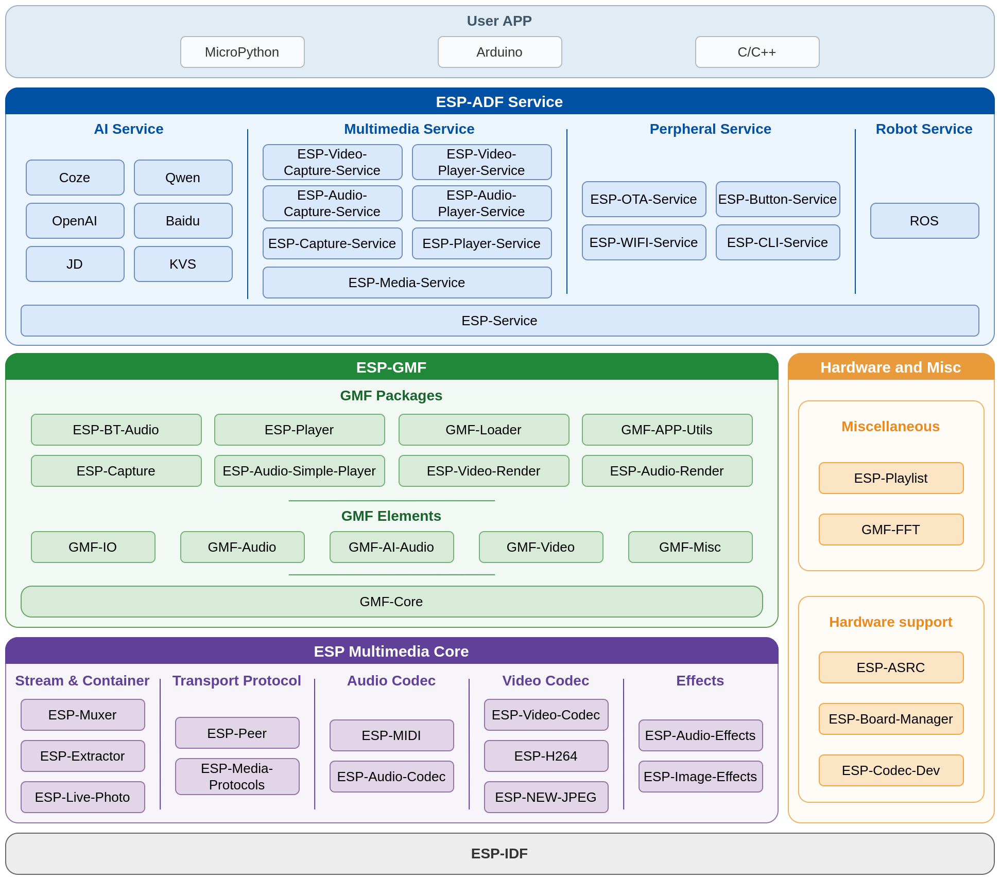

.. _index-sec-00:

Espressif Advanced Development Framework Guide
==============================================

:link_to_translation:`zh_CN:[中文]`

.. list-table::
   :widths: 33 33 34

   * - |Get Started|_
     - |Multimedia Examples|_
     - |Solution Center|_
   * - `Get Started`_
     - `Multimedia Examples`_
     - `Solution Center`_
   * - |Multimedia Basic Components|_
     - |Upper-layer Components|_
     - |Multimedia Development Boards|_
   * - `Multimedia Basic Components`_
     - `Upper-layer Components`_
     - `Multimedia Development Boards`_

.. _Get Started: get-started/index.html

.. _Multimedia Development Boards: multimedia-boards/index.html

.. _Multimedia Examples: multimedia-examples/index.html

.. _Multimedia Basic Components: basic-components/index.html

.. _Upper-layer Components: multimedia-services/index.html

.. _Solution Center: solution-center/index.html

.. _index-sec-01:

.. rubric:: Overview

`ESP-ADF <https://github.com/espressif/esp-adf>`__\ (Espressif Advanced Development Framework) is Espressif's official advanced application-layer development framework. Built on `ESP-IDF <https://github.com/espressif/esp-idf>`__ and `ESP-GMF <https://github.com/espressif/esp-gmf>`__, it targets multimedia application development for audio, video, and IoT products. ESP-ADF v3.0 aims at product-grade features, modular services, and low resource usage, and provides solution components for audio/video capture and playback, AI voice, Bluetooth audio, multimedia transmission, and more. Application components are published to the `IDF Component Registry <https://components.espressif.com/>`__ and can be fetched on demand after declaring dependencies in a project.

    Espressif Advanced Development Framework

.. _index-sec-02:

.. rubric:: What's New

- **Based on ESP-GMF**: The media processing chain is rebuilt with `ESP-GMF <https://github.com/espressif/esp-gmf>`__, unifying audio, video, image, and general streaming data processing within a single framework
- **Independent components**: Functional components can be integrated and run independently without cloning the entire repository
- **Product services**: Provides modular services such as audio playback, video playback, and battery monitoring
- **MCP support**: Product services can be invoked through the Model Context Protocol (MCP)
- **Multi-product coverage**: Targets audio, video, and IoT product scenarios
- **Resource usage optimization**: Optimized for low memory and low CPU usage
- **Multi-language applications**: Supports MicroPython, Arduino, and C/C++ development

.. _index-sec-03:

.. rubric:: Relationship with Previous ESP-ADF Versions

ESP-ADF v3.0 is an architectural upgrade and is not compatible with ESP-ADF v2.x in API or behavior. Branch positioning is as follows:

- ``master``: The main development line of ESP-ADF v3.0, providing components and product-level solution examples based on ESP-GMF
- ``release/v2.x``: The maintenance branch of the previous ESP-ADF (v2), which receives only bug fixes and minor enhancements

.. toctree::
    :hidden:

    get-started/index
    multimedia-examples/index
    solution-center/index
    basic-components/index
    multimedia-services/index
    knowledge-center/index
    multimedia-boards/index
    tools/index
    resources
    COPYRIGHT
    Disclaimer and Copyright Notice <disclaimer-and-copyright>
    english-chinese-glossary
    about
