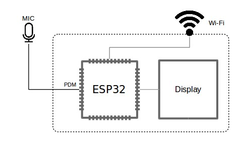
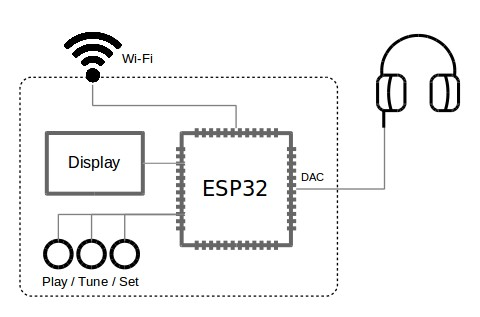
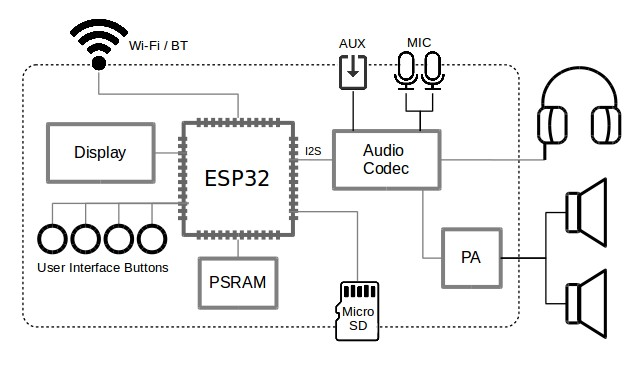

Project Design
**************

:link_to_translation:`zh_CN:[中文]`

Project selection is based on inputs, outputs, and chip model. Inputs include microphones, cameras, storage, the network, and user actions. Outputs include speakers, displays, storage, the network, and status indicators.

Inputs and Outputs
==================

Input

* An analog microphone uses an external codec for analog-to-digital conversion. A digital microphone uses a PDM or I2S interface.
* The camera uses a DVP, MIPI CSI, or USB interface.
* Local audio and video files are stored on microSD or on-chip flash.
* Streaming media is obtained over Wi-Fi or Ethernet.
* Wireless audio uses Classic Bluetooth or LE Audio.
* User actions come from buttons or a touch screen.

Output

* An external codec or the on-chip DAC drives headphones, an amplifier, and speakers.
* The LCD shows video and UI.
* Recordings are written to microSD or flash.
* Upload uses Wi-Fi, Ethernet, or WebRTC.
* Audio is sent to a headset or speaker over Classic Bluetooth or LE Audio.
* LEDs, LED strips, or haptic feedback indicate status.

Main processor

The chip captures data, encodes or decodes it, and sends or receives it over the network. ESP32-P4 uses hardware JPEG, H.264, and PPA to reduce CPU load.

Chips and Modules
=================

Choose the model by feature set. Prefer a chip or module with PSRAM. When Wi-Fi, Bluetooth, and media run at the same time, internal RAM is usually not enough. Filter chips and modules with the `product selector <https://products.espressif.com/#/product-selector>`__.

.. list-table::
   :header-rows: 1
   :widths: 36 28 36

   * - Scenario
     - Suggested model
     - Notes
   * - Audio playback, internet radio
     - ESP32, ESP32-S2, ESP32-C3
     - An external codec has higher quality; ESP32 and ESP32-S2 provide an on-chip DAC
   * - Classic Bluetooth audio
     - ESP32, ESP32-S31
     - ESP32 and ESP32-S31 support Classic Bluetooth
   * - Wake word, AEC, dual microphones
     - ESP32-S3, ESP32-S31, ESP32-P4
     - PSRAM required
   * - A/V playback, intercom, high-resolution codecs
     - ESP32-P4
     - Larger PSRAM; MIPI CSI / DSI; hardware JPEG / H.264 / PPA
   * - LED strips and other low-cost peripherals
     - ESP32-C3
     - Low compute demand; no PSRAM

See :doc:`/multimedia-boards/index` for development boards.

Software Stack
==============

Board peripherals are initialized by ``esp_board_manager`` and ``esp_codec_dev``. See :doc:`/basic-components/hardware-support/esp-board-manager` and :doc:`/basic-components/hardware-support/esp-codec-dev`.

Media processing uses a GMF pipeline of elements. See :doc:`/basic-components/esp-gmf/index`.

Playback, capture, and networking are provided by :doc:`/multimedia-services/index`.

.. only:: html

   .. mermaid::

      flowchart LR
          App["App and product services"] --> Gmf["GMF pipeline"]
          App --> Board["esp_board_manager and esp_codec_dev"]
          Gmf --> Board
          Board --> Soc["SoC and peripherals"]

Hardware Forms
==============

Minimum Peripherals
-------------------

An ESP chip uses I2S, PDM, or the DAC to build a product with few extra parts. A digital microphone captures voice and sends it to a cloud service over Wi-Fi.

    Audio project example: send voice commands to a cloud service

The on-chip DAC is used for an internet radio player. Audio quality is lower than with an external codec.

    Audio project example: internet radio player

Typical Product
---------------

For higher audio quality or more I/O, use an external I2S codec for analog input and output. A codec provides a preamplifier, a headphone amplifier, and multiple analog ports. Add a camera and an LCD when audio and video run together.

Board examples are :doc:`/multimedia-boards/dev-boards/user-guide-esp32-s3-korvo-2` and `ESP32-P4 Function EV <https://docs.espressif.com/projects/esp-dev-kits/en/latest/esp32p4/esp32-p4x-function-ev-board/user_guide.html>`__.

    Typical audio project example

Solution Mapping
================

Product forms and the software/hardware stack are in :doc:`/solution-center/index`.

* :doc:`/solution-center/smart-speaker-alarm`
* :doc:`/solution-center/picture-book`
* :doc:`/solution-center/voice-call`
* :doc:`/solution-center/video-intercom`
* :doc:`/solution-center/esp-webrtc-solution`
* :doc:`/solution-center/bluetooth-audio`
* :doc:`/solution-center/audio-led-strip`
* :doc:`/solution-center/video-led-strip`
* :doc:`/solution-center/ai-companion`
