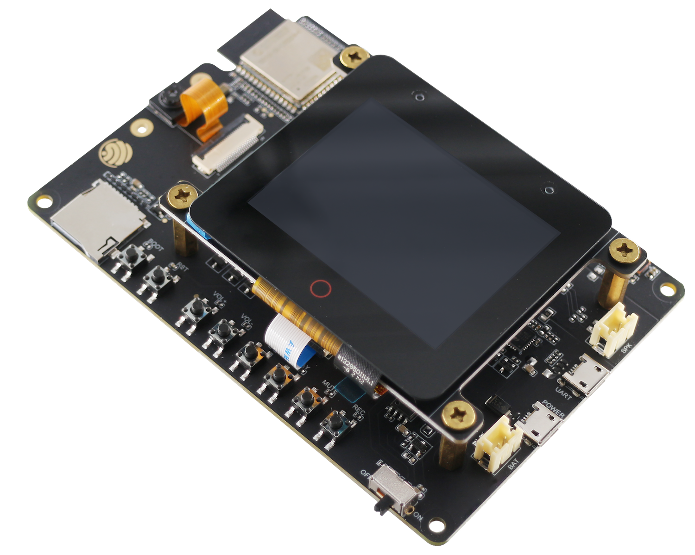
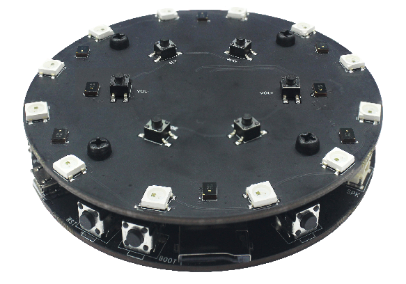
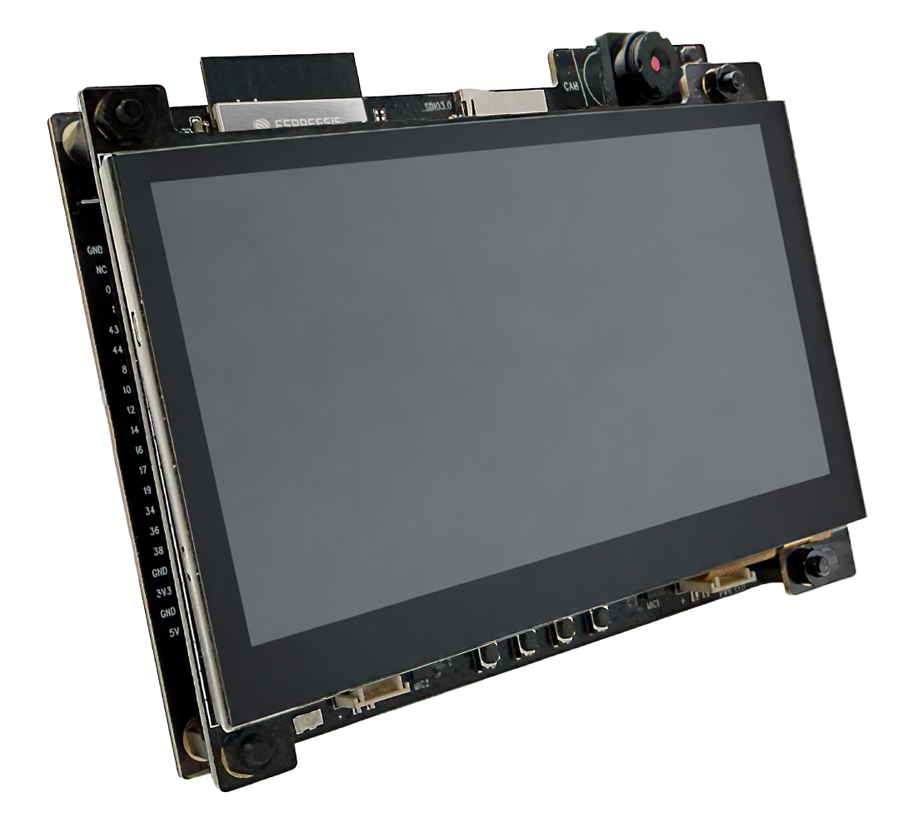
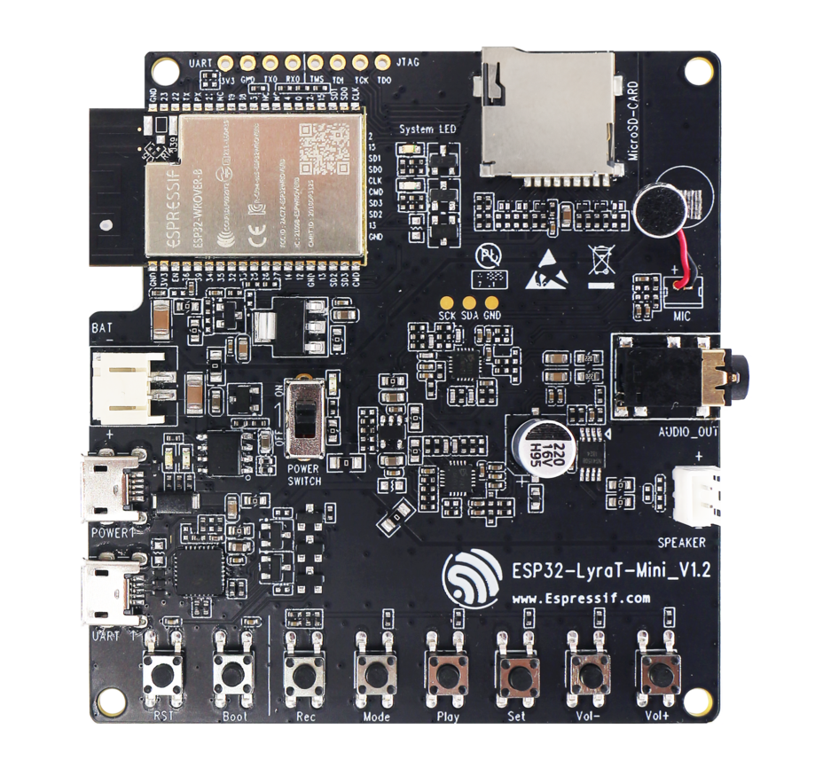

Multimedia Development Boards
==============================

:link_to_translation:`zh_CN:[中文]`

Below are getting started guides and hardware details of audio development boards designed by Espressif.

=============================================  =============================================
|Getting Started with ESP32-S31-Korvo-1|_      |Getting Started with ESP32-P4X-Function-EV|_
=============================================  =============================================
`Getting Started with ESP32-S31-Korvo-1`_      `Getting Started with ESP32-P4X-Function-EV`_
---------------------------------------------  ---------------------------------------------
|Getting Started with ESP32-S3-Korvo-2|_       |Getting Started with ESP32-S3-Korvo-1|_
---------------------------------------------  ---------------------------------------------
`Getting Started with ESP32-S3-Korvo-2`_       `Getting Started with ESP32-S3-Korvo-1`_
---------------------------------------------  ---------------------------------------------
|Getting Started with ESP32-LyraT-Mini|_
---------------------------------------------  ---------------------------------------------
`Getting Started with ESP32-LyraT-Mini`_
=============================================  =============================================

.. _Getting Started with ESP32-S3-Korvo-2: dev-boards/user-guide-esp32-s3-korvo-2.html

.. _Getting Started with ESP32-S3-Korvo-1: https://github.com/espressif/esp-skainet/blob/master/docs/en/hw-reference/esp32s3/user-guide-korvo-1.md

.. _Getting Started with ESP32-S31-Korvo-1: https://docs.espressif.com/projects/esp-dev-kits/en/latest/esp32s31/esp32-s31-korvo-1/user_guide.html

.. |Getting Started with ESP32-P4X-Function-EV| image:: ../../_static/esp32-p4x-function-ev-board-isometric_v1.6.png
.. _Getting Started with ESP32-P4X-Function-EV: https://docs.espressif.com/projects/esp-dev-kits/en/latest/esp32p4/esp32-p4x-function-ev-board/user_guide.html

.. _Getting Started with ESP32-LyraT-Mini: dev-boards/get-started-esp32-lyrat-mini.html

.. toctree::
    :maxdepth: 1
    :hidden:

    ESP32-S3-Korvo-2 V3.1 <dev-boards/user-guide-esp32-s3-korvo-2>
    ESP32-S3-Korvo-2 V3.0 <dev-boards/user-guide-esp32-s3-korvo-2-v3.0>
    ESP32-S3-Korvo-2-LCD V1.0 <dev-boards/user-guide-esp32-s3-korvo-2-lcd>
    ESP32-LyraT-Mini V1.2 Getting Started Guide <dev-boards/get-started-esp32-lyrat-mini>
    ESP32-LyraT-Mini V1.2 Hardware Reference <dev-boards/board-esp32-lyrat-mini-v1.2>
    ESP32-LyraT V4.3 Getting Started Guide <dev-boards/get-started-esp32-lyrat>
    ESP32-LyraT V4.3 Hardware Reference <dev-boards/board-esp32-lyrat-v4.3>
    ESP32-LyraT V4.2 Getting Started Guide <dev-boards/get-started-esp32-lyrat-v4.2>
    ESP32-LyraT V4 Getting Started Guide <dev-boards/get-started-esp32-lyrat-v4>
    ESP32-LyraTD-MSC V2.2 Getting Started Guide <dev-boards/get-started-esp32-lyratd-msc>
    ESP32-Korvo-DU1906 <dev-boards/get-started-esp32-korvo-du1906>
    ESP32-C3-Lyra V2.0 <dev-boards/user-guide-esp32-c3-lyra>
    Hardware Design Guidelines (PDF) <https://www.espressif.com/sites/default/files/documentation/esp32_audio_design_guidelines__en.pdf>
