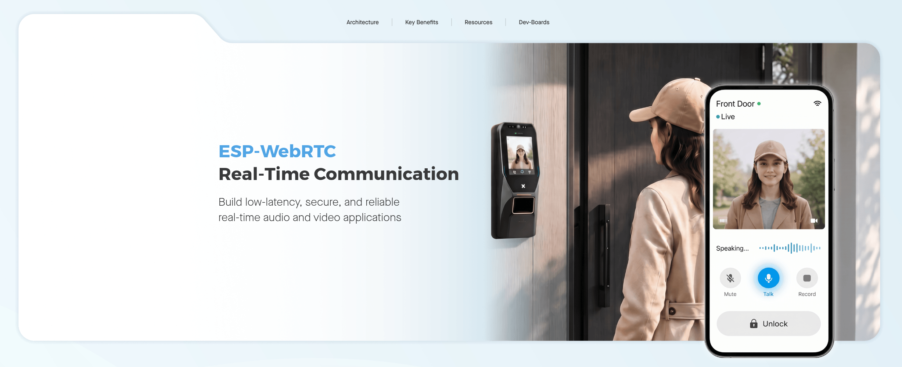

ESP-WebRTC Real-Time Communication Solution
===========================================

:link_to_translation:`zh_CN:[中文]`

|

Introduction
------------

`ESP-WebRTC-Solution <https://github.com/espressif/esp-webrtc-solution>`__ is Espressif's WebRTC application development solution for ESP32 series SoCs. It includes core code such as the WebRTC orchestration layer ``esp_webrtc``\ , the PeerConnection implementation ``esp_peer``\ , and the audio/video playback component ``av_render``\ , and provides a series of example applications under the ``solutions/`` directory that can be directly compiled and flashed, covering scenarios such as voice assistants, video doorbells and calls, cloud streaming and SFU integration, and RTSP/RTMP bridging. See the README in each example's own directory for hardware requirements and build steps.

Core Components
--------------------

- ``esp_webrtc``\ : The WebRTC application orchestration layer, which combines signaling, PeerConnection, and the media system, exposing interfaces such as ``esp_webrtc_start`` and ``esp_webrtc_stop``\ . Once the audio/video codec parameters are configured, connection establishment, capture and sending, and reception and rendering are all handled automatically internally.
- ``esp_peer``\ : The concrete PeerConnection implementation. The code is enhanced based on the open-source project `libpeer <https://github.com/sepfy/libpeer>`__\ , supporting TURN (RFC 5766, RFC 8656), parallel probing of multiple candidate addresses, dual Controlling/Controlled roles, RTP NACK retransmission, and SCTP SACK and large-data fragment reassembly. Sending and receiving each run in independent tasks.
- Signaling abstraction: The three interfaces ``start``\ , ``send_msg``\ , and ``stop``\ , defined by ``esp_peer_signaling_impl_t``\ , shield the differences between specific signaling protocols. Each solution connects to signaling implementations such as AppRTC-style WebSocket, WHIP, Amazon KVS, Janus, Kurento, or OpenAI Realtime as needed.
- ``esp_capture``\ : Responsible for audio/video capture, published as an independent component in the `ESP Component Registry <https://components.espressif.com/components/espressif/esp_capture/>`__\ .
- ``av_render``\ : A push-style audio/video player. Audio and video are each processed in independent decoding threads, and after alignment by the synchronization module, are handed over to audio (I2S) and video (LCD, etc.) rendering output.

Technical Architecture
----------------------

``esp_webrtc`` organizes the connection establishment process into three layers: signaling, PeerConnection, and the media system. Signaling is responsible for discovering the peer and exchanging SDP and ICE information; PeerConnection is implemented by ``esp_peer``\ , which collects candidate addresses based on ICE, completes hole punching, and establishes the connection; the media system sends the audio/video data captured by ``esp_capture`` through the PeerConnection, and passes the received media stream to ``av_render`` for playback. Users only need to configure the audio/video codec parameters, and the data transfer and state synchronization between the three layers are handled automatically by ``esp_webrtc``\ . When a new signaling server needs to be adapted, only the ``esp_peer_signaling_impl_t`` interface needs to be implemented, and the PeerConnection and media system parts are unaffected.

In addition to the media stream, PeerConnection also supports an SCTP-based data channel, used for sending and receiving custom data that does not go through the audio/video codec path, such as the call control commands of ``videocall_demo`` and the chat text of ``peer_demo``\ .

The overall timing of connection establishment is as follows:

.. only:: html

   .. mermaid::

      sequenceDiagram
          participant App as "Application"
          participant Webrtc as "esp_webrtc"
          participant Sig as "signaling"
          participant Peer as "esp_peer"

          App->>Webrtc: esp_webrtc_start
          Webrtc->>Sig: Start signaling connection
          Sig-->>Webrtc: Report ICE information
          Webrtc->>Peer: Open PeerConnection
          Sig-->>Webrtc: Notify signaling connected
          Webrtc->>Peer: Initiate new connection
          Peer-->>Webrtc: Report local SDP
          Webrtc->>Sig: Send SDP
          Sig-->>Webrtc: Forward peer SDP
          Webrtc->>Peer: Set remote SDP
          Peer-->>Webrtc: Connection established

The signaling connection, ICE negotiation, and SDP exchange are all chained together by ``esp_webrtc``\ , and the application layer only needs to be aware of the two actions of starting and stopping.

Solution List
--------------------

The solutions under the ``solutions/`` directory of the repository are divided into the following four categories by purpose.

Learning and API Basics
^^^^^^^^^^^^^^^^^^^^^^^^

- `peer_demo <https://github.com/espressif/esp-webrtc-solution/tree/main/solutions/peer_demo>`__\ : A minimal example built from scratch using only the ``esp_peer`` API. After connection establishment, it periodically sends and receives chat text through the data channel.

Cloud, Streaming, and SFU Integration
^^^^^^^^^^^^^^^^^^^^^^^^^^^^^^^^^^^^^

- `openai_demo <https://github.com/espressif/esp-webrtc-solution/tree/main/solutions/openai_demo>`__\ : Based on the OpenAI Realtime WebRTC ephemeral token flow, it establishes a real-time voice session with the OpenAI Realtime service, supporting function calls triggered by voice commands.
- `whip_demo <https://github.com/espressif/esp-webrtc-solution/tree/main/solutions/whip_demo>`__\ : Uses the WHIP protocol to push audio/video to the server.
- `kvs_master <https://github.com/espressif/esp-webrtc-solution/tree/main/solutions/kvs_master>`__\ : Connects to Amazon Kinesis Video Streams signaling in the MASTER role, receiving the VIEWER's SDP offer and answering it.
- `kms_demo <https://github.com/espressif/esp-webrtc-solution/tree/main/solutions/kms_demo>`__\ : Acts as the streaming end for Kurento Media Server, allowing browsers to view the footage through KMS.
- `janus_demo <https://github.com/espressif/esp-webrtc-solution/tree/main/solutions/janus_demo>`__\ : Connects to the VideoRoom plugin through Janus HTTP signaling, acting as the publishing end for streaming.

Productized Examples
^^^^^^^^^^^^^^^^^^^^

- `doorbell_demo <https://github.com/espressif/esp-webrtc-solution/tree/main/solutions/doorbell_demo>`__\ : A doorbell application implemented with reference to the AppRTC signaling method, supporting remote control, real-time video, and two-way voice.
- `doorbell_local <https://github.com/espressif/esp-webrtc-solution/tree/main/solutions/doorbell_local>`__\ : A local doorbell solution in which the ESP device itself takes on the signaling service, and additionally integrates pedestrian detection capability.
- `videocall_demo <https://github.com/espressif/esp-webrtc-solution/tree/main/solutions/videocall_demo>`__\ : A device-to-device video call application implemented based on the data channel.

Bridging and RTSP/RTMP
^^^^^^^^^^^^^^^^^^^^^^

- `webrtc_usb_camera <https://github.com/espressif/esp-webrtc-solution/tree/main/solutions/webrtc_usb_camera>`__\ : A WebRTC-to-USB UVC bridging solution. The browser sends media data through WebRTC, and the host recognizes the ESP device as a standard USB camera.
- `rtsp_demo <https://github.com/espressif/esp-webrtc-solution/tree/main/solutions/rtsp_demo>`__\ : Starts an RTSP server or streaming end on the device side, used for media stream transmission within a local area network.
- `rtmp_demo <https://github.com/espressif/esp-webrtc-solution/tree/main/solutions/rtmp_demo>`__\ : Captures audio/video from the device and pushes it to the server via RTMP.

Hardware Applicability
--------------------------

Video-based solutions (doorbell, video call, and streaming scenarios such as WHIP, KVS, KMS, and Janus) are by default verified based on the ESP32P4-Function-EV-Board, which comes with an SC2336 camera and meets the requirements for video capture and hardware codec. Solutions that only use audio and the data channel (such as ``peer_demo`` and ``openai_demo``\ ) have lower hardware requirements and can run on ordinary Wi-Fi-capable development boards; ``openai_demo`` is by default verified based on the ESP32-S3-Korvo-2, in order to obtain echo cancellation capability. Refer to the Hardware Requirements section of each solution's README for the specific model.

References
--------------------

- Repository address: `espressif/esp-webrtc-solution <https://github.com/espressif/esp-webrtc-solution>`__
- See the README in each solution's own directory for hardware wiring, configuration items, and build steps.
