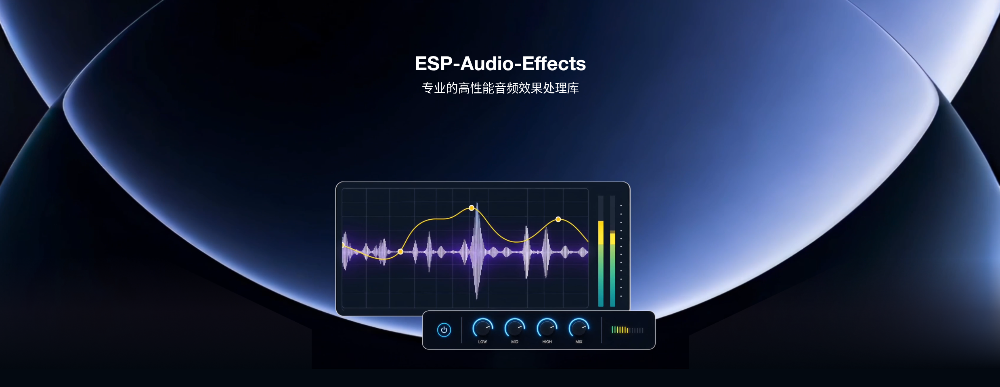

ESP-Audio-Effects
=================

:link_to_translation:`en:[English]`

|

ESP-Audio-Effects（ESP_AUDIO_EFFECTS）是乐鑫为 ESP 系列 SoC 提供的音频处理模块集合，用于修改、增强或塑造音频信号。各模块接口一致，可单独使用，也可串联组成处理链路。

当前模块包括：自动电平控制（ALC）、采样率转换、位深转换、声道转换、均衡（EQ）、数据交织（Data Weaver）、混音（Mixer）、淡入淡出（Fade）、Sonic 变速/变调、动态范围控制（DRC）、多频段动态范围压缩（MBC）、啸叫抑制（HOWL）、混响（Reverb）以及延迟（Delay）。

处理能力分为四类：

- **格式转换**：采样率、位深、声道转换，用于在设备与编解码器之间对齐 PCM 格式。
- **数据路由**：数据交织器完成多声道交织与拆分；混音器按权重融合多路音源，例如背景音乐与语音提示。
- **动态控制**：ALC、DRC 与多频段压缩器用于稳定音量、抑制削波，并按频段调整动态范围。
- **音效处理**：均衡、淡入淡出、变速变调、啸叫抑制、混响与延迟，用于调音与空间感处理。

多数模块在 ESP32-S3（240 MHz）上 CPU 占用低于 1%，内存以 KB 计；计算量最高的多频段压缩器 CPU 占用在 5% 以内。参数可在运行时调整：均衡器可配置滤波器、频率与增益；DRC 与多频段压缩器可配置增益曲线及攻击、释放、保持时间。组件覆盖 ESP32 系列 SoC，可与 ESP-IDF、ESP-GMF 工程一起使用。

相关链接：

- `组件管理器 <https://components.espressif.com/components/espressif/esp_audio_effects>`__
- `GitHub 仓库 <https://github.com/espressif/esp-adf-libs/tree/master/esp_audio_effects>`__
- `技术博客 <https://developer.espressif.com/blog/2025/07/overview-of-esp-audio-effects>`__
