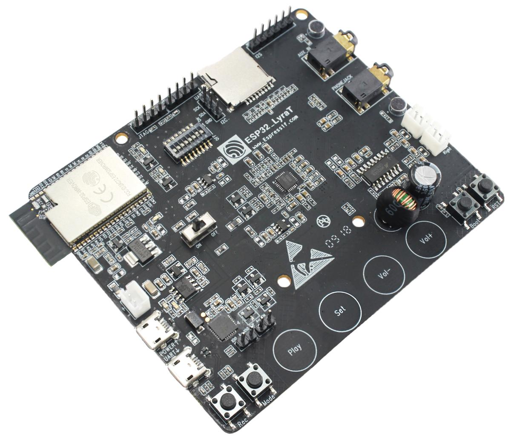
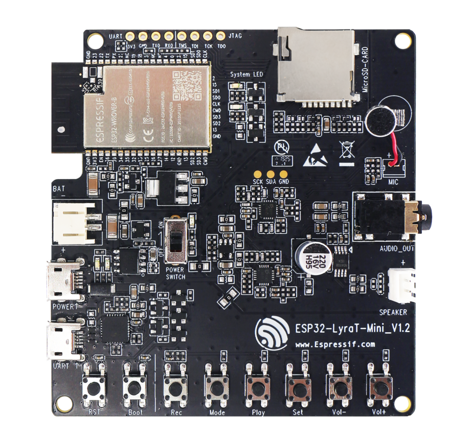
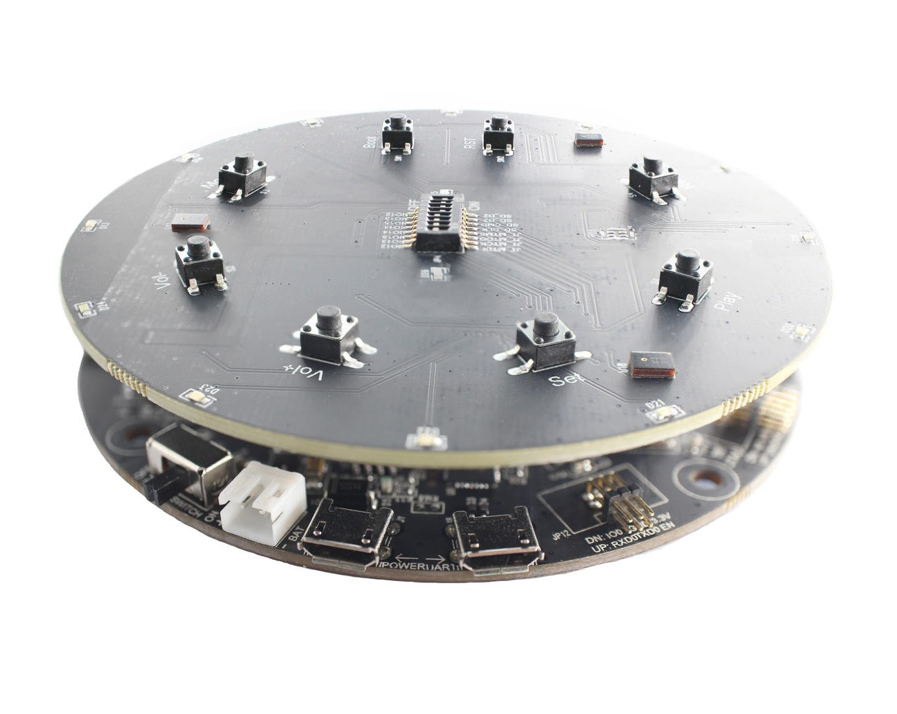
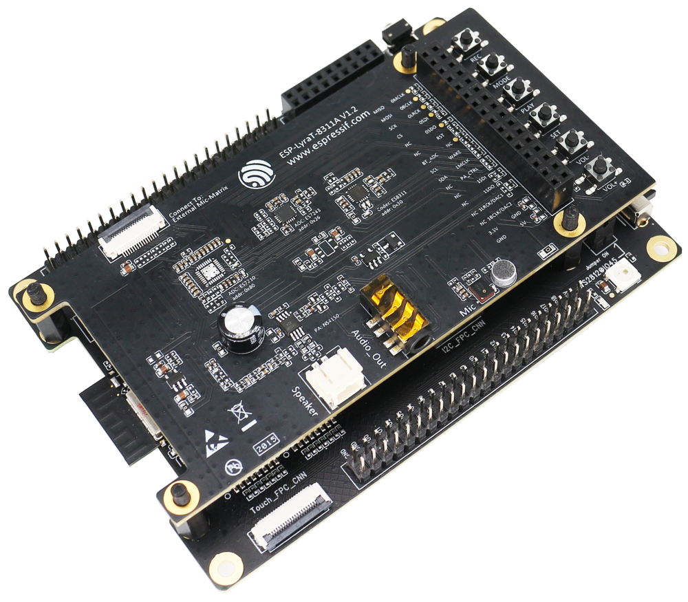
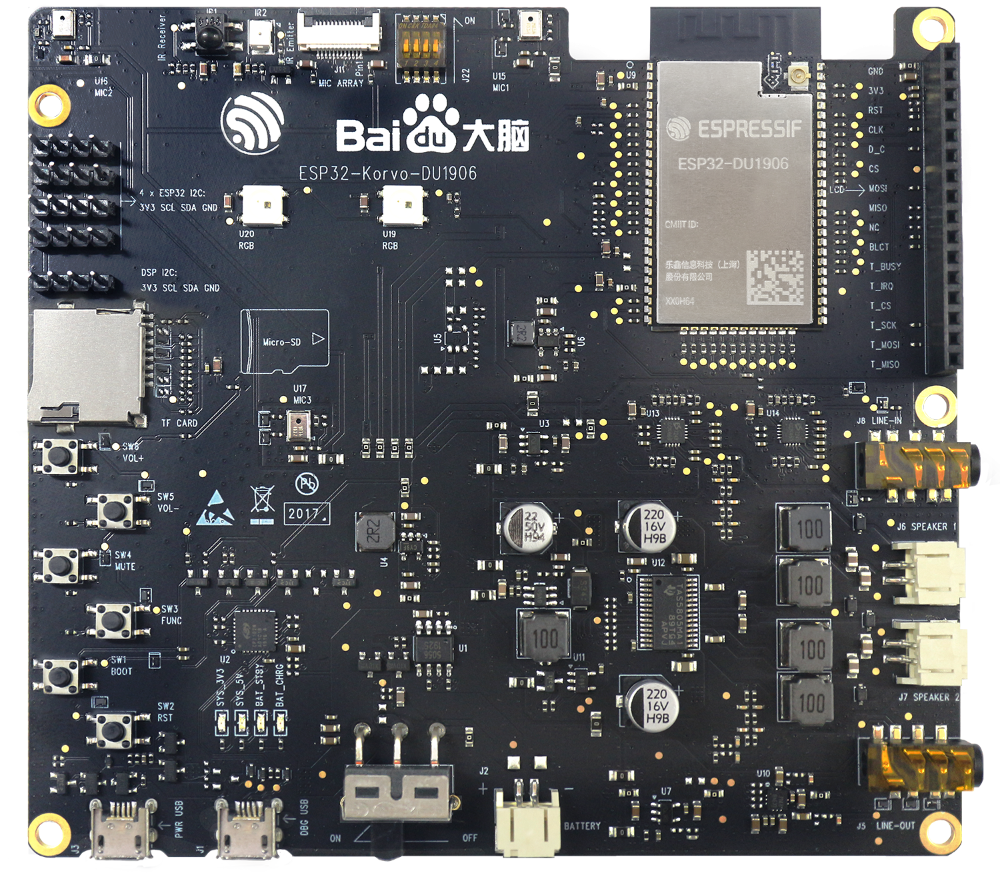
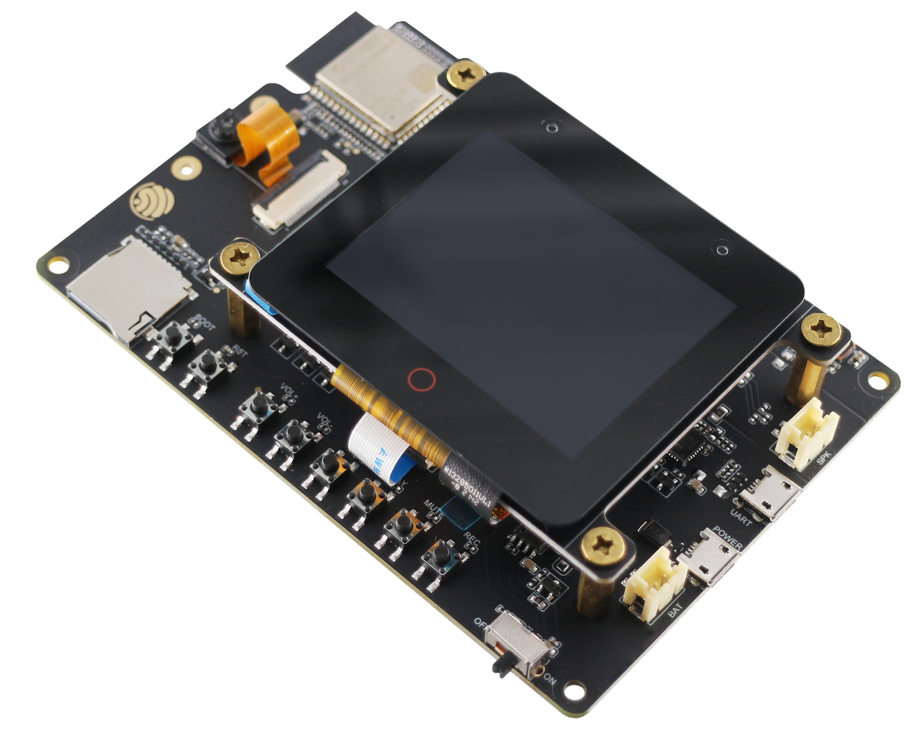
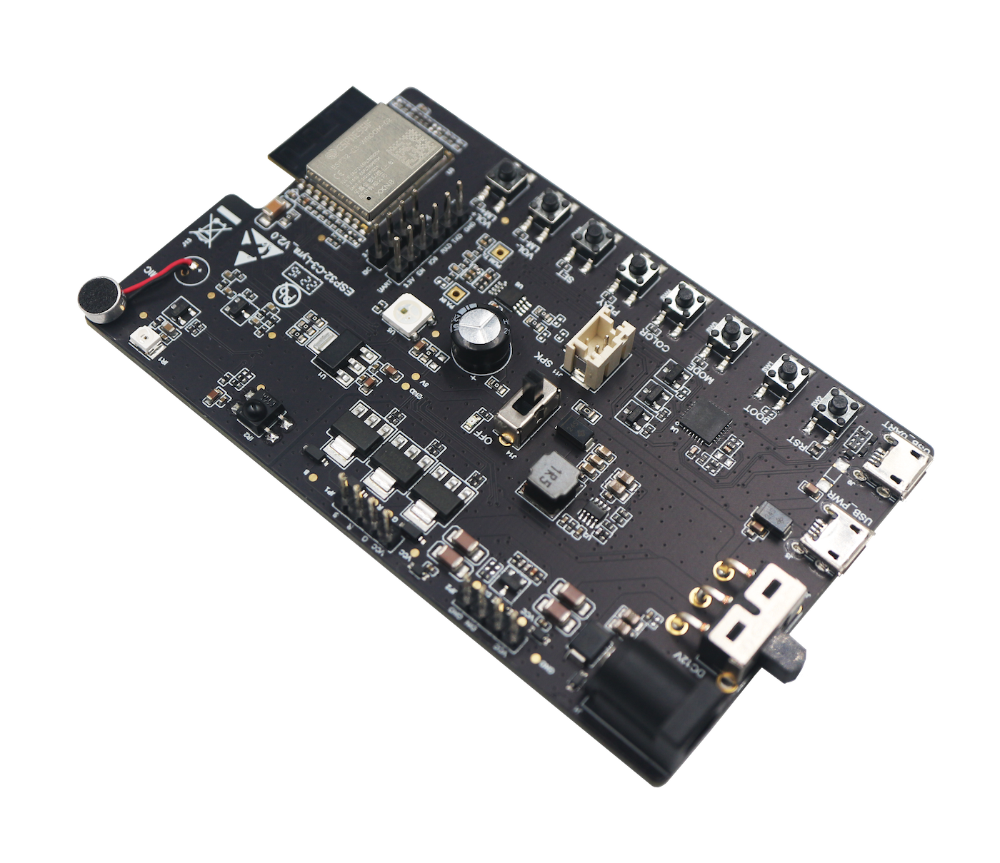

开发板
*******

以下是乐鑫设计的音频开发板的入门指南和硬件参考。

=============================================  =============================================
|ESP32-LyraT 入门指南|_                         |ESP32-LyraT-Mini 入门指南|_
=============================================  =============================================
`ESP32-LyraT 入门指南`_                         `ESP32-LyraT-Mini 入门指南`_
`ESP32-LyraT 硬件参考`_                         `ESP32-LyraT-Mini 硬件参考`_
---------------------------------------------  ---------------------------------------------
|ESP32-LyraTD-MSC 入门指南|_                    |ESP32-S2-Kaluga-1-Kit 入门指南|_
---------------------------------------------  ---------------------------------------------
`ESP32-LyraTD-MSC 入门指南`_                    `ESP32-S2-Kaluga-1-Kit 入门指南`_
---------------------------------------------  ---------------------------------------------
|ESP32-Korvo-DU1906 入门指南|_                  |ESP32-S3-Korvo-2 入门指南|_
---------------------------------------------  ---------------------------------------------
`ESP32-Korvo-DU1906 入门指南`_                  `ESP32-S3-Korvo-2 入门指南`_
---------------------------------------------  ---------------------------------------------
|ESP32-C3-Lyra 入门指南|_
---------------------------------------------  ---------------------------------------------
`ESP32-C3-Lyra 入门指南`_
=============================================  =============================================

.. _ESP32-LyraT 入门指南: get-started-esp32-lyrat.html
.. _ESP32-LyraT 硬件参考: board-esp32-lyrat-v4.3.html

.. _ESP32-LyraT-Mini 入门指南: get-started-esp32-lyrat-mini.html
.. _ESP32-LyraT-Mini 硬件参考: board-esp32-lyrat-mini-v1.2.html

.. _ESP32-LyraTD-MSC 入门指南: get-started-esp32-lyratd-msc.html

.. _ESP32-S2-Kaluga-1-Kit 入门指南: https://docs.espressif.com/projects/esp-idf/en/latest/esp32s2/hw-reference/esp32s2/user-guide-esp32-s2-kaluga-1-kit.html

.. _ESP32-Korvo-DU1906 入门指南: get-started-esp32-korvo-du1906.html

.. _ESP32-S3-Korvo-2 入门指南: user-guide-esp32-s3-korvo-2.html

.. _ESP32-C3-Lyra 入门指南: user-guide-esp32-c3-lyra.html

.. toctree::
    :maxdepth: 1
    :hidden:

    get-started-esp32-lyrat-mini
    board-esp32-lyrat-mini-v1.2
    get-started-esp32-lyrat
    board-esp32-lyrat-v4.3
    get-started-esp32-lyrat-v4.2
    get-started-esp32-lyrat-v4
    get-started-esp32-lyratd-msc
    get-started-esp32-korvo-du1906
    user-guide-esp32-s3-korvo-2
    user-guide-esp32-s3-korvo-2-v3.0
    user-guide-esp32-s3-korvo-2-lcd
    user-guide-esp32-c3-lyra
