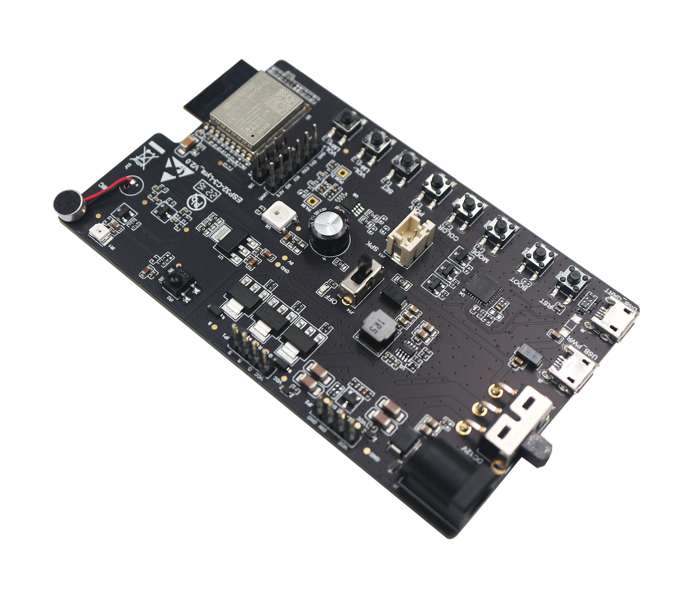
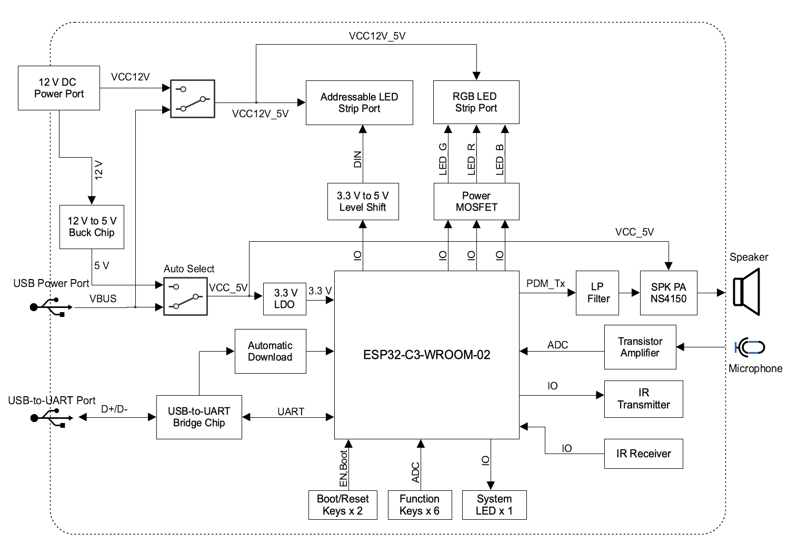
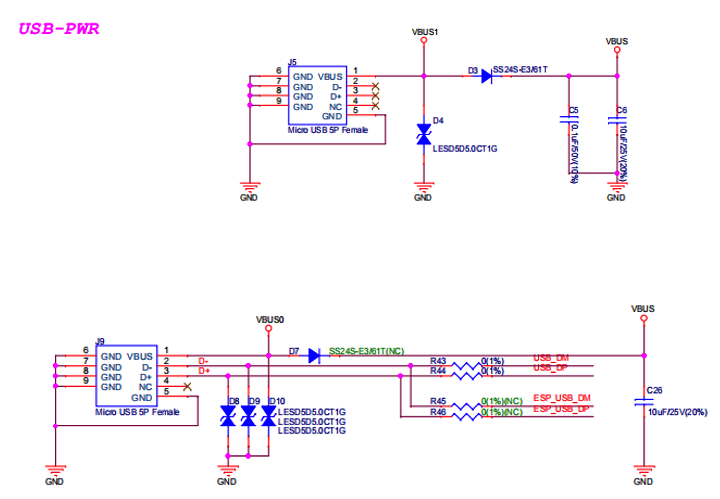
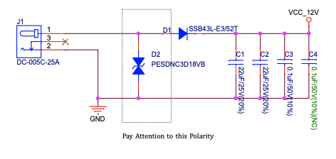
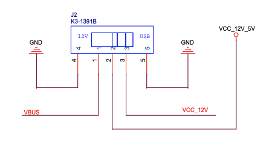
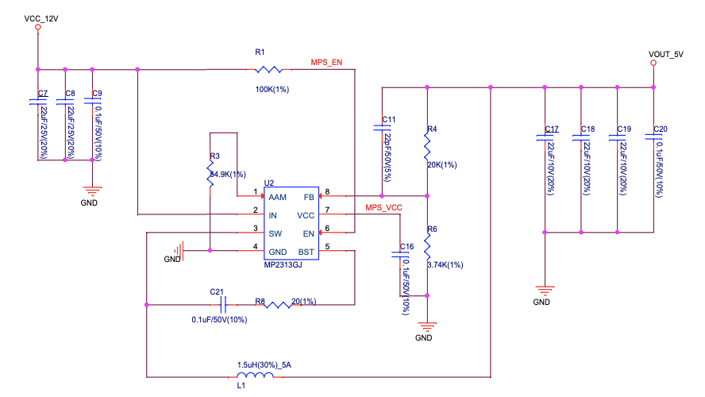
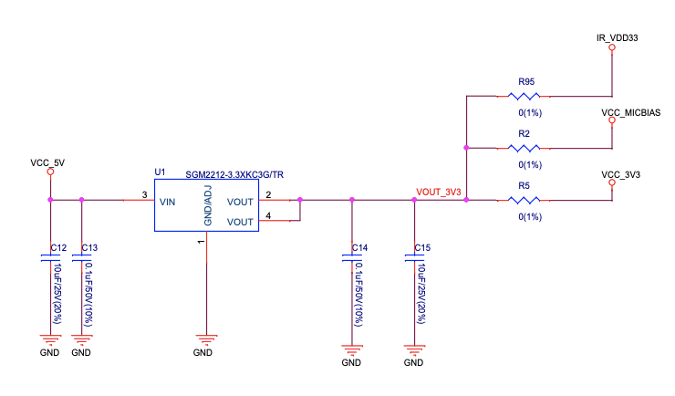

===================
ESP32-C3-Lyra V2.0
===================

:link_to_translation:`en: [English]`

本指南将帮助您快速上手 ESP32-C3-Lyra V2.0，并提供该款开发板的详细信息。

本指南包括如下内容：

- `开发板概述`_：简要介绍了开发板的软件和硬件。
- `开始开发应用`_：介绍了应用程序开发过程中的软硬件设置。
- `硬件参考`_：详细介绍了开发板的硬件。
- `硬件版本`_：列出了硬件历史版本和已知问题，并链接至历史版本开发板的入门指南。
- `订购信息`_：提供了购买开发板的途径。
- `相关文档`_：列出了相关文档的链接。

开发板概述
==============
 
ESP32-C3-Lyra 是乐鑫基于 ESP32-C3 推出的音频灯控开发板，该开发板对麦克风、扬声器以及 LED 灯带的控制，可满足客户对超高性价比的音频播报机以及律动灯带的产品开发需求。

    搭载 ESP32-C3-WROOM-02 模组的 ESP32-C3-Lyra

特性列表
------------

该开发板包括以下主要特性：

- **嵌入式模组：** 板载 ESP32-C3-WROOM-02 模组，外接 4 MB SPI flash
- **音频：** 内置 ECM 麦克风、扬声器功率放大器、扬声器连接器
- **LED 灯带连接器：** 支持连接两种类型的灯带，一种是可寻址的 LED 灯带，一种是 RGB LED 灯带
- **红外控制：** 支持红外 (IR) 发射和接收
- **按键：** 开机键、复位键、六个功能键 (MODE、COLOR、PLAY/PAUSE、SET、VOL+/LM+、VOL-/LM-)
- **USB：** 1 个 USB 电源端口，1 个 USB 转 UART 端口
- **电源：** 5 V USB 供电或 12 V 直流供电

功能框图
-------------

ESP32-C3-Lyra 的主要组件和连接方式如下图所示。

    ESP32-C3-Lyra 功能框图（点击放大）

组件介绍
-------------------------

.. figure:: https://dl.espressif.com/dl/schematics/esp32-c3-lyra-layout-front.png
    :align: center
    :width: 2116
    :height: 1496    
    :scale: 34%    
    :alt: ESP32-C3-Lyra - 正面（点击放大）

    ESP32-C3-Lyra - 正面（点击放大）

以下按照顺时针的顺序依次介绍开发板上的主要组件。

.. list-table::
   :widths: 30 70
   :header-rows: 1

   * - 主要组件
     - 介绍
   * - ESP32-C3-WROOM-02 模组
     - ESP32-C3-WROOM-02 模组是一款基于 ESP32-C3 开发的通用 Wi-Fi 和蓝牙 LE 模组。ESP32-C3 是一款运行频率高达 160 MHz 的 32 位 RISC-V 单核处理器。该高性能模组集成众多外设，适用于智能家居、工业自动化、医疗保健、消费电子等应用场景。模组包含一个 4 MB 的外部 SPI flash 和一个板载 PCB 天线。ESP32-C3-WROOM-02U 模组也兼容此开发板，但需要外接天线。
   * - 扬声器功率放大器 (Speaker PA Chip)
     - NS4150 是一款 EMI、3 W 单声道 D 类音频功率放大器，用于放大来自 ESP32-C3 PDM_TX 的音频信号，以驱动扬声器。
   * - 扬声器输出端口 (Speaker Output Port)
     - 用于连接扬声器的端口。推荐使用 4 欧姆和 3 瓦的扬声器。管脚间距为 2.00 毫米/0.08 英寸。
   * - 功能按键 (Function Press Keys)
     - 六个功能按键，包括 MODE、COLOR、PLAY/PAUSE、SET、VOL+/LM+、VOL-/LM-。它们与 **ESP32-C3-WROOM-02 Module** 模组连接，可借助专门的 API 来开发和测试音频应用程序的用户界面或 LED 灯带。
   * - Boot/Reset按键 (Boot/Reset Press Keys)
     - Boot：按住 Boot 键并短按 Reset 按钮，启动固件上传模式，通过串口上传固件。Reset：单独按下此键，重置系统。
   * - USB-to-UART 端口 (USB-to-UART Port)
     - 用于 PC 端与 ESP32-C3-WROOM-02 模组的通信。
   * - USB-to-UART 桥接芯片 (USB-to-UART Bridge Chip)
     - 单芯片 USB-UART 桥接器 CP2102N 为软件下载和调试提供高达 3 Mbps 的传输速率。
   * - USB 电源端口 (USB Power Port)
     - 为整个系统提供电源。建议使用至少 5 V/2 A 电源适配器供电，以保证供电稳定。
   * - 系统电源开关 (System Power Switch)
     - 系统电源开/关旋钮。 将其切换到 **ON** 会打开 5 V 系统电源，切换到 **OFF** 则关闭 5 V 系统电源。
   * - LED 灯带电源选择开关 (LED Strip Power Selection Switch)
     - 拨动此开关，根据 LED 灯带的工作电压和实际使用的电源适配器类型，选择 USB 5 V 供电或 LED 灯带 12 V 直流供电。
   * - 12 V 直流供电端口 (12 V DC Power Port)
     - 支持最大电流为 2 A 的 12 V 直流电源适配器。直流电源插孔触点的外径为 5.5 mm，内径为 2.5 mm。
   * - 12 V 至 5 V 降压芯片 (12 V to 5 V Buck Chip)
     - 12 V 至 5 V 降压芯片 MP2313 是一款在 1 A 和 2 MHz 情况下工作的高效同步降压转换器。
   * - 可寻址 LED 灯带端口 (Addressable LED Strip Port)
     - 可寻址 LED 灯带端口是一个 4 x 1 P，2.54 mm 间距的排针接口，可以连接到通过单线控制的可寻址 LED 灯带。它支持 5 V 和 12 V LED 灯带，例如 WS2811 和 WS2812 LED。ESP32-C3 可以通过 RMT 或 SPI 发送命令来控制 LED 灯带。
   * - RGB LED 灯带端口 (RGB LED Strip Port)
     - RGB LED 灯带端口是一个 4 x 1 P，2.54 mm 间距的排针接口，可以连接到在 5  V 或 12  V 下运行的常规 RGB LED 灯带（不可寻址，各颜色独立线路控制）。ESP32-C3 可以通过该端口输出 PWM 波形来控制 LED 灯带。
   * - 系统电源 LED (System Power LED)
     - 当 **系统电源开关** 切换到 ON 时，LED 变为红色。
   * - 红外接收器 (IR Receiver)
     - IRM-H638T/TR2 是一款微型贴片型红外遥控系统接收器。解调后的输出信号可以直接由 ESP32-C3 解码。
   * - 红外线发射器 (IR Transmitter)
     - IR67-21C/TR8 是红外线发光二极管，与硅光电二极管和光电晶体管进行光谱匹配。
   * - 麦克风 (Microphone)
     - 板载 ECM 麦克风。它采集的信号通过晶体管放大后送到 ESP32-C3-WROOM-02 的 ADC。
   * - 系统 LED (System LED)
     - 系统 LED 是一颗型号为 WS2812C 的 RGB 灯，由 ESP32-C3-WROOM-02 通过 GPIO 控制，可用于指示音频应用程序的操作状态。

默认固件和功能测试
----------------------------------

每个 ESP32-C3-Lyra 都配有预构建的默认固件，支持功能测试，包括 LED 控制 (LEDC)、远程控制收发器 (RMT)、ADC 和脉冲密度调制 (PDM_TX)。本节将介绍如何使用预建固件测试外围设备的功能。

   .. note::

     《ESP32-C3 物联网工程开发实战》套餐二中 ESP32-C3-Lyra 的默认固件为音乐律动灯环效果。

硬件准备
^^^^^^^^^^^^^^^^^^

相关详细信息，请参阅 `必备硬件`_ 和 `可选硬件`_ 章节。

- 1 x ESP32-C3-Lyra
- 2 x USB 2.0 数据线（标准 A 型转 Micro-B 型）
- 1 x 电脑（Windows、Linux 或 macOS）
- 1 x 5 V RGB LED 灯带 WS2812（可选）
- 1 x 手机或音乐播放器
- 1 x 扬声器（可选）

硬件连接
^^^^^^^^^^^^^^^^^^^

- 通电前，请确保开发板完好无损。
- 插入 USB 数据线，通过 **USB 电源端口** 将开发板连接到 5 V 电源。开发板通电后， **系统电源 LED** 亮起，代表开发板已通电。如果 LED 不亮，请切换 **系统电源开关**。
- 将 **LED 灯带电源选择开关** 切换至 USB 电源侧。
- 插入 USB 数据线，通过 **USB-to-UART 端口** 将开发板连接到电脑。

默认固件测试
^^^^^^^^^^^^^^^^^^^^^^^^
   .. note::

     若您使用《ESP32-C3 物联网工程开发实战》套餐二中的 ESP32-C3-Lyra 进行开发，请跳过此环节。

#. 按下开发板的 **Reset** 键。
#. 开发板自动开始 flash 测试。连接到 USB-to-UART 端口的 PC 上显示日志如下：

   .. code-block:: bash
      
      Step1 Flash Test Start
      Step1 Flash Test OK

#. 开发板测试 **功能按键**。请按照日志提示按键，例如，当显示以下日志时，按下 **VOL+**：

   .. code-block:: bash
      
      Step2 Keys Test Start
      Please press The Key: VOL+

#. 开发板测试 **系统 LED**。此时，LED 将在红色、蓝色和绿色之间不断切换。按下 ``VOL+/LM+`` 键进入下一步。
#. 开发板测试 LEDC (PWM)。将 RGB LED 灯带连接到 **RGB LED 灯带端口**，您将看到 LED 呼吸灯效果。按下 ``VOL+/LM+`` 键进入下一步。
#. 开发板测试 ADC。用手机或音乐播放器靠近 **麦克风**，播放 1 kHz 正弦音频信号。开发板检测到音频信号后，显示如下：

   .. code-block:: bash
      
      Step5 Adc Test Start
      Please play 1khz audio
      Step5 Adc Test OK

#. 开发板测试 PDM_TX 功能。扬声器连接到 **扬声器输出端口** 后，播放 flash 中的音乐。

软件支持
----------------

ESP32-C3-Lyra 的开发框架是 `ESP-ADF <https://github.com/espressif/esp-adf>`_。如需查看本开发板支持的 ESP-ADF 版本，请前往 `硬件 <https://github.com/espressif/esp-adf#hardware>`_。

您也可以前往乐鑫开发的其他软件仓库，更加全面地探索 ESP32-C3-Lyra 的相关功能。

- `ESP-IDF <https://github.com/espressif/esp-idf>`__：基于 FreeRTOS 的乐鑫 SoC 开发框架，具有众多组件，包括 LED 控制 (LEDC)、ADC、RMT、SPI 等。

开发板的应用示例存放在 :adf:`application example <examples>` 中。

开始开发应用
=============================

本节介绍硬件和软件的设置方法，以及烧录固件至开发板以开发应用程序的说明。

必备硬件
-----------------

.. list-table::
   :widths: 30 10 70
   :header-rows: 1

   * - 硬件
     - 数量
     - 说明
   * - ESP32-C3-Lyra
     - 1
     - –
   * - USB 2.0 数据线（标准 A 型转 Micro-B 型）
     - 2
     - 一个用于 USB 电源，另一个用于将固件烧录至开发板。请确保使用适当的 USB 数据线。部分数据线仅可用于充电，无法用于数据传输和编程。
   * - 电脑（Windows、Linux 或 macOS）
     - 1
     - –
   * - 扬声器
     - 1
     - 建议使用 4 欧姆 3 瓦的扬声器，并配备 PH 2 mm 间距，1 x 2 P 的插孔端子。如果没有这种类型的插头，也可以使用杜邦母跳线进行开发。

可选硬件
-----------------

.. list-table::
   :widths: 30 10 70
   :header-rows: 1

   * - 硬件
     - 数量
     - 说明
   * - 12 V 直流适配器
     - 1
     - 适配器为 12 V LED 灯带提供电源，最大工作电流为 2 A。
   * - 5 V 或 12 V 可寻址 LED 灯带/灯环
     - 1
     - 建议使用 WS2812 或 WS2811 LED 灯带（4 x 1 P，2.54 mm 间距的排母连接器）/16 颗灯珠的 WS2812 LED 灯环（3 x 1 P，2.54 mm 间距的排母连接器）。此 LED 灯带/灯环应连接到 **可寻址 LED 灯带端口** (:ref:`JP2 <addressable-led-strip-connector>`)。
   * - 5 V 或 12 V RGB LED 灯带
     - 1
     - 应为带有 4 x 1 P，2.54 mm 间距的排母连接器。此 LED 灯带应连接到 **RGB LED 灯带端口** (:ref:`JP1 <rgb-led-strip-connector>`)。

电源选项
--------------------

有两种方式为开发板供电：

- **USB 供电端口** (5 V)
- **12 V 直流供电端口**

硬件设置
--------------

准备开发板，加载第一个示例应用程序：

#. 连接扬声器至 **扬声器输出端口**。
#. （可选）根据 LED 灯带的类型，将 LED 灯带连接到开发板的可寻址 LED 灯带端口或 RGB LED 灯带端口。
#. 根据负载的工作电压和电流，将电源连接到开发板的 **USB 供电端口** (5 V) 或 **12 V 直流供电端口**。
#. （可选）根据 LED 灯带的工作电压和电流，切换 **LED 灯带电源选择开关**，为 LED 灯带供电。

   .. note::

     如果开关未切换至正确的一侧，灯带将无法正常工作。 **请勿** 使用 12 V 直流适配器为 5 V LED 灯带供电，否则灯带将损坏。

#. 切换 **系统电源开关** 至 **ON**。红色 **系统电源 LED** 亮起。
#. 插入 USB 数据线，通过 **USB-to-UART 端口** 将开发板连接到电脑。

此时，硬件设置完成，可以进行软件设置。

软件设置
--------------

硬件设置完成后，请前往 :doc:`../../get-started/index`，准备开发工具。

有关开发应用程序的更多软件信息，请访问 `软件支持`_。

硬件参考
==================

本节提供有关开发板硬件的更多详细信息。

GPIO 分配列表
---------------

`表 <../../../_static/esp32-c3-lyra-gpio-allocation.pdf>`_ 为 ESP32-C3-WROOM-02 模组管脚的 GPIO 分配列表，用于控制开发板的特定组件或功能。

供电说明
------------------

通过 USB 或 12 V/2 A 直流输入供电
^^^^^^^^^^^^^^^^^^^^^^^^^^^^^^^^^^^^^^^^^^^^^^^

开发板有两种供电方式：5 V USB 供电端口或 12 V/2 A 直流输入供电。

    ESP32-C3-Lyra - 专用 USB 电源端口

    ESP32-C3-Lyra - 12 V 直流输入供电

LED 灯带电源选择开关
^^^^^^^^^^^^^^^^^^^^^^^^^^^^^^^^

根据灯带的工作电压和电流，选择合适的电源适配器和端口，切换 **LED 灯带电源选择开关** 至相应侧，即可为灯带通电。

    LED 灯带电源选择开关

12 V 至 5 V 降压电源
^^^^^^^^^^^^^^^^^^^^^^

    12 V 至 5 V 降压电源

系统 3.3 V 电源
^^^^^^^^^^^^^^^^^^

    系统 3.3 V 电源

连接器
---------

RGB LED 灯带连接器 (JP1)
^^^^^^^^^^^^^^^^^^^^^^^^^^^^^

.. _rgb-led-strip-connector:

.. list-table::
   :widths: 5 10 10
   :header-rows: 1

   * - No.
     - 信号
     - ESP32-C3 管脚
   * - 1
     - VCC_12V_5V
     - –
   * - 2
     - LED_G
     - GPIO6
   * - 3
     - LED_R
     - GPIO5
   * - 4
     - LED_B
     - GPIO4

可寻址 LED 灯带连接器 (JP2)
^^^^^^^^^^^^^^^^^^^^^^^^^^^^^^^^^^^^^^^^^^^^^^^^

.. _addressable-led-strip-connector:

.. list-table::
   :widths: 5 10 10
   :header-rows: 1

   * - No.
     - 信号
     - ESP32-C3 管脚
   * - 1
     - VCC_12V_5V
     - –
   * - 2
     - DIN
     - GPIO7
   * - 3
     - DIN
     - GPIO7
   * - 4
     - GND
     - –

扩展排针管脚分布
---------------------------

有多个可用于连接外部组件、检查特定信号总线的状态和调试 ESP32-C3 操作的管脚。请注意，部分管脚共享同个信号。详细信息请参阅 `GPIO 分配列表`_ 章节。

UART 接口 (JP12)
^^^^^^^^^^^^^^^^^^

.. list-table::
   :widths: 5 10 10
   :header-rows: 1

   * - No.
     - 信号
     - ESP32-C3 管脚
   * - 1
     - VCC_3V3
     - –
   * - 2
     - ESP_EN
     - EN
   * - 3
     - ESP_BOOT
     - GPIO9
   * - 4
     - ESP_UART_RXD
     - U0RXD
   * - 5
     - ESP_UART_TXD
     - U0TXD
   * - 6
     - GND
     - –

I2C 接口 (JP8)
^^^^^^^^^^^^^^^^

.. list-table::
   :widths: 5 10 10
   :header-rows: 1

   * - No.
     - 信号
     - ESP32-C3 管脚
   * - 1
     - VCC_3V3
     - –
   * - 2
     - I2C_CLK
     - GPIO8
   * - 3
     - I2C_DATA
     - GPIO9
   * - 4
     - GND
     - –

硬件版本
=========================

无历史版本。

订购信息
========

如购买样品，每个开发板将独立包装。

零售订单请前往官方网站 https://www.espressif.com/zh-hans/contact-us/get-samples，或是前往淘宝下单 https://world.taobao.com/item/677273363812.htm?spm=a21wu.12321156-tw.recommend-tpp.4.19a61924ZMaqpf。

批量订单请前往官方网站 https://www.espressif.com/zh-hans/contact-us/sales-questions。

相关文档
=================

- 技术规格书

  - `ESP32-C3 系列芯片技术规格书 <https://www.espressif.com/sites/default/files/documentation/esp32-c3_datasheet_cn.pdf>`_ (PDF)
  - `ESP32-C3-WROOM-02 & ESP32-C3-WROOM-02U 规格书 <https://www.espressif.com/sites/default/files/documentation/esp32-c3-wroom-02_datasheet_cn.pdf>`_ (PDF)

- 原理图

  - `ESP32-C3-Lyra 原理图 <https://dl.espressif.com/dl/schematics/ESP32-C3-Lyra_V2_20211231.pdf>`_ (PDF)

- PCB 布局图

  - `ESP32-C3-Lyra PCB 布局图 <https://dl.espressif.cn/dl/schematics/PCB_ESP32-C3-Lyra_V2_20211231.pdf>`_ (PDF)

有关本开发板的更多设计文档，请联系我们的商务部门 `sales@espressif.com <sales@espressif.com>`_。
