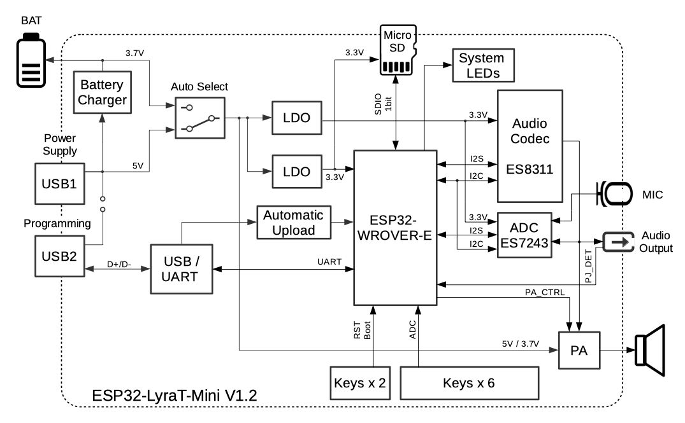
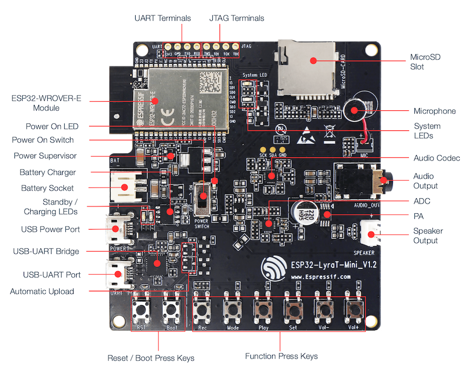
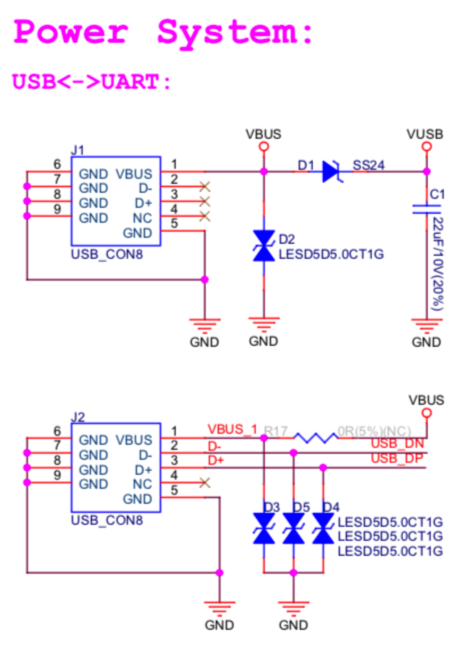
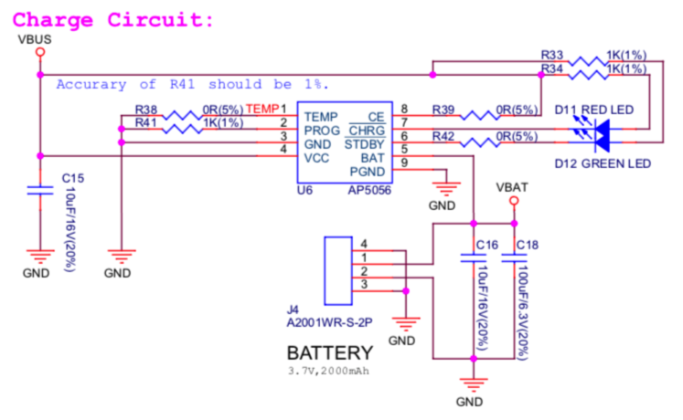
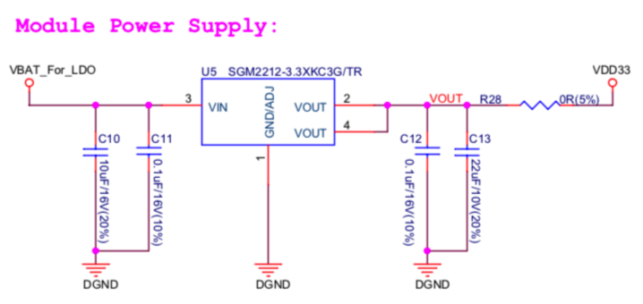
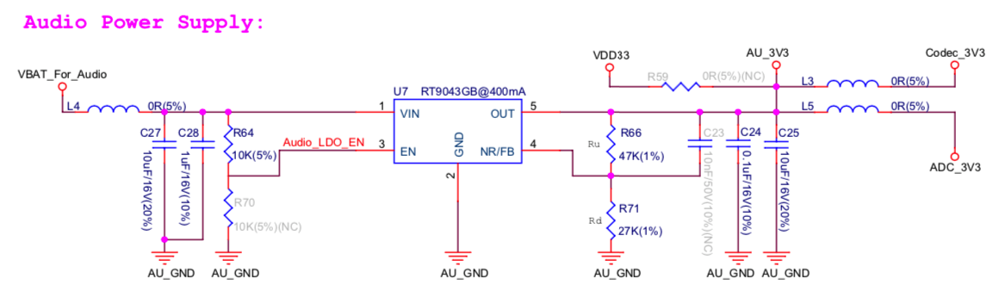

ESP32-LyraT-Mini V1.2 硬件参考
===========================================

:link_to_translation:`en:[English]`

本文档提供 ESP32-LyraT-Mini V1.2 音频开发板的功能描述和配置选项。如需了解功能介绍以及 LyraT 的使用方法，请参阅 :doc:`get-started-esp32-lyrat-mini`。

.. contents:: 本节内容
    :local:
    :depth: 3

概述
----

ESP32-LyraT 是为双核 ESP32 音频应用设计的硬件平台，例如 Wi-Fi 或 BT 音频音箱、基于语音的远程控制器、带有一个或多个音频功能的联网智能家居设备等。

下方的框图展示了 ESP32-LyraT-Mini 的主要组件。

    ESP32-LyraT-Mini V1.2 电路框图

功能说明
--------

以下列表和图示描述了 ESP32-LyraT-Mini 开发板的主要组件、接口及控制方式。列表从图片右上角开始，按顺时针方向依次介绍。

MicroSD 卡槽
    开发板支持 MicroSD 卡 SPI/1-bit 模式，可存储或播放 MicroSD 卡中的音频文件。引脚分配详见 `MicroSD 卡`_。
麦克风
    板载麦克风连接至 **ADC 芯片** 的 AINLP/AINRP。
系统指示灯
    两个通用 LED（绿色和红色），由 **ESP32-WROVER-E 模组** 控制，用于通过专用 API 指示音频应用的特定运行状态。
音频编解码芯片
    音频编解码芯片 `ES8311`_ 是一款低功耗单声道音频编解码器。它由单通道 ADC、单通道 DAC、低噪声前置放大器、耳机驱动、数字音效、模拟混音和增益功能组成。该芯片通过 I2S 和 I2C 总线与 **ESP32-WROVER-E 模组** 连接，独立于音频应用在硬件层面提供音频处理功能。
音频输出
    输出插孔，可连接 3.5 mm 立体声耳机。插孔的一个端子连接至 ESP32，用于检测耳机插入。
ADC
    音频编解码芯片 `ES7243`_ 是一款低功耗多位 delta-sigma 音频 ADC 和 DAC。在此开发板上，该芯片用作麦克风接口。
PA
    功率放大器，用于放大来自 **音频编解码芯片** 的音频信号，以驱动扬声器。
扬声器输出
    输出插孔，用于连接扬声器。建议使用 4 欧姆 3 瓦特扬声器。引脚间距为 2.00 mm / 0.08"。
功能按键
    六个按键，分别为 **Rec**、**Mode**、**Play**、**Set**、**Vol-** 和 **Vol+**。按键连接至 **ESP32-WROVER-E 模组**，用于通过专用 API 开发和测试音频应用的 UI。

    ESP32 LyraT-Mini V1.2 开发板布局

Boot/Reset 按键
    Boot：按住 **Boot** 按钮并短按 **Reset** 按钮，可进入固件烧录模式。随后用户可通过串口上传固件。Reset：单独按下此按钮可复位系统。
自动烧录
    一个简单的双晶体管电路，根据 UART DTR 和 RTS 信号的状态使 ESP32 进入固件烧录模式。这些信号由外部应用程序控制，通过 USB-UART 接口上传固件。
USB-UART 端口
    作为 PC 与 ESP32 模组之间的通信接口。
USB-UART 桥接芯片
    单芯片 USB-UART 桥接芯片 CP2102N，最高传输速率可达 3 Mbps。
USB 电源端口
    为开发板提供电源。
待机/充电指示灯
    绿色 **待机** LED 表示 **USB 电源端口** 已接入电源。红色 **充电** LED 表示连接至 **电池座** 的电池正在充电。
电池座
    两针插座，用于连接单节 Li-ion 电池。引脚间距为 2.00 mm / 0.08"。电池可作为 **USB 电源端口** 的备用电源，为开发板供电。请确保使用带有保护电路和保险丝的 Li-ion 电池。建议电池规格：容量 > 1000 mAh，输出电压 3.7 V，输入电压 4.2 V – 5 V。请确认电池插头的极性与插座旁的丝印标记一致。
电池充电器
    AP5056 单节锂离子电池恒流恒压线性充电器。用于通过 **USB 电源端口** 为连接至 **电池座** 的电池充电。
电源监控
    提供 EN 信号，在电源电压稳定后使能 ESP32。
电源开关
    电源开/关旋钮：向上拨动为开发板上电；向下拨动为开发板断电。

    .. note::

        **电源开关** 不影响 / 不断开 Li-ion 电池的充电。更多信息请参阅 `ESP32-LyraT-Mini V1.2 原理图`_ (PDF)。

电源指示灯
    红色 LED，表示 **电源开关** 已开启。
ESP32-WROVER-E 模组
    ESP32-WROVER-E 模组包含 ESP32 芯片，提供 Wi-Fi / 蓝牙连接和数据处理能力，同时集成 4 MB 外部 SPI flash 和额外的 8 MB PSRAM，用于灵活的数据存储。
UART 端子
    串口：提供 **ESP32-WROVER-E 模组** 与 **USB-UART Bridge Chip** 之间串行 TX/RX 信号的访问。引脚分配详见 `UART 测试点`_。
JTAG 端子
    提供 **ESP32-WROVER-E 模组** 的 **JTAG** 接口访问。可用于调试、应用程序烧录，以及实现多种其他功能，例如 `应用层跟踪 <https://docs.espressif.com/projects/esp-idf/zh_CN/latest/esp32/api-reference/system/app_trace.html>`_。引脚分配详见 `JTAG 测试点`_。

ESP32 引脚至测试点的分配
------------------------

本节描述 ESP32-LyraT-Mini 开发板上测试点的引脚分配。

测试点为裸通孔焊盘，标准间距为 2.54 mm / 0.1 英寸。用户可能需要为其焊接排针或插座，以便轻松连接外部硬件。

JTAG 测试点
^^^^^^^^^^^^^^^

====  ===============  =================
.     ESP32 引脚       JTAG 信号
====  ===============  =================
 1    MTDO / GPIO15    TDO
 2    MTCK / GPIO13    TCK
 3    MTDI / GPIO12    TDI
 4    MTMS / GPIO14    TMS
====  ===============  =================

.. note::
    若应用程序正在使用 **MicroSD 卡**，则无法使用 **JTAG**。

UART 测试点
^^^^^^^^^^^^^^^

====  ===============  =================
.     ESP32 引脚       引脚说明
====  ===============  =================
 1    RXD0             RX
 2    TXD0             TX
 3    GND              GND
 4    n/a              3.3 V
====  ===============  =================

MicroSD 卡
------------

本开发板实现的 MicroSD 卡接口工作在 SPI/1-bit 模式。在 PCB 预留位置焊接额外组件后，开发板可支持 SPI/4-bit 模式。详细信息请参阅 `ESP32-LyraT-Mini V1.2 原理图`_ (PDF)。未焊接的组件在原理图标注为 *(NC)*。

====  ==============  ===============
.     ESP32 引脚      MicroSD 信号
====  ==============  ===============
1     MTDI / GPIO12   --
2     MTCK / GPIO13   --
3     MTDO / GPIO15   CMD
4     MTMS / GPIO14   CLK
5     GPIO2           DATA0
6     GPIO4           --
7     GPIO34          CD
====  ==============  ===============

.. _GPIO Allocation Summary:

GPIO 分配汇总
-----------------------

下表列出了 **ESP32-WROVER-E 模组** 端子上暴露的 GPIO 分配，用于控制开发板的特定组件或功能。

.. csv-table::
    :header: Pin :sup:`1`,Pin Name,`ES8311`_,`ES7243`_,Keys,MicroSD,Other

    3,EN,,,EN_KEY,,
    4,S_VP,,I2S_DATA,,,
    5,S_VN,,,"REC, MODE, PLAY, SET, VOL-, VOL+",,
    6,IO34,,,,CD,
    7,IO35,I2S0_ASDOUT,,,,
    8,IO32,,I2S1_SCLK,,,
    9,IO33,,I2S1_LRCK,,,
    10,IO25,I2S0_LRCK,,,,
    11,IO26,I2S0_DSDIN,,,,
    12,IO27,,,,,Blue_LED
    13,IO14,,,,CLK,
    14,IO12,,,,NC (DATA2),
    16,IO13,,,,NC (DATA3),
    17,SD2,,,,,
    18,SD3,,,,,
    19,CMD,,,,,
    20,CLK,,,,,
    21,SD0,,,,,
    22,SD1,,,,,
    23,IO15,,,,CMD,
    24,IO2,,,IO2_KEY,DATA0,
    25,IO0,I2S0_MCLK,I2S1_MCLK,IO0_KEY,,
    26,IO4,,,,NC (DATA1),
    27,NC (IO16),,,,,
    28,NC (IO17),,,,,
    29,IO5,I2S0_SCLK,,,,
    30,IO18,I2C_SDA,I2C_SDA,,,
    31,IO19,,,,,PJ_DET :sup:`2`
    33,IO21,,,,, PA_CTRL :sup:`3`
    34,RXD0,,,,,RXD0 :sup:`4`
    35,TXD0,,,,,TXD0 :sup:`4`
    36,IO22,,,,,Green_LED
    37,IO23,I2C_SCK,I2C_SCL,,,

1. **Pin** - ESP32-WROVER-E 模组引脚编号，GND 和电源引脚未列出
2. **PJ_DET** - 耳机插孔插入检测信号
3. **PA_CTRL** - NS4150 功率放大器芯片控制信号
4. **RXD0**、**TXD0** - 连接至 CP2102N USB-UART 桥接芯片 TXD 和 RXD 引脚的串行通信信号
5. **NC** - 未连接

电源分配说明
---------------------------

ESP32-LyraT-Mini 开发板通过为音频子系统和数字子系统提供独立电源分配，提供隔离数字组件噪声的基本功能。

USB 与电池供电
^^^^^^^^^^^^^^^^^^^^^^^^^^^^^^^^^^^^^^

开发板有两种供电方式：5 V USB 电源端口或 3.7 V 可选电池。对于需要更纯净电源的应用，建议使用可选电池。

    ESP32-LyraT-Mini V1.2 - 专用 USB 电源插座

    ESP32-LyraT-Mini V1.2 - 电池供电

独立音频与数字电源
^^^^^^^^^^^^^^^^^^^^^^^^^^^^^^^^^^^^^^^^^^

开发板为音频组件和 ESP32 模组提供独立电源。这应能减少数字组件对音频信号的噪声干扰，并改善组件的整体性能。

    ESP32-LyraT-Mini V1.2 - 数字电源

    ESP32-LyraT-Mini V1.2 - 音频电源

音频输出选择
-----------------------------

开发板在 ES8311 编解码芯片的 OUTN 和 OUTP 引脚上提供单声道音频输出信号。该信号路由至两个输出：

* 功率放大器 (PA)，用于驱动外部扬声器
* 耳机插孔，用于驱动外部耳机

开发板设计假定通过软件实现两种输出之间的选择，而非使用耳机插孔中传统的机械触点（插入耳机时会断开扬声器连接）。

提供两个数字 IO 信号，用于在扬声器和耳机之间进行选择：

* **PJ_DET** - 数字输入信号，用于检测耳机插孔是否插入，
* **PA_CTRL** - 数字输出信号，用于使能或禁用放大器 IC。

运行在 ESP32 上的应用程序可根据 **PJ_DET** 的状态，通过 **PA_CTRL** 使能或禁用 PA。有关分配给这些信号的具体 GPIO 编号，请参阅 `GPIO 分配汇总`_。

相关文档
-----------------

* `ESP32-LyraT-Mini V1.2 原理图`_ (PDF)
* `ESP32-LyraT-Mini V1.2 尺寸图 <https://dl.espressif.com/dl/schematics/Layout_ESP32-LyraT-Mini_V1.2_20220317.pdf>`_ (PDF)
* :doc:`get-started-esp32-lyrat-mini`
* `ESP32 技术规格书 <https://www.espressif.com/sites/default/files/documentation/esp32_datasheet_cn.pdf>`_ (PDF)
* `ESP32-WROVER-E 技术规格书 <https://www.espressif.com/sites/default/files/documentation/esp32-wrover-e_esp32-wrover-ie_datasheet_cn.pdf>`_ (PDF)

.. _ESP32-LyraT-Mini V1.2 原理图: https://dl.espressif.com/dl/schematics/SCH_ESP32-LyraT-Mini_V1.2_20220119.pdf
.. _ES8311: http://www.everest-semi.com/pdf/ES8311%20PB.pdf
.. _ES7243: http://www.everest-semi.com/pdf/ES7243%20PB.pdf

免责声明和版权公告
------------------

请参阅 :doc:`免责声明和版权公告 <../../disclaimer-and-copyright>`。
