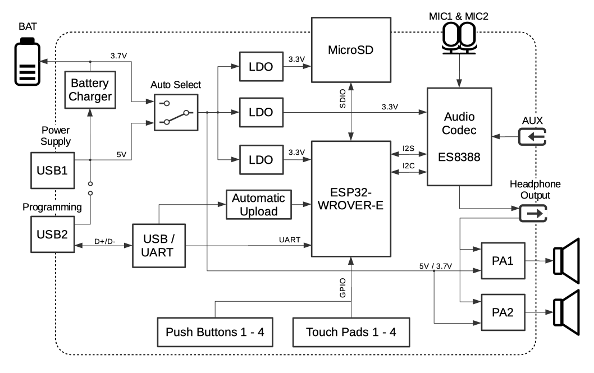
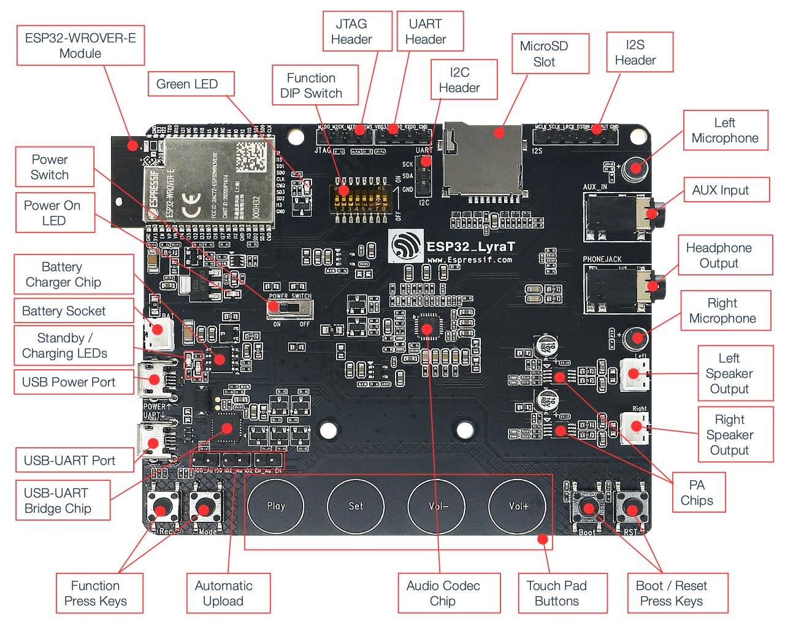
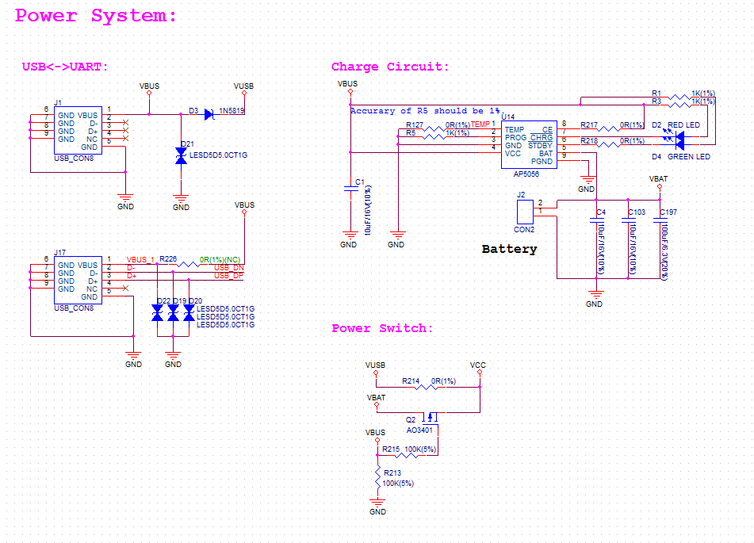
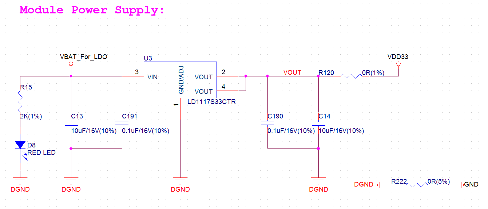
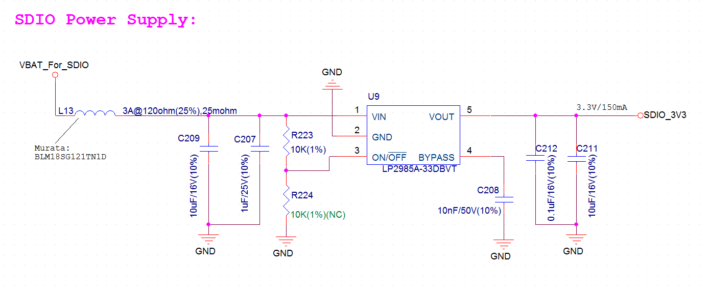
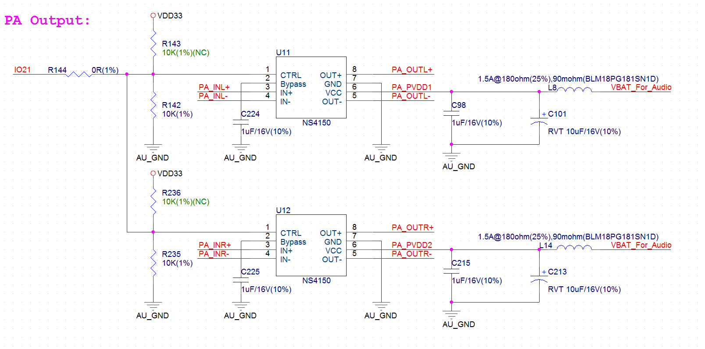

ESP32-LyraT V4.3 硬件参考
===========================

:link_to_translation:`en:[English]`

本文档介绍 ESP32-LyraT V4.3 音频开发板的功能说明与配置选项。如需了解 LyraT 的功能与基本用法，请参阅 :doc:`get-started-esp32-lyrat`。若您使用的开发板版本不同，请查看 `其他 LyraT 开发板版本`_ 一节。

.. contents:: 本节内容
    :local:
    :depth: 3

概述
----

ESP32-LyraT 开发板面向搭载 ESP32 双核芯片的音频应用领域，如 Wi-Fi 或蓝牙音箱、基于语音的遥控器、具备音频功能的智能家居设备等。

下方框图展示了 ESP32-LyraT 的主要组件。

    ESP32-LyraT V4.3 电气框图

功能说明
--------

以下列表与图示介绍了 ESP32-LyraT 开发板的主要组件、接口与控制方式。

ESP32-WROVER-E 模组
    ESP32-WROVER-E 模组采用 ESP32 芯片，可实现 Wi-Fi/蓝牙连接和数据处理，同时集成 4 MB 外部 SPI flash 和 8 MB PSRAM，可实现灵活的数据存储。
绿色 LED
    由 **ESP32-WROVER-E 模组** 控制的通用 LED，可通过专用 API 指示音频应用的特定运行状态。
功能 DIP 开关
    用于配置 GPIO12 至 GPIO15 引脚的功能，这些引脚在多个器件之间复用，主要在 **JTAG 排针** 与 **MicroSD 卡** 之间共享。默认情况下，所有开关处于 *OFF* 位置时启用 **MicroSD 卡**。若要启用 **JTAG 排针**，应将位置 3、4、5 和 6 的开关拨至 *ON*。若未使用 **JTAG** 且 **MicroSD 卡** 以一线模式运行，则 GPIO12 和 GPIO13 可分配给其他功能。详情请参阅 `ESP32-LyraT V4.3 原理图`_。
JTAG 排针
    提供 **ESP32-WROVER-E 模组** **JTAG** 接口的访问。可用于调试、应用程序上传，以及实现其他功能，例如 `应用层跟踪 <https://docs.espressif.com/projects/esp-idf/zh_CN/latest/esp32/api-reference/system/app_trace.html>`_。引脚定义请参阅 `JTAG 排针 / JP7`_。在使用 **JTAG** 信号连接排针之前，应启用 **功能 DIP 开关**。请注意，**JTAG** 运行时无法使用 **MicroSD 卡**，应断开 MicroSD 卡，因为部分 JTAG 信号由两个器件共享。
UART 排针
    串口：提供 **ESP32-WROVER-E 模组** 与 **USB-UART 桥接芯片** 之间串行 TX/RX 信号的访问。
I2C 排针
    提供 I2C 接口的访问。**ESP32-WROVER-E 模组** 与 **音频编解码芯片** 均连接至该接口。引脚定义请参阅 `I2C 排针 / JP5`_。
MicroSD 卡槽
    开发板支持 SPI/1-bit/4-bit 模式的 MicroSD 卡，可在 MicroSD 卡中存储或播放音频文件。请注意，**MicroSD 卡** 运行时无法使用 **JTAG**，应通过设置 **功能 DIP 开关** 断开 JTAG，因为部分信号由两个器件共享。
I2S 排针
    提供 I2S 接口的访问。**ESP32-WROVER-E 模组** 与 **音频编解码芯片** 均连接至该接口。引脚定义请参阅 `I2S 排针 / JP4`_。
左侧麦克风
    板载麦克风，连接至 **音频编解码芯片** 的 IN1。
AUX 输入
    辅助输入插座，连接至 **音频编解码芯片** 的 IN2（左声道与右声道）。请使用 3.5 mm 立体声插头连接此插座。
耳机输出
    输出插座，可连接 3.5 mm 立体声耳机。

    .. note::

        该插槽可接入移动电话耳机，只与 OMPT 标准耳机兼容，与 CTIA 耳机不兼容。更多耳机标准信息请访问维基百科 `Phone connector (audio) <https://en.wikipedia.org/wiki/Phone_connector_(audio)#TRRS_standards>`_ 词条。

    ESP32-LyraT V4.3 开发板布局

右侧麦克风
    板载麦克风，连接至 **音频编解码芯片** 的 IN1。
左侧扬声器输出
    音频输出插槽，可连接扬声器。建议使用 4 欧姆 3 瓦特扬声器。引脚间距为 2.00 mm / 0.08"。
右侧扬声器输出
    音频输出插槽，可连接扬声器。建议使用 4 欧姆 3 瓦特扬声器。引脚间距为 2.00 mm / 0.08"。
PA 芯片
    功率放大器，用于放大 **音频编解码芯片** 输出的立体声音频信号，以驱动两个扬声器。
启动/复位按键
    启动按键：长按 **Boot** 键，然后按下 **Reset** 键进入烧写模式，此时可通过串行端口上传固件。复位按键：仅按下此按键可重置系统。
触摸按键
    四个触摸按键，标有 *Play*、*Sel*、*Vol+* 和 *Vol-*。它们连接至 **ESP32-WROVER-E 模组**，用于通过专用 API 开发并测试音频应用的用户界面。
音频编解码芯片
    音频编解码芯片 `ES8388 <http://www.everest-semi.com/pdf/ES8388%20DS.pdf>`_ 是一款低功耗立体声编解码器，内置耳机放大器。它由双通道 ADC、双通道 DAC、麦克风放大器、耳机放大器、数字音效处理器、模拟混音和增益控制功能组成。该芯片通过 I2S 和 I2C 总线与 **ESP32-WROVER-E 模组** 连接，可在硬件中独立完成音频处理，无需依赖音频应用软件。
自动上传
    在此排针上安装三个跳线，可启用向 ESP32 自动加载应用程序。三个排针上需同时安装全部跳线。上传完成后请移除所有跳线。
功能按键
    两个按键，标有 *Rec* 和 *Mode*。它们连接至 **ESP32-WROVER-E 模组**，用于通过专用 API 开发并测试音频应用的用户界面。
USB-UART 桥接芯片
    单芯片 USB-UART 桥接器，最高传输速率可达 1 Mbps。
USB-UART 接口
    作为 PC 与 ESP32 模组之间的通信接口。
USB 供电接口
    为开发板供电。
待机/充电指示灯
    绿色 **待机** 指示灯亮起时，表示 **Micro USB 接口** 已接入电源；红色 **充电** 指示灯亮起时，表示连接至 **电池接口** 的电池正在充电。
电池接口
    两针插座，用于连接单节锂离子电池。

    .. note::

        请确认电池插头极性与插座旁丝印标注的极性一致。

电池充电芯片
    AP5056 恒流恒压线性充电器，用于单节锂离子电池。通过 **Micro USB 接口** 为连接至 **电池接口** 的电池充电。
电源指示灯
    红色 LED，表示 **电源开关** 已开启。

    .. note::

        **电源开关** 不影响/不断开锂离子电池的充电。

电源开关
    电源开/关旋钮：向左拨动则开发板电源开启，向右拨动则电源关闭。

硬件配置选项
^^^^^^^^^^^^

可通过 **功能 DIP 开关** 调整 ESP32-LyraT 开发板的若干硬件配置。

启用一线模式 MicroSD 卡
""""""""""""""""""""""""

+---------+-----------------+
|  DIP SW | Position        |
+=========+=================+
|    1    |    OFF          |
+---------+-----------------+
|    2    |    OFF          |
+---------+-----------------+
|    3    |    OFF          |
+---------+-----------------+
|    4    |    OFF          |
+---------+-----------------+
|    5    |    OFF          |
+---------+-----------------+
|    6    |    OFF          |
+---------+-----------------+
|    7    |    OFF :sup:`1` |
+---------+-----------------+
|    8    |    n/a          |
+---------+-----------------+

1. 将 DIP SW 7 拨至 *ON* 可启用 **AUX 输入** 检测。请注意，系统上电时 **AUX 输入** 信号引脚不应插入，否则 ESP32 可能无法正常启动。

在此模式下：

* **JTAG** 功能不可用
* *Vol-* 触摸按键可通过 API 使用

启用四线模式 MicroSD 卡
""""""""""""""""""""""""

+---------+-----------+
|  DIP SW | Position  |
+=========+===========+
|    1    |    ON     |
+---------+-----------+
|    2    |    ON     |
+---------+-----------+
|    3    |    OFF    |
+---------+-----------+
|    4    |    OFF    |
+---------+-----------+
|    5    |    OFF    |
+---------+-----------+
|    6    |    OFF    |
+---------+-----------+
|    7    |    OFF    |
+---------+-----------+
|    8    |    n/a    |
+---------+-----------+

在此模式下：

* **JTAG** 功能不可用
* *Vol-* 触摸按键不可通过 API 使用
* 无法通过 API 进行 **AUX 输入** 检测

启用 JTAG
"""""""""""

+---------+-----------+
|  DIP SW | Position  |
+=========+===========+
|    1    |    OFF    |
+---------+-----------+
|    2    |    OFF    |
+---------+-----------+
|    3    |    ON     |
+---------+-----------+
|    4    |    ON     |
+---------+-----------+
|    5    |    ON     |
+---------+-----------+
|    6    |    ON     |
+---------+-----------+
|    7    |    ON     |
+---------+-----------+
|    8    |    n/a    |
+---------+-----------+

在此模式下：

* **MicroSD 卡** 功能不可用，请从卡槽中取出 MicroSD 卡
* *Vol-* 触摸按键不可通过 API 使用
* 无法通过 API 进行 **AUX 输入** 检测

使用自动上传
""""""""""""

可通过以下两种方式使 ESP32 进入上传模式：

* 手动方式：同时按下 **Boot** 和 **RST** 键，先松开 **RST**，再松开 **Boot** 键。
* 自动方式：由上传软件执行。软件使用串行接口的 **DTR** 和 **RTS** 信号控制 ESP32 的 **EN**、**IO0** 和 **IO2** 引脚状态。在 **JP23**、**JP24** 和 **JP25** 三个排针上安装跳线即可启用此功能。详情请参阅 `ESP32-LyraT V4.3 原理图`_。上传完成后请移除所有跳线。

ESP32 引脚分配
^^^^^^^^^^^^^^

ESP32 模组的若干引脚已分配给板载硬件。其中部分引脚（如 GPIO0 或 GPIO2）具有多种功能。具体详情请参阅下表或 `ESP32-LyraT V4.3 原理图`_。

+-----------+------+-------------------------------------------------------+
| GPIO Pin  | Type | Function Definition                                   |
+===========+======+=======================================================+
| SENSOR_VP | I    | Audio **Rec** (PB)                                    |
+-----------+------+-------------------------------------------------------+
| SENSOR_VN | I    | Audio **Mode** (PB)                                   |
+-----------+------+-------------------------------------------------------+
| IO32      | I/O  | Audio **Set** (TP)                                    |
+-----------+------+-------------------------------------------------------+
| IO33      | I/O  | Audio **Play** (TP)                                   |
+-----------+------+-------------------------------------------------------+
| IO27      | I/O  | Audio **Vol+** (TP)                                   |
+-----------+------+-------------------------------------------------------+
| IO13      | I/O  | JTAG **MTCK**, MicroSD **D3**, Audio **Vol-** (TP)    |
+-----------+------+-------------------------------------------------------+
| IO14      | I/O  | JTAG **MTMS**, MicroSD **CLK**                        |
+-----------+------+-------------------------------------------------------+
| IO12      | I/O  | JTAG **MTDI**, MicroSD **D2**, Aux signal **detect**  |
+-----------+------+-------------------------------------------------------+
| IO15      | I/O  | JTAG **MTDO**, MicroSD **CMD**                        |
+-----------+------+-------------------------------------------------------+
| IO2       | I/O  | Automatic Upload, MicroSD **D0**                      |
+-----------+------+-------------------------------------------------------+
| IO4       | I/O  | MicroSD **D1**                                        |
+-----------+------+-------------------------------------------------------+
| IO34      | I    | MicroSD insert **detect**                             |
+-----------+------+-------------------------------------------------------+
| IO0       | I/O  | Automatic Upload, I2S **MCLK**                        |
+-----------+------+-------------------------------------------------------+
| IO5       | I/O  | I2S **SCLK**                                          |
+-----------+------+-------------------------------------------------------+
| IO25      | I/O  | I2S **LRCK**                                          |
+-----------+------+-------------------------------------------------------+
| IO26      | I/O  | I2S **DSDIN**                                         |
+-----------+------+-------------------------------------------------------+
| IO35      | I    | I2S **ASDOUT**                                        |
+-----------+------+-------------------------------------------------------+
| IO19      | I/O  | Headphone jack insert **detect**                      |
+-----------+------+-------------------------------------------------------+
| IO22      | I/O  | Green LED indicator                                   |
+-----------+------+-------------------------------------------------------+
| IO21      | I/O  | PA Enable output                                      |
+-----------+------+-------------------------------------------------------+
| IO18      | I/O  | I2C **SDA**                                           |
+-----------+------+-------------------------------------------------------+
| IO23      | I/O  | I2C **SCL**                                           |
+-----------+------+-------------------------------------------------------+

* (TP) - touch pad
* (PB) - push button

扩展排针引脚
^^^^^^^^^^^^

开发板提供若干排针，用于连接外部组件、检查特定信号总线状态或调试 ESP32 运行。请注意，部分信号存在复用，详情请参阅 `ESP32 引脚分配`_ 一节。

UART 排针 / JP2
"""""""""""""""

+---+-------------+
|   | Header Pin  |
+===+=============+
| 1 | 3.3V        |
+---+-------------+
| 2 | TX          |
+---+-------------+
| 3 | RX          |
+---+-------------+
| 4 | GND         |
+---+-------------+

I2S 排针 / JP4
""""""""""""""

+---+----------------+-------------+
|   | I2C Header Pin | ESP32 Pin   |
+===+================+=============+
| 1 | MCLK           | GPI0        |
+---+----------------+-------------+
| 2 | SCLK           | GPIO5       |
+---+----------------+-------------+
| 1 | LRCK           | GPIO25      |
+---+----------------+-------------+
| 2 | DSDIN          | GPIO26      |
+---+----------------+-------------+
| 3 | ASDOUT         | GPIO35      |
+---+----------------+-------------+
| 3 | GND            | GND         |
+---+----------------+-------------+

I2C 排针 / JP5
""""""""""""""

+---+----------------+-------------+
|   | I2C Header Pin | ESP32 Pin   |
+===+================+=============+
| 1 | SCL            | GPIO23      |
+---+----------------+-------------+
| 2 | SDA            | GPIO18      |
+---+----------------+-------------+
| 3 | GND            | GND         |
+---+----------------+-------------+

JTAG 排针 / JP7
"""""""""""""""

+---+---------------+-------------+
|   | ESP32 Pin     | JTAG Signal |
+===+===============+=============+
| 1 | MTDO / GPIO15 | TDO         |
+---+---------------+-------------+
| 2 | MTCK / GPIO13 | TCK         |
+---+---------------+-------------+
| 3 | MTDI / GPIO12 | TDI         |
+---+---------------+-------------+
| 4 | MTMS / GPIO14 | TMS         |
+---+---------------+-------------+

.. note::
    启用 **MicroSD 卡** 时无法使用 **JTAG**。

电源分配说明
^^^^^^^^^^^^

开发板具有较为完善的电源分配系统，为所有关键组件提供独立电源。这有助于降低数字组件对音频信号的噪声干扰，并改善各组件的整体性能。

电源分离
""""""""

主电源为 5V，由 USB 提供。次级电源为 3.7V，由可选电池提供。USB 电源通过专用线缆供电，与用于应用程序上传的 USB 线缆分开。为进一步降低 USB 噪声，也可使用电池代替 USB 供电。

    ESP32 LyraT V4.3 - 电源分离

三个独立 LDO
""""""""""""

**ESP32 模组**

为 ESP32 提供足够电流，开发板采用 LD1117S33CTR LDO，最大输出电流可达 800 mA。

    ESP32 LyraT V4.3 - ESP32 模组专用 LDO

**MicroSD 卡** 与 **音频编解码芯片**

MicroSD 卡与音频编解码芯片各配备一个独立 LDO。两个电路采用相似设计，在 LDO 输入端和输出端均包含电感与双重去耦电容。

    ESP32 LyraT V4.3 - MicroSD 卡专用 LDO

PA 独立供电
"""""""""""

音频放大单元采用两枚 NS4150，驱动外部扬声器时需要较大功率，最大输出功率为 3 W。电源由电池或 USB 直接供给两枚 PA。开发板在 PA 电源前端加入 LC 电路，其中 L 采用 1.5 A 磁珠，C 采用 10 uF 铝电解电容，以有效滤除电源串扰。

    ESP32 LyraT V4.3 - PA 电源

音频输出选择
^^^^^^^^^^^^

开发板采用两枚单声道 D 类放大器 IC，型号 NS4150，最大输出功率 3 W，工作电压 3.0 V 至 5.25 V。

音频输入源为 ES8388 数模转换器（DAC）输出。音频输出支持两个外接扬声器。

可选音频输出为耳机，其信号来自与放大器 IC 相同的 DAC。

在扬声器和耳机之间切换时，开发板提供数字输入信号以检测耳机插孔是否插入，并提供数字输出信号以启用或禁用放大器 IC。换言之，扬声器与耳机的选择由软件控制，而非采用会在插入耳机时断开扬声器的机械触点。

其他 LyraT 开发板版本
----------------------

* :doc:`get-started-esp32-lyrat-v4.2`
* :doc:`get-started-esp32-lyrat-v4`

相关文档
--------

* `ESP32-LyraT V4.3 原理图`_ (PDF)
* :doc:`get-started-esp32-lyrat`
* `ESP32 技术规格书 <https://www.espressif.com/sites/default/files/documentation/esp32_datasheet_cn.pdf>`_ (PDF)
* `ESP32-WROVER-E 技术规格书 <https://www.espressif.com/sites/default/files/documentation/esp32-wrover-e_esp32-wrover-ie_datasheet_cn.pdf>`_ (PDF)
* `JTAG 调试 <https://docs.espressif.com/projects/esp-idf/zh_CN/latest/esp32/api-guides/jtag-debugging/index.html>`_

.. _ESP32-LyraT V4.3 原理图: https://dl.espressif.com/dl/schematics/ESP32-LYRAT_V4.3-20220119.pdf

免责声明和版权公告
------------------

请参阅 :doc:`免责声明和版权公告 <../../disclaimer-and-copyright>`。
