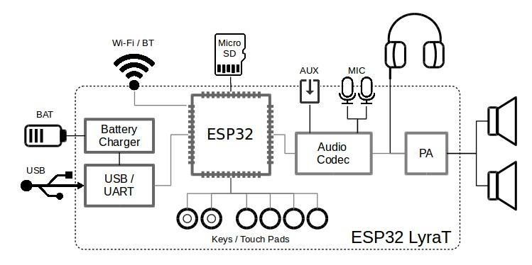
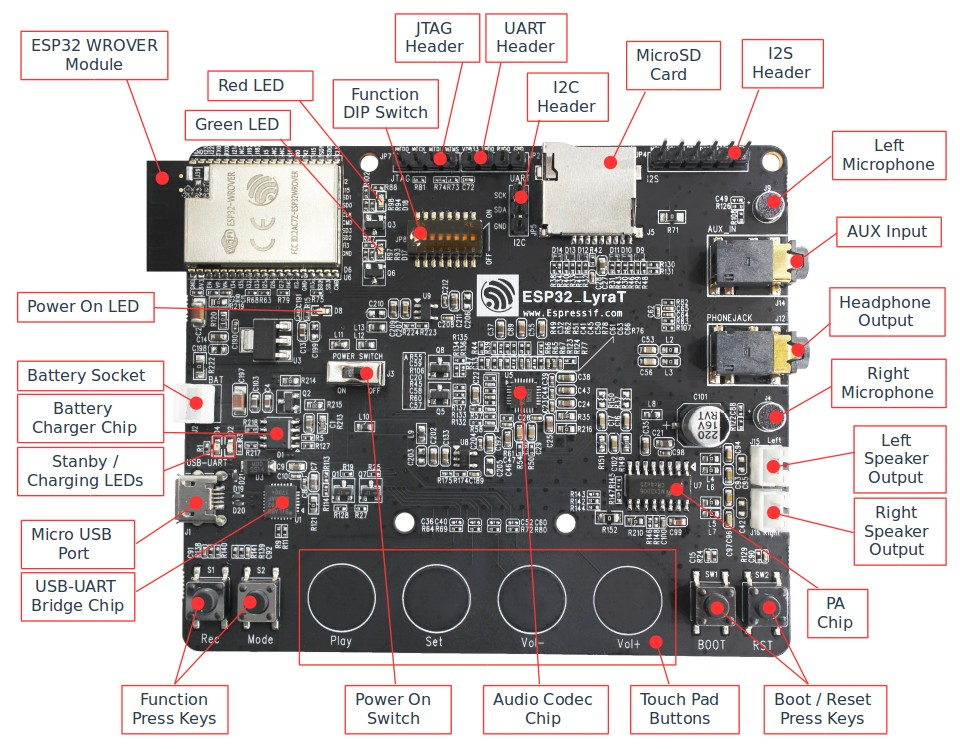

ESP32-LyraT V4 入门指南
========================

:link_to_translation:`en:[English]`

本指南旨在向用户介绍 ESP32-LyraT V4 音频开发板的功能、配置选项以及如何快速入门。

ESP32-LyraT 开发板面向搭载 ESP32 双核芯片的音频应用领域，如 Wi-Fi 或蓝牙音箱、语音遥控器以及具备音频功能的智能家居设备等。

如需立即使用此开发板，请直接前往 :ref:`get-started-esp32-lyrat-v4-start-development` 章节。

准备工作
--------

* 1 × :ref:`ESP32-LyraT V4 开发板 <get-started-esp32-lyrat-v4-board>`
* 2 × 扬声器或 3.5 mm 耳机。若使用扬声器，建议功率不超过 3 瓦特，并需配备 JST PH 2.0 2 针插头。若无此类插头，开发过程中也可使用杜邦母跳线。
* 1 × Micro USB 2.0 数据线（Type A 转 Micro B）
* 1 × 已安装 Windows、Linux 或 Mac OS 的 PC

概述
^^^^

ESP32-LyraT V4 是一款基于 `乐鑫 <https://espressif.com>`_ ESP32 的音频开发板，专为音频应用打造，在 ESP32 芯片原有硬件基础上，额外提供音频处理硬件和扩展 RAM。具体硬件包括：

* ESP32-WROVER 模组\ :sup:`*`
* 音频编解码芯片
* 板载双麦克风
* 耳机输入
* 2 x 3 瓦特扬声器输出
* 双辅助输入
* MicroSD 卡槽（一线模式或四线模式）
* 6 个按键（2 个物理按键和 4 个触摸按键）
* JTAG 排针
* 集成 USB-UART 桥接芯片
* 锂离子电池充电管理

上标 \ :sup:`*` 表示该产品已处于 EOL 状态。下文同理。

下图展示 ESP32-LyraT 的主要组件以及组件之间的连接方式。

    ESP32-LyraT 开发板框图

功能说明
^^^^^^^^

以下列表及下图介绍 ESP32-LyraT 开发板的主要组件、接口及控制方式。

ESP32-WROVER 模组\ :sup:`*`
    ESP32-WROVER\ :sup:`*` 模组采用 ESP32 芯片，可实现 Wi-Fi/蓝牙连接和数据处理，同时集成 32 Mbit SPI flash 和 32 Mbit PSRAM，可实现灵活的数据存储。
绿色和红色 LED
    两颗通用 LED，由 ESP32-WROVER 模组\ :sup:`*` 控制，通过专用 API 指示音频应用的特定运行状态。
功能 DIP 开关
    用于配置 GPIO12 至 GPIO15 引脚的功能，这些引脚在 JTAG 排针 与 MicroSD 卡 等设备之间共享。默认情况下，所有开关处于 *OFF* 位置，MicroSD 卡 处于启用状态。若要改为启用 JTAG 排针，应将位置 3、4、5 和 6 的开关拨至 *ON*。若不使用 JTAG，且 MicroSD 卡 以一线模式运行，则 GPIO12 和 GPIO13 可分配给其他功能。更多详情请参阅 `ESP32 LyraT V4 schematic`_。
JTAG 排针
    提供 ESP32-WROVER 模组\ :sup:`*` 的 JTAG 接口访问。可用于调试、应用程序烧录，以及实现其他多种功能，例如 `应用层跟踪 <https://docs.espressif.com/projects/esp-idf/zh_CN/latest/esp32/api-reference/system/app_trace.html>`_。引脚定义请参阅 :ref:`get-started-esp32-lyrat-v4-jtag-header`。在向排针输出 JTAG 信号之前，应先启用 功能 DIP 开关。请注意，JTAG 运行时无法使用 MicroSD 卡，应断开 MicroSD 卡连接，因为部分 JTAG 信号由两种设备共享。
UART 排针
    串口提供 ESP32-WROVER 模组\ :sup:`*` 与 USB-UART 桥接芯片 之间串行 TX/RX 信号的访问。
I2C 排针
    提供 I2C 接口访问。ESP32-WROVER 模组\ :sup:`*` 与 音频编解码芯片 均连接至该接口。引脚定义请参阅 :ref:`get-started-esp32-lyrat-v4-i2c-header`。
MicroSD 卡
    开发板支持 SPI/1-bit/4-bit 模式下的 MicroSD 卡，可在卡中存储或播放音频文件。引脚定义请参阅 :ref:`get-started-esp32-lyrat-v4-microsd-card-slot`。请注意，MicroSD 卡 运行时无法使用 JTAG，应通过设置 功能 DIP 开关 断开 JTAG，因为部分信号由两种设备共享。
I2S 排针
    提供 I2S 接口访问。ESP32-WROVER 模组\ :sup:`*` 与 音频编解码芯片 均连接至该接口。引脚定义请参阅 :ref:`get-started-esp32-lyrat-v4-i2s-header`。
左侧麦克风
    板载麦克风，连接至 音频编解码芯片 的 IN1。
AUX 输入
    辅助输入插座，连接至 音频编解码芯片 的 IN2（左右声道）。请使用 3.5 mm 立体声插头连接此插座。
耳机输出
    输出插座，可连接 3.5 mm 立体声耳机。

.. _get-started-esp32-lyrat-v4-board:

    ESP32-LyraT V4 开发板布局

右侧麦克风
    板载麦克风，连接至 音频编解码芯片 的 IN1。
左侧扬声器输出
    输出插座，用于连接扬声器。建议使用 4 欧姆 3 瓦特扬声器。引脚间距为 2.00 mm / 0.08"。
右侧扬声器输出
    输出插座，用于连接扬声器。建议使用 4 欧姆 3 瓦特扬声器。引脚间距为 2.00 mm / 0.08"。
PA 芯片
    功率放大器，用于放大 音频编解码芯片 的立体声音频信号，以驱动两个扬声器。
启动/复位按键
    启动：按住 Boot 键并短按 Reset 键，可进入固件烧录模式，随后可通过串口上传固件。复位：单独按下此键可重置系统。
触摸板按键
    四个触摸板，分别标注为 *Play*、*Sel*、*Vol+* 和 *Vol-*。它们连接至 ESP32-WROVER 模组\ :sup:`*`，通过专用 API 用于开发和测试音频应用的用户界面。
音频编解码芯片
    音频编解码芯片 `ES8388 <http://www.everest-semi.com/pdf/ES8388%20DS.pdf>`_ 是一款低功耗立体声编解码器，内置耳机放大器。它由双通道 ADC、双通道 DAC、麦克风放大器、耳机放大器、数字音效处理器、模拟混音和增益控制功能组成。该芯片通过 I2S 和 I2C 总线与 ESP32-WROVER 模组\ :sup:`*` 连接，可在硬件中独立完成音频处理，无需依赖音频应用软件。
功能按键
    两个按键，分别标注为 *Rec* 和 *Mode*。它们连接至 ESP32-WROVER 模组\ :sup:`*`，通过专用 API 用于开发和测试音频应用的用户界面。
USB-UART 桥接芯片
    单芯片 USB-UART 桥接器，最高传输速率可达 1 Mbps。
Micro USB 端口
    USB 接口，用作开发板供电，以及 PC 与 ESP32 模组之间的通信接口。
待机/充电 LED
    绿色 待机 LED 表示 Micro USB 端口 已接入电源。红色 充电 LED 表示连接至 电池插座 的电池正在充电。
电池充电芯片
    AP5056 恒流恒压线性充电器，适用于单节锂离子电池。用于通过 Micro USB 端口 为连接至 电池插座 的电池充电。
电源开关
    电源开/关旋钮：向左拨动则开发板通电；向右拨动则开发板断电。
电池插座
    两针插座，用于连接单节锂离子电池。
电源指示灯
    红色 LED，表示 电源开关 已开启。

    .. note::

        电源开关 不影响锂离子电池的充电，也不会断开电池充电。

.. _get-started-esp32-lyrat-v4-setup-options:

硬件配置选项
^^^^^^^^^^^^

可通过 **功能 DIP 开关** 调整 ESP32-LyraT 开发板的若干硬件配置。

在一线模式下启用 MicroSD 卡
""""""""""""""""""""""""""""

+---------+-----------------+
|  DIP SW | Position        |
+=========+=================+
|    1    |    OFF          |
+---------+-----------------+
|    2    |    OFF          |
+---------+-----------------+
|    3    |    OFF          |
+---------+-----------------+
|    4    |    OFF          |
+---------+-----------------+
|    5    |    OFF          |
+---------+-----------------+
|    6    |    OFF          |
+---------+-----------------+
|    7    |    OFF :sup:`1` |
+---------+-----------------+
|    8    |    n/a          |
+---------+-----------------+

1. 将 DIP SW 7 拨至 *ON* 可启用 **AUX 输入** 检测

此模式下：

* **JTAG** 功能不可用
* *Vol-* 触摸按键可通过 API 使用

在四线模式下启用 MicroSD 卡
""""""""""""""""""""""""""""""

+---------+-----------+
|  DIP SW | Position  |
+=========+===========+
|    1    |    ON     |
+---------+-----------+
|    2    |    ON     |
+---------+-----------+
|    3    |    OFF    |
+---------+-----------+
|    4    |    OFF    |
+---------+-----------+
|    5    |    OFF    |
+---------+-----------+
|    6    |    OFF    |
+---------+-----------+
|    7    |    OFF    |
+---------+-----------+
|    8    |    n/a    |
+---------+-----------+

此模式下：

* **JTAG** 功能不可用
* *Vol-* 触摸按键无法通过 API 使用
* 无法通过 API 进行 **AUX 输入** 检测

启用 JTAG
"""""""""

+---------+-----------+
|  DIP SW | Position  |
+=========+===========+
|    1    |    OFF    |
+---------+-----------+
|    2    |    OFF    |
+---------+-----------+
|    3    |    ON     |
+---------+-----------+
|    4    |    ON     |
+---------+-----------+
|    5    |    ON     |
+---------+-----------+
|    6    |    ON     |
+---------+-----------+
|    7    |    ON     |
+---------+-----------+
|    8    |    n/a    |
+---------+-----------+

此模式下：

* **MicroSD 卡** 功能不可用，请从卡槽中取出存储卡
* *Vol-* 触摸按键无法通过 API 使用
* 无法通过 API 进行 **AUX 输入** 检测

ESP32 引脚分配
^^^^^^^^^^^^^^

ESP32 模组的若干引脚/端子已分配给板载硬件。其中部分引脚（如 GPIO0 或 GPIO2）具有多种功能。具体详情请参阅下表或 `ESP32 LyraT V4 schematic`_。

.. _get-started-esp32-lyrat-v4-red-green-led:

红色 / 绿色 LED
"""""""""""""""

+---+-----------+-----------+
|   | ESP32 Pin | LED Color |
+===+===========+===========+
| 1 | GPIO19    | Red LED   |
+---+-----------+-----------+
| 2 | GPIO22    | Green LED |
+---+-----------+-----------+

.. _get-started-esp32-lyrat-v4-touch-pads:

触摸板
""""""

+---+-----------+--------------------+
|   | ESP32 Pin | Touch Pad Function |
+===+===========+====================+
| 1 | GPIO33    | Play               |
+---+-----------+--------------------+
| 2 | GPIO32    | Set                |
+---+-----------+--------------------+
| 3 | GPIO13    | Vol- :sup:`1`      |
+---+-----------+--------------------+
| 4 | GPIO27    | Vol+               |
+---+-----------+--------------------+

1. 若使用 **JTAG**，则 *Vol-* 功能不可用。若 **MicroSD 卡** 配置为四线模式运行，*Vol-* 功能亦不可用。

.. _get-started-esp32-lyrat-v4-microsd-card-slot:

MicroSD 卡 / J5
"""""""""""""""

+---+---------------+----------------+
|   | ESP32 Pin     | MicroSD Signal |
+===+===============+================+
| 1 | MTDI / GPIO12 | DATA2          |
+---+---------------+----------------+
| 2 | MTCK / GPIO13 | CD / DATA3     |
+---+---------------+----------------+
| 3 | MTDO / GPIO15 | CMD            |
+---+---------------+----------------+
| 4 | MTMS / GPIO14 | CLK            |
+---+---------------+----------------+
| 5 | GPIO2         | DATA0          |
+---+---------------+----------------+
| 6 | GPIO4         | DATA1          |
+---+---------------+----------------+
| 7 | GPIO21        | CD             |
+---+---------------+----------------+

.. note::
    启用 JTAG 时无法使用 MicroSD 卡。

UART 排针 / JP2
"""""""""""""""

+---+-------------+
|   | Header Pin  |
+===+=============+
| 1 | 3.3V        |
+---+-------------+
| 2 | TX          |
+---+-------------+
| 3 | RX          |
+---+-------------+
| 4 | GND         |
+---+-------------+

.. _get-started-esp32-lyrat-v4-i2s-header:

I2S 排针 / JP4
""""""""""""""

+---+----------------+-------------+
|   | I2C Header Pin | ESP32 Pin   |
+===+================+=============+
| 1 | MCLK           | GPI0        |
+---+----------------+-------------+
| 2 | SCLK           | GPIO5       |
+---+----------------+-------------+
| 1 | LRCK           | GPIO25      |
+---+----------------+-------------+
| 2 | DSDIN          | GPIO26      |
+---+----------------+-------------+
| 3 | ASDOUT         | GPIO35      |
+---+----------------+-------------+
| 3 | GND            | GND         |
+---+----------------+-------------+

.. _get-started-esp32-lyrat-v4-i2c-header:

I2C 排针 / JP5
""""""""""""""

+---+----------------+-------------+
|   | I2C Header Pin | ESP32 Pin   |
+===+================+=============+
| 1 | SCL            | GPIO23      |
+---+----------------+-------------+
| 2 | SDA            | GPIO18      |
+---+----------------+-------------+
| 3 | GND            | GND         |
+---+----------------+-------------+

.. _get-started-esp32-lyrat-v4-jtag-header:

JTAG 排针 / JP7
"""""""""""""""

+---+---------------+-------------+
|   | ESP32 Pin     | JTAG Signal |
+===+===============+=============+
| 1 | MTDO / GPIO15 | TDO         |
+---+---------------+-------------+
| 2 | MTCK / GPIO13 | TCK         |
+---+---------------+-------------+
| 3 | MTDI / GPIO12 | TDI         |
+---+---------------+-------------+
| 4 | MTMS / GPIO14 | TMS         |
+---+---------------+-------------+

.. note::
    启用 MicroSD 卡 时无法使用 JTAG。

功能 DIP 开关 / JP8
"""""""""""""""""""

+---+----------------------+-------------------------+
|   | Switch OFF           | Switch ON               |
+===+======================+=========================+
| 1 | GPIO12 not allocated | MicroSD Card 4-wire     |
+---+----------------------+-------------------------+
| 2 | Touch *Vol-* enabled | MicroSD Card 4-wire     |
+---+----------------------+-------------------------+
| 3 | MicroSD Card         | JTAG                    |
+---+----------------------+-------------------------+
| 4 | MicroSD Card         | JTAG                    |
+---+----------------------+-------------------------+
| 5 | MicroSD Card         | JTAG                    |
+---+----------------------+-------------------------+
| 6 | MicroSD Card         | JTAG                    |
+---+----------------------+-------------------------+
| 7 | MicroSD Card 4-wire  | AUX IN detect :sup:`1`  |
+---+----------------------+-------------------------+
| 8 | not used             | not used                |
+---+----------------------+-------------------------+

1.  系统上电时，**AUX 输入** 信号引脚不应插入插头，否则 ESP32 可能无法正常启动。

.. _get-started-esp32-lyrat-v4-start-development:

应用程序开发
------------

ESP32-LyraT 上电之前，请首先确认开发板完好无损，无明显损坏迹象。

初始设置
^^^^^^^^

设置开发板，运行首个示例应用程序：

1. 将扬声器连接至 **右侧** 和 **左侧扬声器输出**。也可选择将耳机连接至 **耳机输出**。
2. 将 Micro-USB 数据线插入 PC 及 ESP32-LyraT 的 **Micro USB 端口**。
3. 绿色 **待机 LED** 应亮起。假设未连接电池，红色 **充电 LED** 将每隔数秒闪烁一次。
4. 向左拨动 **电源开关**。
5. 红色 **电源指示灯** 应亮起。

若 LED 状态与上述一致，则开发板已可用于应用程序烧录。接下来请按照下一节介绍，在 PC 上安装并配置开发工具。

正式开始开发
^^^^^^^^^^^^

完成初始设置并检查无误后，即可准备开发工具。请参阅 :ref:`get-started-step-by-step` 章节，按以下步骤操作：

* :ref:`get-started-setup-esp-idf` 提供一套适用于 ESP32（及 ESP32-S2）芯片的 C 语言通用开发框架；
* :ref:`get-started-get-esp-adf` 安装音频应用专用 API；
* :ref:`get-started-set-up-env` 使框架识别音频专用 API；
* :ref:`get-started-start-project` 提供适用于该开发板的音频应用示例；
* :ref:`get-started-connect` 准备烧录应用程序；
* :ref:`get-started-build` 最终运行应用程序并播放音乐。

相关文档
--------

* `ESP32 LyraT V4 schematic`_ (PDF)
* `ESP32 技术规格书 <https://www.espressif.com/sites/default/files/documentation/esp32_datasheet_cn.pdf>`_ (PDF)
* `JTAG 调试 <https://docs.espressif.com/projects/esp-idf/zh_CN/latest/esp32/api-guides/jtag-debugging/index.html>`_

.. _ESP32 LyraT V4 schematic: https://dl.espressif.com/dl/schematics/esp32-lyrat-v4-schematic.pdf

免责声明和版权公告
------------------

请参阅 :doc:`免责声明和版权公告 <../../disclaimer-and-copyright>`。
