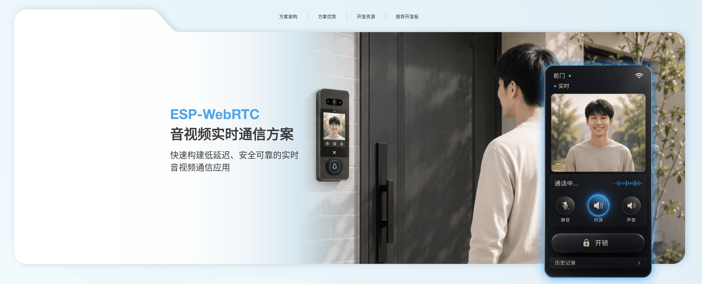

ESP-WebRTC 音视频实时通信方案
========================================

:link_to_translation:`en:[English]`

|

简介
----------

`ESP-WebRTC-Solution <https://github.com/espressif/esp-webrtc-solution>`__ 是乐鑫面向 ESP32 系列 SoC 的 WebRTC 应用开发方案，包含 WebRTC 编排层 ``esp_webrtc``\ 、PeerConnection 实现 ``esp_peer``\ 、音视频播放组件 ``av_render`` 等核心代码，并在 ``solutions/`` 目录下提供一系列可直接编译烧录的示例应用，覆盖语音助手、视频门铃与通话、云端推流与 SFU 对接、RTSP/RTMP 桥接等场景。各示例的硬件要求与编译步骤见其自身目录下的 README。

核心组成
--------------------

- ``esp_webrtc``\ ：WebRTC 应用编排层，组合 signaling、PeerConnection 与媒体系统，对外提供 ``esp_webrtc_start``\ 、``esp_webrtc_stop`` 等接口；配置好音视频编解码参数后，建连、采集发送与接收渲染均由内部自动完成。
- ``esp_peer``\ ：PeerConnection 具体实现，代码基于开源项目 `libpeer <https://github.com/sepfy/libpeer>`__ 增强而来，支持 TURN（RFC 5766、RFC 8656）、多候选地址并行探测、Controlling/Controlled 双角色、RTP NACK 重传、SCTP SACK 与大数据分片重组，发送与接收分别运行在独立任务中。
- signaling 抽象：以 ``esp_peer_signaling_impl_t`` 定义的 ``start``\ 、``send_msg``\ 、``stop`` 三个接口屏蔽具体信令协议差异，各方案按需接入 AppRTC 风格 WebSocket、WHIP、Amazon KVS、Janus、Kurento 或 OpenAI Realtime 等信令实现。
- ``esp_capture``\ ：负责音视频采集，以独立组件形式发布在 `ESP 组件注册表 <https://components.espressif.com/components/espressif/esp_capture/>`__\ 。
- ``av_render``\ ：推送式音视频播放器，音频与视频分别在独立解码线程中处理，经同步模块对齐后交由音频（I2S）与视频（LCD 等）渲染输出。

技术架构
--------------------

``esp_webrtc`` 按 signaling、PeerConnection、媒体系统三层组织建连过程：signaling 负责发现对端并交换 SDP、ICE 信息；PeerConnection 由 ``esp_peer`` 实现，基于 ICE 收集候选地址、完成打洞并建立连接；媒体系统把 ``esp_capture`` 采集到的音视频数据通过 PeerConnection 发送，并把收到的媒体流交给 ``av_render`` 播放。用户只需配置音视频编解码参数，三层之间的数据搬运与状态同步由 ``esp_webrtc`` 自动完成；需要适配新的信令服务器时，只需实现 ``esp_peer_signaling_impl_t`` 接口，PeerConnection 与媒体系统部分不受影响。

除媒体流外，PeerConnection 还支持基于 SCTP 的 data channel，用于收发不经过音视频编解码路径的自定义数据，例如 ``videocall_demo`` 的通话控制指令与 ``peer_demo`` 的聊天文本。

连接建立的整体时序如下：

.. only:: html

   .. mermaid::

      sequenceDiagram
          participant App as "应用"
          participant Webrtc as "esp_webrtc"
          participant Sig as "signaling"
          participant Peer as "esp_peer"

          App->>Webrtc: esp_webrtc_start
          Webrtc->>Sig: 启动信令连接
          Sig-->>Webrtc: 上报 ICE 信息
          Webrtc->>Peer: 打开 PeerConnection
          Sig-->>Webrtc: 通知信令已连接
          Webrtc->>Peer: 发起新连接
          Peer-->>Webrtc: 上报本地 SDP
          Webrtc->>Sig: 发送 SDP
          Sig-->>Webrtc: 转发对端 SDP
          Webrtc->>Peer: 设置远端 SDP
          Peer-->>Webrtc: 连接建立完成

信令连接、ICE 协商与 SDP 交换均由 ``esp_webrtc`` 串联完成，应用层只需感知启动与停止两个动作。

方案列表
--------------------

各方案位于仓库的 ``solutions/`` 目录下，按用途分为以下四类。

学习与 API 入门
^^^^^^^^^^^^^^^^^^^^^^^^

- `peer_demo <https://github.com/espressif/esp-webrtc-solution/tree/main/solutions/peer_demo>`__\ ：仅使用 ``esp_peer`` API 从零搭建的最小示例，建连后通过 data channel 定时收发聊天文本。

云端、推流与 SFU 对接
^^^^^^^^^^^^^^^^^^^^^^^^^^^^^^^^

- `openai_demo <https://github.com/espressif/esp-webrtc-solution/tree/main/solutions/openai_demo>`__\ ：基于 OpenAI Realtime WebRTC ephemeral token 流程，与 OpenAI Realtime 服务建立实时语音会话，支持语音指令触发的 function call。
- `whip_demo <https://github.com/espressif/esp-webrtc-solution/tree/main/solutions/whip_demo>`__\ ：使用 WHIP 协议向服务器推送音视频。
- `kvs_master <https://github.com/espressif/esp-webrtc-solution/tree/main/solutions/kvs_master>`__\ ：以 MASTER 角色接入 Amazon Kinesis Video Streams 信令，接收 VIEWER 的 SDP offer 并应答。
- `kms_demo <https://github.com/espressif/esp-webrtc-solution/tree/main/solutions/kms_demo>`__\ ：作为 Kurento Media Server 的推流端，浏览器可通过 KMS 观看画面。
- `janus_demo <https://github.com/espressif/esp-webrtc-solution/tree/main/solutions/janus_demo>`__\ ：通过 Janus HTTP 信令接入 VideoRoom 插件，作为发布端推流。

产品化示例
^^^^^^^^^^^^^^^^^^

- `doorbell_demo <https://github.com/espressif/esp-webrtc-solution/tree/main/solutions/doorbell_demo>`__\ ：参照 AppRTC 信令方式实现的门铃应用，支持远程控制、实时视频与双向语音。
- `doorbell_local <https://github.com/espressif/esp-webrtc-solution/tree/main/solutions/doorbell_local>`__\ ：ESP 设备自身承担信令服务的本地门铃方案，另集成行人检测能力。
- `videocall_demo <https://github.com/espressif/esp-webrtc-solution/tree/main/solutions/videocall_demo>`__\ ：基于 data channel 实现的设备间视频通话应用。

桥接与 RTSP/RTMP
^^^^^^^^^^^^^^^^^^^^^^

- `webrtc_usb_camera <https://github.com/espressif/esp-webrtc-solution/tree/main/solutions/webrtc_usb_camera>`__\ ：WebRTC 到 USB UVC 的桥接方案，浏览器通过 WebRTC 发送媒体数据，主机将 ESP 设备识别为标准 USB 摄像头。
- `rtsp_demo <https://github.com/espressif/esp-webrtc-solution/tree/main/solutions/rtsp_demo>`__\ ：在设备端启动 RTSP 服务器或推流端，用于局域网内的媒体流传输。
- `rtmp_demo <https://github.com/espressif/esp-webrtc-solution/tree/main/solutions/rtmp_demo>`__\ ：采集设备音视频并通过 RTMP 推送到服务器。

硬件适用范围
--------------------------

视频类方案（门铃、视频通话，以及 WHIP、KVS、KMS、Janus 等推流场景）默认基于 ESP32P4-Function-EV-Board 验证，该开发板自带 SC2336 摄像头，满足视频采集与硬件编解码需求。仅使用音频与 data channel 的方案（例如 ``peer_demo`` 与 ``openai_demo``\ ）对硬件要求更低，普通支持 Wi-Fi 的开发板即可运行；``openai_demo`` 默认基于 ESP32-S3-Korvo-2 验证，以获得回声消除能力。具体型号以各方案 README 的 Hardware Requirements 章节为准。

参考资料
--------------------

- 仓库地址：`espressif/esp-webrtc-solution <https://github.com/espressif/esp-webrtc-solution>`__
- 各方案的硬件接线、配置项与编译步骤见其自身目录下的 README。
