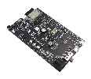
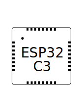

# 例程

[English Version](./README.md)

本文件夹中含有大量 ESP-ADF 简单示例项目，并且数量仍在不断增加。这些项目展示了 esp-adf 的基本功能，并提供代码示例，供您借鉴参考。

如果您是初次使用 esp-adf，请参考 [入门指南](https://docs.espressif.com/projects/esp-adf/zh_CN/latest/get-started/index.html) 文档，了解使用例程的详细步骤。

## ESP32 用法

- 开始 [CMake](https://docs.espressif.com/projects/esp-idf/zh_CN/latest/esp32/api-guides/build-system.html) 编译
- 请选择 [release/v3.3](https://github.com/espressif/esp-idf/tree/release/v3.3) 及以后的 IDF 分支进行 CMake 编译

## ESP32-S2 用法

- 开始 [CMake](https://docs.espressif.com/projects/esp-idf/zh_CN/latest/esp32s2/api-guides/build-system.html) 编译
- 请选择 [release/v4.2](https://github.com/espressif/esp-idf/tree/release/v4.2) 及以后的 IDF 分支

## ESP32-S3 用法

- 开始 [CMake](https://docs.espressif.com/projects/esp-idf/zh_CN/latest/esp32s3/api-guides/build-system.html) 编译
- 请选择 [release/v4.4](https://github.com/espressif/esp-idf/tree/release/v4.4) 及以后的 IDF 分支

## ESP32-C3 用法

- 开始 [CMake](https://docs.espressif.com/projects/esp-idf/zh_CN/latest/esp32c3/api-guides/build-system.html) 编译
- 请选择 [release/v4.4](https://github.com/espressif/esp-idf/tree/release/v4.4) IDF 分支编译 led_pixels 例程
- 请选择 [release/v5.1](https://github.com/espressif/esp-idf/tree/release/v5.1) 及以后的 IDF 分支编译其他例程

## 例程与乐鑫音频开发板的兼容性

下表介绍了各个例程与乐鑫音频开发板的兼容性， 表示兼容，  表示不兼容。

[comment]: <> (Markdown table editing tool)
[comment]: <> (https://www.tablesgenerator.com/markdown_tables)

| 编号 | 例程名称 / 开发板名称 -->                                                                  |                                                                                  ESP32-LyraT                                                                                 |                                                                                    ESP32-LyraTD-MSC                                                                                    |                                                                                    ESP32-LyraT-Mini                                                                                    |                          ESP32-Korvo-DU1906           **1**       |                        ESP32-S2-Kaluga-1 Kit                           |                        ESP32-S3-Korvo-2                           |                             ESP32-C3-Lyra                              |
|-----|------------------------------------------------------------------------------------------------|:----------------------------------------------------------------------------------------------------------------------------------------------------------------------------:|:--------------------------------------------------------------------------------------------------------------------------------------------------------------------------------------:|:--------------------------------------------------------------------------------------------------------------------------------------------------------------------------------------:|:---------------------------------------------------------------:|:----------------------------------------------------------------------:|:----------------------------------------------------------------------:|:----------------------------------------------------------------------:|
| .   | 链接至开发板入门指南  -->                                                   |  |  |  |   |  |  |   |
| .   | 板载乐鑫芯片 -->                                                      |                                                                                                                 |                                                                                                                           |                                                                                                                           |    |    |   |
|  1  | [advanced_examples/algorithm](advanced_examples/algorithm)                                               |                                                                                                                        |                                                                                         |                                                                                                                                  |          |                |   |        |
|  2  | [advanced_examples/audio_mixer_tone](advanced_examples/audio_mixer_tone)                       |                                                                                                                        |                                                                                                                                  |                                                                                                                                  |           |              |   |        |
|  3  | [advanced_examples/dlna](advanced_examples/dlna)                                               |                                                                                                                        |                                                                                                                                  |                                                                                                                                  |           |                  |   |        |
|  4  | [advanced_examples/downmix_pipeline](advanced_examples/downmix_pipeline)                       |                                                                                                                        |                                                                                                                                  |                                                                                                                                  |           |              |   |        |
|  5  | [advanced_examples/esp_dispatcher_dueros](advanced_examples/esp_dispatcher_dueros)             |                                                                                                                        |                                                                                                                                  |                                                                                                                                  |           |                  |   |        |
|  6  | [advanced_examples/flexible_pipeline](advanced_examples/flexible_pipeline)                     |                                                                                                                        |                                                                                                                                  |                                                                                                                                  |           |                 |   |        |
|  7  | [advanced_examples/http_play_and_save_to_file](advanced_examples/http_play_and_save_to_file)   |                                                                                                                        |                                                                                                                                  |                                                                                                                                  |           |                 |   |        |
|  8  | [advanced_examples/multi-room](advanced_examples/multi-room)                                |                                                                                                                        |                                                                                                                                  |                                                                                                                                  |           |                  |   |        |
|  9  | [advanced_examples/nvs_dispatcher](advanced_examples/nvs_dispatcher)                                |                                                                                                                        |                                                                                                                                  |                                                                                                                                  |           |                  |   |        |
| 10  | [protocols/voip](protocols/voip)                                               				   |                                                                                                                        |                                                                                                                                  |                                                                                                                                 |          |                  |   |        |
| 11  | [advanced_examples/wifi_bt_ble_coex](advanced_examples/wifi_bt_ble_coex)    **2**   |                                                                                                                        |                                                                                                                                  |                                                                                                                                  |           |                 |  |        |
| 12  | [audio_processing/pipeline_alc](audio_processing/pipeline_alc)                                 |                                                                                                                        |                                                                                                                                  |                                                                                                                                  |           |                 |   |        |
| 13  | [audio_processing/pipeline_audio_forge](audio_processing/pipeline_audio_forge)                                 |                                                                                                                        |                                                                                                                                  |                                                                                                                                  |           |                 |   |        |
| 14  | [audio_processing/pipeline_equalizer](audio_processing/pipeline_equalizer)                     |                                                                                                                        |                                                                                                                                  |                                                                                                                                  |           |                 |   |        |
| 15  | [audio_processing/pipeline_passthru](audio_processing/pipeline_passthru)                       |             |                        |                                                                            |               |                      |       |        |
| 16  | [audio_processing/pipeline_resample](audio_processing/pipeline_resample)                       |                                                                                                                        |                                                                                                                                  |                                                                                                                                  |           |                   |   |        |
| 17  | [audio_processing/pipeline_sonic](audio_processing/pipeline_sonic)                             |                                                                                                                        |                                                                                                                                  |                                                                                                                                  |           |                   |   |        |
| 18  | [audio_processing/pipeline_spiffs_amr_resample](audio_processing/pipeline_spiffs_amr_resample) |                                                                                                                        |                                                                                                                                  |                                                                                                                                  |           |                  |   |        |
| 19  | [checks/check_board_buttons](checks/check_board_buttons)                                     |                                                                                                                     |                                                                                                                                  |                                                                                                                               |        |               |   |        |
| 20  | [checks/check_display_led](checks/check_display_led)                                                 |                                                                                                                     |                                                                                                                                  |                                                                                                                               |        |               |   |        |
| 21  | [cli](cli)                                                                                     |                                                                                                                        |                                                                                                                                  |                                                                                                                                  |           |                  |   |        |
| 22  | [cloud_services/google_translate_device](cloud_services/google_translate_device)               |                                                                                                                        |                                                                                                                               |                                                                                                                                  |           |                  |   |        |
| 23  | [cloud_services/pipeline_aws_polly_mp3](cloud_services/pipeline_aws_polly_mp3)                 |                                                                                                                        |                                                                                                                                  |                                                                                                                                  |           |                  |   |        |
| 24  | [cloud_services/pipeline_baidu_speech_mp3](cloud_services/pipeline_baidu_speech_mp3)           |                                                                                                                        |                                                                                                                                  |                                                                                                                                  |           |                  |   |        |
| 25  | [dueros](dueros)                                                                               |                                                                                                                        |                                                                                                                                  |                                                                                                                                  |           |                  |   |        |
| 26  | [get-started/pipeline_a2dp_sink_and_hfp](get-started/pipeline_a2dp_sink_and_hfp)               |                                                                                                                        |                                                                                                                                  |                                                                                                                                  |           |                 |  |        |
| 27  | [get-started/play_mp3_control](get-started/play_mp3_control)                                   |                                                                                                                        |                                                                                                                                  |                                                                                                                                  |           |                  |   |        |
| 28  | [get-started/pipeline_tcp_client](get-started/pipeline_tcp_client)                                       |                                                                                                                        |                                                                                                                                  |                                                                                                                                  |           |                  |   |        |
| 29  | [ota](ota)                           |                                                                                                                        |                                                                                                                                  |                                                                                                                                  |           |     |   |        |
| 30  | [korvo_du1906](korvo_du1906)      **2**       |                                                                          |                                                                      |                                       |           |                  |   |        |
| 31  | [player/pipeline_a2dp_sink_stream](player/pipeline_a2dp_sink_stream)                                         |                                                                                                                        |                                                                                                                                  |                                                                                                                                  |           |                 |  |        |
| 32  | [player/pipeline_a2dp_source_stream](player/pipeline_a2dp_source_stream)                                         |                                                                                                                        |                                                                                                                                  |                                                                                                                                  |           |                   |    |        |
| 33  | [player/pipeline_bt_sink](player/pipeline_bt_sink)                                             |                                                                                                                        |                                                                                                                                  |                                                                                                                                  |           |                 |  |        |
| 34  | [player/pipeline_bt_source](player/pipeline_bt_source)                                         |                                                                                                                        |                                                                                                                                  |                                                                                                                                  |           |                 |  |        |
| 35  | [player/pipeline_embed_flash_tone](player/pipeline_embed_flash_tone)          |                                                                                                                        |                                                                                                                                  |                                                                                                                                  |           |                  |   |   |
| 36  | [player/pipeline_flash_tone](player/pipeline_flash_tone)      **3**       |                                                                                                                        |                                                                                                                                  |                                                                                                                                  |           |                  |   |   |
| 37  | [player/pipeline_hfp_stream](player/pipeline_hfp_stream)                                         |                                                                                                                        |                                                                                                                                  |                                                                                                                                  |           |                 |  |        |
| 38  | [player/pipeline_http_mp3](player/pipeline_http_mp3)      **3**       |                                                                                                                        |                                                                                                                                  |                                                                                                                                  |           |                  |   |   |
| 39  | [player/pipeline_http_select_decoder](player/pipeline_http_select_decoder)                     |                                                                                                                        |                                                                                                                                  |                                                                                                                                  |           |                  |   |        |
| 40  | [player/pipeline_living_stream](player/pipeline_living_stream)      **3**       |                                                                                                                        |                                                                                                                                  |                                                                                                                                  |           |                  |   |        |
| 41  | [player/pipeline_play_sdcard_music](player/pipeline_play_sdcard_music)                                       |                                                                                                                        |                                                                                                                                  |                                                                                                                                  |           |                 |   |        |
| 42  | [player/pipeline_sdcard_mp3_control](player/pipeline_sdcard_mp3_control)                       |                                                                                                                        |                                                                                                                                  |                                                                                                                                  |           |                 |   |        |
| 43  | [player/pipeline_tts_stream](player/pipeline_tts_stream)                                       |                                                                                                                        |                                                                                                                                  |                                                                                                                                  |           |                 |   |        |
| 44  | [player/pipeline_spiffs_mp3](player/pipeline_spiffs_mp3)      **3**       |                                                                                                                        |                                                                                                                                  |                                                                                                                                  |           |                  |   |        |
| 45  | [player/pipeline_play_mp3_with_dac_or_pwm](player/pipeline_play_mp3_with_dac_or_pwm)                                       |                                                                               |                                                                              |                                |             |                    |     |        |
| 46  | [recorder/element_cb_sdcard_amr](recorder/element_cb_sdcard_amr)                               |                                                                                                                        |                                                                                                                                  |                                                                                                                                  |           |                  |   |        |
| 47  | [recorder/element_wav_amr_sdcard](recorder/element_wav_amr_sdcard)                               |                                                                                                                        |                                                                                                                                  |                                                                                                                                  |           |                  |   |        |
| 48  | [recorder/pipeline_raw_http](recorder/pipeline_raw_http)                                       |                                                                                                                        |                                                                                                                                  |                                                                                                                                  |           |                  |   |        |
| 49  | [recorder/pipeline_wav_amr_sdcard](recorder/pipeline_wav_amr_sdcard)                                   |                                                                                                                        |                                                                                                                                  |                                                                                                                                  |           |                  |   |        |
| 50  | [recorder/pipeline_recording_to_sdcard](recorder/pipeline_recording_to_sdcard)                                   |                                                                                                                        |                                                                                                                                  |                                                                                                                                  |             |                  |   |        |
| 51  | [speech_recognition/wwe](speech_recognition/wwe)                                               |                                                                                                                        |                                                                                                                                  |                                                                                                                                  |        |                   |  |        |
| 52  | [speech_recognition/vad](speech_recognition/vad)                                               |                                                                                                                        |                                                                                                                                  |                                                                                                                                  |           |                   |   |        |
| 53  | [system/battery](system/battery)                           |                                                                             |                  |                                                                               |           |                    |     |        |
| 54  | [system/coredump](system/coredump)                           |                                                                                                                        |                                                                                                                                  |                                                                                                                                  |           |                  |   |        |
| 55  | [system/wpa2_enterprise](system/wpa2_enterprise)                           |                                                                                                                        |                                                                                                                                  |                                                                                                                                  |           |                  |   |        |
| 56  | [display/lcd_jpeg](display/lcd_jpeg)                           |                               |                       |                           |           |           |                  |        |
| 57  | [display/music_player](display/music_player)        |                   |                         |                    |            |            |                  |        |
| 58  | [display/lcd_camera](display/lcd_camera)        |                   |                         |                    |            |            |                  |        |
| 59  | [display/led_pixels](display/led_pixels)        |                   |                         |                    |            |            |                  |        |
| 60  | [recoder/av_muxer_sdcard](recorder/av_muxer_sdcard)        |                   |                         |                    |            |            |                  |        |
| 61  | [protocols/rtmp](protocols/rtmp)         |                   |                         |                    |            |            |                  |        |
| 62  | [protocols/esp-rtc](protocols/esp-rtc)       	|		|		|		|          |                  |   |        |
| 63  | [protocols/esp-rtsp](protocols/esp-rtsp)     	|		|		|		|          |                  |   |        |

**Note 1:** [ESP32-Korvo-DU1906](https://docs.espressif.com/projects/esp-adf/en/latest/design-guide/dev-boards/get-started-esp32-korvo-du1906.html) 开发板的按键布局与其他官方语音开发板略有不同，没有定义 `REC`、`MODE` 和 `PLAY` 键，所以需要这些键操作的例程可能无法正常运行。 
**Note 2:** 本例程涉及 Wi-Fi、A2DP、HFP、Bluetooth LE 共存，推荐使用优化共存的 IDF 分支：[audio/stack_on_psram_v3.3](https://github.com/espressif/esp-idf/tree/audio/stack_on_psram_v3.3)。 
**Note 3:** 若使用 [ESP32-C3-Lyra](https://docs.espressif.com/projects/esp-adf/en/latest/get-started/user-guide-esp32-c3-lyra.html) 开发板运行这些例程, 则需要在`$IDF_PATH`目录下应用`$ADF_PATH/idf_patches/idf_v4.4_i2s_c3_pdm_tx.patch`以获得PDM支持。