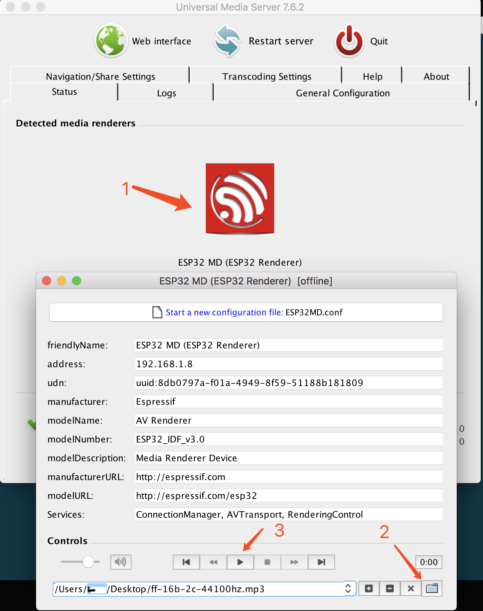
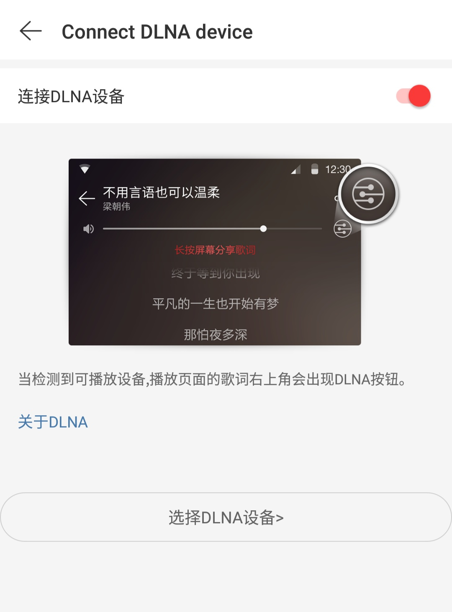

# 数字生活网络联盟 (DLNA) 例程

- [English Version](./README.md)
- 例程难度：


## 例程简介

本例程演示了在 ESP-ADF 框架中运行 UPnP/DLNA 媒体渲染器的过程。

数字生活网络联盟 (Digital Living Network Alliance, DLNA) 旨在解决个人 PC、消费电器和移动设备在内的无线网络和有线网络的互联互通，目的是打通数字媒体和内容服务之间共享的一种解决的方案。


## 环境配置

### 硬件要求

本例程支持的开发板在 `$ADF_PATH/examples/README_CN.md` 文档中[例程与乐鑫音频开发板的兼容性表格](../../README_CN.md#例程与乐鑫音频开发板的兼容性)中有标注，表格中标有绿色复选框的开发板均可运行本例程。请记住，如下面的 [配置](#配置) 一节所述，可以在 `menuconfig` 中选择开发板。


## 编译和下载

### IDF 默认分支

本例程支持 IDF release/v3.3 及以后的分支，例程默认使用 ADF 的內建分支 `$ADF_PATH/esp-idf`。

### 配置


本例程默认选择的开发板是 `ESP32-Lyrat V4.3`，如果需要在其他的开发板上运行此例程，则需要在 menuconfig 中选择开发板的配置，例如选择 `ESP32-Lyrat-Mini V1.1`。

```
menuconfig > Audio HAL > ESP32-Lyrat-Mini V1.1
```

本例程需要先配置 Wi-Fi 连接信息，通过运行 `menuconfig > Example Configuration` 填写 `Wi-Fi SSID` 和 `Wi-Fi Password`。

```
menuconfig > Example Configuration > (myssid) WiFi SSID > (myssid) WiFi Password
```


### 编译和下载
请先编译版本并烧录到开发板上，然后运行 monitor 工具来查看串口输出 (替换 PORT 为端口名称)：

```
idf.py -p PORT flash monitor
```

退出调试界面使用 ``Ctrl-]``。

有关配置和使用 ESP-IDF 生成项目的完整步骤，请参阅 [《ESP-IDF 编程指南》](https://docs.espressif.com/projects/esp-idf/zh_CN/release-v4.2/esp32/index.html)。

## 如何使用例程

### 功能和用法

本例程需要先运行 DLNA 服务器，对于电脑端的配置如下：
- 先安装 [Universal Media Center](https://www.universalmediaserver.com/) 或其他的 DLNA 媒体控制终端。
- 按照下图，选择 ESP32 Renderer > 从电脑选择 MP3 文件 > 点击播放。

  

对于手机端的 DLNA，可以选择网易云音乐 APP。

- 首先，需要手机和开发板共同连接到同一个 Wi-Fi 网络。
- 本例选择安卓手机，打开网易云音乐的设置菜单，`设置` > `连接 DLNA 设备` > `开启`，从扫描到的 DLNA 设备中选择 `ESP32 MD(ESP32 Renderer)` 进行连接。若连接成功，歌曲菜单会有如下图标，点击即可使用 DLNA 设备进行播放。

  

- 例程开始运行后，首先尝试连接 Wi-Fi 无线网络，如果连接成功，则会启动 DLNA，等待服务器的连接和推送，打印如下：

```c
ets Jul 29 2019 12:21:46

rst:0x1 (POWERON_RESET),boot:0x1f (SPI_FAST_FLASH_BOOT)
configsip: 0, SPIWP:0xee
clk_drv:0x00,q_drv:0x00,d_drv:0x00,cs0_drv:0x00,hd_drv:0x00,wp_drv:0x00
mode:DIO, clock div:1
load:0x3fff0030,len:7152
load:0x40078000,len:13240
load:0x40080400,len:4568
0x40080400: _init at ??:?

entry 0x400806f4
I (27) boot: ESP-IDF v4.2.2 2nd stage bootloader
I (27) boot: compile time 15:01:29
I (27) boot: chip revision: 3
I (30) boot.esp32: SPI Speed      : 80MHz
I (35) boot.esp32: SPI Mode       : DIO
I (39) boot.esp32: SPI Flash Size : 4MB
I (44) boot: Enabling RNG early entropy source...
I (49) boot: Partition Table:
I (53) boot: ## Label            Usage          Type ST Offset   Length
I (60) boot:  0 nvs              WiFi data        01 02 00009000 00006000
I (68) boot:  1 phy_init         RF data          01 01 0000f000 00001000
I (75) boot:  2 factory          factory app      00 00 00010000 00200000
I (83) boot: End of partition table
I (87) esp_image: segment 0: paddr=0x00010020 vaddr=0x3f400020 size=0x3da58 (252504) map
I (177) esp_image: segment 1: paddr=0x0004da80 vaddr=0x3ffb0000 size=0x02598 (  9624) load
I (180) esp_image: segment 2: paddr=0x00050020 vaddr=0x400d0020 size=0xbf390 (783248) map
0x400d0020: _stext at ??:?

I (435) esp_image: segment 3: paddr=0x0010f3b8 vaddr=0x3ffb2598 size=0x00d68 (  3432) load
I (436) esp_image: segment 4: paddr=0x00110128 vaddr=0x40080000 size=0x16dc0 ( 93632) load
0x40080000: _WindowOverflow4 at /hengyongchao/esp-idfs/esp-idf-v4.2.2/components/freertos/xtensa/xtensa_vectors.S:1730

I (489) boot: Loaded app from partition at offset 0x10000
I (489) boot: Disabling RNG early entropy source...
I (490) psram: This chip is ESP32-D0WD
I (494) spiram: Found 64MBit SPI RAM device
I (499) spiram: SPI RAM mode: flash 80m sram 80m
I (504) spiram: PSRAM initialized, cache is in low/high (2-core) mode.
I (511) cpu_start: Pro cpu up.
I (515) cpu_start: Application information:
I (520) cpu_start: Project name:     dlna_example
I (525) cpu_start: App version:      v2.2-209-gbe6d16e6-dirty
I (532) cpu_start: Compile time:     Oct 22 2021 15:01:19
I (538) cpu_start: ELF file SHA256:  6be02b440d307699...
I (544) cpu_start: ESP-IDF:          v4.2.2
I (549) cpu_start: Starting app cpu, entry point is 0x40081cf0
0x40081cf0: call_start_cpu1 at /hengyongchao/esp-idfs/esp-idf-v4.2.2/components/esp32/cpu_start.c:287

I (0) cpu_start: App cpu up.
I (1047) spiram: SPI SRAM memory test OK
I (1048) heap_init: Initializing. RAM available for dynamic allocation:
I (1048) heap_init: At 3FFAE6E0 len 00001920 (6 KiB): DRAM
I (1053) heap_init: At 3FFB44B0 len 0002BB50 (174 KiB): DRAM
I (1060) heap_init: At 3FFE0440 len 00003AE0 (14 KiB): D/IRAM
I (1066) heap_init: At 3FFE4350 len 0001BCB0 (111 KiB): D/IRAM
I (1073) heap_init: At 40096DC0 len 00009240 (36 KiB): IRAM
I (1079) cpu_start: Pro cpu start user code
I (1084) spiram: Adding pool of 4082K of external SPI memory to heap allocator
I (1105) spi_flash: detected chip: gd
I (1105) spi_flash: flash io: dio
W (1105) spi_flash: Detected size(8192k) larger than the size in the binary image header(4096k). Using the size in the binary image header.
I (1116) cpu_start: Starting scheduler on PRO CPU.
I (0) cpu_start: Starting scheduler on APP CPU.
I (1126) spiram: Reserving pool of 32K of internal memory for DMA/internal allocations
I (1176) wifi:wifi driver task: 3ffc6364, prio:23, stack:6656, core=0
I (1176) system_api: Base MAC address is not set
I (1176) system_api: read default base MAC address from EFUSE
I (1186) wifi:wifi firmware version: bb6888c
I (1186) wifi:wifi certification version: v7.0
I (1196) wifi:config NVS flash: enabled
I (1196) wifi:config nano formating: disabled
I (1196) wifi:Init data frame dynamic rx buffer num: 32
I (1206) wifi:Init management frame dynamic rx buffer num: 32
I (1206) wifi:Init management short buffer num: 32
I (1216) wifi:Init static tx buffer num: 16
I (1216) wifi:Init tx cache buffer num: 32
I (1216) wifi:Init static rx buffer size: 1600
I (1226) wifi:Init static rx buffer num: 16
I (1226) wifi:Init dynamic rx buffer num: 32
I (1236) wifi_init: rx ba win: 16
I (1236) wifi_init: tcpip mbox: 32
I (1236) wifi_init: udp mbox: 6
I (1246) wifi_init: tcp mbox: 6
I (1246) wifi_init: tcp tx win: 5744
I (1246) wifi_init: tcp rx win: 5744
I (1256) wifi_init: tcp mss: 1440
I (1256) wifi_init: WiFi/LWIP prefer SPIRAM
I (1266) wifi_init: WiFi IRAM OP enabled
I (1266) wifi_init: WiFi RX IRAM OP enabled
I (1276) phy_init: phy_version 4660,0162888,Dec 23 2020
I (1366) wifi:mode : sta (94:b9:7e:65:c2:44)
I (2586) wifi:new:<11,0>, old:<1,0>, ap:<255,255>, sta:<11,0>, prof:1
I (3056) wifi:state: init -> auth (b0)
I (3066) wifi:state: auth -> assoc (0)
I (3076) wifi:state: assoc -> run (10)
I (3096) wifi:connected with esp32, aid = 2, channel 11, BW20, bssid = fc:ec:da:b7:11:c7
I (3096) wifi:security: WPA2-PSK, phy: bgn, rssi: -37
I (3096) wifi:pm start, type: 1

W (3096) PERIPH_WIFI: WiFi Event cb, Unhandle event_base:WIFI_EVENT, event_id:4
I (3166) wifi:AP's beacon interval = 102400 us, DTIM period = 3
I (4666) esp_netif_handlers: sta ip: 192.168.5.187, mask: 255.255.255.0, gw: 192.168.5.1
I (4666) PERIPH_WIFI: Got ip:192.168.5.187
I (4666) gpio: GPIO[19]| InputEn: 1| OutputEn: 0| OpenDrain: 0| Pullup: 1| Pulldown: 0| Intr:3
E (4676) gpio: gpio_install_isr_service(438): GPIO isr service already installed
I (4906) gpio: GPIO[21]| InputEn: 0| OutputEn: 1| OpenDrain: 0| Pullup: 0| Pulldown: 0| Intr:0
I (4906) ES8388_DRIVER: init,out:02, in:00
I (5016) AUDIO_HAL: Codec mode is 2, Ctrl:1
I (5076) ESP_AUDIO_TASK: media_ctrl_task running...,0x3f811c98

----------------------------- ESP Audio Platform -----------------------------
|                                                                            |
|                 ESP_AUDIO-v1.7.0-31-g5b8f999-3072767-09be8fe               |
|                     Compile date: Oct 14 2021-11:00:34                     |
------------------------------------------------------------------------------
I (5106) ESP_DECODER: esp_decoder_init, stack size is 5120
I (5106) I2S: DMA Malloc info, datalen=blocksize=1200, dma_buf_count=3
I (5116) I2S: DMA Malloc info, datalen=blocksize=1200, dma_buf_count=3
I (5136) I2S: APLL: Req RATE: 48000, real rate: 47999.961, BITS: 16, CLKM: 1, BCK_M: 8, MCLK: 12287990.000, SCLK: 1535998.750000, diva: 1, divb: 0
I (5136) LYRAT_V4_3: I2S0, MCLK output by GPIO0
I (5186) DLNA_EXAMPLE: DLNA Started...
```

- 本例程选择安卓手机，使用网易云音乐应用程序，与 DLNA 设备建立连接，连接成功后，点击播放音乐，手机上的音乐则会通过开发板播放出来，日志如下：

```c
I (15456) DLNA_EXAMPLE: Play with speed=1 trans_state STOPPED
I (30766) DLNA_EXAMPLE: get vol = 33
I (31406) DLNA_EXAMPLE: set vol = 38
I (31456) DLNA_EXAMPLE: get vol = 36
I (33106) DLNA_EXAMPLE: get vol = 36
I (33336) DLNA_EXAMPLE: set vol = 31
I (33386) DLNA_EXAMPLE: get vol = 30
I (38446) DLNA_EXAMPLE: Stop instance=0
W (38446) ESP_AUDIO_CTRL: [media_ctrl_stop]-Already stopped, status is UNKNOWN, phase:0
I (38446) DLNA_EXAMPLE: _avt_get_trans_state STOPPED
E (39086) HTTP_CLIENT: Error parse url uuid:5851f42d-8ccf-f646-3129-30705b045db4
I (40056) DLNA_EXAMPLE: SetAVTransportURI=http://m801.music.126.net/20211022155558/ef68cd84f4448a6ebfd6b5735889159b/jdyyaac/015a/5259/025a/603087e667e391674ac550a240ab60c5.m4a
I (40196) DLNA_EXAMPLE: Play with speed=1 trans_state STOPPED
I (40196) ESP_AUDIO_TASK: It's a decoder
I (40196) ESP_AUDIO_TASK: 1.CUR IN:[IN_http],CODEC:[DEC_auto],RESAMPLE:[48000],OUT:[OUT_iis],rate:0,ch:0,pos:0
I (40206) ESP_AUDIO_TASK: 2.Handles,IN:0x3f812104,CODEC:0x3f8125dc,FILTER:0x3f81c920,OUT:0x3f81277c
I (40216) ESP_AUDIO_TASK: 2.2 Update all pipeline
I (40216) ESP_AUDIO_TASK: 2.3 Linked new pipeline
I (40226) ESP_AUDIO_TASK: 3. Previous starting...
I (40236) ESP_AUDIO_TASK: Blocking play until received AEL_MSG_CMD_REPORT_MUSIC_INFO
I (40236) ESP_DECODER: Ready to do audio type check, pos:0, (line 104)
I (40336) HTTP_STREAM: total_bytes=2712381
I (40346) ESP_AUDIO_TASK: Recv Element[IN_http-0x3f812104] MSG,type:20000,cmd:8,len:4,status:AEL_STATUS_STATE_RUNNING
I (40346) ESP_DECODER: Detect audio type is M4A
I (40346) CODEC_ELEMENT_HELPER: The element is 0x3f8125dc. The reserve data 2 is 0x0.
I (40356) AAC_DECODER: a new song playing
I (40696) ESP_AUDIO_TASK: Recv Element[DEC_auto-0x3f8125dc] MSG,type:20000,cmd:8,len:4,status:AEL_STATUS_STATE_RUNNING
I (40706) ESP_AUDIO_TASK: Received music info then on play
I (40706) ESP_AUDIO_TASK: On event play, status:UNKNOWN, 0
I (40716) I2S_STREAM: AUDIO_STREAM_WRITER
I (40716) AUDIO_FORGE: audio_forge opened
I (40716) ESP_AUDIO_TASK: Recv Element[OUT_iis-0x3f81277c] MSG,type:20000,cmd:8,len:4,status:AEL_STATUS_STATE_RUNNING
I (40736) ESP_AUDIO_TASK: Recv Element[Audio_forge-0x3f81c920] MSG,type:20000,cmd:8,len:4,status:AEL_STATUS_STATE_RUNNING
I (40746) ESP_AUDIO_TASK: ESP_AUDIO status is AEL_STATUS_STATE_RUNNING, 0, src:0, is_stopping:0
I (40756) ESP_AUDIO_TASK: Func:media_ctrl_task, Line:984, MEM Total:4080504 Bytes, Inter:182272 Bytes, Dram:144868 Bytes

I (40766) DLNA_EXAMPLE: _avt_get_trans_state PLAYING
I (40776) DLNA_EXAMPLE: _avt_get_trans_state PLAYING
```

- 支持歌曲暂停、下一曲、上一曲、音量加、音量减等操作的，歌曲暂停。日志如下：

```c
I (114436) DLNA_EXAMPLE: Pause instance=0
I (114436) ESP_AUDIO_TASK: MEDIA_CTRL_EVT_PAUSE
I (114436) AUDIO_FORGE: audio forge closed
I (114476) DLNA_EXAMPLE: _avt_get_trans_state PAUSED_PLAYBACK
I (114476) ESP_AUDIO_TASK: Recv Element[Audio_forge-0x3f81c920] MSG,type:20000,cmd:8,len:4,status:AEL_STATUS_STATE_PAUSED
I (114476) ESP_AUDIO_TASK: Recv Element[OUT_iis-0x3f81277c] MSG,type:20000,cmd:8,len:4,status:AEL_STATUS_STATE_PAUSED
I (114486) DLNA_EXAMPLE: _avt_get_trans_state PAUSED_PLAYBACK
```

### 日志输出
以下为本例程的完整日志。

```c
ets Jul 29 2019 12:21:46

rst:0x1 (POWERON_RESET),boot:0x1f (SPI_FAST_FLASH_BOOT)
configsip: 0, SPIWP:0xee
clk_drv:0x00,q_drv:0x00,d_drv:0x00,cs0_drv:0x00,hd_drv:0x00,wp_drv:0x00
mode:DIO, clock div:1
load:0x3fff0030,len:7152
load:0x40078000,len:13240
load:0x40080400,len:4568
0x40080400: _init at ??:?

entry 0x400806f4
I (27) boot: ESP-IDF v4.2.2 2nd stage bootloader
I (27) boot: compile time 15:01:29
I (27) boot: chip revision: 3
I (30) boot.esp32: SPI Speed      : 80MHz
I (35) boot.esp32: SPI Mode       : DIO
I (39) boot.esp32: SPI Flash Size : 4MB
I (44) boot: Enabling RNG early entropy source...
I (49) boot: Partition Table:
I (53) boot: ## Label            Usage          Type ST Offset   Length
I (60) boot:  0 nvs              WiFi data        01 02 00009000 00006000
I (68) boot:  1 phy_init         RF data          01 01 0000f000 00001000
I (75) boot:  2 factory          factory app      00 00 00010000 00200000
I (83) boot: End of partition table
I (87) esp_image: segment 0: paddr=0x00010020 vaddr=0x3f400020 size=0x3da58 (252504) map
I (177) esp_image: segment 1: paddr=0x0004da80 vaddr=0x3ffb0000 size=0x02598 (  9624) load
I (180) esp_image: segment 2: paddr=0x00050020 vaddr=0x400d0020 size=0xbf390 (783248) map
0x400d0020: _stext at ??:?

I (435) esp_image: segment 3: paddr=0x0010f3b8 vaddr=0x3ffb2598 size=0x00d68 (  3432) load
I (436) esp_image: segment 4: paddr=0x00110128 vaddr=0x40080000 size=0x16dc0 ( 93632) load
0x40080000: _WindowOverflow4 at /hengyongchao/esp-idfs/esp-idf-v4.2.2/components/freertos/xtensa/xtensa_vectors.S:1730

I (489) boot: Loaded app from partition at offset 0x10000
I (489) boot: Disabling RNG early entropy source...
I (490) psram: This chip is ESP32-D0WD
I (494) spiram: Found 64MBit SPI RAM device
I (499) spiram: SPI RAM mode: flash 80m sram 80m
I (504) spiram: PSRAM initialized, cache is in low/high (2-core) mode.
I (511) cpu_start: Pro cpu up.
I (515) cpu_start: Application information:
I (520) cpu_start: Project name:     dlna_example
I (525) cpu_start: App version:      v2.2-209-gbe6d16e6-dirty
I (532) cpu_start: Compile time:     Oct 22 2021 15:01:19
I (538) cpu_start: ELF file SHA256:  6be02b440d307699...
I (544) cpu_start: ESP-IDF:          v4.2.2
I (549) cpu_start: Starting app cpu, entry point is 0x40081cf0
0x40081cf0: call_start_cpu1 at /hengyongchao/esp-idfs/esp-idf-v4.2.2/components/esp32/cpu_start.c:287

I (0) cpu_start: App cpu up.
I (1047) spiram: SPI SRAM memory test OK
I (1048) heap_init: Initializing. RAM available for dynamic allocation:
I (1048) heap_init: At 3FFAE6E0 len 00001920 (6 KiB): DRAM
I (1053) heap_init: At 3FFB44B0 len 0002BB50 (174 KiB): DRAM
I (1060) heap_init: At 3FFE0440 len 00003AE0 (14 KiB): D/IRAM
I (1066) heap_init: At 3FFE4350 len 0001BCB0 (111 KiB): D/IRAM
I (1073) heap_init: At 40096DC0 len 00009240 (36 KiB): IRAM
I (1079) cpu_start: Pro cpu start user code
I (1084) spiram: Adding pool of 4082K of external SPI memory to heap allocator
I (1105) spi_flash: detected chip: gd
I (1105) spi_flash: flash io: dio
W (1105) spi_flash: Detected size(8192k) larger than the size in the binary image header(4096k). Using the size in the binary image header.
I (1116) cpu_start: Starting scheduler on PRO CPU.
I (0) cpu_start: Starting scheduler on APP CPU.
I (1126) spiram: Reserving pool of 32K of internal memory for DMA/internal allocations
I (1176) wifi:wifi driver task: 3ffc6364, prio:23, stack:6656, core=0
I (1176) system_api: Base MAC address is not set
I (1176) system_api: read default base MAC address from EFUSE
I (1186) wifi:wifi firmware version: bb6888c
I (1186) wifi:wifi certification version: v7.0
I (1196) wifi:config NVS flash: enabled
I (1196) wifi:config nano formating: disabled
I (1196) wifi:Init data frame dynamic rx buffer num: 32
I (1206) wifi:Init management frame dynamic rx buffer num: 32
I (1206) wifi:Init management short buffer num: 32
I (1216) wifi:Init static tx buffer num: 16
I (1216) wifi:Init tx cache buffer num: 32
I (1216) wifi:Init static rx buffer size: 1600
I (1226) wifi:Init static rx buffer num: 16
I (1226) wifi:Init dynamic rx buffer num: 32
I (1236) wifi_init: rx ba win: 16
I (1236) wifi_init: tcpip mbox: 32
I (1236) wifi_init: udp mbox: 6
I (1246) wifi_init: tcp mbox: 6
I (1246) wifi_init: tcp tx win: 5744
I (1246) wifi_init: tcp rx win: 5744
I (1256) wifi_init: tcp mss: 1440
I (1256) wifi_init: WiFi/LWIP prefer SPIRAM
I (1266) wifi_init: WiFi IRAM OP enabled
I (1266) wifi_init: WiFi RX IRAM OP enabled
I (1276) phy_init: phy_version 4660,0162888,Dec 23 2020
I (1366) wifi:mode : sta (94:b9:7e:65:c2:44)
I (2586) wifi:new:<11,0>, old:<1,0>, ap:<255,255>, sta:<11,0>, prof:1
I (3056) wifi:state: init -> auth (b0)
I (3066) wifi:state: auth -> assoc (0)
I (3076) wifi:state: assoc -> run (10)
I (3096) wifi:connected with esp32, aid = 2, channel 11, BW20, bssid = fc:ec:da:b7:11:c7
I (3096) wifi:security: WPA2-PSK, phy: bgn, rssi: -37
I (3096) wifi:pm start, type: 1

W (3096) PERIPH_WIFI: WiFi Event cb, Unhandle event_base:WIFI_EVENT, event_id:4
I (3166) wifi:AP's beacon interval = 102400 us, DTIM period = 3
I (4666) esp_netif_handlers: sta ip: 192.168.5.187, mask: 255.255.255.0, gw: 192.168.5.1
I (4666) PERIPH_WIFI: Got ip:192.168.5.187
I (4666) gpio: GPIO[19]| InputEn: 1| OutputEn: 0| OpenDrain: 0| Pullup: 1| Pulldown: 0| Intr:3
E (4676) gpio: gpio_install_isr_service(438): GPIO isr service already installed
I (4906) gpio: GPIO[21]| InputEn: 0| OutputEn: 1| OpenDrain: 0| Pullup: 0| Pulldown: 0| Intr:0
I (4906) ES8388_DRIVER: init,out:02, in:00
I (5016) AUDIO_HAL: Codec mode is 2, Ctrl:1
I (5076) ESP_AUDIO_TASK: media_ctrl_task running...,0x3f811c98

----------------------------- ESP Audio Platform -----------------------------
|                                                                            |
|                 ESP_AUDIO-v1.7.0-31-g5b8f999-3072767-09be8fe               |
|                     Compile date: Oct 14 2021-11:00:34                     |
------------------------------------------------------------------------------
I (5106) ESP_DECODER: esp_decoder_init, stack size is 5120
I (5106) I2S: DMA Malloc info, datalen=blocksize=1200, dma_buf_count=3
I (5116) I2S: DMA Malloc info, datalen=blocksize=1200, dma_buf_count=3
I (5136) I2S: APLL: Req RATE: 48000, real rate: 47999.961, BITS: 16, CLKM: 1, BCK_M: 8, MCLK: 12287990.000, SCLK: 1535998.750000, diva: 1, divb: 0
I (5136) LYRAT_V4_3: I2S0, MCLK output by GPIO0
I (5186) DLNA_EXAMPLE: DLNA Started...
I (15456) DLNA_EXAMPLE: Play with speed=1 trans_state STOPPED
I (30766) DLNA_EXAMPLE: get vol = 33
I (31406) DLNA_EXAMPLE: set vol = 38
I (31456) DLNA_EXAMPLE: get vol = 36
I (33106) DLNA_EXAMPLE: get vol = 36
I (33336) DLNA_EXAMPLE: set vol = 31
I (33386) DLNA_EXAMPLE: get vol = 30
I (38446) DLNA_EXAMPLE: Stop instance=0
W (38446) ESP_AUDIO_CTRL: [media_ctrl_stop]-Already stopped, status is UNKNOWN, phase:0
I (38446) DLNA_EXAMPLE: _avt_get_trans_state STOPPED
E (39086) HTTP_CLIENT: Error parse url uuid:5851f42d-8ccf-f646-3129-30705b045db4
I (40056) DLNA_EXAMPLE: SetAVTransportURI=http://m801.music.126.net/20211022155558/ef68cd84f4448a6ebfd6b5735889159b/jdyyaac/015a/5259/025a/603087e667e391674ac550a240ab60c5.m4a
I (40196) DLNA_EXAMPLE: Play with speed=1 trans_state STOPPED
I (40196) ESP_AUDIO_TASK: It's a decoder
I (40196) ESP_AUDIO_TASK: 1.CUR IN:[IN_http],CODEC:[DEC_auto],RESAMPLE:[48000],OUT:[OUT_iis],rate:0,ch:0,pos:0
I (40206) ESP_AUDIO_TASK: 2.Handles,IN:0x3f812104,CODEC:0x3f8125dc,FILTER:0x3f81c920,OUT:0x3f81277c
I (40216) ESP_AUDIO_TASK: 2.2 Update all pipeline
I (40216) ESP_AUDIO_TASK: 2.3 Linked new pipeline
I (40226) ESP_AUDIO_TASK: 3. Previous starting...
I (40236) ESP_AUDIO_TASK: Blocking play until received AEL_MSG_CMD_REPORT_MUSIC_INFO
I (40236) ESP_DECODER: Ready to do audio type check, pos:0, (line 104)
I (40336) HTTP_STREAM: total_bytes=2712381
I (40346) ESP_AUDIO_TASK: Recv Element[IN_http-0x3f812104] MSG,type:20000,cmd:8,len:4,status:AEL_STATUS_STATE_RUNNING
I (40346) ESP_DECODER: Detect audio type is M4A
I (40346) CODEC_ELEMENT_HELPER: The element is 0x3f8125dc. The reserve data 2 is 0x0.
I (40356) AAC_DECODER: a new song playing
I (40696) ESP_AUDIO_TASK: Recv Element[DEC_auto-0x3f8125dc] MSG,type:20000,cmd:8,len:4,status:AEL_STATUS_STATE_RUNNING
I (40706) ESP_AUDIO_TASK: Received music info then on play
I (40706) ESP_AUDIO_TASK: On event play, status:UNKNOWN, 0
I (40716) I2S_STREAM: AUDIO_STREAM_WRITER
I (40716) AUDIO_FORGE: audio_forge opened
I (40716) ESP_AUDIO_TASK: Recv Element[OUT_iis-0x3f81277c] MSG,type:20000,cmd:8,len:4,status:AEL_STATUS_STATE_RUNNING
I (40736) ESP_AUDIO_TASK: Recv Element[Audio_forge-0x3f81c920] MSG,type:20000,cmd:8,len:4,status:AEL_STATUS_STATE_RUNNING
I (40746) ESP_AUDIO_TASK: ESP_AUDIO status is AEL_STATUS_STATE_RUNNING, 0, src:0, is_stopping:0
I (40756) ESP_AUDIO_TASK: Func:media_ctrl_task, Line:984, MEM Total:4080504 Bytes, Inter:182272 Bytes, Dram:144868 Bytes

I (40766) DLNA_EXAMPLE: _avt_get_trans_state PLAYING
I (40776) DLNA_EXAMPLE: _avt_get_trans_state PLAYING
I (67216) gpio: GPIO[21]| InputEn: 0| OutputEn: 1| OpenDrain: 0| Pullup: 0| Pulldown: 0| Intr:0
W (67216) HEADPHONE: Headphone jack inserted
I (114436) DLNA_EXAMPLE: Pause instance=0
I (114436) ESP_AUDIO_TASK: MEDIA_CTRL_EVT_PAUSE
I (114436) AUDIO_FORGE: audio forge closed
I (114476) DLNA_EXAMPLE: _avt_get_trans_state PAUSED_PLAYBACK
I (114476) ESP_AUDIO_TASK: Recv Element[Audio_forge-0x3f81c920] MSG,type:20000,cmd:8,len:4,status:AEL_STATUS_STATE_PAUSED
I (114476) ESP_AUDIO_TASK: Recv Element[OUT_iis-0x3f81277c] MSG,type:20000,cmd:8,len:4,status:AEL_STATUS_STATE_PAUSED
I (114486) DLNA_EXAMPLE: _avt_get_trans_state PAUSED_PLAYBACK

```


## 技术支持
请按照下面的链接获取技术支持：

- 技术支持参见 [esp32.com](https://esp32.com/viewforum.php?f=20) 论坛
- 故障和新功能需求，请创建 [GitHub issue](https://github.com/espressif/esp-adf/issues)

我们会尽快回复。
