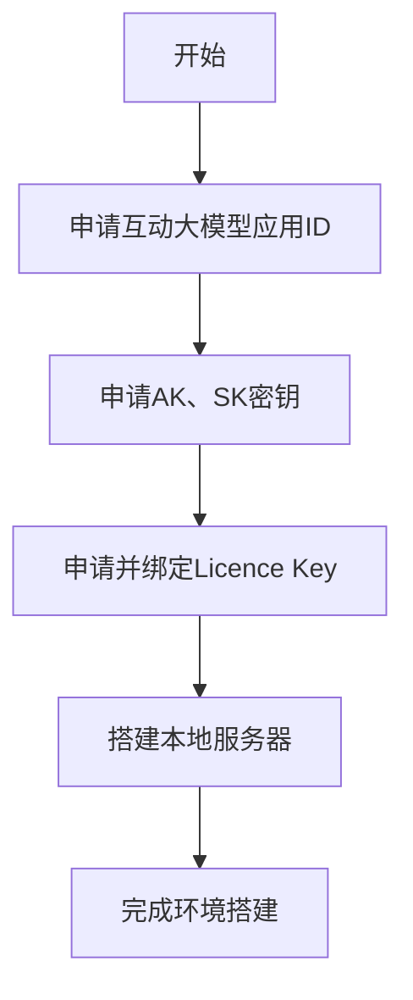

# BRTC 项目

## 1. BRTC 简介

[BRTC (Baidu Real-Time Communication)](https://cloud.baidu.com/?from=console) 是基于ESP32平台的百度实时音视频通信解决方案，支持音频和视觉的处理能力。

### 主要功能
- **实时语音对话**: 支持连续语音交互，低延迟响应
- **语音识别和合成**: 集成ASR(语音识别)和TTS(语音合成)功能
- **网络音乐播放**: 支持在线音乐播放和音频流处理
- **视频对讲**: 支持实时视频通话功能
- **视觉理解**: 集成图像识别和视觉分析能力
- **音频处理**: 3A算法(自动增益、回声消除、噪声抑制)

## 2. 支持的示例应用

### `Voice Assistant App` (语音助手应用)

**位置**: `solutions/voice_assistant_app/`

**功能特性**:
- **智能语音对话**: 基于百度大模型的自然语言交互
- **多工作模式**: 
  - 普通模式: 直接语音对话，无需唤醒词
  - 唤醒模式: 支持"Hi 乐鑫"等唤醒词
- **网络音乐播放**: 支持在线音乐播放和音频流处理
- **音频混音功能**: 支持多路音频同时播放
- **实时音视频**: 支持音视频同步传输

**技术特点**:
- 基于ESP-GMF音频框架
- 集成3A音频处理算法
- 支持WebRTC实时通信
- 低延迟音频处理

**适用场景**: 
- 智能音箱开发
- 语音交互设备
- 智能家居控制
- 音视频通话设备

## 3. 前期准备

### 硬件要求
- **推荐开发板**: ESP32-S3-Korvo-2

### 软件环境
- **ESP-IDF**: release/v5.4 及以上版本
- **依赖框架**: ESP-GMF音频处理框架
- **开发工具**: ESP-IDF开发环境
- **服务账号**: 百度智能云服务账号

### 百度云环境搭建



**1. 申请互动大模型应用ID**
- 访问 [百度智能云互动大模型控制台](https://console.bce.baidu.com/rtc/#/rtc/interaction)
- 创建互动大模型应用，获取应用ID

**2. 申请AK、SK密钥**
- 访问 [百度智能云访问控制台](https://console.bce.baidu.com/iam/#/iam/accesslist)
- 创建访问密钥，获取 Access Key (AK) 和 Secret Key (SK)

**3. 申请并绑定Licence Key**
- 访问 [百度RTC资源管理](https://console.bce.baidu.com/rtc/?_=1756295965745#/rtc/resource)
- 申请 Licence Key
- 将 Licence Key 绑定到步骤1中创建的互动大模型应用

**4. 搭建本地服务器**
- 参考[服务搭建文档](components/brtc/BRTC实时交互智能体接入指引文档V1.4.pdf)
- 需要搭建一个本地服务器用于处理设备与百度云服务之间的通信
- 服务器负责转发音频数据和AI响应
- 获取的服务器URL示例: `http://192.168.3.73:8936/api/v1/aiagent`

## 4. 快速开始

## 进入相关的 solution 中， 如 `voice_assistant_app`

### 配置项目
```bash
# 进入项目目录
cd solutions/voice_assistant_app

# 配置ESP-IDF环境
idf.py set-target esp32s3

# 配置项目参数
idf.py menuconfig
```

在menuconfig中配置:
- **WiFi连接信息**: SSID和密码
- **百度RTC配置**: App ID、User ID、Workflows、Licence Key、Instance ID 和 Server URL

### 编译和烧录
```bash
# 编译项目
idf.py build

# 烧录到设备
idf.py -p PORT flash monitor
```

### 使用说明
- 设备启动后可直接进行语音对话
- 支持唤醒词模式: "Hi 乐鑫"
- 可通过语音指令播放网络音乐
- 支持音视频通话功能

## 5. 故障排查

### 常见问题
- **自问自答现象**: 调整音频增益参数，优化3A算法配置
- **连接失败**: 检查WiFi连接和百度RTC配置信息
- **音频质量问题**: 检查硬件连接和音频采样率设置
- **视频功能异常**: 确认摄像头硬件和驱动配置

### 调试建议
- 使用串口监控查看详细日志
- 检查网络连接状态
- 验证音频设备工作状态
- 监控系统资源使用情况
