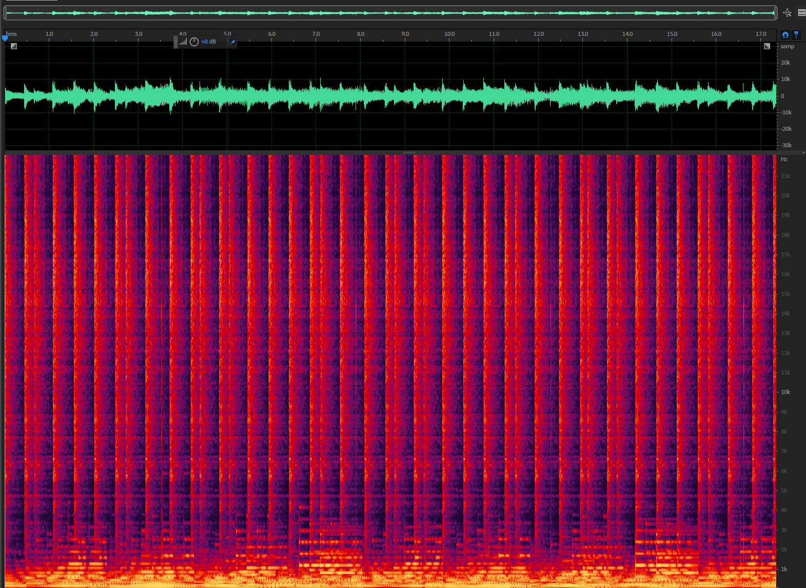
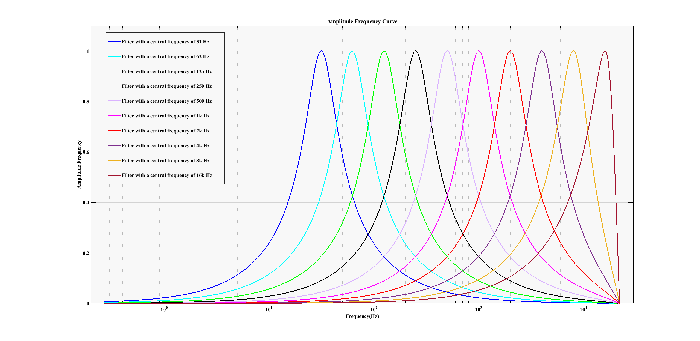

# Playback Example of WAV File Processed by Equalizer

To run this example, you need an ESP32-LyraT or compatible board.

- Connect speakers or headphones to the board. 
- Insert a microSD card loaded with a WAV file 'test.wav' into board's card slot.

To change the parameters of the equalizer, edit set_gain[] table in equalizer_example.c. The center frequencies of equalizer are 31Hz, 62Hz, 125Hz, 250Hz, 500Hz, 1kHz, 2kHz, 4kHz, 8kHz and 16kHz.

To run the example of playback, the following conditions should be met:

- The audio file should be in format supported by the equalizer:
    * Sampling rate of 11025Hz, 22050Hz, 44100Hz or 48000Hz.
    * Number of channels: 1 or 2.

- Audio file format for this example is WAV.

- Contents of 'document' folder:
    * The 'test.wav' file is the example file. with sample rate of 44100Hz and a single audio channel.
    * The 'spectrum_before.png' is the spectrum image of the original 'test.wav' file.

    * The 'spectrum_after.png' is the spectrum image of the 'test.wav' file after processing by the equalizer, when the gain of equalizer is -13 dB.

    * The 'amplitude_frequency.png' is the equalizer's frequency response diagram, when the gain of equalizer is 0 dB.

