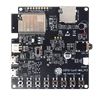
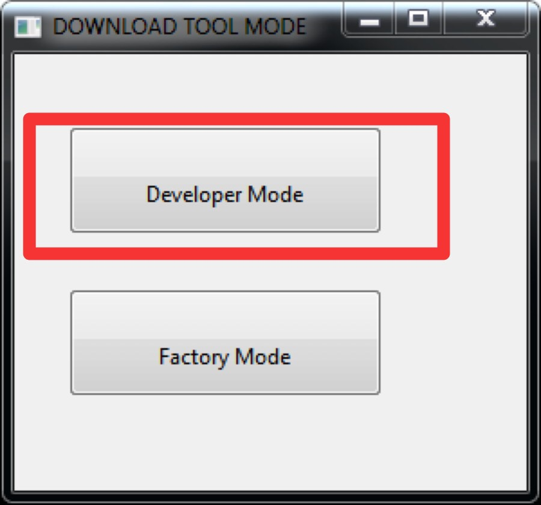
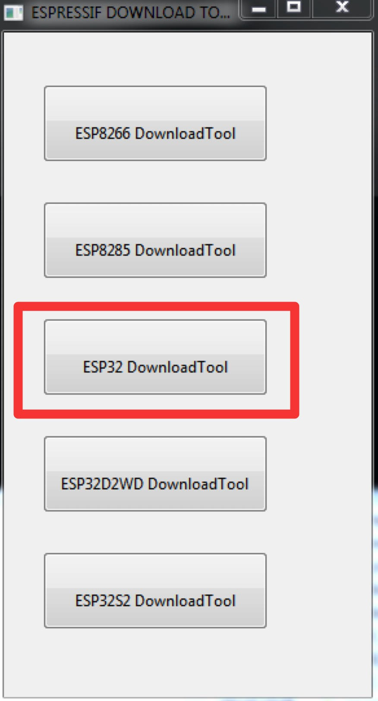
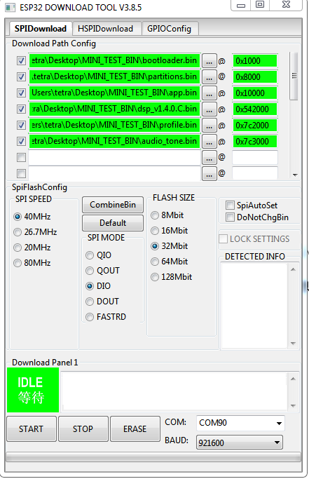
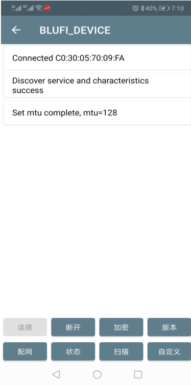
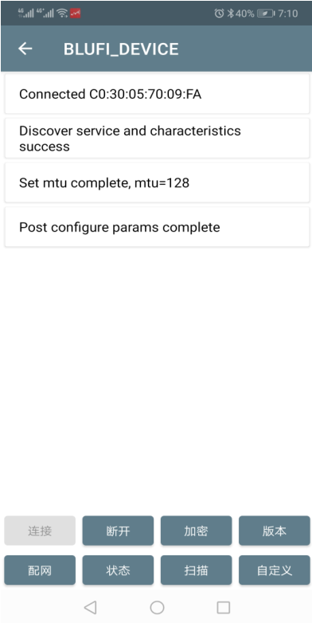

# Example of ESP32-Korvo-DU1906 board

This example shows how to use ESP32-Korvo-DU1906 board working with DuHome AIOT Voice Platform (度家-AIOT语音平台).The board supports features such as:
- ASR, TTS and NLP
- Bluetooth music
- BLE Wi-Fi provisioning
- OTA
- Mesh and infrared controller

The board together with the platform provide easy way to develop a smart speaker or AIOT device.

# How to use example

## Hardware Required

This example is will run on boards marked with green checkbox. Please remember to select the board in menuconfig as discussed is section *Usage* below.

| Board Name | Getting Started | Chip | Compatible |
|-------------------|:--------------------------------------------------------------------------------------------------------------------------------------------------------------------------------------------:|:--------------------------------------------------------------------:|:-----------------------------------------------------------------:|
| ESP32-LyraT | [](https://docs.espressif.com/projects/esp-adf/en/latest/get-started/get-started-esp32-lyrat.html) |  |  |
| ESP32-LyraTD-MSC | [](https://docs.espressif.com/projects/esp-adf/en/latest/get-started/get-started-esp32-lyratd-msc.html) |  |  |
| ESP32-LyraT-Mini | [](https://docs.espressif.com/projects/esp-adf/en/latest/get-started/get-started-esp32-lyrat-mini.html) |  |  |
| ESP32-Du1906 |  |  |  |
| ESP32-S2-Kaluga-1 Kit |  |  |  |

## Setup software environment

Please refer to [Get Started](https://docs.espressif.com/projects/esp-adf/en/latest/get-started/index.html#get-started).

## Authentication code

Please refer to [度家 AIOT 快速入门](https://cloud.baidu.com/doc/SHC/s/wk7bl9g8i) and apply for factory code (fc), product Key (pk), access key (ak) and secret key (sk) that should be then saved in `profiles/profile.bin`

## Jumpstart the example
No need to compile the project, just use the firmware in this example.

The firmware downloading flash address refer to follow table.

Flash address | Bin Path
---|---
0x1000 | bootloader.bin
0x8000 | partitions.bin
0x10000 | app.bin
0x510000 | DU1906_slave_v1.4.8.E.bin
0x790000 | profile.bin
0x791000 | audio_tone.bin

### Download firmware

#### Linux operating system

Run the command below:
```bash
python $ADF_PATH/esp-idf/components/esptool_py/esptool/esptool.py --chip esp32 \
--port PORT --baud 921600 \
--before default_reset \
--after hard_reset write_flash -z --flash_mode dio --flash_freq 80m --flash_size detect \
0x1000   ./firmware/bootloader.bin \
0x8000   ./firmware/partitions.bin \
0x10000  ./firmware/app.bin \
0x510000 ./firmware/DU1906_slave_v1.4.8.E.bin \
0x790000 ./profiles/profile.bin \
0x791000 ./tone/audio_tone.bin
```
#### Windows operating system

- **step 1:** [Download the firmware download tool](https://www.espressif.com/sites/default/files/tools/flash_download_tool_v3.8.5_0.zip) and unzip the compressed package, then run the executable file with ".exe" suffix.
- **step 2:** Choose download mode (Developer Mode)

    

- **step 3:** Choose chip (ESP32)

    

- **step 4:** open firmware directory (`$ADF_PATH/example/korvo_du1906/firmware`) and fill in the address according to the above flash address table.

    

**Note: The tone bin is in `$ADF_PATH/example/korvo_du1906/tone/audio_tone.bin` and profile.bin is in `$ADF_PATH/example/korvo_du1906/profile/profile.bin`**

- **step 5:** Click `START` button on the graphical interface to download the firmware

After download firmware, press `[RST]` button, and then there will be some logs print on the serial port.

### Network configuration

- **step 1:** Download and install Blufi app on cell phone, [App for Andriod](https://github.com/EspressifApp/EspBlufiForAndroid/releases), [App for IOS](https://github.com/EspressifApp/EspBlufiForiOS/releases)
- **step 2:** Open bluetooth and open blufi app on mobilephone, scan the device.
- **step 3:** Press `[FUNC]` button on device for 4s, the device will enter wifi-setting mode, and play a tone music "请点击确认开始配网".
- **step 4:** Fresh the scan list, there will be a device named "BLUFI_DEVICE", click it and choose `[连接]` on phone.

    

- **step 5:** After connect to device, click `[配网]`, input wifi ssid and password that to connect.
- **step 6:** Click `[确认]`, the device will acquire the wifi information and connect to network. If conenct to wifi successfully, the app will receive a string "hello world" and the device will play a tone music "网络连接成功".

    

**Note: If configurate fails, check the above process and try again. Be careful and patient!**

### Features experience

**Note that, please make sure that there is a speaker inserts to the board at least.**

#### Voice interaction

After configurate wifi information and connect to network, you can start a conversation with a voice wake-up word "xiaodu xiaodu", such as below supported command:
- "小度小度" "在呢" "讲个笑话"
- "小度小度" "在呢" "上海天气怎么样？"
- "小度小度" "在呢" "播放一首歌"
- "小度小度" "在呢" "百度百科乐鑫信息科技"

If you need more instructions, you can define them in the background of Baidu.

#### bluetooth music

Press `[MUTE]` button for 3-5s enter BT mode, open bluetooth on your phone and connect to device named "ESP_BT_COEX_DEV", and then you can play bt music on the device.

#### Buttons usage
Name of Button | Short press | Long press
:-:|:-:|:-:
VOL + | Volume up | NA
VOL - | Volume down| NA
MUTE | Enter mute mode |Enter/Exit BT mode
FUNC | NA |Setting Wi-Fi

## Build and flash

After the experience, it's time to build the example now! you can also add some features by yourself and then build it.

### IDF branch

For now, we need to select audio IDF branch as follow.
```bash
cd $IDF_PATH
git pull
git checkout -b audio/stack_on_psram_v3.3 origin/audio/stack_on_psram_v3.3
git submodule update --init --recursive
```
The latest commit ID is `0c1859a5a5a5eded5af1b9423c290781e3973915`

###  Menuconfig

Select the default sdkconfig for build

```bash
cp sdkconfig.defaults sdkconfig
```

### Build

You can use `GNU make` or `cmake` to build the project.
If you are using make:
```bash
cd $ADF_PATH/examples/korvo_du1906
make clean
make menuconfig
make -j4 all
```

Or if you are using cmake:
```bash
cd $ADF_PATH/examples/korvo_du1906
idf.py fullclean
idf.py menuconfig
idf.py build
```

### Downloading

Download application with make
```bash
make flash ESPPORT=PORT
```
Or if you are using cmake
```bash
idf.py flash -p PORT
```

**Note:** Replace `PORT` with USB port name where ESP32-Korvo-DU1906 board is connected to.

In addition, ESP32-Korvo-DU1906 have three more bins, `./firmware/DU1906_slave_v1.4.8.E.bin`,  `./profiles/profile.bin` and `./tone/audio-esp.bin`.
```bash
python $ADF_PATH/esp-idf/components/esptool_py/esptool/esptool.py --chip esp32 \
--port PORT --baud 921600 \
--before default_reset \
--after hard_reset write_flash -z --flash_mode dio --flash_freq 80m --flash_size detect \
0x510000 ./firmware/DU1906_slave_v1.4.8.E.bin \
0x790000 ./profiles/profile.bin \
0x791000 ./tone/audio_tone.bin
```

The firmware downloading flash address refer to above table in jumpstart part.

### Usage

Please refer to jumpstart part.

### Upgrade function

The application, flash tone, profile bins, dsp firmware and app firmware upgrade are supported. Those bins can be store on SDcard or HTTP Server, such as, "/sdcard/profile.bin", "https://github.com/espressif/esp-adf/raw/master/examples/korvo_du1906/firmware/app.bin".

#### Upgrade strategy

We have two kind of firmware ota strategy in this example like below.
- Each partition to be upgraded has a separate URL. **(strategy 1)**
- Combine different binary bins to a whole firmware and add a description header to the firmware and just need one URL to access it. **(strategy 2)**

#### strategy 1 (default)

Before the upgration, usually compare the firmware version first, and then judge whether the firmware need to be upgraded. (Sdcard ota in this example doesn't compare firmware version).
To edit the version of firmware like below:
- App bin:  Change "version.txt" in the project directory and recompile.
- Tone bin: Use this script to assign version ``` python  $ADF_PATH/tools/audio_tone/mk_audio_tone.py -r tone/ -f components/audio_flash_tone -v v1.1.1 ```

The bin files version checking after every booting, exculde profile.bin.
User copy the profile.bin to SDCard root folder and inserted to ESP32-Korvo-DU1906 sdcard slot could be execute profile bin upgrade.

The app will wait 15s for wifi connection. If wifi connect, the ota process will start, if not, skip it.

#### strategy 2

To use ota strategy 2, some patchs should be applied first.
```bash
cd $ADF_PATH; git apply $ADF_PATH/examples/korvo_du1906/patches/adf_ota_patch.patch
```
Use script under tools directory to assign version
```bash
cd $ADF_PATH/examples/korvo_du1906/tools/iot_ota_pkg_generator
python mk_ota_bin.py -c tda -st x.x.x -sd x.x.x -sa x.x.x -v xxx -p ../../
```
Use ``` python mk_ota_bin.py -h ``` to get more information about the script.

After execute the script, there will be a combine firmware named "combine_ota_default.bin" generated under the directory. Put the firmware on your website and update the upgrade URL.

Press button `[VOL +]` to excute ota process.

## Example Output

After download the follow logs should be output.
```c
I (64) boot: Chip Revision: 3
I (35) boot: ESP-IDF v3.3.1-203-g0c1859a5a 2nd stage bootloader
I (35) boot: compile time 21:43:15
I (35) boot: Enabling RNG early entropy source...
I (41) qio_mode: Enabling default flash chip QIO
I (46) boot: SPI Speed      : 80MHz
I (50) boot: SPI Mode       : QIO
I (54) boot: SPI Flash Size : 8MB
I (58) boot: Partition Table:
I (62) boot: ## Label            Usage          Type ST Offset   Length
I (69) boot:  0 nvs              WiFi data        01 02 00009000 00004000
I (76) boot:  1 otadata          OTA data         01 00 0000d000 00002000
I (84) boot:  2 phy_init         RF data          01 01 0000f000 00001000
I (91) boot:  3 ota_0            OTA app          00 10 00010000 00280000
I (99) boot:  4 ota_1            OTA app          00 11 00290000 00280000
I (106) boot:  5 dsp_bin          Unknown data     01 24 00510000 00280000
I (114) boot:  6 profile          Unknown data     01 29 00790000 00001000
I (121) boot:  7 flash_tone       Unknown data     01 27 00791000 00060000
I (129) boot: End of partition table
I (133) esp_image: segment 0: paddr=0x00010020 vaddr=0x3f400020 size=0xaabbc (699324) map
I (318) esp_image: segment 1: paddr=0x000babe4 vaddr=0x3ffbdb60 size=0x0542c ( 21548) load
I (325) esp_image: segment 2: paddr=0x000c0018 vaddr=0x400d0018 size=0x1aaf90 (1748880) map
0x400d0018: _stext at ??:?

I (765) esp_image: segment 3: paddr=0x0026afb0 vaddr=0x3ffc2f8c size=0x012c8 (  4808) load
I (767) esp_image: segment 4: paddr=0x0026c280 vaddr=0x40080000 size=0x00400 (  1024) load
0x40080000: _WindowOverflow4 at /Users/maojianxin/duros/baidu_dul1906/dul1906/esp-adf/esp-idf/components/freertos/xtensa_vectors.S:1779

I (772) esp_image: segment 5: paddr=0x0026c688 vaddr=0x40080400 size=0x1d064 (118884) load
I (836) boot: Loaded app from partition at offset 0x10000
I (836) boot: Disabling RNG early entropy source...
I (836) psram: This chip is ESP32-D0WD
I (841) spiram: Found 64MBit SPI RAM device
I (845) spiram: SPI RAM mode: flash 80m sram 80m
I (851) spiram: PSRAM initialized, cache is in low/high (2-core) mode.
I (858) cpu_start: Pro cpu up.
I (862) cpu_start: Application information:
I (866) cpu_start: Project name:     korvo_du1906
I (872) cpu_start: App version:      v1.2.0
I (877) cpu_start: ELF file SHA256:  36613ad813caa06e...
I (883) cpu_start: ESP-IDF:          v3.3.1-203-g0c1859a5a
I (889) cpu_start: Starting app cpu, entry point is 0x400818dc
0x400818dc: call_start_cpu1 at /Users/maojianxin/duros/baidu_dul1906/dul1906/esp-adf/esp-idf/components/esp32/cpu_start.c:274

I (0) cpu_start: App cpu up.
I (1378) spiram: SPI SRAM memory test OK
I (1380) heap_init: Initializing. RAM available for dynamic allocation:
I (1380) heap_init: At 3FFAFF10 len 000000F0 (0 KiB): DRAM
I (1385) heap_init: At 3FFB6388 len 00001C78 (7 KiB): DRAM
I (1391) heap_init: At 3FFB9A20 len 00004108 (16 KiB): DRAM
I (1397) heap_init: At 3FFBDB5C len 00000004 (0 KiB): DRAM
I (1403) heap_init: At 3FFC7C18 len 000183E8 (96 KiB): DRAM
I (1409) heap_init: At 3FFE0440 len 00003AE0 (14 KiB): D/IRAM
I (1416) heap_init: At 3FFE4350 len 0001BCB0 (111 KiB): D/IRAM
I (1422) heap_init: At 4009D464 len 00002B9C (10 KiB): IRAM
68ad6443 f76e90a4 1fc0565a e1e3c08d 69328419 ccb14ddd ba28c093 122787aa
fd1ca6af fe1f4f20 46307e06 e37f0c0b 025288ba c9e8fc0e 3cb036c7 e95d84d4
4faaf12d 3e747918 019f6fd3 3897429b 30802f52 d5001fab 78534643 1e2f5722
3c163955 e09ffdba 897f4f47 ae615170 94bc40ee a1d63a85 866cf213 cdf6f139
52b29e17 1de4df29 0389e31f 3d4214f3 99e396bf 6c3e7b4b 65edde67 74afc5e8
f239edaf a1452940 482e8dac fd96e119 0a58b4f6 ff205186 a1f8528f 837fc8be
523275fd e5edaf71 5480949b e41bf7d8 dc0b17ee 77a1c8a9 d6ef15d9 9842cc2d
c739c3bd 0cb9d59d 4a66718b aa189302 b7f576d8 8d310fa0 70b661f7 15dfca0e
I (1479) cpu_start: Pro cpu start user code
I (1484) spiram: Adding pool of 4060K of external SPI memory to heap allocator
I (163) esp_core_dump_common: Init core dump to UART
E (168) esp_core_dump_common: No core dump partition found!
I (168) cpu_start: Starting scheduler on PRO CPU.
I (0) cpu_start: Starting scheduler on APP CPU.
I (179) spiram: Reserving pool of 18K of internal memory for DMA/internal allocations
I (210) AUDIO_THREAD: The esp_periph task allocate stack on external memory
E (210) PERIPH_SDCARD: no sdcard detect
E (2711) AUDIO_BOARD: Sdcard mount failed
I (2718) wifi: wifi driver task: 3ffd1a14, prio:23, stack:3584, core=0
I (2718) system_api: Base MAC address is not set, read default base MAC address from BLK0 of EFUSE
I (2723) system_api: Base MAC address is not set, read default base MAC address from BLK0 of EFUSE
I (2747) wifi: wifi firmware version: 0df1a2a
I (2747) wifi: config NVS flash: enabled
I (2747) wifi: config nano formating: disabled
I (2748) wifi: Init dynamic tx buffer num: 32
I (2752) wifi: Init data frame dynamic rx buffer num: 512
I (2757) wifi: Init management frame dynamic rx buffer num: 512
I (2763) wifi: Init management short buffer num: 32
I (2768) wifi: Init static tx buffer num: 16
I (2772) wifi: Init static rx buffer size: 1600
I (2776) wifi: Init static rx buffer num: 16
I (2780) wifi: Init dynamic rx buffer num: 512
I (2784) wifi: init cache tx buffer number 32
I (2901) phy: phy_version: 4181, c9a03e2, Mar 10 2020, 12:45:06, 0, 0
I (2902) wifi: mode : sta (fc:f5:c4:37:c1:10)
I (3717) DU1910_APP: SMARTCONFIG wifi setting module has been selected
I (3721) WIFI_SERV: Connect to wifi ssid: ESP-Audio, pwd: esp123456
I (3922) wifi: new:<6,0>, old:<1,0>, ap:<255,255>, sta:<6,0>, prof:1
I (3922) wifi: state: init -> auth (b0)
I (3928) wifi: state: auth -> assoc (0)
I (3938) wifi: state: assoc -> run (10)
I (3974) wifi: connected with ESP-Audio, aid = 4, channel 6, BW20, bssid = ac:22:0b:d2:ee:58
I (3974) wifi: security type: 4, phy: bgn, rssi: -44
I (3981) wifi: pm start, type: 1

I (4014) wifi: AP's beacon interval = 102400 us, DTIM period = 3
I (4712) event: sta ip: 192.168.1.211, mask: 255.255.255.0, gw: 192.168.1.1
I (4712) WIFI_SERV: Got ip:192.168.1.211
W (4713) WIFI_SERV: STATE type:2, pdata:0x0, len:0
I (4732) DU1910_APP: PERIPH_WIFI_CONNECTED [64]
I (4732) SNTP_INIT: ------------Initializing SNTP
I (4733) APP_OTA_UPGRADE: Create OTA service
I (4737) APP_OTA_UPGRADE: Start OTA service
I (4742) OTA_DEFAULT: data upgrade uri https://github.com/espressif/esp-adf/raw/master/examples/korvo_du1906/tone/audio_tone.bin
I (8018) HTTP_STREAM: total_bytes=166
I (9899) HTTP_STREAM: total_bytes=107950
I (9900) flashPartition: 146: label:flash_tone
I (9900) TONE_STREAM: header tag 2053, format 1
I (9905) TONE_STREAM: audio tone's tail is DFAC
I (9911) APP_OTA_UPGRADE: format 1 : 1
I (9913) APP_OTA_UPGRADE: imcoming magic_word F55F9876, project_name ESP_TONE_BIN
I (9921) APP_OTA_UPGRADE: current version v1.2.0, incoming version v1.0.9
W (9929) APP_OTA_UPGRADE: The incoming version is same as or lower than the running version
E (9938) OTA_SERVICE: No need to upgrade
E (9942) APP_OTA_UPGRADE: List id: 0, OTA failed, result: 589828
I (9949) OTA_DEFAULT: data upgrade uri file://sdcard/profile.bin
I (9956) FATFS_STREAM: File size is 0 byte,pos:0
E (9961) FATFS_STREAM: Failed to open file /sdcard/profile.bin
E (9967) AUDIO_ELEMENT: [file] AEL_STATUS_ERROR_OPEN,-1
E (9973) OTA_DEFAULT: reader stream init failed
E (9978) OTA_SERVICE: OTA prepared fail
E (9983) APP_OTA_UPGRADE: List id: 1, OTA failed, result: 589835
I (16013) esp_https_ota: Starting OTA...
I (16013) esp_https_ota: Writing to partition subtype 17 at offset 0x290000
I (16026) OTA_DEFAULT: Running firmware version: v1.2.0, the incoming firmware version v1.1.1
W (16026) OTA_DEFAULT: Current running version is the same as or higher than a new. We will not continue the update.
E (16037) OTA_SERVICE: No need to upgrade
E (16041) APP_OTA_UPGRADE: List id: 2, OTA failed, result: 589828
W (16048) OTA_SERVICE: OTA_END!
W (16052) APP_OTA_UPGRADE: upgrade finished, Please check the result of OTA
I (16060) TAS5805M: Power ON CODEC with GPIO 12
I (16061) AUDIO_THREAD: The button_task task allocate stack on external memory
I (16066) gpio: GPIO[12]| InputEn: 0| OutputEn: 1| OpenDrain: 0| Pullup: 1| Pulldown: 1| Intr:0
I (17031) TAS5805M: tas5805m_transmit_registers:  write 1677 reg done
W (17031) TAS5805M: volume = 0x44
W (17032) I2C_BUS: i2c_bus_create:57: I2C bus has been already created, [port:0]
W (17042) I2C_BUS: i2c_bus_create:57: I2C bus has been already created, [port:0]
I (17050) AUDIO_HAL: Codec mode is 3, Ctrl:1
I (17052) APP_BT_INIT: Init Bluetooth module

 BT version: high level int 0605
I (17060) BTDM_INIT: BT controller compile version [b343a59]
I (17067) system_api: Base MAC address is not set, read default base MAC address from BLK0 of EFUSE
I (17420) BLE_GATTS: ble gatts module init
I (17420) APP_BT_INIT: Start Bluetooth peripherals
I (17421) AUDIO_THREAD: The media_task task allocate stack on external memory
I (17427) BLE_GATTS: create attribute table successful, the number handle = 8

----------------------------- ESP Audio Platform -----------------------------
I (17435) BLE_GATTS: SERVICE_START_EVT, status 0, service_handle 40
|                                                                            |
|                         ESP_AUDIO-v1.6.3-4-g113c153                        |
|                     Compile date: Jul 22 2020-21:43:33                     |
------------------------------------------------------------------------------
I (17478) BT_HELPER: ap_helper_a2dp_handle_set, 42, 0x0x3f872260, 0x3ffc5fdc
I (17485) MP3_DECODER: MP3 init
I (17489) ESP_DECODER: esp_decoder_init, stack size is 5120
W (17496) TAS5805M: volume = 0x4a
I (17499) APP_PLAYER_INIT: Func:setup_app_esp_audio_instance, Line:150, MEM Total:3788648 Bytes, Inter:90996 Bytes, Dram:83872 Bytes

I (17511) APP_PLAYER_INIT: esp_audio instance is:0x3f872084
I (17518) I2S: DMA Malloc info, datalen=blocksize=1200, dma_buf_count=3
I (17527) I2S: APLL: Req RATE: 48000, real rate: 47999.961, BITS: 16, CLKM: 1, BCK_M: 8, MCLK: 12287990.000, SCLK: 1535998.750000, diva: 1, divb: 0
I (17539) ESP32_Korvo_DU1906: I2S0, MCLK output by GPIO0
I (17545) AUDIO_THREAD: The audio_manager_task task allocate stack on external memory
I (17554) SD_HELPER: default_sdcard_player_init
I (17559) SD_HELPER: default_sdcard_player_init  playlist_create
I (17566) RAW_HELPER: default_raw_player_init :106, que:0x3ffecf4c
W (17573) TAS5805M: volume = 0x58
I (17576) BDSC_ENGINE: APP version is 71b44ade974adfed02ea9d12b2bba36eb60ae6f6
I (17584) AUDIO_PLAYER: tone play, type:203, cur media type:203
I (17591) AP_HELPER: audio_player_helper_default_play, type:203,url:flash://tone/1_boot.mp3,pos:0,block:0,auto:0,mixed:0,inter:1
W (17603) AUDIO_MANAGER: ap_manager_backup_audio_info, not found the current operations
W (17612) AUDIO_MANAGER: AP_MANAGER_PLAY, Unblock playing, type:203, auto:0, block:0
I (17624) TONE_STREAM: Wanted read flash tone index is 1
I (17626) TONE_STREAM: Tone offset:00001a38, Tone length:39019, total num:13  pos:1

I (17662) AUDIO_THREAD: The DEC_auto task allocate stack on external memory
I (17663) ESP_DECODER: Ready to do audio type check, pos:0, (line 104)
I (17669) ESP_DECODER: Detect audio type is MP3
I (17676) MP3_DECODER: MP3 opened
I (17691) RSP_FILTER: reset sample rate of source data : 44100, reset channel of source data : 1
I (17691) AUDIO_THREAD: The resample task allocate stack on external memory
I (17698) AUDIO_THREAD: The OUT_iis task allocate stack on external memory
I (17705) I2S_STREAM: AUDIO_STREAM_WRITER
I (17874) RSP_FILTER: sample rate of source data : 44100, channel of source data : 1, sample rate of destination data : 48000, channel of destination data : 2
W (17878) DU1910_APP: AUDIO_PLAYER_CALLBACK send OK, status:1, err_msg:0, media_src:203, ctx:0x0
W (17903) AUDIO_MANAGER: AP_MANAGER_PLAY, Unblock playing timeout occurred
W (17904) TAS5805M: volume = 0x58
I (17904) SNTP_INIT: ------------Initializing SNTP
I (17911) PROFILE: 55: type[0x1]
I (17913) PROFILE: 56: subtype[0x29]
I (17918) PROFILE: 57: address:0x790000
I (17922) PROFILE: 58: size:0x1000
I (17930) PROFILE: 59: label:profile
I (17943) PROFILE: fc            = your_fc
I (17943) PROFILE: pk            = your_pk
I (17943) PROFILE: ak            = your_ak
I (17948) PROFILE: sk            = your_sk
I (17956) PROFILE: mqtt_broker   = azsgqzj.iot.gz.baidubce.com
I (17960) PROFILE: mqtt_username = xxxxxxxxxxx|xxxxxxxxxxx|0|MD5
I (17969) PROFILE: mqtt_password = xxxxxxxxxxx
I (17976) PROFILE: mqtt_cid      = xxxxxxxxxxx
I (17986) PROFILE: cur_version_num = 0
I (17988) PROFILE: tone_sub_ver    = 0.0.0
I (17992) PROFILE: dsp_sub_ver     = 0.0.0
I (17997) PROFILE: app_sub_ver     = 0.0.0
I (18005) BLUFI_CONFIG: Set blufi customized data: your_fc#your_pk#your_ak#your_sk, length: 56
I (18016) gpio: GPIO[27]| InputEn: 0| OutputEn: 1| OpenDrain: 0| Pullup: 0| Pulldown: 0| Intr:0
I (18023) ESP32_GPIO_DRIVER: Initializing GPIO reset is successful.
I (18030) dsp_download_imp: esp32_spi_init...
I (18035) ESP32_SPI_DRIVER: Initializing SPI is successful,clock speed is 16MHz,mode 0.
I (18044) gpio: GPIO[38]| InputEn: 1| OutputEn: 0| OpenDrain: 0| Pullup: 1| Pulldown: 0| Intr:1
E (18053) gpio: gpio_install_isr_service(410): GPIO isr service already installed
esp32_intr_gpio_init 38.
I (18063) wakeup_hal: esp32_intr_gpio_init, ret:0
I (18069) BDSC_ENGINE: cuid: your_fcyour_pkyour_ak
GPIO_DSP_RST is high.
I (18298) BDDSP_SPI_DRIVER: bddsp_load_bin_slave: entering...
I (18299) BDDSP_SPI_DRIVER: type: 55, load dst:5ff60000 src:60000000 storage src:00000240 len:131072.
I (18304) BDDSP_SPI_DRIVER: index :0 total:8.
md5:92B8C60C4122D986D8C166BEBF1E5F22.
I (18598) BDDSP_SPI_DRIVER: md5 wait time 78.
I (18668) BDDSP_SPI_DRIVER: type: 55, load dst:5ff80000 src:60000000 storage src:00020240 len:507904.
I (18669) BDDSP_SPI_DRIVER: index :1 total:8.
md5:806C15442352D6F7E3968195E5D16E84.
I (19798) BDDSP_SPI_DRIVER: md5 wait time 304.
I (20035) BDDSP_SPI_DRIVER: type: 55, load dst:60050000 src:60050000 storage src:0009c240 len:536576.
I (20036) BDDSP_SPI_DRIVER: index :2 total:8.
md5:E37F61A507D025162AC3AC01888491A9.
I (21218) BDDSP_SPI_DRIVER: md5 wait time 321.
I (21465) BDDSP_SPI_DRIVER: type: aa, load dst:5ff60000 src:50000000 storage src:0011f240 len:16.
I (21466) BDDSP_SPI_DRIVER: index :3 total:8.
I (21469) BDDSP_SPI_DRIVER: core boot addr: 0x5ff60000 0x50000000

I (21477) BDDSP_SPI_DRIVER: type: 55, load dst:5ff60000 src:a0000000 storage src:0011f250 len:131072.
I (21487) BDDSP_SPI_DRIVER: index :4 total:8.
md5:9F5D31CF954149A4D77539BAFEAC820A.
I (21784) BDDSP_SPI_DRIVER: md5 wait time 78.
I (21854) BDDSP_SPI_DRIVER: type: 55, load dst:5ff80000 src:a0000000 storage src:0013f250 len:507904.
I (21855) BDDSP_SPI_DRIVER: index :5 total:8.
md5:1D19794309F5AE4C5B0BE39CC85B1482.
W (22654) TONE_STREAM: No more data,ret:0 ,info.byte_pos:39019
I (22976) BDDSP_SPI_DRIVER: md5 wait time 304.
I (23210) BDDSP_SPI_DRIVER: type: 55, load dst:a0000000 src:a0000000 storage src:001bb250 len:487424.
I (23211) BDDSP_SPI_DRIVER: index :6 total:8.
md5:80CA6C2A586F552A7BA1203E0BC45281.
I (24279) BDDSP_SPI_DRIVER: md5 wait time 292.
I (24506) BDDSP_SPI_DRIVER: type: 55, load dst:60010000 src:60010000 storage src:00232250 len:195616.
I (24507) BDDSP_SPI_DRIVER: index :7 total:8.
md5:6B7424978E55D90F986D83B2F683F5BF.
I (24935) BDDSP_SPI_DRIVER: md5 wait time 117.
I (25031) BDDSP_SPI_DRIVER: type: aa, load dst:5ff60000 src:50000000 storage src:00261e70 len:16.
I (25032) BDDSP_SPI_DRIVER: index :8 total:8.
I (25036) BDDSP_SPI_DRIVER: core1 boot addr: 0x5ff60000 0x50000000

I (25043) BDDSP_SPI_DRIVER: Loading DSP bins is successful.
I (25048) dsp_download_imp: check dsp status before
I (25172) dsp_download_imp: check dsp status end : 0
I (25173) BDDSP_SPI_DRIVER: <bddsp_get_dsp_version>The version of DSP is 1.4.8E
I (25178) MQTT_TASK: mqtt_app_start ==>
 clientid: 88ab4711a540db9af46894e6bd5e9f38, sub: $iot/88ab4711a540db9af46894e6bd5e9f38/user/your_fc/your_pk/your_ak/down, pub: $iot/88ab4711a540db9af46894e6bd5e9f38/user/your_fc/your_pk/your_ak/up
esp32_intr_gpio_add, ret 0.
I (25185) EVENT_IN: Handle sdk event start.
E (25202) wakeup_hal: wakeup cmd 0x57414b45+++
I (25208) ==========: ---> EVENT_SDK_START_COMPLETED
E (25213) wakeup_hal: wakeup cmd---
I (25219) EVENT_OUT: Handle sdk event end.
I (25205) MQTT_TASK: Other event id:7
W (25227) ==========: Stack: 2400
I (25281) MQTT_CLIENT: Sending MQTT CONNECT message, type: 1, id: 0000
I (25340) MQTT_TASK: MQTT_EVENT_CONNECTED
I (25342) MQTT_TASK: sent subscribe successful, msg_id=12125
I (25379) MQTT_TASK: MQTT_EVENT_SUBSCRIBED, msg_id=12125
I (25520) MP3_DECODER: Closed
W (25707) ESP_AUDIO_TASK: Destroy the old pipeline
W (25708) ESP_AUDIO_TASK: The old pipeline destroyed
W (25708) DU1910_APP: AUDIO_PLAYER_CALLBACK send OK, status:4, err_msg:0, media_src:203, ctx:0x0
W (30202) MQTT_TASK: Stack: 2352
```

## Troubleshooting

### Incorrect `fc`, `pk`, `ak` and `sk`.

```c
I (4499) RAW_HELPER: default_raw_player_init :106, que:0x3ffe8804
W (4500) TAS5805M: volume = 0x58
I (4500) BDSC_ENGINE: APP version is 750c6318a6d33aa382452446f7d9b792974acbb5
I (4501) SNTP_INIT: ------------Initializing SNTP
I (4506) PROFILE: 56: type[0x1]
I (4506) PROFILE: 57: subtype[0x29]
I (4507) PROFILE: 58: address:0x7c2000
I (4507) PROFILE: 59: size:0x1000
I (4507) PROFILE: 60: label:profile
I (4517) PROFILE: fc            = xx
I (4517) PROFILE: pk            = xx
I (4517) PROFILE: ak            = xx
I (4517) PROFILE: sk            = xx
I (4518) PROFILE: cuid          = xx
I (4518) PROFILE: mqtt_broker   =
I (4519) PROFILE: mqtt_username =
I (4520) PROFILE: mqtt_password =
I (4520) PROFILE: mqtt_cid      =
==> generate_auth_pam
current ts: 1591943265
==> generate_auth_sig_needfree
sig: 043cfeb0d0b752258024131142e4ac0b
pam_string: {"fc":"xx","pk":"xx","ak":"xx","time_stamp":26532387,"signature":"043cfeb0d0b752258024131142e4ac0b"}
I (4523) AUTH_TASK: test request: POST /v1/manage/mqtt HTTP/1.0
Host: smarthome.baidubce.com
User-Agent: esp32
Content-Type: application/json
Content-Length: 100

{"fc":"xx","pk":"xx","ak":"xx","time_stamp":26532387,"signature":"043cfeb0d0b752258024131142e4ac0b"}
I (5508) HTTP_TASK: Connection established...
I (5509) HTTP_TASK: 236 bytes written
I (5509) HTTP_TASK: Reading HTTP response...
I (6109) HTTP_TASK: 202 bytes read
HTTP/1.0 200 OK
Cache-Control: no-cache
Content-Length: 57
Content-Type: application/json
Date: Fri, 12 Jun 2020 06:27:45 GMT
Server: BWS
X-Bce-Request-Id: 5367c504-d620-4e93-8966-74047f0b9175

I (6112) HTTP_TASK: 57 bytes read
{"error_code":1,"err_msg":"fc:xx, pk:xx not registered."}I (6113) HTTP_TASK: connection closed
I (6117) AUTH_TASK: recv body: {"error_code":1,"err_msg":"fc:xx, pk:xx not registered."}
E (6118) AUTH_TASK: auth failed, retry!
==> generate_auth_pam
```