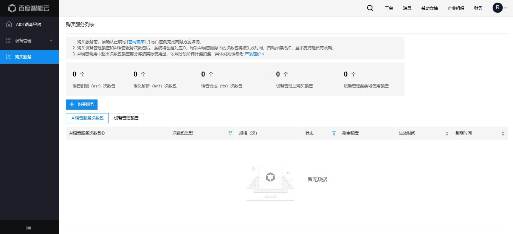
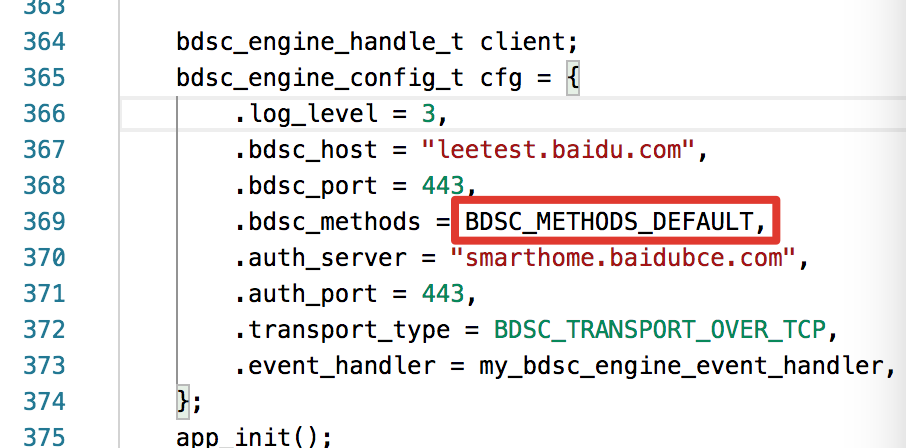

# ESP32-Korvo-DU1906 使用指南

使用 ESP32-KORVO-DU1906 开发版前，需要先在百度“度家 AIOT 语音平台”进行云端配置——购买相应服务获得权限，并获取调用语音服务必须的参数，具体操作详见第一章节。第一章配置指南完成后，参考第二章进行烧录和使用。

## 一、云端配置指南

> 度家 AIOT 语音平台提供端云一体的产品方案，通过阅读本章节，您可完成语音交互前必须的准备工作，进而通过设备直连的方式调用线上语音服务,本章包含以下三个部分：使用准备、购买服务、配置设备管理功能。

1. 使用准备：注册百度智能云账号，并完成实名认证。
2. 购买服务：若您已购买 ESP32-Korvo-DU1906 开发版，需前往[度家AIOT语音平台](https://cloud.baidu.com/product/shc.html)点击“立即使用", 进入控制台的“购买服务"页面购买线上服务。
3. 配置设备管理功能：完成创建厂商、创建产品及添加设备等基本操作，获取后续服务所需的参数。


### 1. 使用准备

1. 在购买服务、使用百度智能云度家 AIOT 语音平台前，您需要拥有一个百度智能云账号并完成实名认证，具体操作如下：
    - 注册并登录百度智能云平台，请参考[注册](https://cloud.baidu.com/doc/UserGuide/s/ejwvy3fo2#%E6%B3%A8%E5%86%8C%E7%99%BE%E5%BA%A6%E8%B4%A6%E5%8F%B7)和[登录](https://cloud.baidu.com/doc/UserGuide/s/jjwvy3dk5)教程。
    - 实名认证操作细节请参考[实名认证](https://cloud.baidu.com/doc/UserGuide/s/8jwvy3c96)，实名认证后才可申请开通权限、购买度家 AIOT 语音平台提供的服务。

### 2. 购买服务

1. 前往[度家AIOT语音平台](https://cloud.baidu.com/product/shc.html)点击**“立即使用"**, 进入控制台。

2. 点击菜单栏的“购买服务"进入下方页面，您可在该页面查看已购买的**“AI语音服务次数包”**及**“设备管理额度”**,尚未购买时显示暂无数据。

     

3. 点击“+购买服务”，进入下图的购买信息配置页面。您可根据需求选择不同规格的设备管理服务，语音识别、语义解析及语音合成次数包。设备管理额度及三种次数包的定价计费信息请参考[计费策略](https://cloud.baidu.com/doc/SHC/s/Ok74ghlfz)。

    

    > 注意：</br>
    > 设备管理额度一经购买，永久有效；若您的目的为试用开发板，在设备管理服务栏输入最小购买额度“1”即可。</br>
    > 如何购买语音识别、语义解析、语音合成取决于您调用服务的需求，目前支持三种组合购买方式：</br>
    > 1）全链路：ASR+UNIT+TTS </br>
    > 2) 语音识别+语义解析：ASR+UNIT </br>
    > 3）仅语音识别：ASR </br>
    > 您需记住此时购买的服务，在后续文档**“修改main.c文件中的methods”**部分中您需要修改相应代码。

4. 配置购买信息后，控制台展示相应配置费用。确认购买信息配置无误后，点击下图**“去结算”**进入订单确认页。

    

5. 若您有百度智能云代金券，可在订单确认页使用代金券结算抵扣相应费用。若无代金券，确认订单信息无误后，直接点击“去支付”进入支付页面。

    

6. 您可以使用银行卡、支付宝、百度账户余额等方式完成支付操作。

    

    > 注意：购买服务时需确认您的百度智能云账户余额(不包括代金券）大于或等于 0 元，若百度智能云账户欠费，将无法购买服务。关于百度智能云账户充值，请参见[如何充值](https://console.bce.baidu.com/billing/?_=1567132907317#/renew/list)。

7. 支付成功后，您可回到度家AIOT语音平台控制台的“购买服务"页面可查看到已购买的资源及使用情况。

    

### 3. 配置设备管理功能

设备管理页面为厂商提供了设备身份注册、修改等一系列管理功能，帮助厂商为不同产品下的每一个设备创建身份 ID，并将该身份 ID 用于设备鉴权及语音服务调用。您需通过创建厂商、创建产品、导入设备三步操作分别创建设备的对应的 fc、pk 以及 ak、sk 码，参数含义介绍及设置 ak 码时的规则请参考[核心概念](https://cloud.baidu.com/doc/SHC/s/Gk7bh9rxo)。

> 注意：</br>
> 请保护好创建后生成的 fc,pk,ak,sk，泄露该信息给第三方可能导致设备异常调用等问题。

1. 登陆设备管理页面
    - 在[度家AIOT语音平台](https://cloud.baidu.com/product/shc.html)点击“设备管理"侧边栏, 进入设备管理页面的。

        

2. 创建厂商
    - 进入**“设备管理"**页面后，点击菜单下的**“厂商"**栏进入厂商列表页。点击**“创建厂商"**，输入厂商名称和描述，完成厂商创建，获得系统生成的 fc 码。

        

    - 厂商列表页支持编辑和删除厂商。

        

3. 创建产品
    - 在厂商列表页点击**“管理产品”**。点击**“创建产品"**，选择厂商、和产品类型，同时输入产品型号及产品描述即可创建产品，获得系统生成的pk码。

        

    - 产品列表页支持编辑和删除产品。

        

4. 添加设备
    - 在产品列表页点击**“管理设备”**。可通过单个添加或导入 CSV 文件批量添加的方式导入设备。

        

        >注意：测试开发版时建议通过添加单个设备的方式，添加所需数量的设备即可，同一个产品下的设备 ak 不可重复。

    - 设备列表页支持删除设备，以及禁用、启用设备，同时可通过状态栏筛选设备状态。

        

        >注意: <br/>
        >若厂商、产品下创建有设备则无法删除，需先删除设备后才可删除产品，进而删除厂商。<br/>
        >后续完成第二章节操作，且调用设备成功后，度家控制台上的设备会显示“已激活”，若激活会有延时，可等待几分钟后刷新。<br/>

<br/>

## 二、烧录和使用
### 1. 软件准备

1. 修改 main.c 文件中的 methods
    - 在烧录固件前，您需要修改定义服务权限的相关代码，结合您在“一、云端配置指南” 中“2.购买服务”所选购的具体服务，您需按照如下逻辑修改 main.c 文件中的代码（下图红圈部分）：

    

    - 若您购买了全链路的服务，该部分无需修改，保留为：BDSC\_METHODS\_DEFAULT

    - 若您仅购买了语音识别+语义解析，该部分修改为：BDSC\_METHODS\_ASR | BDSC\_METHODS\_NLP

    - 若您仅购买了语音识别，该部分修改为：BDSC\_METHODS\_ASR

        >注意: 购买的服务和此处代码需匹配一致才能正常调用，否则服务将鉴权失败。

2. 接入许可（Profile）准备
    - 编辑工程目录下的 profile 文件，将度家 AIOT 平台配置生成的 fc、pk、ak 和 sk 的字段，以字符串的形式填入文本文件 profile.bin 中（文件名称可以更改）。
示例：
{"fc":"xxxxxx","pk":"xxxxxxxx","ak":"xxxxxxxxxxxx","sk":"xxxxxxxxxxxx","cuid":"xxxxxxxx"}

        > 注意: 工程软件务必烧录 Profile，否则会无法连接百度云进行语音交互。

3. 工程软件准备
    - 根据[ADF-Getting](https://docs.espressif.com/projects/esp-adf/en/latest/get-started/index.html)搭建软件开发环境，并按步骤编译 Korvo-DU1906 方案工程。

### 2. 工具准备

- ESP32-Korvo-DU1906 开发板一块
- PC（建议使用 Windows 环境，并且安装有串口打印工具）
- 2 条 Micro-USB 线，其中一条作为供电线
    - 供电建议使用不小于 5V/2A
- 1 个 2.0mm 端子扬声器
    - 规格建议使用 4 欧 3W 或 4欧 5W

### 3. 软件烧录

以 DU1906-Korvo-DU1906 开发板为例，烧录时需要让 ESP32 进入下载模式，长按 Boot 键（4S），再按 RST 键，一起松开即可进入下载模式，如果此时接入串口查看工具会打印 “ Waiting for download "。

**指令烧录**

利用 ADF/IDF 中的 python 脚本，进行软件烧录，指令见如下（仅做示例，具体烧录地址依据 Make 的结果），烧录成功后按键 RST 重启运行。

````
sudo python \
/home/Admin/Baidu/baidu_dul1906/dul1906/esp-adf/esp-idf/components/esptool_py/esptool/esptool.py \
--chip esp32 --port /dev/ttyUSB0 --baud 921600 \
--before default_reset --after hard_reset write_flash \
-z --flash_mode dio --flash_freq 80m --flash_size detect \
0xd000 /home/donglianghao/Baidu/baidu_dul1906/dul1906/build/ota_data_initial.bin \
0x1000 /home/donglianghao/Baidu/baidu_dul1906/dul1906/build/bootloader/bootloader.bin \
0x10000 /home/donglianghao/Baidu/baidu_dul1906/dul1906/build/app.bin \
0x8000 /home/donglianghao/Baidu/baidu_dul1906/dul1906/build/partitions.bin \
0x7FF000 ./profiles/profile.bin \
0x7d9000 ./tone/audio_tone.bin \
0x570000 ./firmware/DU1906_slave_v1.5.5.D.bin
````

> 注意:串口的设备 /dev/ttyUSB0 根据电脑具体识别修改。

**工具烧录**

下载乐鑫官方 [Flash 烧写工具](https://www.espressif.com/sites/default/files/tools/flash_download_tools_v3.6.8.zip)，烧录地址如表格显示，烧录成功后，短按板子 RST 按键重启运行状态。

> 注意：烧录地址和固件名称会随着工程更替而变动，烦请以实际 Example 功能分区为准。

| 序号  |                固件名称                  |  烧录地址 |    功能     |
| :---: | :------------------------------------: | :------: |  :------: |
|   1   |             bootloader.bin             |  0x1000  |    Boot    |
|   2   |             partitions.bin             |  0x8000  |    分区表   |
|   3   |         ota\_data\_initial.bin         |  0xd000  |   OTA分区   |
|   4   |                 app.bin                | 0x10000  |   APP工程   |
|   5   |              profile.bin               | 0x7FF000 |   证书许可   |
|   6   |             audio\_tone.bin            | 0x7d9000 |    提示音    |
|   7   |         DU1906\_slave\_v1.5.5.D.bin    | 0x570000 |    DSP固件  |
|  配置  | SPI Mode DIO、SPI SPEED 80MHz、FLASH SIZE 64Mbit |||

<br/>
### 4. 软件配网

ESP32-Korvo-DU1906 工程默认使用 Ble 配网，烦请前往乐鑫官方 Github 下载 [Blufi APP](https://github.com/EspressifApp/EspBlufiForAndroid/releases) 进行配网,IOS 版本见[地址](https://github.com/EspressifApp/EspBlufiForiOS/releases)，配网步骤如下：

- 开启手机蓝牙，打开 APP 扫描设备
- 长按开发板 FUNC 键 4s，开发板进入配网模式，并播放提示音“请点击确定，开始配网”
- 下来 APP 扫描 Ble 设备，选择需要配对的设备，并点击连接
- 连接成功后显示如下图，然后点击配网，按照输入需要配对的 Wi-Fi 账号密码

    

    > 注意： 配网方式默认选择 "Station"，配对的网络必须是 2.4GHz Wi-Fi

- 输入后点击确认发送，此时设备会收到配网信息并开始连接网络，连接成功后会提示“网络连接成功”

    

    > 注意：如果配对失败，烦请 Check 上述流程，并重新尝试

<br/>

### 5. 使用体验

**语音交互体验**

配网成功并连接上服务器后，设备即准备就绪，您可以使用“小度小度”语音唤醒开始对话，如下部分支持的语言命令，更多指令需要在百度后台申请定义。

```
“小度小度” “在呢”“讲个笑话”
“小度小度” “在呢”“上海天气如何？”
“小度小度” “在呢”“中国有多少人口？”
“小度小度” “在呢”“百度百科乐鑫信息科技”
```

**返回示例**

根据您在第二章 “1.1 修改 main.c 文件中的 methods”中修改的服务权限代码，您在设备端上收到的返回示例可能有如下四种：

1. 购买全链路服务（BDSC_METHODS_DEFAULT）
2. 购买语音识别+语义解析（BDSC_METHODS_ASR | BDSC_METHODS_NLP ）
3. 仅购买语音识别（BDSC_METHODS_ASR）
4. 越权访问：定义的服务权限代码与控制台购买行为不一致

- 购买全链路服务（BDSC\_METHODS\_DEFAULT）时，收到 EVENT\_ASR\_RESULT 、EVENT\_ASR\_EXTERN\_DATA、EVENT\_ASR\_TTS\_DATA三个事件，示例如下：

```
I (30226) EVENT_IN: Handle sdk event start.
I (30227) ==========: 366 got asr result
W (30227) ==========: ---> EVENT_ASR_RESULT sn=8cba3508-2b80-?????becf0, idx=0,
buffer_length=243, buffer={"asr_align_begin":7,"asr_align_end":132,
"corpus_no":6844872432671848469,"err_no":0,"raf":400,"
result":{"word":["今天天气","今天天泣","今天今天","今天天汽","今天天器"]},
"sn":"8cba3508-2b80-4d17-adc4-08668c2becf0_ws_0"}

I (30231) MAIN: ==> Got BDSC_EVENT_ON_ASR_RESULT
I (30231) MAIN: ========= asr result {"asr_align_begin":7,"asr_align_end":132,
"corpus_no":6844872432671848469,"err_no":0,"raf":400,
"result":{"word":["今天天气","今天天泣","今天今天","今天天汽","今天天器"]},
"sn":"8cba3508-2b80-4d17-adc4-08668c2becf0_ws_0"}

I (30236) EVENT_OUT: Handle sdk event end.
W (30236) ==========: Stack: 1756
I (30316) EVENT_IN: Handle sdk event start.
I (30316) ==========: got 1st extern data
W (30316) ==========: ---> EVENT_ASR_EXTERN_DATA sn=8cba3508-2b80-4d17-adc4-08668c2becf0,
idx=0, buffer_length=265,buffer={"error_code":0,"err_msg":"",
"sessionId":"session-1593696055545-3360021168-8013-2136","origin":"92138",
"action_type":"asrnlp_tts","query":["今天天气"],"intent":"USER_WEATHER","slots":
[{"name":"user_time","value":"2020-07-02"}],"custom_reply":[]}
I (30320) MAIN: ==> Got BDSC_EVENT_ON_NLP_RESULT
I (30321) MAIN: early EXIT duplex mode!
I (30322) ==========: found tts type
```

- 购买语音识别和语义解析（BDSC\_METHODS\_ASR | BDSC\_METHODS\_NLP ）时，收到 EVENT\_ASR\_RESULT EVENT\_ASR\_EXTERN\_DATA两个事件，示例如下。

```
W (27391) ==========: ---> EVENT_ASR_RESULT sn=703f86e0-748e-40cc-a838-f6cdf0afa26a,
idx=0, buffer_length=227,buffer={"asr_align_begin":7,"asr_align_end":144,
"corpus_no":6844866601673826187,"err_no":0,"raf":28,
"result":{"word":["你好吗","祢好吗","拟好吗","旎好吗","你好啊"]},
"sn":"703f86e0-748e-40cc-a838-f6cdf0afa26a_ws_0"}

I (27395) MAIN: ==> Got BDSC_EVENT_ON_ASR_RESULT
I (27396) MAIN: ========= asr result {"asr_align_begin":7,"asr_align_end":144,
"corpus_no":6844866601673826187,
"err_no":0,"raf":28,"result":{"word":["你好吗","祢好吗","拟好吗","旎好吗","你好啊"]},
"sn":"703f86e0-748e-40cc-a838-f6cdf0afa26a_ws_0"}

I (27400) EVENT_OUT: Handle sdk event end.
W (27400) ==========: Stack: 1756
I (27790) EVENT_IN: Handle sdk event start.
I (27790) ==========: got 1st extern data
W (27790) ==========: ---> EVENT_ASR_EXTERN_DATA sn=703f86e0-748e-40cc-a838-f6cdf0afa26a,
idx=0, buffer_length=504,buffer={"error_code":0,"err_msg":"","sessionId":"",
"origin":"92140","action_type":"asrnlp_none","query":["你好吗"],
"intent":"BUILT_SUBSTANTIVE","custom_reply":[{"type":"tts","value":"
《你好吗》是周杰伦演唱的一首歌曲，由周杰伦作曲，李汪哲、罗宇轩填词，黄雨勋编曲，
收录在周杰伦2011年11月11日发行的专辑《惊叹号》中，2011年11月4日这首歌曲在移动首发。2012年2月，
这首歌曲获得了中国歌曲排行榜周冠军。"}]}
```

- 仅购买语音识别（BDSC\_METHODS\_ASR）时，仅收到一个EVENT\_ASR\_RESULT事件，示例如下：

```
EVENT_ASR_RESULT sn=f51cb898-a0b8-4b49-a5d2-745782913936, idx=0,
buffer_length=242,buffer={"asr_align_begin":7,
"asr_align_end":136,"corpus_no":6844835706816949982,
"err_no":0,"raf":27,"result":{"word":["今天天气","今天天泣","今天天汽","今天天器",
"今天天弃"]},"sn":"54cbbbcf-393f-42a9-834f-e61d94a842fb_ws_1"}
```

- 越权访问：当您定义的服务权限与实际购买不符时，将收到如下信息：

```
 {"corpus_no":0,"err_msg":"third party authentication failed[info:-3015]",
 "err_no":-3015,"sn":"11199e39-cedc-4da4-a5ca-cd56d7624dda_ws_0"}
```